<a name="HOLTitle"></a>
# Microsoft Power BI Embedded #

---

<a name="Overview"></a>
## Overview ##

[Microsoft Power BI](https://powerbi.microsoft.com/en-us/mobile/) was created to address the data explosion in commercial and academic organizations, the need to analyze that data, and the need for rich, interactive visuals to represent the data and reveal key insights. It contains a suite of tools that assist in the full life cycle of data analysis, from data discovery and collection to data transformation, aggregation, visualization, sharing, and collaboration. Moreover, it allows you to create rich visualizations without writing any code and present them in interactive dashboards.

[Microsoft Power BI Embedded](https://azure.microsoft.com/en-us/services/power-bi-embedded/ "Microsoft Power BI Embedded") is an Azure service that enables ISVs and app developers to surface Power BI data experiences within their applications. As a developer, you've built applications, and those applications have their own users and distinct sets of features. Those apps may also happen to have built-in data elements like charts and reports that can now be powered by Microsoft Power BI Embedded. You don’t need a Power BI account to use your app. You can continue to sign in to your application just like before, and view and interact with Power BI reports without additional licensing. 

In this lab, you wll create a Power BI Embedded workspace that wraps a Power BI workspace, report, and dataset to display real-time Twitter activity in a Xamarin Forms app that runs on iOS, Android, and Windows.

<a name="Objectives"></a>
### Objectives ###

In this hands-on lab, you will learn how to:

- Provision a Power BI Embedded workspace collection
- Create a Xamarin Forms app in Visual Studio 2017 
- Write code to create Power BI Embedded reports
- Write code to track Twitter activity
- Create an Azure Mobile App as a back-end service
- Create a Power BI report viewer in an Azure Mobile App
- View a Power BI report in an app targeting Android, iOS, and Windows

<a name="Prerequisites"></a>
### Prerequisites ###

The following are required to complete this hands-on lab:

- [Visual Studio Community 2017](https://www.visualstudio.com/) or higher with the ".NET desktop development," "Universal Windows Platform development," and "Mobile Development with .NET" workloads installed
- An active Microsoft Azure subscription. If you don't have one, [sign up for a free trial](http://aka.ms/WATK-FreeTrial)
- A Twitter account. If you don't have one, [sign up for free](http://www.twitter.com)
- Optional: A Microsoft Office 365 account. If you don't have one, [sign up for a free trial](https://products.office.com/en-us/try "https://products.office.com/en-us/try") 
- Optional: [Microsoft Power BI Desktop]()

If you wish to build and run the iOS version of the app, you also have to have a Mac running OS X 10.11 or higher, and both the Mac and the PC running Visual Studio 2017 require further configuration. For details, see https://developer.xamarin.com/guides/ios/getting_started/installation/windows/.

> Having a Mac and connecting it to Visual Studio is **only required** if you wish to build and run the iOS version of the app. You can run the Android and Windows versions of the app without any further configuration.
> 
---

<a name="Exercises"></a>
## Exercises ##

This hands-on lab includes the following exercises:

- [Exercise 1: Provision a Power BI Embedded workspace collection](#Exercise1)
- [Exercise 2: Create a Xamarin Forms solution](#Exercise2)
- [Exercise 3: Add assets and infrastructure](#Exercise3)
- [Exercise 4: Write code to create Power BI Embedded reports](#Exercise4)
- [Exercise 5: Create a Twitter app](#Exercise5)
- [Exercise 6: Write code to track Twitter activity](#Exercise6)
- [Exercise 7: Create a Power BI report viewer in an Azure Mobile App](#Exercise7)
- [Exercise 8: Connect a Xamarin Forms app to a Power BI report viewer](#Exercise8)
- [Exercise 9: (OPTIONAL) Configure and view a Power BI report in Power BI Desktop](#Exercise9)

Estimated time to complete this lab: **60** minutes.

<a name="Exercise1"></a>
## Exercise 1: Provision a Power BI Embedded workspace collection ##

The first step in leveraging Power BI Embedded is to create a workspace collection. In this exercise, you will create one in the Azure Portal.

1. Open the [Azure Portal](https://portal.azure.com) in your browser. If asked to sign in, do so using your Microsoft account.
2. Click **+ New**, followed by **Intelligence + analytics** and **Power BI Embedded**. 
 
    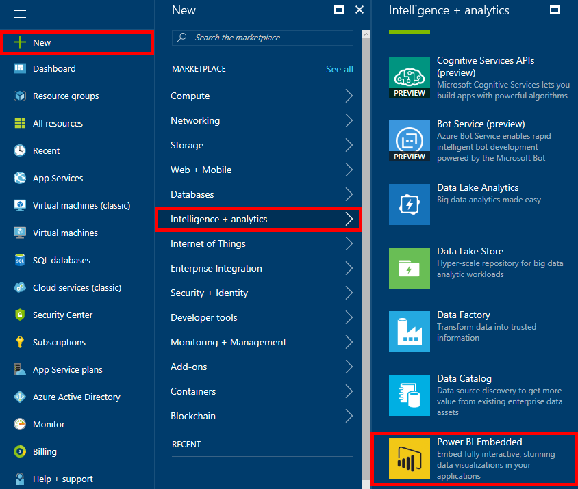

    _Creating a Power BI Embedded service_

3. Enter a unique name as the **Workspace Collection Name** and make sure a green check mark appears next to it indicating that the name is valid and unique. Under **Resource Group**, select **Create new** and enter "PowerBIResources" (without quotation marks) as the resource-group name. Choose the **Location** nearest you, and accept the default values for all other parameters. Then click **Create**.
 
    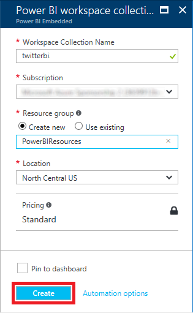

    _Creating a Power BI Embedded workspace collection_

1. Click **Resource groups** in the ribbon on the left side of the portal, and then click the resource group created for the Power BI Embedded workspace collection.

    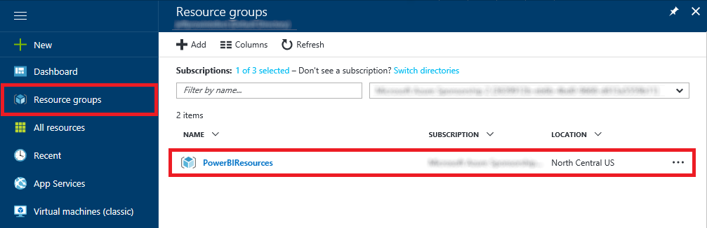

    _Opening the resource group_

1. Wait until "Deploying" changes to "Succeeded," indicating that the workspace collection has been deployed. Then click the workspace collection.

	> Refresh the page in the browser from time to time to update the deployment status. Clicking the **Refresh** button in the resource-group blade refreshes the list of resources in the resource group, but does not reliably update the deployment status.
  
    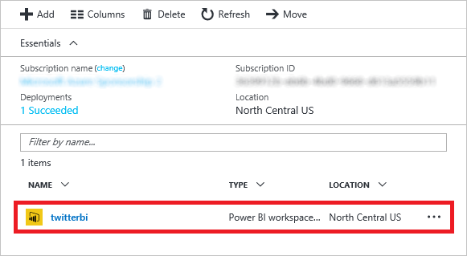
	
    _Opening the workspace collection_ 

1. Click **Access keys**, and then click the **Copy** button to the right of **KEY 1** to copy the access key to the clipboard. Paste the key into your favorite text editor so you can easily retrieve it later. You will need it in [Exercise 4](#Exercise4).
 
    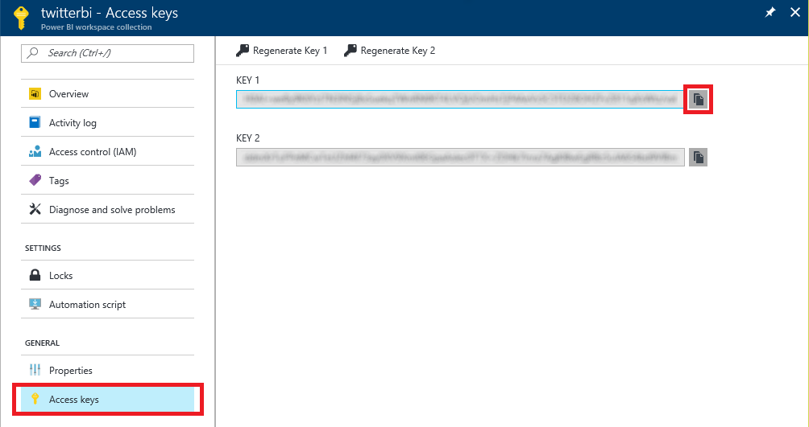
	
    _Copying the access key to the clipboard_ 

A workspace collection has been provisioned, but it currently contains no workspaces. A workspace will be created programmatically  later on in this lab by the Xamarin Forms app that you write.

<a name="Exercise2"></a>
## Exercise 2: Create a Xamarin Forms solution ##

The first step in creating a cross-platform mobile app with Xamarin Forms is to provision a solution in Visual Studio 2017. If you have not installed the workloads listed in the [Prerequisites](#Prerequisites) section, stop now and modify your Visual Studio installation to add these workloads.

1. Start Visual Studio, and use the **File** -> **New** -> **Project** command to create a new **Cross Platform App** solution named "TwitterBI."   

    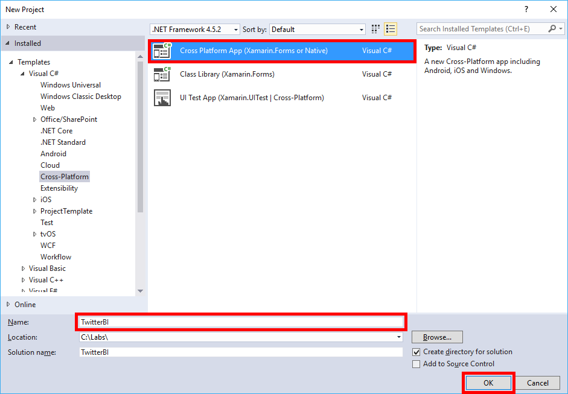

    _Creating a solution in Visual Studio 2017_
 
1. In the "New Cross Platform App" dialog, select the **Blank App** template. Make sure **Xamarin.Forms** is selected under "UI Technology" and select **Portable Class Library (PCL)** as the "Code Sharing Strategy." Then click **OK**. 
 
    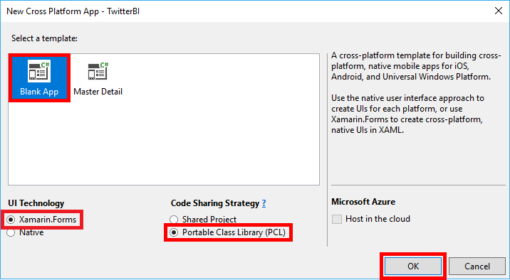

    _Creating a Cross Platform App_
  
1. When prompted to choose platform requirements for the Universal Windows Platform project, accept the defaults and click **OK**.

    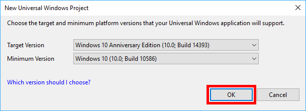

    _Specifying UWP platform versions_
 
1. Confirm that the solution appears in Solution Explorer and that it contains four projects:

	- **TwitterBI (Portable)** - Contains shared logic for your  Xamarin Forms app
	- **TwitterBI.Android** - Contains assets, resources, and logic specific to Android
	- **TwitterBI.iOS** - Contains assets, resources, and logic specific to iOS
	- **TwitterBI.UWP (Universal Windows)** - Contains assets, resources, and logic specific to the Universal Windows Platform (UWP)

	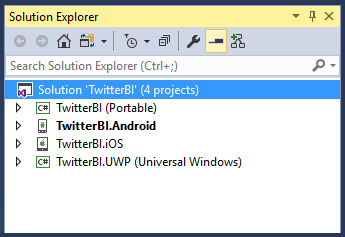
	
	_The generated solution_

1. Right-click the **TwitterBI.Android** project in Solution Explorer and select **Properties** from the context menu. Then click **Android Options** and uncheck the **Use Fast Deployment (debug mode only)** box. This option, if enabled, sometimes causes problems with Android emulators in Hyper-V. 

    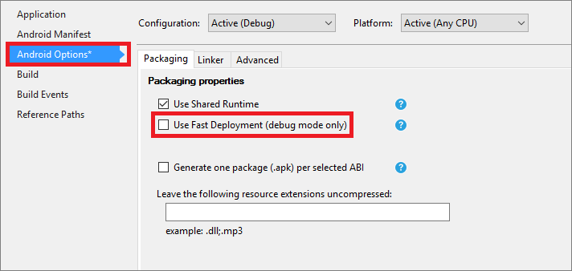

    _Disabling fast deployment on Android_

1. In Solution Explorer, right-click the **TwitterBI** solution and select **Build Solution** to build the solution. Make sure the solution builds without errors.

    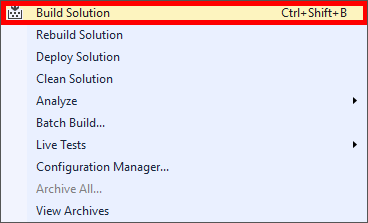

    _Building the solution_
 
Now that the solution has been provisioned, the next step is to import image assets to brand the app, and to add shared logic to the PCL project that will be used on all three platforms.

<a name="Exercise3"></a>
## Exercise 3: Add assets and infrastructure ##

In this exercise, you will replace the generic images for icons, tiles, and other visual assets that Visual Studio created for you with ones that give your app unique branding. You will also add infrastructural code that will be used on all three platforms. 

1. In Solution Explorer, right-click the **TwitterBI (Portable)** project and use the **Add** -> **New Folder** command to add a folder named "Common" to the project.

    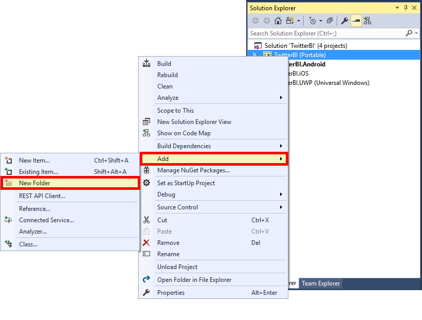

    _Adding a new folder to the PCL project_

1. Right-click the "Common" folder that you just added. Select **Add** -> **Existing Item...** and browse to the "Resources\Common" folder included with this lab. Select all of the files in that folder and click **Add**

    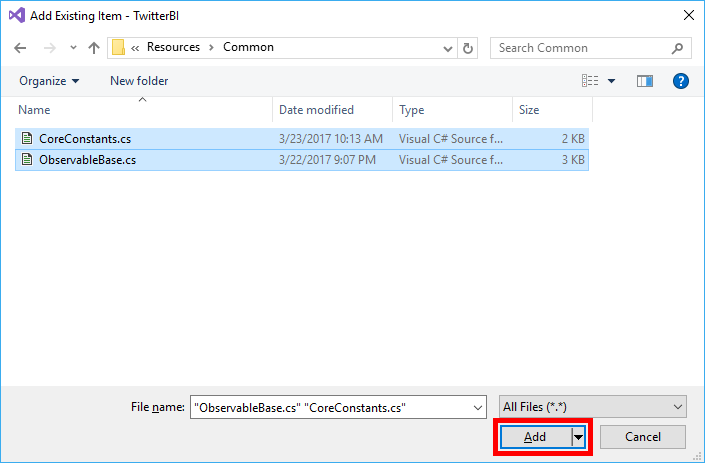

    _Adding files to the PCL project_

1. Right-click the **TwitterBI (Portable)** project again and use the **Add** -> **Class** command to add a class file named **MainViewModel.cs** to the project.

    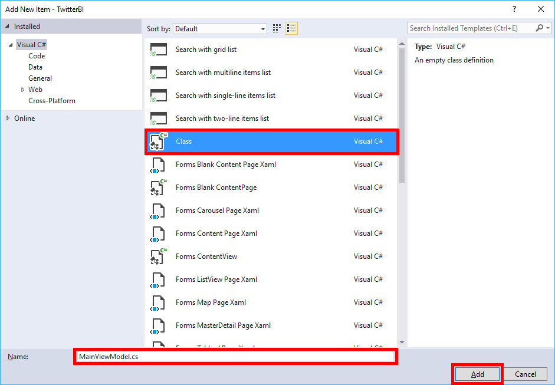

    _Adding the MainViewModel class_

1. Open **App.xaml.cs** in the **TwitterBI (Portable)** project and insert the following line of code directly above the ```App``` class constructor:

	```C#
	public static MainViewModel ViewModel { get; set; }
	```

1. Still in **App.xaml.cs**, replace the line of code that initializes the ```MainPage``` property in the class constructor with the following line of code:

	```C#
	MainPage = new NavigationPage(new TwitterBI.MainPage());
	```

    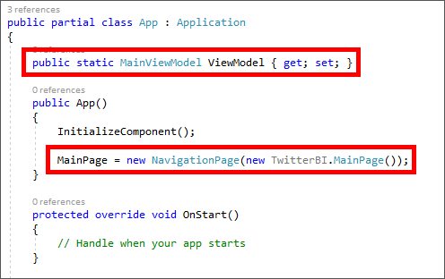

    _Updating App.xaml.cs_

1. Open a Windows File Explorer window and navigate to the "Resources\Android\Resources" folder included with this lab. Copy all of the subfolders in the "Resources\Android\Resources" folder to the clipboard. Then return to Solution Explorer, right-click the "Resources" folder in the **TwitterBI.Android** project, and select **Paste** to paste the contents of the clipboard into the project.

    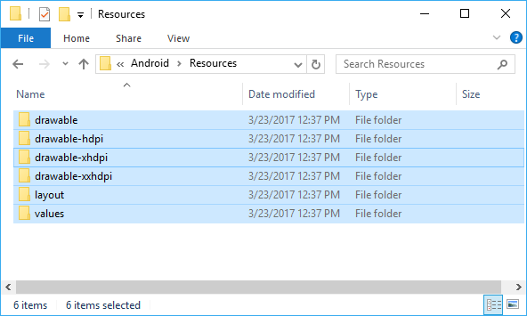

    _Importing Android assets_

1. In the subsequent "Merge Folders" dialog, check **Apply to all items** and then click **Yes**.
 
    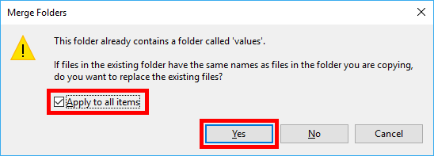

    _Merging existing files_

1. In the "Destination File Exists" dialog, again check **Apply to all items** and then click **Yes**. This will update the default Android assets with custom-branded assets.
 
    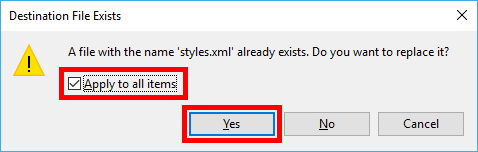

    _Overwriting resources_

1. In Solution Explorer, right-click the "Resources" folder in the **TwitterBI.iOS** project and select **Add** -> **Existing Item...**. Then browse to the "Resources\iOS\Resources" folder included with this lab, select all of the files in that folder, and click **Add**.
 
    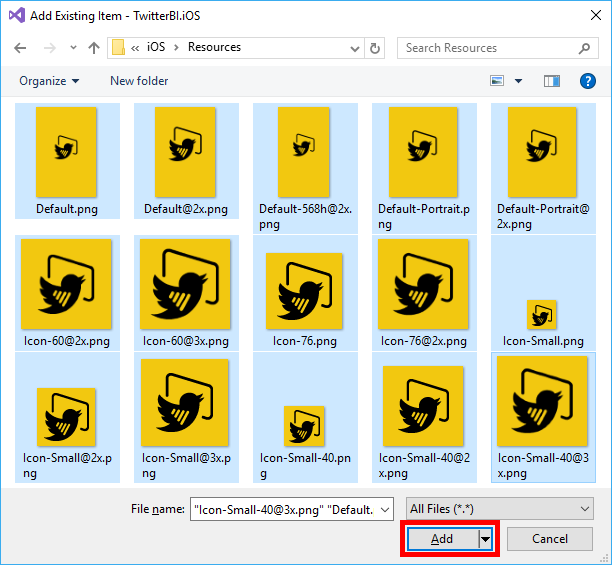

    _Adding images to the iOS project_

1. In the "Destination File Exists" dialog, check **Apply to all items** and then click **Yes**. This will update the default iOS assets with custom-branded assets.

1. Open **Info.plist** in the **TwitterBI.iOS** project. Scroll to the bottom of the file, right-click **Launch screen interface file base name**, and select **Delete**. 

    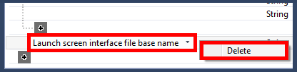

    _Modifying Info.plist_

1. Right-click the "Assets" folder in the **TwitterBI.UWP (Windows Universal)** project and select **Add** -> **Existing Item...**. Then browse to the "Resources\UWP\Assets" folder included with this lab, select all of the files in that folder, and click **Add**.
 
    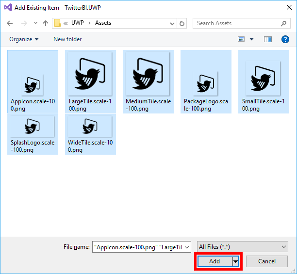

    _Adding images to the Windows project_

1. In Solution Explorer, right-click **Package.appxmanifest** in the UWP project and select **View Code**. Replace the ```Applications``` element with this one:

	```xml
	<Applications>
	  <Application Id="App" Executable="$targetnametoken$.exe" EntryPoint="TwitterBI.UWP.App">
	    <uap:VisualElements DisplayName="TwitterBI" Square150x150Logo="Assets\MediumTile.png" Square44x44Logo="Assets\AppIcon.png" Description="TwitterBI for Windows" BackgroundColor="#F2C811">
	      <uap:DefaultTile Wide310x150Logo="Assets\WideTile.png" Square310x310Logo="Assets\LargeTile.png" Square71x71Logo="Assets\SmallTile.png">
	      </uap:DefaultTile>
	      <uap:SplashScreen Image="Assets\SplashLogo.png" BackgroundColor="#F2C811" />
	    </uap:VisualElements>
	  </Application>
	</Applications>
	```

    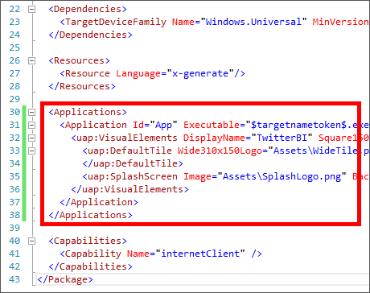

    _Updating Package.appxmanifest_

1. Now it's time to run the app for the first time, starting with the Android version. Ensure that the Android project is selected as the startup project by right-clicking the **TwitterBI.Android** project in Solution Explorer and selecting **Set as StartUp Project**.
 
    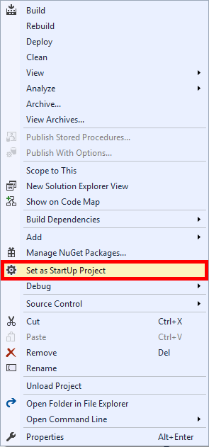

    _Setting a project as the startup project_

1. Select the emulator you want to run the app in and click the **Run** button (the one with the green arrow) at the top of Visual Studio to launch the Android version of the app. Note that the emulator will probably take a minute or two to start.
 
    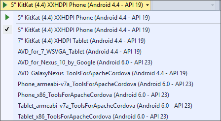

    _Launching the Android app_

1. Confirm that the app appears in the Android emulator. Leave the emulator running (that will allow the Android app to start quickly next time). Then return to Visual Studio and select **Stop Debugging** from the **Debug** menu to stop debugging.

1. Open the Settings app on your PC (an easy way to do it is to click the Windows button, type "Settings," and click **Settings**). Then click **Update & security** followed by **For developers**, and select **Developer mode** if it isn't already selected.

	> If you try to enable developer mode and receive an error, see https://www.kapilarya.com/developer-mode-package-failed-to-install-error-code-0x80004005-windows-10 for a potential fix.

    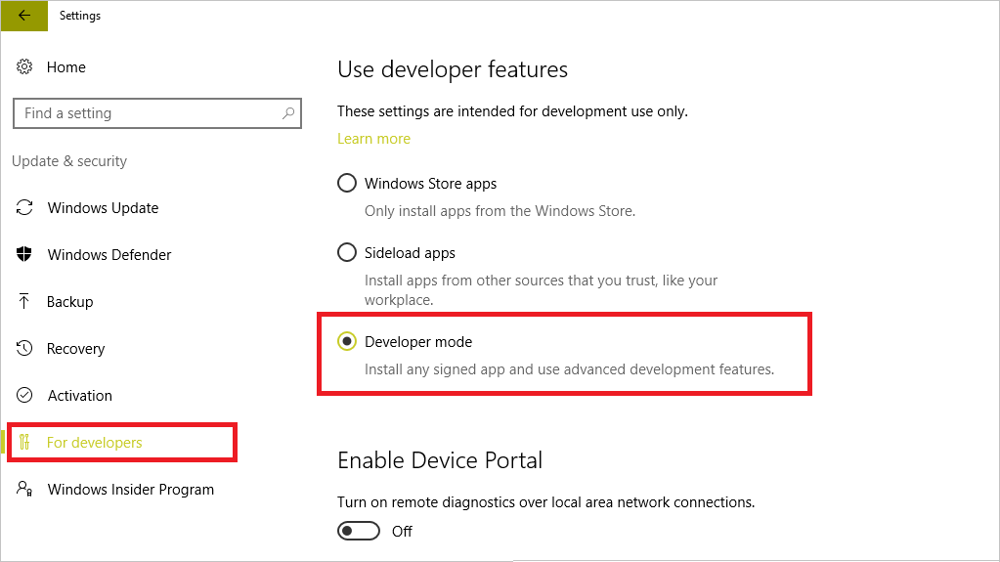

    _Enabling developer mode in Windows 10_

1. Make **TwitterBI.UWP** the startup project by right-clicking it and selecting **Set as StartUp Project**. Then deploy the UWP app to your computer by right-clicking the project in Solution Explorer and selecting **Deploy**.

1. Click the **Run** button at the top of Visual Studio to launch the UWP version of TwitterBI on the local machine.

	> If you would prefer to run the UWP app in a Windows phone emulator rather than on the desktop, simply select the desired emulator from the drop-down list attached to the **Run** button.
 
    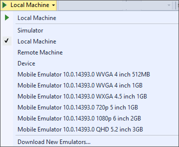

    _Launching the UWP app_

1. Confirm that the app appears on the screen. Then return to Visual Studio and select **Stop Debugging** from the **Debug** menu to stop debugging.

1. If you configured Visual Studio to build iOS projects, make **TwitterBI.iOS** the startup project and click the **Run** button to launch it in the iOS simulator.

	> Remember that you can only build and run the iOS version of the app if you configured a Mac to serve as the build host and connected Visual Studio to the Mac. For more information, see https://developer.xamarin.com/guides/ios/getting_started/installation/windows/.

1. Confirm that the app appears in the iOS emulator. Then return to Visual Studio and select **Stop Debugging** from the **Debug** menu to stop debugging.
 
The app doesn't do anything yet, but it is branded with splash screens, icons, and other visual assets that give it an identity of its own. Now it's time to add code to make the app do something useful.

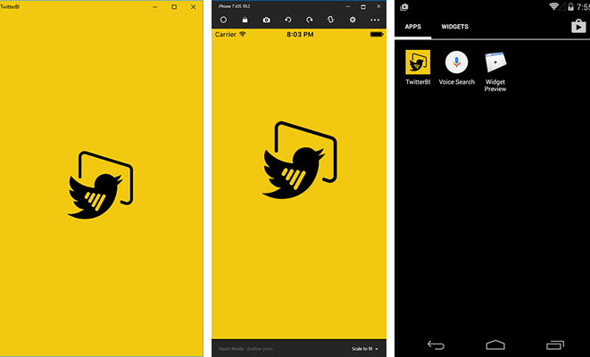

_Branded splash screens and visual assets_ 

<a name="Exercise4"></a>
## Exercise 4: Import a Power BI Embedded report ##

In this exercise, you will write code to create a Power BI Embedded workspace and import a Power BI report. Then you will run the app and execute the code.

1. In Solution Explorer, right-click the **TwitterBI** solution and select **Manage NuGet Packages for Solution…**.

    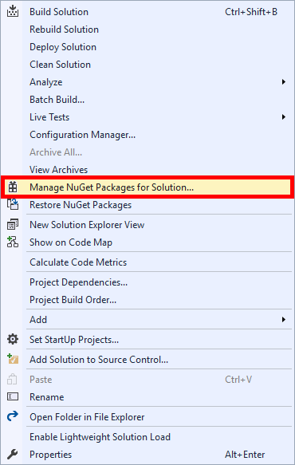
	
    _Managing NuGet packages for the solution_ 

1. Click **Browse** in the NuGet Package Manager. Type "Microsoft.Rest.ClientRuntime" into the search box and select the **Microsoft.Rest.ClientRuntime** package. Check the boxes next to the **TwitterBI.Android** and **TwitterBI.iOS** projects and click **Install** to install the package into these projects. If prompted to review changes, click **OK**. If prompted to accept a license, click **I Accept**.

    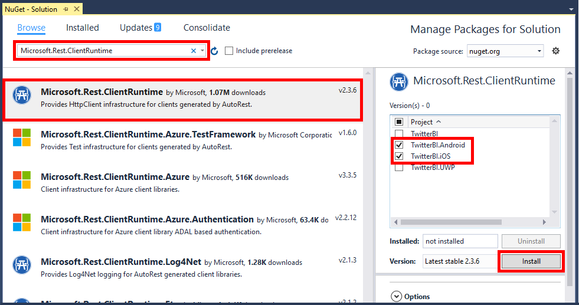
	
    _Installing Microsoft.Rest.ClientRuntime_ 

1. Type "Microsoft.PowerBI.Api" into the search box and select the **Microsoft.PowerBI.Api** package. Check the boxes next to the **TwitterBI.Android**, **TwitterBI.iOS**, and **TwitterBI.UWP** projects and click **Install** to install the package into these projects. If prompted to review changes, click **OK**. If prompted to accept a license, click **I Accept**.

    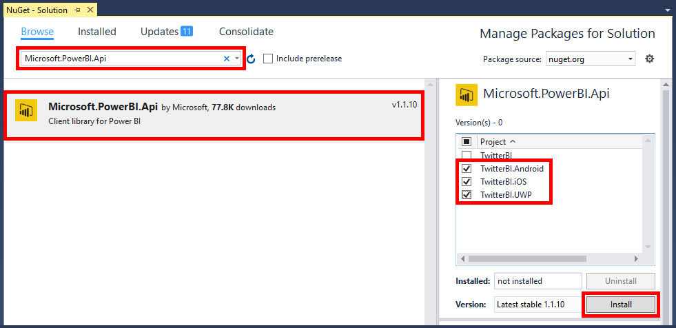
	
    _Installing Microsoft.PowerBI.Api_ 

1. Repeat this process to install **Newtonsoft.Json** into *all* of the projects.

    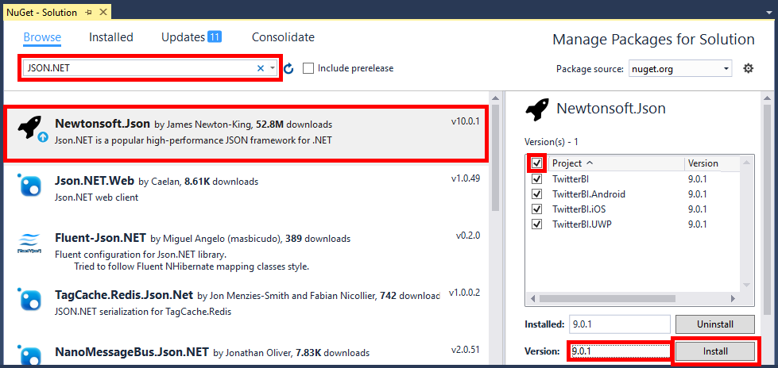
	
    _Installing Newtonsoft.Json_ 

1. Repeat this process one more time to install **Microsoft.Net.Http** into the **TwitterBI** project.

    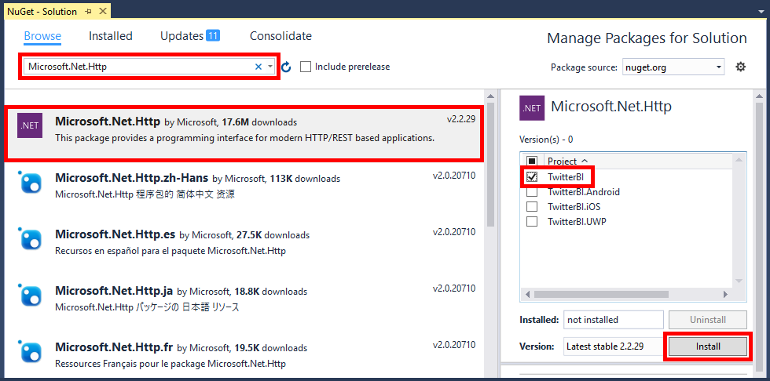
	
    _Installing Microsoft.Net.Http_ 

1. Open **CoreConstants.cs** in the "Common" folder of the **TwitterBI (Portable)** project and add the following class definition:

	```C#
	public static class PowerBIConstants
	{
	    public static string WorkspaceCollectionName = "twitterbi";
	    public static string WorkspaceName = "TwitterActivity";
	    public static string AccessKey = "POWER_BI_EMBEDDED_ACCESS_KEY";
	    public static string DatasetUserName = "powerbiuser";
	    public static string DatasetPassword = "PowerBIRocks!";
	    public static string ReportLocation = $"https://traininglabservices.azurewebsites.net/PowerBIImports/{WorkspaceName}.zip";
	}
	```

1. Replace *POWER_BI_EMBEDDED_ACCESS_KEY* in the code that you just added with the access key that you saved in Exercise 1, Step 6. 

    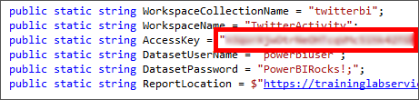
	
    _Updating the AccessKey property_ 
 
1. In Solution Explorer, right-click the **TwitterBI (Portable)** project and use the **Add** -> **New Folder** command to add a folder named "Interfaces" to the project.

1. Right-click the "Interfaces" folder and use the **Add** -> **Class** command to add a class file named **IPowerBIService.cs** to the folder. Then replace the contents of the file with the following code: 

	```C#
	using System;
	using System.Collections.Generic;
	using System.IO;
	using System.Linq;
	using System.Text;
	using System.Threading.Tasks;
	
	namespace TwitterBI
	{
	    public interface IPowerBIService
	    {
	        Task<string> CreateWorkspaceAsync(string workspaceCollectionName, string workspaceName, string accessKey);
	        Task<List<string>> GetWorkspaceIdsAsync(string workspaceCollectionName, string accessKey);
	        Task<List<string>> GetReportIdsAsync(string workspaceCollectionName, string workspaceId, string accessKey);
	        Task<List<string>> GetDatasetIdsAsync(string workspaceCollectionName, string workspaceId, string accessKey);
	        Task<bool> UpdateConnectionCredentialsAsync(string workspaceCollectionName, string workspaceId, string datasetId, string accessKey, string username, string password);
	        Task<bool> DeleteDatasetAsync(string workspaceCollectionName, string workspaceId, string datasetId, string accessKey);
	        Task<bool> DeleteReportAsync(string workspaceCollectionName, string workspaceId, string reportId, string accessKey);
	        Task<bool> ImportPbixAsync(string workspaceCollectionName, string workspaceId, string datasetName, byte[] file, string accessKey);
	    }
	}
	```

1. Add a folder named "Helpers" to the **TwitterBI (Portable)** project. Right-click the "Helpers" folder and use the **Add** -> **Class** command to add a class file named **PowerBIHelper.cs**. Then replace the contents of the file with the following code: 

	```C#
	using Newtonsoft.Json.Linq;
	using System;
	using System.Collections.Generic;
	using System.IO;
	using System.Linq;
	using System.Text;
	using System.Threading.Tasks;
	
	namespace TwitterBI.Helpers
	{
	    public static class PowerBIHelper
	    {
	        public async static Task<string> CreateWorkspaceAsync(string workspaceName)
	        {
	            var service = Xamarin.Forms.DependencyService.Get<IPowerBIService>();
	            return await service.CreateWorkspaceAsync(Common.PowerBIConstants.WorkspaceCollectionName, workspaceName, Common.PowerBIConstants.AccessKey);
	        }
	
	        public async static Task<List<string>> GetWorkspaceIdsAsync()
	        {
	            var service = Xamarin.Forms.DependencyService.Get<IPowerBIService>();
	            return await service.GetWorkspaceIdsAsync(Common.PowerBIConstants.WorkspaceCollectionName, Common.PowerBIConstants.AccessKey);
	        }
	
	        public async static Task<List<string>> GetReportIdsAsync(string workspaceId)
	        {
	            var service = Xamarin.Forms.DependencyService.Get<IPowerBIService>();
	            return await service.GetReportIdsAsync(Common.PowerBIConstants.WorkspaceCollectionName, workspaceId, Common.PowerBIConstants.AccessKey);
	        }
	
	        public async static Task<List<string>> GetDatasetIdsAsync(string workspaceId)
	        {
	            var service = Xamarin.Forms.DependencyService.Get<IPowerBIService>();
	            return await service.GetDatasetIdsAsync(Common.PowerBIConstants.WorkspaceCollectionName, workspaceId, Common.PowerBIConstants.AccessKey);
	        }
	
	        public async static Task<bool> UpdateConnectionCredentialsAsync(string workspaceId, string datasetId)
	        {
	            var service = Xamarin.Forms.DependencyService.Get<IPowerBIService>();
	            return await service.UpdateConnectionCredentialsAsync(Common.PowerBIConstants.WorkspaceCollectionName, workspaceId, datasetId, Common.PowerBIConstants.AccessKey, Common.PowerBIConstants.DatasetUserName, Common.PowerBIConstants.DatasetPassword);
	        }
	
	        public async static Task<bool> DeleteReportAsync(string workspaceId, string reportId)
	        {
	            var service = Xamarin.Forms.DependencyService.Get<IPowerBIService>();
	            return await service.DeleteReportAsync(Common.PowerBIConstants.WorkspaceCollectionName, workspaceId, reportId, Common.PowerBIConstants.AccessKey);
	        }
	
	        public async static Task<bool> DeleteDatasetAsync(string workspaceId, string datasetId)
	        {
	            var service = Xamarin.Forms.DependencyService.Get<IPowerBIService>();
	            return await service.DeleteDatasetAsync(Common.PowerBIConstants.WorkspaceCollectionName, workspaceId, datasetId, Common.PowerBIConstants.AccessKey);
	        }
	
	        public async static Task<bool> ImportPbixAsync(string workspaceId, string datasetName, byte[] file)
	        {
	            var service = Xamarin.Forms.DependencyService.Get<IPowerBIService>();
	            return await service.ImportPbixAsync(Common.PowerBIConstants.WorkspaceCollectionName, workspaceId, datasetName, file, Common.PowerBIConstants.AccessKey);
	        }
	    }
	}
	```

	Unlike most code in a Xamarin Forms solution, Power BI Embedded code cannot be shared across platforms. The ```PowerBIHelper``` class you just added contains methods that exist in shared code, but that delegate to methods in platform-specific code.
 
1. Now it's time write the platform-specific code. Begin by right-clicking the **TwitterBI.Android** project and using the **Add** -> **Class** command to add a class file named **PowerBIService.cs** to the project. Then replace the contents of the file with the following code: 

	```C#
	using System;
	using System.Collections.Generic;
	using System.Linq;
	using System.Text;
	
	using Android.App;
	using Android.Content;
	using Android.OS;
	using Android.Runtime;
	using Android.Views;
	using Android.Widget;
	using Microsoft.PowerBI.Api.V1.Models;
	using System.Threading.Tasks;
	using Microsoft.PowerBI.Api.V1;
	using Microsoft.Rest;
	using TwitterBI.Droid.DependencyServices;
	using System.Threading;
	using System.IO;
	
	[assembly: Xamarin.Forms.Dependency(typeof(PowerBIService))]
	namespace TwitterBI.Droid.DependencyServices
	{
	    public class PowerBIService : IPowerBIService
	    {
	        public async Task<bool> DeleteDatasetAsync(string workspaceCollectionName, string workspaceId, string datasetId, string accessKey)
	        {
	            bool successful = false;
	
	            try
	            {
	                using (var client = CreateClient(accessKey))
	                {
	                    await client.Datasets.DeleteDatasetByIdAsync(workspaceCollectionName, workspaceId, datasetId);
	                }
	            }
	            catch { }
	
	            return successful;
	        }
	
	        public async Task<bool> DeleteReportAsync(string workspaceCollectionName, string workspaceId, string reportId, string accessKey)
	        {
	            bool successful = false;
	
	            try
	            {
	                using (var client = CreateClient(accessKey))
	                {
	                    await client.Reports.DeleteReportAsync(
	                            workspaceCollectionName,
	                            workspaceId,
	                            reportId);
	                }
	
	            }
	            catch { }
	
	            return successful;
	        }
	
	        public async Task<string> CreateWorkspaceAsync(string workspaceCollectionName, string workspaceName, string accessKey)
	        {
	            string workspaceId = null;
	
	            CreateWorkspaceRequest request = null;
	            if (!string.IsNullOrEmpty(workspaceName))
	            {
	                request = new CreateWorkspaceRequest(workspaceName);
	            }
	
	            using (var client = CreateClient(accessKey))
	            {
	                var workspace = await client.Workspaces.PostWorkspaceAsync(workspaceCollectionName, request);
	
	                workspaceId = workspace.WorkspaceId;
	            }
	
	            return workspaceId;
	        }
	
	        public async Task<List<string>> GetWorkspaceIdsAsync(string workspaceCollectionName, string accessKey)
	        {
	            using (var client = CreateClient(accessKey))
	            {
	                var response = await client.Workspaces.GetWorkspacesByCollectionNameAsync(workspaceCollectionName);
	                return response.Value.Select(s => s.WorkspaceId).ToList();
	            }
	        }
	
	        public async Task<List<string>> GetDatasetIdsAsync(string workspaceCollectionName, string workspaceId, string accessKey)
	        {
	            using (var client = CreateClient(accessKey))
	            {
	                var response = await client.Datasets.GetDatasetsAsync(workspaceCollectionName, workspaceId);
	                return response.Value.Select(s => s.Id).ToList();
	            }
	        }
	
	        public async Task<List<string>> GetReportIdsAsync(string workspaceCollectionName, string workspaceId, string accessKey)
	        {
	            using (var client = CreateClient(accessKey))
	            {
	                var response = await client.Reports.GetReportsAsync(workspaceCollectionName, workspaceId);
	                return response.Value.Select(s => s.Id).ToList();
	            }
	        }
	
	        public async Task<bool> UpdateConnectionCredentialsAsync(string workspaceCollectionName, string workspaceId, string datasetId, string accessKey, string username, string password)
	        {
	            bool successful = false;
	
	            try
	            {
	                using (var client = CreateClient(accessKey))
	                {
	                    var datasources = await client.Datasets.GetGatewayDatasourcesAsync(workspaceCollectionName, workspaceId, datasetId);
	
	                    var delta = new GatewayDatasource
	                    {
	                        CredentialType = "Basic",
	                        BasicCredentials = new BasicCredentials
	                        {
	                            Username = username,
	                            Password = password
	                        }
	                    };
	
	                    await client.Gateways.PatchDatasourceAsync(workspaceCollectionName, workspaceId, datasources.Value[0].GatewayId, datasources.Value[0].Id, delta);
	                    successful = true; ;
	                }
	            }
	            catch { }
	
	            return successful;
	        }
	
	        public async Task<bool> ImportPbixAsync(string workspaceCollectionName, string workspaceId, string datasetName, byte[] file, string accessKey)
	        {
	            bool successful = false;
	
	            MemoryStream ms = new MemoryStream(file);
	
	            using (var fileStream = ms)
	            {
	                using (var client = CreateClient(accessKey))
	                {
	                    // Set request timeout to support uploading large PBIX files
	                    client.HttpClient.Timeout = TimeSpan.FromMinutes(60);
	                    client.HttpClient.DefaultRequestHeaders.Add("ActivityId", Guid.NewGuid().ToString());
	
	                    // Import PBIX file from the file stream
	                    var import = await client.Imports.PostImportWithFileAsync(workspaceCollectionName, workspaceId, fileStream, datasetName);
	
	                    // Example of polling the import to check when the import has succeeded.
	                    while (import.ImportState != "Succeeded" && import.ImportState != "Failed")
	                    {
	                        import = await client.Imports.GetImportByIdAsync(workspaceCollectionName, workspaceId, import.Id);
	
	                        await Task.Delay(1000);
	                    }
	
	                    successful = true;
	                }
	            }
	
	            return successful;
	        }
	
	
	        private PowerBIClient CreateClient(string accessKey)
	        {
	            var credentials = new TokenCredentials(accessKey, "AppKey");
	            var client = new PowerBIClient(credentials);
	            client.BaseUri = new Uri("https://api.powerbi.com");
	
	            return client;
	        }
	    }
	}
	```

1. Right-click the **TwitterBI.iOS** project and use the **Add** -> **Class** command to add a class file named **PowerBIService.cs** to the project. Then replace the contents of the file with the following code: 

	```C#
	using System;
	using System.Collections.Generic;
	using System.Linq;
	using System.Text;
	
	using Foundation;
	using UIKit;
	using System.Threading.Tasks;
	using Microsoft.Rest;
	using Microsoft.PowerBI.Api.V1;
	using Microsoft.PowerBI.Api.V1.Models;
	using TwitterBI;
	using TwitterBI.iOS.DependencyServices;
	using System.IO;
	using System.Threading;
	
	[assembly: Xamarin.Forms.Dependency(typeof(PowerBIService))]
	namespace TwitterBI.iOS.DependencyServices
	{
	    public class PowerBIService : IPowerBIService
	    {
	        public async Task<bool> DeleteDatasetAsync(string workspaceCollectionName, string workspaceId, string datasetId, string accessKey)
	        {
	            bool successful = false;
	
	            try
	            {
	                using (var client = CreateClient(accessKey))
	                {
	                    await client.Datasets.DeleteDatasetByIdAsync(workspaceCollectionName, workspaceId, datasetId);
	                }
	            }
	            catch { }
	
	            return successful;
	        }
	
	        public async Task<bool> DeleteReportAsync(string workspaceCollectionName, string workspaceId, string reportId, string accessKey)
	        {
	            bool successful = false;
	
	            try
	            {
	                using (var client = CreateClient(accessKey))
	                {
	                    await client.Reports.DeleteReportAsync(
	                            workspaceCollectionName,
	                            workspaceId,
	                            reportId);
	                }
	
	            }
	            catch { }
	
	            return successful;
	        }
	
	        public async Task<string> CreateWorkspaceAsync(string workspaceCollectionName, string workspaceName, string accessKey)
	        {
	            string workspaceId = null;
	
	            CreateWorkspaceRequest request = null;
	            if (!string.IsNullOrEmpty(workspaceName))
	            {
	                request = new CreateWorkspaceRequest(workspaceName);
	            }
	
	            using (var client = CreateClient(accessKey))
	            {
	                var workspace = await client.Workspaces.PostWorkspaceAsync(workspaceCollectionName, request);
	
	                workspaceId = workspace.WorkspaceId;
	            }
	
	            return workspaceId;
	        }
	
	        public async Task<List<string>> GetWorkspaceIdsAsync(string workspaceCollectionName, string accessKey)
	        {
	            using (var client = CreateClient(accessKey))
	            {
	                var response = await client.Workspaces.GetWorkspacesByCollectionNameAsync(workspaceCollectionName);
	                return response.Value.Select(s => s.WorkspaceId).ToList();
	            }
	        }
	
	        public async Task<List<string>> GetDatasetIdsAsync(string workspaceCollectionName, string workspaceId, string accessKey)
	        {
	            using (var client = CreateClient(accessKey))
	            {
	                var response = await client.Datasets.GetDatasetsAsync(workspaceCollectionName, workspaceId);
	                return response.Value.Select(s => s.Id).ToList();
	            }
	        }
	
	        public async Task<List<string>> GetReportIdsAsync(string workspaceCollectionName, string workspaceId, string accessKey)
	        {
	            using (var client = CreateClient(accessKey))
	            {
	                var response = await client.Reports.GetReportsAsync(workspaceCollectionName, workspaceId);
	                return response.Value.Select(s => s.Id).ToList();
	            }
	        }
	
	        public async Task<bool> UpdateConnectionCredentialsAsync(string workspaceCollectionName, string workspaceId, string datasetId, string accessKey, string username, string password)
	        {
	            bool successful = false;
	
	            try
	            {
	                using (var client = CreateClient(accessKey))
	                {
	                    var datasources = await client.Datasets.GetGatewayDatasourcesAsync(workspaceCollectionName, workspaceId, datasetId);
	
	                    var delta = new GatewayDatasource
	                    {
	                        CredentialType = "Basic",
	                        BasicCredentials = new BasicCredentials
	                        {
	                            Username = username,
	                            Password = password
	                        }
	                    };
	
	                    await client.Gateways.PatchDatasourceAsync(workspaceCollectionName, workspaceId, datasources.Value[0].GatewayId, datasources.Value[0].Id, delta);
	                    successful = true;
	                }
	            }
	            catch { }
	
	            return successful;
	        }
	
	        public async Task<bool> ImportPbixAsync(string workspaceCollectionName, string workspaceId, string datasetName, byte[] file, string accessKey)
	        {
	            bool successful = false;
	
	            MemoryStream ms = new MemoryStream(file);
	
	            using (var fileStream = ms)
	            {
	                using (var client = CreateClient(accessKey))
	                {
	                    // Set request timeout to support uploading large PBIX files
	                    client.HttpClient.Timeout = TimeSpan.FromMinutes(60);
	                    client.HttpClient.DefaultRequestHeaders.Add("ActivityId", Guid.NewGuid().ToString());
	
	                    // Import PBIX file from the file stream
	                    var import = await client.Imports.PostImportWithFileAsync(workspaceCollectionName, workspaceId, fileStream, datasetName);
	
	                    // Example of polling the import to check when the import has succeeded.
	                    while (import.ImportState != "Succeeded" && import.ImportState != "Failed")
	                    {
	                        import = await client.Imports.GetImportByIdAsync(workspaceCollectionName, workspaceId, import.Id);
	
	                        await Task.Delay(1000);
	                    }
	
	                    successful = true;
	                }
	            }
	
	            return successful;
	        }
	
	
	        private PowerBIClient CreateClient(string accessKey)
	        {
	            var credentials = new TokenCredentials(accessKey, "AppKey");
	            var client = new PowerBIClient(credentials);
	            client.BaseUri = new Uri("https://api.powerbi.com");
	
	            return client;
	        }
	    }
	}
	```

1. Right-click the **TwitterBI.UWP (Universal Windows)** project and use the **Add** -> **Class** command to add a class file named **PowerBIService.cs** to the project. Replace the contents of the file with the following code: 

	```C#
	using Microsoft.PowerBI.Api.V1;
	using Microsoft.PowerBI.Api.V1.Models;
	using Microsoft.Rest;
	using System;
	using System.Collections.Generic;
	using System.IO;
	using System.Linq;
	using System.Text;
	using System.Threading.Tasks;
	using TwitterBI.UWP.DependencyServices;
	
	[assembly: Xamarin.Forms.Dependency(typeof(PowerBIService))]
	namespace TwitterBI.UWP.DependencyServices
	{
	    public class PowerBIService : IPowerBIService
	    {
	        public async Task<bool> DeleteDatasetAsync(string workspaceCollectionName, string workspaceId, string datasetId, string accessKey)
	        {
	
	            bool successful = false;
	
	            try
	            {
	                using (var client = CreateClient(accessKey))
	                {
	                    await client.Datasets.DeleteDatasetByIdAsync(workspaceCollectionName, workspaceId, datasetId);
	                }
	            }
	            catch { }
	
	            return successful;
	        }
	
	        public async Task<bool> DeleteReportAsync(string workspaceCollectionName, string workspaceId, string reportId, string accessKey)
	        {
	            bool successful = false;
	
	            try
	            {
	                using (var client = CreateClient(accessKey))
	                {
	                    await client.Reports.DeleteReportAsync(
	                            workspaceCollectionName,
	                            workspaceId,
	                            reportId);
	                }
	
	            }
	            catch { }
	
	            return successful;
	        }
	
	        public async Task<string> CreateWorkspaceAsync(string workspaceCollectionName, string workspaceName, string accessKey)
	        {
	            string workspaceId = null;
	
	            CreateWorkspaceRequest request = null;
	            if (!string.IsNullOrEmpty(workspaceName))
	            {
	                request = new CreateWorkspaceRequest(workspaceName);
	            }
	
	            using (var client = CreateClient(accessKey))
	            {
	                var workspace = await client.Workspaces.PostWorkspaceAsync(workspaceCollectionName, request);
	
	                workspaceId = workspace.WorkspaceId;
	            }
	
	            return workspaceId;
	        }
	
	        public async Task<List<string>> GetWorkspaceIdsAsync(string workspaceCollectionName, string accessKey)
	        {
	            using (var client = CreateClient(accessKey))
	            {
	                var response = await client.Workspaces.GetWorkspacesByCollectionNameAsync(workspaceCollectionName);
	                return response.Value.Select(s => s.WorkspaceId).ToList();
	            }
	        }
	
	        public async Task<List<string>> GetDatasetIdsAsync(string workspaceCollectionName, string workspaceId, string accessKey)
	        {
	            using (var client = CreateClient(accessKey))
	            {
	                var response = await client.Datasets.GetDatasetsAsync(workspaceCollectionName, workspaceId);
	                return response.Value.Select(s => s.Id).ToList();
	            }
	        }
	
	        public async Task<List<string>> GetReportIdsAsync(string workspaceCollectionName, string workspaceId, string accessKey)
	        {
	            using (var client = CreateClient(accessKey))
	            {
	                var response = await client.Reports.GetReportsAsync(workspaceCollectionName, workspaceId);
	                return response.Value.Select(s => s.Id).ToList();
	            }
	        }
	
	        public async Task<bool> UpdateConnectionCredentialsAsync(string workspaceCollectionName, string workspaceId, string datasetId, string accessKey, string username, string password)
	        {
	            bool successful = false;
	
	            try
	            {
	                using (var client = CreateClient(accessKey))
	                {
	                    var datasources = await client.Datasets.GetGatewayDatasourcesAsync(workspaceCollectionName, workspaceId, datasetId);
	
	                    var delta = new GatewayDatasource
	                    {
	                        CredentialType = "Basic",
	                        BasicCredentials = new BasicCredentials
	                        {
	                            Username = username,
	                            Password = password
	                        }
	                    };
	
	                    await client.Gateways.PatchDatasourceAsync(workspaceCollectionName, workspaceId, datasources.Value[0].GatewayId, datasources.Value[0].Id, delta);
	                    successful = true;
	                }
	            }
	            catch (Exception ex)
	            {
	            }
	
	            return successful;
	        }
	
	        public async Task<bool> ImportPbixAsync(string workspaceCollectionName, string workspaceId, string datasetName, byte[] file, string accessKey)
	        {
	            bool successful = false;
	
	            MemoryStream ms = new MemoryStream(file);
	
	            using (var fileStream = ms)
	            {
	                using (var client = CreateClient(accessKey))
	                {
	                    // Set request timeout to support uploading large PBIX files
	                    client.HttpClient.Timeout = TimeSpan.FromMinutes(60);
	                    client.HttpClient.DefaultRequestHeaders.Add("ActivityId", Guid.NewGuid().ToString());
	
	                    // Import PBIX file from the file stream
	                    var import = await client.Imports.PostImportWithFileAsync(workspaceCollectionName, workspaceId, fileStream, datasetName);
	
	                    // Example of polling the import to check when the import has succeeded.
	                    while (import.ImportState != "Succeeded" && import.ImportState != "Failed")
	                    {
	                        import = await client.Imports.GetImportByIdAsync(workspaceCollectionName, workspaceId, import.Id);
	
	                        await Task.Delay(1000);
	                    }
	
	                    successful = true;
	                }
	            }
	
	            return successful;
	        }
	
	        private PowerBIClient CreateClient(string accessKey)
	        {
	            var credentials = new TokenCredentials(accessKey, "AppKey");
	            var client = new PowerBIClient(credentials);
	            client.BaseUri = new Uri("https://api.powerbi.com");
	
	            return client;
	        }
	    }
	}
	```

	Notice that except for the ```using``` statements and ```namespace``` definitions, the ```PowerBIServices``` class in each project looks exactly the same. But the classes that it relies on are platform-specific. 

1. Open **MainViewModel.cs** in the **TwitterBI (Portable)** project and replace its contents with the following code:

	```C#
	using System;
	using System.Collections.Generic;
	using System.Collections.ObjectModel;
	using System.Linq;
	using System.Text;
	using System.Threading.Tasks;
	using TwitterBI.Common;
	
	namespace TwitterBI
	{
	    public class MainViewModel : ObservableBase
	    {
	        public MainViewModel()
	        {
	            this.WorkspaceIds = new ObservableCollection<string>();
	            this.DatasetIds = new ObservableCollection<string>();
	            this.ReportIds = new ObservableCollection<string>();
	        }
	 
	        private ObservableCollection<string> _workspaceIds;
	        public ObservableCollection<string> WorkspaceIds
	        {
	            get { return this._workspaceIds; }
	            set { this.SetProperty(ref this._workspaceIds, value); }
	        }
	
	        private ObservableCollection<string> _reportIds;
	        public ObservableCollection<string> ReportIds
	        {
	            get { return this._reportIds; }
	            set { this.SetProperty(ref this._reportIds, value); }
	        }
	
	        private ObservableCollection<string> _datasetIds;
	        public ObservableCollection<string> DatasetIds
	        {
	            get { return this._datasetIds; }
	            set { this.SetProperty(ref this._datasetIds, value); }
	        }
	
	        private string _currentWorkspaceId;
	        public string CurrentWorkspaceId
	        {
	            get { return this._currentWorkspaceId; }
	            set { this.SetProperty(ref this._currentWorkspaceId, value); }
	        }
	
	        private string _currentReportId;
	        public string CurrentReportId
	        {
	            get { return this._currentReportId; }
	            set { this.SetProperty(ref this._currentReportId, value); }
	        }
	
	        private string _currentDatasetId;
	        public string CurrentDatasetId
	        {
	            get { return this._currentDatasetId; }
	            set { this.SetProperty(ref this._currentDatasetId, value); }
	        }
	
	        private bool _needsWorkspaceCreated;
	        public bool NeedsWorkspaceCreated
	        {
	            get { return this._needsWorkspaceCreated; }
	            set { this.SetProperty(ref this._needsWorkspaceCreated, value); }
	        }
	
	        private bool _needsReportCreated;
	        public bool NeedsReportCreated
	        {
	            get { return this._needsReportCreated; }
	            set { this.SetProperty(ref this._needsReportCreated, value); }
	        }
	
	        private bool _isDatasetCreated;
	        public bool IsDatasetCreated
	        {
	            get { return this._isDatasetCreated; }
	            set { this.SetProperty(ref this._isDatasetCreated, value); }
	        }
	
	        private bool _isBusy;
	        public bool IsBusy
	        {
	            get { return this._isBusy; }
	            set { this.SetProperty(ref this._isBusy, value); }
	        }
	        
	        public async void ClearWorkspaceAsync()
	        {
	            this.IsBusy = true;
	
	            await InitializeWorkspaceAsync();
	
	            foreach (var reportId in this.ReportIds)
	            {
	                await Helpers.PowerBIHelper.DeleteReportAsync(this.CurrentWorkspaceId, reportId);
	            }
	
	            foreach (var datasetId in this.DatasetIds)
	            {
	                await Helpers.PowerBIHelper.DeleteDatasetAsync(this.CurrentWorkspaceId, datasetId);
	            }
	
	            await InitializeWorkspaceAsync();
	
	            this.IsBusy = false;
	        }
	
	        public async Task InitializeWorkspaceAsync()
	        {
	            this.IsBusy = true;
	
	            var workspaceIds = await Helpers.PowerBIHelper.GetWorkspaceIdsAsync();
	
	            this.WorkspaceIds.Clear();
	            foreach (var workspaceId in workspaceIds)
	            {
	                this.WorkspaceIds.Add(workspaceId);
	            }
	            this.CurrentWorkspaceId = this.WorkspaceIds.FirstOrDefault();
	            this.NeedsWorkspaceCreated = this.CurrentWorkspaceId == null;
	
	            if (this.CurrentWorkspaceId != null)
	            {
	                var reportIds = await Helpers.PowerBIHelper.GetReportIdsAsync(this.CurrentWorkspaceId);
	
	                this.ReportIds.Clear();
	                foreach (var reportId in reportIds)
	                {
	                    this.ReportIds.Add(reportId);
	                }
	                this.CurrentReportId = this.ReportIds.FirstOrDefault();
	                this.NeedsReportCreated = this.CurrentWorkspaceId != null && this.CurrentReportId == null;
	
	                var datasetIds = await Helpers.PowerBIHelper.GetDatasetIdsAsync(this.CurrentWorkspaceId);
	                this.DatasetIds.Clear();
	                foreach (var datasetId in datasetIds)
	                {
	                    this.DatasetIds.Add(datasetId);
	                }
	                this.CurrentDatasetId = this.DatasetIds.FirstOrDefault();
	                
	                this.IsDatasetCreated = this.CurrentWorkspaceId != null && this.CurrentReportId != null;
	                
	            }
	
	            this.IsBusy = false;
	
	            return;
	        }
	    }
	}
	```

	This is the view-model whose properties will be bound to controls in the view to drive the user experience.

1. Open **MainPage.xaml** in the **TwitterBI (Portable)** project and replace its contents with the following XAML:

	```XAML
	<?xml version="1.0" encoding="utf-8" ?>
	<ContentPage xmlns="http://xamarin.com/schemas/2014/forms"
	             xmlns:x="http://schemas.microsoft.com/winfx/2009/xaml" Title="Welcome to TwitterBI"
	             xmlns:local="clr-namespace:TwitterBI"
	             x:Class="TwitterBI.MainPage">
	
	    <ScrollView Margin="40,30">
	        <Grid>
	            <StackLayout>
	                <Label Margin="0,10" Style="{DynamicResource TitleStyle}" Text="PowerBI Embedded"/>
	                <Label Style="{DynamicResource BodyStyle}" Text="To create a PowerBI Embedded Workspace, tap 'Create Workspace'."/>
	                <Button BackgroundColor="#F2C811" TextColor="Black" IsEnabled="{Binding NeedsWorkspaceCreated}" Text="Create Workspace" Clicked="OnCreateWorkspaceClicked"/>
	                <Label Style="{DynamicResource BodyStyle}" Text="To provision a report and connect a datasource, tap 'Import Report Definition'."/>
	                <Button BackgroundColor="#F2C811" TextColor="Black" IsEnabled="{Binding NeedsReportCreated}" Text="Import Report Definition" Clicked="OnImportReportClicked"/>
	                <Label FontAttributes="Bold" IsVisible="{Binding IsDatasetCreated}" Text="The Twitter Activity report is available." />
	            </StackLayout>
	            <ActivityIndicator WidthRequest="80" HeightRequest="80" VerticalOptions="Center" HorizontalOptions="Center" IsEnabled="{Binding IsBusy}" IsVisible="{Binding IsBusy}" IsRunning="{Binding IsBusy}" Color="#F2C811"/>
	        </Grid>
	    </ScrollView>
	</ContentPage>
	```

1. Open **MainPage.xaml.cs** in the **TwitterBI (Portable)** project and replace its contents with the following code:

	```C#
	using System;
	using System.Collections.Generic;
	using System.IO;
	using System.Linq;
	using System.Net.Http;
	using System.Text;
	using System.Threading.Tasks;
	using Xamarin.Forms;
	
	namespace TwitterBI
	{
	    public partial class MainPage : ContentPage
	    {
	        public MainPage()
	        {
	            InitializeComponent();
	        }
	
	        protected async override void OnAppearing()
	        {
	            base.OnAppearing();
	            if (App.ViewModel == null) App.ViewModel = new MainViewModel();
	            this.BindingContext = App.ViewModel;
	            await App.ViewModel.InitializeWorkspaceAsync();               
	        }
	
	        private async void OnCreateWorkspaceClicked(object sender, EventArgs e)
	        {
	            string workspaceId = await Helpers.PowerBIHelper.CreateWorkspaceAsync(Common.PowerBIConstants.WorkspaceName);
	            await App.ViewModel.InitializeWorkspaceAsync();
	        }
	
	        private async void OnImportReportClicked(object sender, EventArgs e)
	        {
	            HttpClient client = new HttpClient();
	            var bytes = await client.GetByteArrayAsync(Common.PowerBIConstants.ReportLocation);
	            bool successful = await Helpers.PowerBIHelper.ImportPbixAsync(App.ViewModel.CurrentWorkspaceId, Common.PowerBIConstants.WorkspaceName, bytes);
	            await App.ViewModel.InitializeWorkspaceAsync();
	
	            if (successful)
	            {
	                await Helpers.PowerBIHelper.UpdateConnectionCredentialsAsync(App.ViewModel.CurrentWorkspaceId, App.ViewModel.CurrentDatasetId);
	            }
	        }
	    }
	}
	```

1. Make the Android project the startup project and launch it. Once the app is running, click the **Create Workspace** button to create a Power BI Embedded workspace and add it to the workspace collection that you created in the Azure Portal. 

    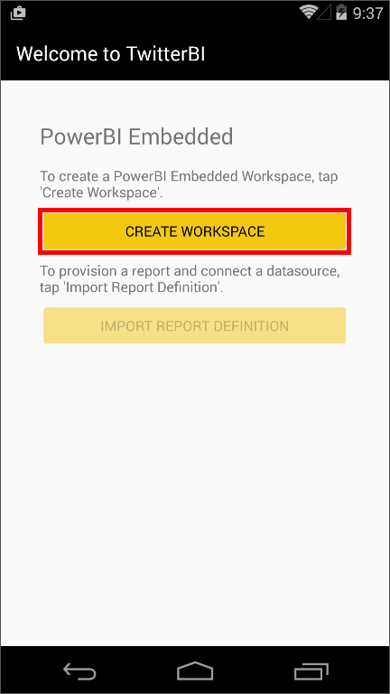
	
    _Creating a Power BI Embedded workspace_ 

1. Next,  click **Import Report Definition** to import a PBIX file containing a report definition The report definition was created ahead of time so you wouldn't have to create it yourself.

	> If you'd like to learn more about report definitions and PBIX files, you will have the opportunity to do so in Exercise 10.

    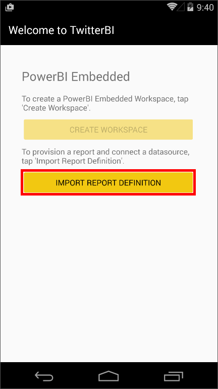
	
    _Importing a Power BI Embedded report definition_ 

Now it's time to start populating the dataset that was created when you imported the report definition. This is where things start to get fun, since you'll be viewing real-time Twitter activity in your Power BI Embedded report (and therefore in the app).

<a name="Exercise5"></a>
## Exercise 5: Create a Twitter app ##

In order to access Twitter streams programmatically, you need an access token that allows Twitter to authenticate calls from your app. And in order to get an access token, you must have a Twitter account. If you don't have a Twitter account, go to http://www.twitter.com and create one now.

1. Go to https://dev.twitter.com/ in your browser and click **My Apps** in the menu at the top of the page.

    
	
    _Viewing My Apps in the Twitter developer portal_ 

1. Click **Create New App**. If you are asked to sign in, do so with your Twitter credentials.

    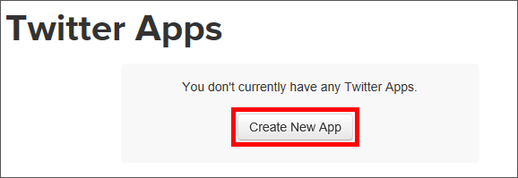
	
    _Creating a new Twitter app_ 

1. Fill in the "Create an application" form as shown below. The application name has to be unique, so you won't be able to use "Twitter BI" (although you could use something like "Twitter BI 093059"). Then click **Create your Twitter Application**.
 
    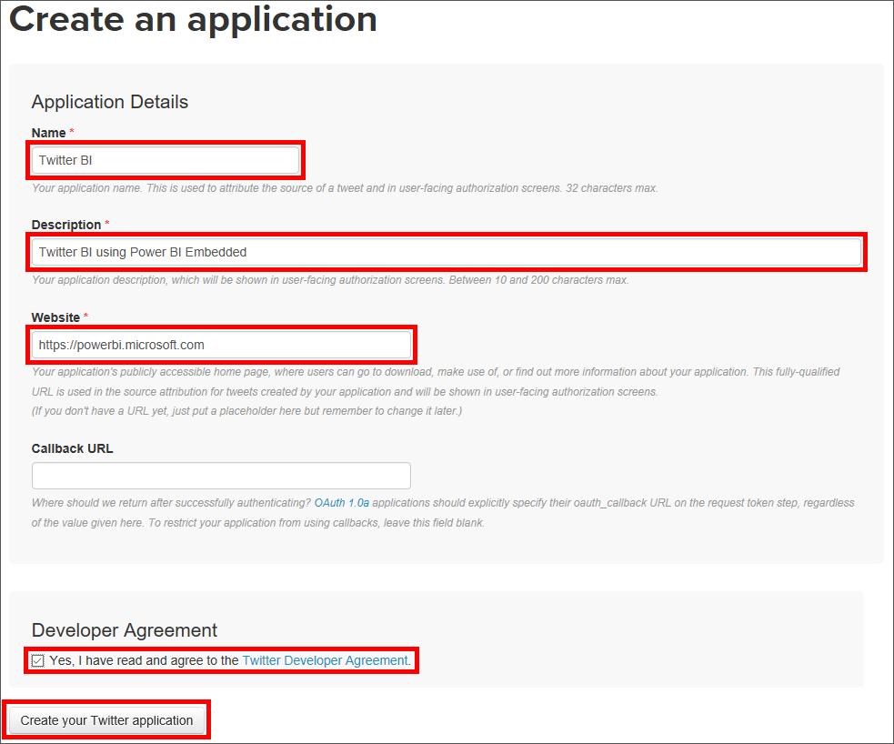
	
    _Creating a Twitter application_ 

1. Click **Keys and Access Tokens**.

    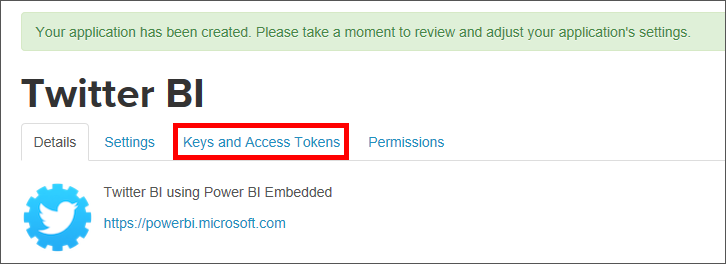
	
    _Activating the "Keys and Access Tokens" tab_ 

1. Scroll to the bottom of the page and click **Create my access token**. 
 
    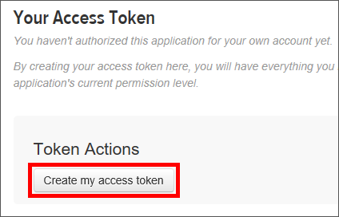
	
    _Creating an access token_ 

For convenience, leave this page open in your browser because you will need several of the values shown on the page in the next exercise.

<a name="Exercise6"></a>
## Exercise 6: Write code to track Twitter activity ##

In this exercise, you will write code that uses Tweetinvi, a popular Twitter API library, to monitor tweets, and that transmits the latitudes and longitudes that the tweets originate from to a back-end dataset used by the Power BI report that you imported in [Exercise 4](#Exercise4).

1. In Solution Explorer, right-click the **TwitterBI** solution and select **Manage NuGet Packages for Solution...**. Search for "tweetenvi," and then install **TweetinviAPI** in all four projects. If prompted to review changes, click **OK**.

    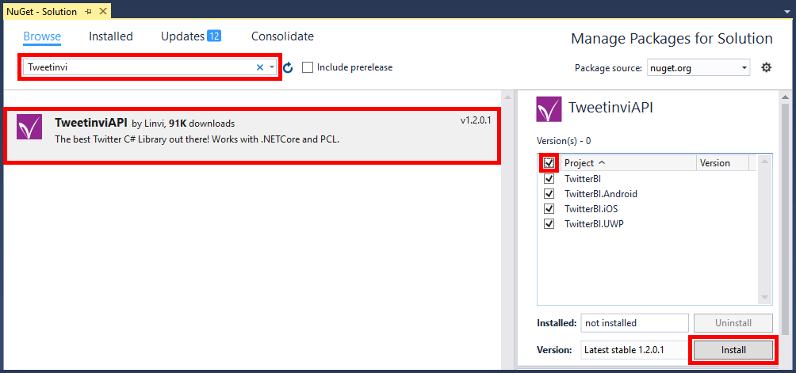
	
    _Installing TweetinviAPI_ 

1. Open **CoreConstants.cs** in the "Common" folder of the **TwitterBI (Portable)** project and add the following class definition:

	```C#
	public static class TwitterConstants
	{
	    public static string ConsumerKey = "TWITTER_CONSUMER_KEY";
	    public static string ConsumerSecret = "TWITTER_CONSUMER_SECRET";
	    public static string AccessToken = "TWITTER_ACCESS_TOKEN";
	    public static string AccessSecret = "TWITTER_ACCESS_TOKEN_SECRET";

	    // THIS LATITUDE/LONGITUDE RECTANGLE DENOTES THE GENERAL AREA OF TEXAS, UNITED STATES
	    public static double StartingLatitude = 36.221413;
	    public static double StartingLongitude = -106.600440;
	    public static double EndingLatitude = 30.386337;
	    public static double EndingLongitude = -93.592628;

	    public static string ActivityBaseUrl = "https://traininglabservices.azurewebsites.net/api/TwitterActivity";
	}	
	```

1. Replace *TWITTER_CONSUMER_KEY* in the code you just added with the **Consumer Key (API Key)** shown on the Twitter Application Management page open in your browser.

1. Replace *TWITTER_CONSUMER_SECRET* with the **Consumer Secret (API Key)** shown in the browser.

1. Replace *TWITTER_ACCESS_TOKEN* with the **Access Token** shown in the browser.

1. Replace *TWITTER_ACCESS_TOKEN_SECRET* with the **Access Token Secret** shown in the browser.

1. Open **MainViewModel.cs** in the **TwitterBI (Portable)** project and add the following statements to the ```MainViewModel``` class:

	```C#
	private bool _canStartStreaming;
    public bool CanStartStreaming
    {
        get { return this._canStartStreaming; }
        set { this.SetProperty(ref this._canStartStreaming, value); }
    }

    private string _startStreamingLabel;
    public string StartStreamingLabel
    {
        get { return this._startStreamingLabel; }
        set { this.SetProperty(ref this._startStreamingLabel, value); }
    }

    public void ToggleStreamingLabel()
    {
        this.StartStreamingLabel = (this.CanStartStreaming) ? "Start Streaming" : "Stop Streaming";
    }
	```

1. Add the following statements to the end of the ```MainViewModel``` constructor:

	```C#
	this.CanStartStreaming = true;
	ToggleStreamingLabel();
	```

1. Scroll down to the ```InitializeWorkspaceAsync``` method and insert the following line of code after the line that initializes ```this.IsDatasetCreated```:

	```C#
	this.CanStartStreaming = this.CurrentReportId != null;
	```

1. Open **MainPage.xaml** in the **TwitterBI (Portable)** project and insert the following XAML before the closing ```</StackLayout>``` tag:

	```XAML
	<Label Margin="0,10" Style="{DynamicResource TitleStyle}" Text="Twitter Streaming"/>
	<Label Style="{DynamicResource BodyStyle}" Text="To start streaming Twitter activity, tap 'Start Streaming'."/>
	<Button IsVisible="{Binding IsDatasetCreated}" BackgroundColor="#00ACED" TextColor="Black" IsEnabled="{Binding IsStreamingStopped}" Text="{Binding StartStreamingLabel}" Clicked="OnStartStreamingClicked"/>
	```

    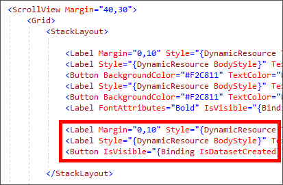
	
    _Updating MainPage.xaml.cs_ 

1. Open **MainPage.xaml.cs** in the **TwitterBI (Portable)** project and insert the following code after the ```OnImportReportClicked``` method:

	```C#
	private void OnStartStreamingClicked(object sender, EventArgs e)
	{
	    if (App.ViewModel.CanStartStreaming)
	    {
	        Helpers.StreamHelper.StartStreaming();
	    }
	    else
	    {
	        Helpers.StreamHelper.StopStreaming();
	    }
	
	    App.ViewModel.ToggleStreamingLabel();
	}
	```

1. Right-click the "Interfaces" folder in the **TwitterBI (Portable)** project and use the **Add** -> **Class** command to add a class file named **IStreamService.cs**. Then replace the contents of the file with the following code: 

	```C#
	using System;
	using System.Collections.Generic;
	using System.Linq;
	using System.Text;
	using System.Threading.Tasks;
	
	namespace TwitterBI
	{
	    public interface IStreamService
	    {
	        void StartStreaming();
	        void StopStreaming();
	    }
	}
	```
1. Right-click the "Helpers" folder and use the **Add** -> **Class** command to add a class file named **StreamHelper.cs** to the folder. Then replace the contents of this file with the following code: 

	```C#
	using System;
	using System.Collections.Generic;
	using System.Linq;
	using System.Net.Http;
	using System.Text;
	using System.Threading.Tasks;
	using Tweetinvi;
	using Tweetinvi.Models;
	
	namespace TwitterBI.Helpers
	{
	    public static class StreamHelper
	    {
	        public async static Task<bool> AddTwitterActivityAsync(double latitude, double longitude)
	        {
	            HttpClient client = new HttpClient();
	            HttpResponseMessage result = await client.PostAsync(Common.TwitterConstants.ActivityBaseUrl + $"?workspaceId={App.ViewModel.CurrentWorkspaceId}&latitude={latitude}&longitude={longitude}", null);
	            return result.IsSuccessStatusCode;
	        }
	
	        public async static Task<bool> ClearTwitterActivityAsync()
	        {
	            HttpClient client = new HttpClient();
	            HttpResponseMessage result = await client.GetAsync(Common.TwitterConstants.ActivityBaseUrl + $"?workspaceId={App.ViewModel.CurrentWorkspaceId}");
	            return result.IsSuccessStatusCode;
	        }
	
	        public async static void StartStreaming()
	        {
	            App.ViewModel.CanStartStreaming = false;
	            await ClearTwitterActivityAsync();
	            var service = Xamarin.Forms.DependencyService.Get<IStreamService>();
	            service.StartStreaming();
	        }
	
	        public static void StopStreaming()
	        {
	            App.ViewModel.CanStartStreaming = true;
	            var service = Xamarin.Forms.DependencyService.Get<IStreamService>();
	            service.StopStreaming();
	        }
	    }
	}
	```

	> Just like Power BI Embedded code, Tweetinvi code is platform-specific. The code you just added allows platform-specific code to be called from PCL code.

1. Right-click the **TwitterBI.Android** project and use the **Add** -> **Class** command to add a class file named **StreamService.cs**. Then replace the contents of the file with the following code: 

	```C#
	using System;
	using System.Collections.Generic;
	using System.Linq;
	using System.Text;
	
	using Android.App;
	using Android.Content;
	using Android.OS;
	using Android.Runtime;
	using Android.Views;
	using Android.Widget;
	using TwitterBI.Droid.DependencyServices;
	using Tweetinvi;
	using Tweetinvi.Models;
	using System.Threading.Tasks;
	using Tweetinvi.Streaming;
	
	[assembly: Xamarin.Forms.Dependency(typeof(StreamService))]
	namespace TwitterBI.Droid.DependencyServices
	{
	    public class StreamService : IStreamService
	    {
	        public IFilteredStream CurrentStream = null;
	
	        public async void StartStreaming()
	        {
	            var credentials = Auth.CreateCredentials(Common.TwitterConstants.ConsumerKey, Common.TwitterConstants.ConsumerSecret, Common.TwitterConstants.AccessToken, Common.TwitterConstants.AccessSecret);
	
	            this.CurrentStream = Stream.CreateFilteredStream(credentials);
	
	            this.CurrentStream.StallWarnings = true;
	            this.CurrentStream.FilterLevel = Tweetinvi.Streaming.Parameters.StreamFilterLevel.None;
	            this.CurrentStream.AddLocation(new Coordinates(Common.TwitterConstants.StartingLatitude, Common.TwitterConstants.StartingLongitude), new Coordinates(Common.TwitterConstants.EndingLatitude, Common.TwitterConstants.EndingLongitude));
	
	            this.CurrentStream.MatchingTweetReceived += (sender, args) =>
	            {
	                if (args.Tweet.Coordinates != null)
	                {
	                    AddActivityAsync(args.Tweet.Coordinates);
	                }
	            };
	
	            await this.CurrentStream.StartStreamMatchingAllConditionsAsync();
	        }
	
	        public void StopStreaming()
	        {
	            if (this.CurrentStream != null && this.CurrentStream.StreamState != StreamState.Stop) this.CurrentStream.StopStream();
	        }
	
	        private async void AddActivityAsync(ICoordinates coordinates)
	        {
	            await Helpers.StreamHelper.AddTwitterActivityAsync(coordinates.Latitude, coordinates.Longitude);
	        }
	    }
	}
	```

1. Right-click the **TwitterBI.iOS** project and use the **Add** -> **Class** command to add a class file named **StreamService.cs**. Then replace the contents of the file with the following code: 

	```C#
	using System;
	using System.Collections.Generic;
	using System.Linq;
	using System.Text;
	
	using Foundation;
	using UIKit;
	using TwitterBI.iOS.DependencyServices;
	using Tweetinvi;
	using Tweetinvi.Models;
	using Tweetinvi.Streaming;
	
	[assembly: Xamarin.Forms.Dependency(typeof(StreamService))]
	namespace TwitterBI.iOS.DependencyServices
	{
	    public class StreamService : IStreamService
	    {
	        public IFilteredStream CurrentStream = null;
	
	        public async void StartStreaming()
	        {
	            var credentials = Auth.CreateCredentials(Common.TwitterConstants.ConsumerKey, Common.TwitterConstants.ConsumerSecret, Common.TwitterConstants.AccessToken, Common.TwitterConstants.AccessSecret);
	
	            this.CurrentStream = Stream.CreateFilteredStream(credentials);
	
	            this.CurrentStream.StallWarnings = true;
	            this.CurrentStream.FilterLevel = Tweetinvi.Streaming.Parameters.StreamFilterLevel.None;
	            this.CurrentStream.AddLocation(new Coordinates(Common.TwitterConstants.StartingLatitude, Common.TwitterConstants.StartingLongitude), new Coordinates(Common.TwitterConstants.EndingLatitude, Common.TwitterConstants.EndingLongitude));
	
	            this.CurrentStream.MatchingTweetReceived += (sender, args) =>
	            {
	                if (args.Tweet.Coordinates != null)
	                {
	                    AddActivityAsync(args.Tweet.Coordinates);
	                }
	            };
	
	            await this.CurrentStream.StartStreamMatchingAllConditionsAsync();
	        }
	
	        public void StopStreaming()
	        {
	            if (this.CurrentStream != null && this.CurrentStream.StreamState != StreamState.Stop) this.CurrentStream.StopStream();
	        }
	
	        private async void AddActivityAsync(ICoordinates coordinates)
	        {
	            await Helpers.StreamHelper.AddTwitterActivityAsync(coordinates.Latitude, coordinates.Longitude);
	        }
	    }
	}
	```

1. Right-click the **TwitterBI.UWP (Universal Windows)** project and use the **Add** -> **Class** command to add a class file named **StreamService.cs**. Then replace the contents of the file with the following code: 

	```C#
	using System;
	using System.Collections.Generic;
	using System.Linq;
	using System.Text;
	using System.Threading.Tasks;
	using Tweetinvi;
	using Tweetinvi.Models;
	using Tweetinvi.Streaming;
	using TwitterBI.UWP.DependencyServices;
	
	[assembly: Xamarin.Forms.Dependency(typeof(StreamService))]
	namespace TwitterBI.UWP.DependencyServices
	{
	    public class StreamService : IStreamService
	    {
	        public IFilteredStream CurrentStream = null;
	        public async void StartStreaming()
	        {
	            var credentials = Auth.CreateCredentials(Common.TwitterConstants.ConsumerKey, Common.TwitterConstants.ConsumerSecret, Common.TwitterConstants.AccessToken, Common.TwitterConstants.AccessSecret);
	
	            this.CurrentStream = Stream.CreateFilteredStream(credentials);
	
	            this.CurrentStream.StallWarnings = true;
	            this.CurrentStream.FilterLevel = Tweetinvi.Streaming.Parameters.StreamFilterLevel.None;
	            this.CurrentStream.AddLocation(new Coordinates(Common.TwitterConstants.StartingLatitude, Common.TwitterConstants.StartingLongitude), new Coordinates(Common.TwitterConstants.EndingLatitude, Common.TwitterConstants.EndingLongitude));
	
	            this.CurrentStream.MatchingTweetReceived += (sender, args) =>
	            {
	                if (args.Tweet.Coordinates != null)
	                {
	                    AddActivityAsync(args.Tweet.Coordinates);
	                }
	            };
	
	            await this.CurrentStream.StartStreamMatchingAllConditionsAsync();
	        }
	
	        public void StopStreaming()
	        {
	            if (this.CurrentStream != null && this.CurrentStream.StreamState != StreamState.Stop) this.CurrentStream.StopStream();
	        }
	
	        private async void AddActivityAsync(ICoordinates coordinates)
	        {
	            await Helpers.StreamHelper.AddTwitterActivityAsync(coordinates.Latitude, coordinates.Longitude);
	        }
	    }
	}
	```

1. Launch the Android app and click the **Start Streaming** button to begin streaming real-time Twitter updates to the Power BI Embedded dataset.

    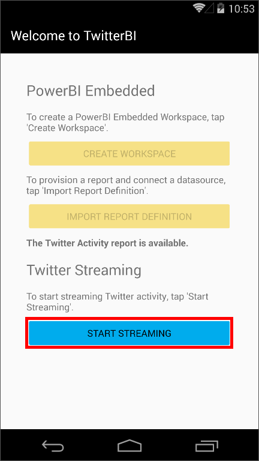
	
    _Streaming Twitter updates_ 

1. After approximately 60 seconds, click **Stop Streaming**.

At this point, you're probably wondering what's happening since the app shows no visible representation of Twitter activity. That's because one piece of the puzzle is still missing: the piece that runs in the cloud and serves up a Power BI Embedded report for the app to display.

<a name="Exercise7"></a>
## Exercise 7: Create a Power BI report viewer in an Azure Mobile App ##

Power BI Embedded services can only be created programmatically, but Power BI reports, with full support for report navigation and filtering tools, can easily be generated and viewed on-the-fly via HTML, by, again, leveraging the Power BI Embedded SDK. Although you could technically create these services in a wide variety of ways, one of the easy mechanisms is to use an Azure Mobile App to serve as a reporting back end.

1. In Solution Explorer, right-click the **TwitterBI** solution and use the **Add** -> **New Project...** command to add an **ASP.NET Web Application (.NET Framework)** project to the solution. Name the project "TwitterBIMobile."
 
    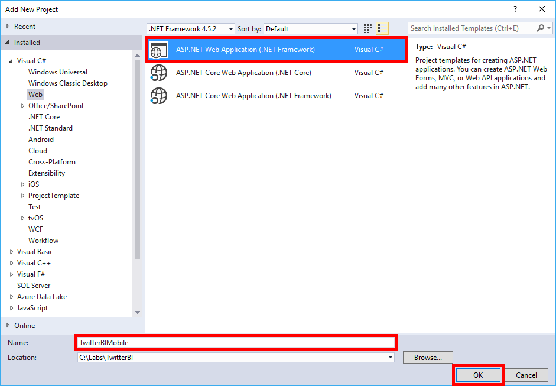
	
    _Adding a project to the solution_

1. In the "New ASP.NET Web Application" dialog, select **Azure Mobile App** and click **OK**.
 
    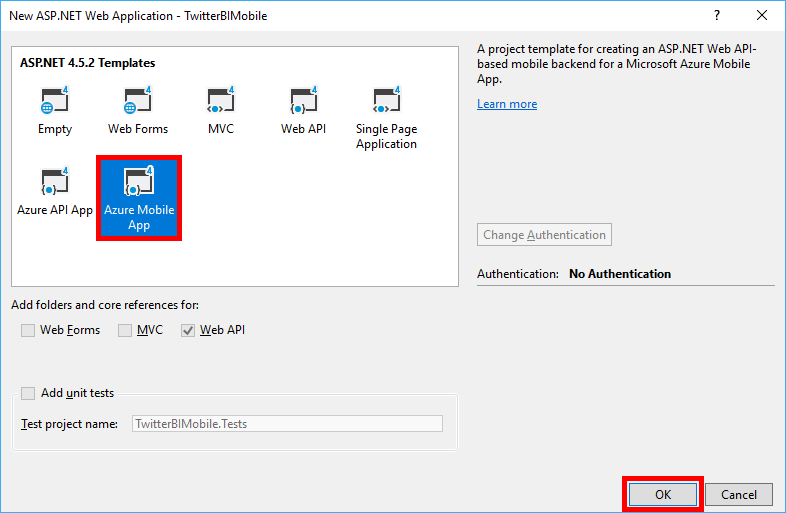
	
    _Creating an Azure Mobile App_

1. Right-click the **TwitterBIMobile** project you just added to the solution and select **Manage NuGet Packages...**. Then find the package named "Microsoft.PowerBI.Core" and install it.

    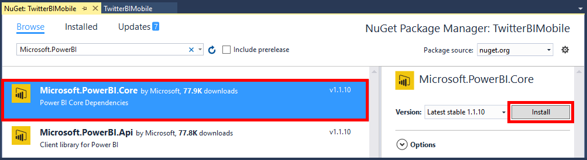
	
    _Installing Microsoft.PowerBI.Core_

1. Repeat this process to install **Microsoft.PowerBI.Javascript** into the project.

    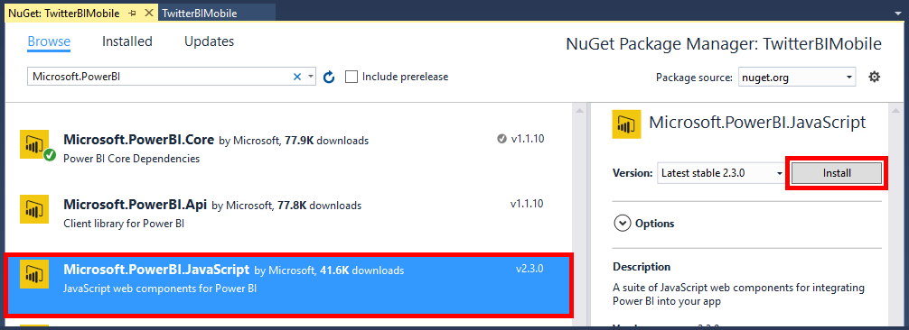
	
    _Installing Microsoft.PowerBI.Javascript_

1. Right-click the **TwitterBIMobile** project and use the **Add** -> **New Folder** command to add a folder named "Common" to the project.

1. Right-click the "Common" folder and use the **Add** -> **Class** command to add a class file named **CoreConstants.cs** to the folder. Replace the contents of the file with the following code:

	```C#
	using System;
	using System.Collections.Generic;
	using System.Linq;
	using System.Web;
	
	namespace TwitterBIMobile.Common
	{
	    public static class PowerBIConstants
	    {
	        public static string WorkspaceCollectionName = "twitterbi";
	        public static string AccessKey = "POWER_BI_EMBEDDED_ACCESS_KEY";
	    }
	}
	```

1. Right-click the "Controllers" folder and select **Add** -> **Controller...**. Select **MVC 5 Controller - Empty** as the controller type and click **Add**.
 
    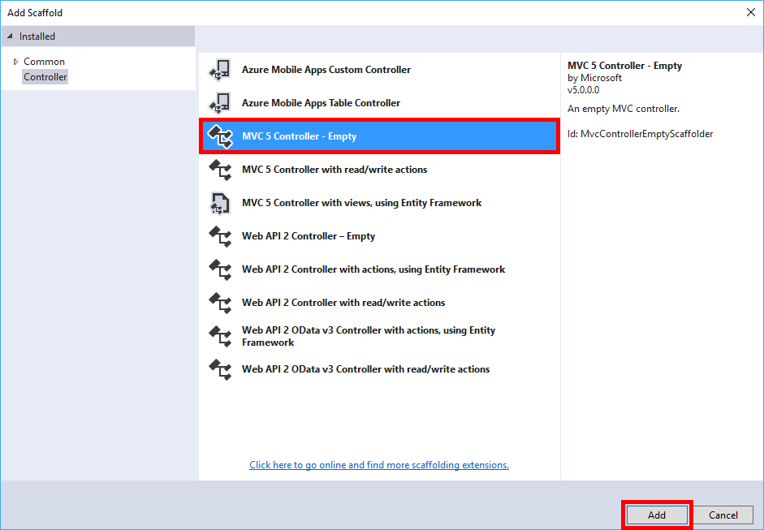
	
    _Adding a controller_

1. Enter "ReportsController" as the controller name and click **Add**. 

    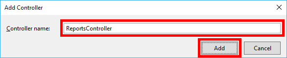
	
    _Naming the controller_

1. Replace the contents of **ReportsController.cs** with the following code:

	```C#
	using Microsoft.PowerBI.Security;
	using System;
	using System.Collections.Generic;
	using System.Linq;
	using System.Web;
	using System.Web.Mvc;
	
	namespace TwitterBIMobile.Controllers
	{
	    public class ReportsController : Controller
	    {
	        // GET: Reports
	        public ActionResult Index(string workspaceId, string reportId)
	        {
	            ViewBag.Title = "Reports";
	
	            if (!string.IsNullOrEmpty(workspaceId) && !string.IsNullOrEmpty(reportId))
	            {
	                var token = PowerBIToken.CreateReportEmbedToken(Common.PowerBIConstants.WorkspaceCollectionName, workspaceId, reportId, "R", new string[] { "R" }, "Report.Read");
	
	                var accessToken = token.Generate(Common.PowerBIConstants.AccessKey);
	
	                ViewBag.ReportId = reportId;
	                ViewBag.AccessToken = accessToken;
	            }
	
	            return View();
	        }
	    }
	}
	```

1. Right-click the "Views\Reports" folder and select **Add** -> **New Scaffolding Item...** Select the **MVC 5 View** and click **Add**.

    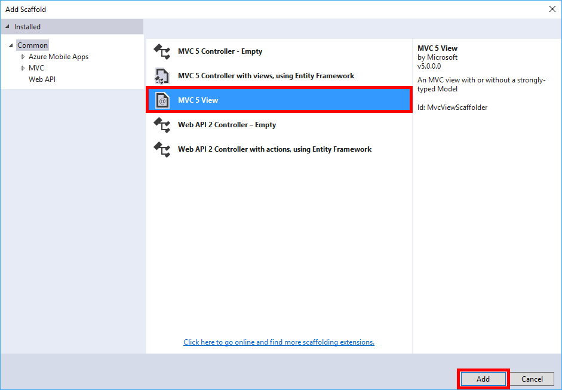
	
    _Adding a view_

1. Enter "Index" as the view name and click **Add**.

    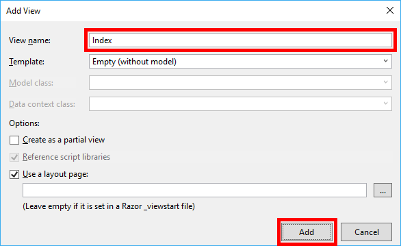
	
    _Naming the view_

1. Replace the contents of **Index.cshtml** with the following statements:

	```html
	@{
    ViewBag.Title = "Reports";
	}
	
	<div class="container" id="reportContainer"></div>
	
	<script type="text/javascript">
	
	    var embedConfiguration = {
	        type: 'report',
	        accessToken: '@ViewBag.AccessToken',
	        id: '@ViewBag.ReportId',
	        embedUrl: 'https://embedded.powerbi.com/appTokenReportEmbed'
	    };
	
	    var $reportContainer = $('#reportContainer');
	    var report = powerbi.embed($reportContainer.get(0), embedConfiguration);
	
	</script>

	```

1. Open **_Layout.cshtml** in the "Views\Shared" folder and replace the contents of the file with the following code:

	```html
	<!DOCTYPE html>
	<html>
	<head>
	    <meta charset="utf-8" />
	    <meta name="viewport" content="width=device-width" />
	    <title>@ViewBag.Title</title>
	    @Styles.Render("~/Content/css")
	    @Scripts.Render("~/bundles/modernizr")
	    <script src="~/Scripts/jquery-1.10.2.js" type="text/javascript" language="javascript"></script>
	    <script src="~/Scripts/powerbi.js" type="text/javascript" language="javascript"></script>
	
	    <style>
	        html, body {
	            height: 100%;
	            width: 100%;
	            margin: 0px;
	            padding: 0px;
	        }
	
	        .container {
	            height: 100%;
	            width: 100%;
	            margin: 0px;
	            padding: 0px;
	        }
	    </style>
	
	</head>
	<body>
	
	    <div class="container body-content">
	        @RenderBody()
	    </div>
	
	    @Scripts.Render("~/bundles/jquery")
	    @Scripts.Render("~/bundles/bootstrap")
	    @RenderSection("scripts", required: false)
	</body>
	</html>
	```

1. Right-click the "Views" folder and select **Add** -> **New Item...**. Select **Web Configuration File**, enter "Web.config" as the file name, and click **Add**.

    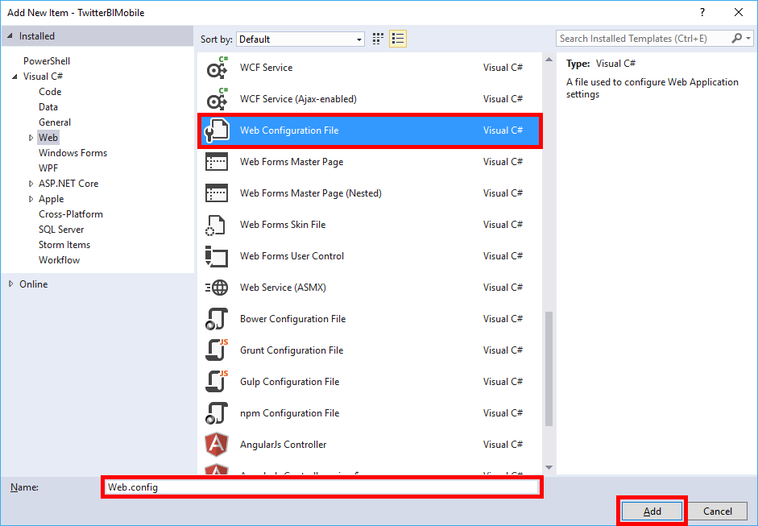
	
    _Adding a Web.config file to the "Views" folder_

1. Replace the contents of the new **Web.config** file with the following XML: 

	```XML
	<?xml version="1.0"?>
	<configuration>
	  <configSections>
	    <sectionGroup name="system.web.webPages.razor" type="System.Web.WebPages.Razor.Configuration.RazorWebSectionGroup, System.Web.WebPages.Razor, Version=3.0.0.0, Culture=neutral, PublicKeyToken=31BF3856AD364E35">
	      <section name="host" type="System.Web.WebPages.Razor.Configuration.HostSection, System.Web.WebPages.Razor, Version=3.0.0.0, Culture=neutral, PublicKeyToken=31BF3856AD364E35" requirePermission="false" />
	      <section name="pages" type="System.Web.WebPages.Razor.Configuration.RazorPagesSection, System.Web.WebPages.Razor, Version=3.0.0.0, Culture=neutral, PublicKeyToken=31BF3856AD364E35" requirePermission="false" />
	    </sectionGroup>
	  </configSections>
	
	  <system.web.webPages.razor>
	    <host factoryType="System.Web.Mvc.MvcWebRazorHostFactory, System.Web.Mvc, Version=5.2.3.0, Culture=neutral, PublicKeyToken=31BF3856AD364E35" />
	    <pages pageBaseType="System.Web.Mvc.WebViewPage">
	      <namespaces>
	        <add namespace="System.Web.Mvc" />
	        <add namespace="System.Web.Mvc.Ajax" />
	        <add namespace="System.Web.Mvc.Html" />
	        <add namespace="System.Web.Routing" />
	        <add namespace="System.Web.Optimization" />
	        <add namespace="TwitterBIMobile" />
	      </namespaces>
	    </pages>
	  </system.web.webPages.razor>
	
	  <appSettings>
	    <add key="webpages:Enabled" value="false" />
	  </appSettings>
	
	  <system.webServer>
	    <handlers>
	      <remove name="BlockViewHandler"/>
	      <add name="BlockViewHandler" path="*" verb="*" preCondition="integratedMode" type="System.Web.HttpNotFoundHandler" />
	    </handlers>
	  </system.webServer>
	</configuration>
	```

1. One of the primary benefits of Power BI Embedded is that you can embed visualizations in your apps, and people who use the apps don't have to have Power BI accounts. All access and activity for reports uses your Power BI Embedded Access Key created when you provisioned your Power BI Embedded Workspace Collection. In order to ensure authorization for view reports via your new report viewer you will need to use the same Power BI Embedded Access Key used in Exercise 4.

	Open **CoreConstants.cs** in the "Common" folder of the **TwitterBI (Portable)** project. 

1. Copy the value of the ```AccessKey``` property in the ```PowerBIConstants``` class to the clipboard.    
 
    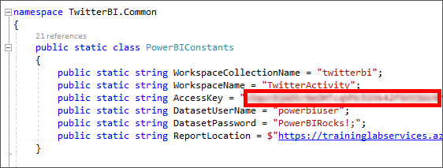
	
    _Copying the access key_

1. Now open **CoreConstants.cs** in the **TwitterBIMobile** project and replace *POWER_BI_EMBEDDED_ACCESS_KEY* with the access key on the clipboard.

    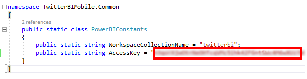
	
    _Pasting the access key_

1. The next step is to publish the Azure Mobile App. Right-click the **TwitterBIMobile** project and select **Publish**.
 
    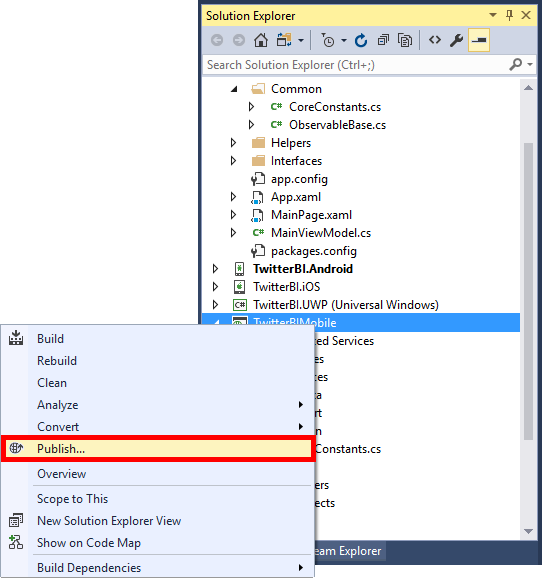
	
    _Publishing the Azure Mobile App_

1. Select **Microsoft Azure App Service**, ensure **Create New** is selected, and click **Publish**.

    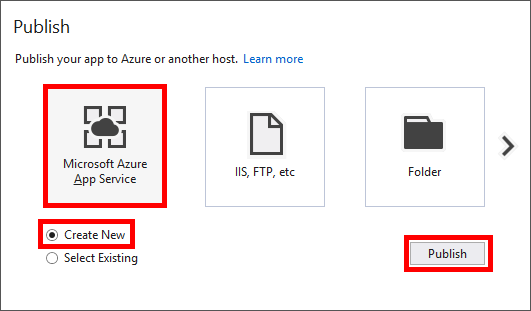
	
    _Publishing the Azure Mobile App_

1. In the "Create App Service" dialog, select the **PowerBIResources** resource group and click **Create**.

    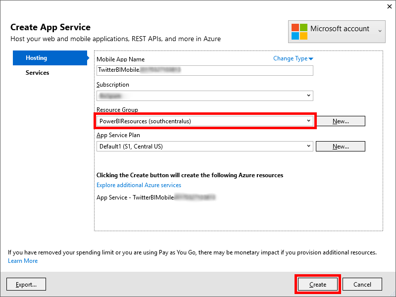
	
    _Creating an Azure App Service_

1. Confirm that the Azure Mobile App appears in your browser.

    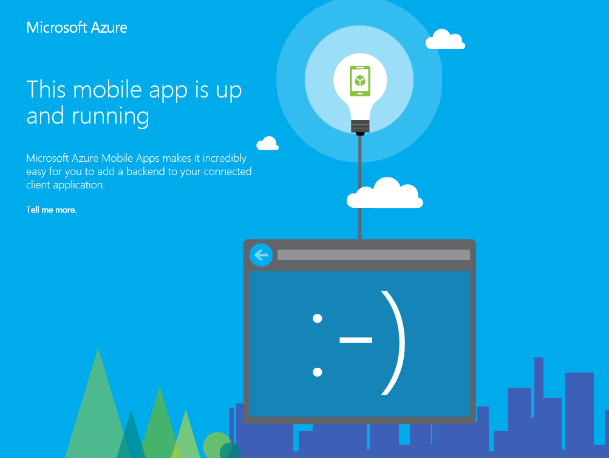
	
    _The Azure Mobile App_

Leave the browser open, because you will be returning to this page in the next exercise. Now it's time to experience what you've worked so hard for: viewing real-time Twitter activity in a Power BI report in your Twitter BI app.

<a name="Exercise8"></a>
## Exercise 8: Connect a Xamarin Forms app to a Power BI report viewer ##

Since you created your Power BI report viewer in HTML, you can easily view the report, as well as all the cool report navigation, zooming, and various views on any device, including an app created in Xamarin Forms targeting iOS, Android or Windows. The code to view an HTML report is extremely simple, and, as long as the viewer can generate a key using your Power BI Embedded Access Key, can be viewed by any user.

In this exercise you will be connecting Twitter BI app to your back end Power BI report viewer to view reports directly in the app.

1. In Solution Explorer, right-click the **TwitterBI (Portable)** project and use the **Add** -> **New Item...** command to add a blank page named **ViewReportPage.xaml** to the project.
 
    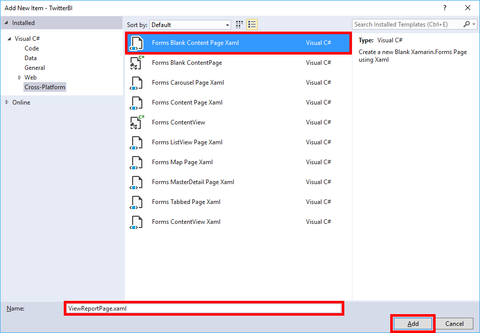
	
    _Adding a page to the app_

1. Replace the contents of **ViewReportPage.xaml** with the following XAML:

	```XAML
	<?xml version="1.0" encoding="utf-8" ?>
	<ContentPage xmlns="http://xamarin.com/schemas/2014/forms" Title="Twitter Activity"
	             xmlns:x="http://schemas.microsoft.com/winfx/2009/xaml"
	             x:Class="TwitterBI.ViewReportPage">
	    <Grid>
	        <WebView Source="{Binding ReportViewerUrl}" IsVisible="True" VerticalOptions="Fill" HorizontalOptions="Fill"/>
	    </Grid>
	</ContentPage>
	```
	
	This page contains a ```WebView``` control which is capable of displaying HTML content. You are effectively embedding a browser inside a page in a mobile app.

1. Open **ViewReportPage.xaml.cs** and insert enter the following code below the class constructor to override the ```OnAppearing``` method:

	```C#
	protected override void OnAppearing()
	{
	    base.OnAppearing();
	    this.BindingContext = App.ViewModel;
	}
	```

1. Open **CoreConstants.cs** in the project's "Common" folder. Insert the following class below the ```TwitterConstants``` class:

	```C#
	public static class AzureMobileConstants
	{
		public static string MobileServiceUrl = "AZURE_MOBILE_APP_URL";
	}
	```

1. Return to the browser where the Azure Mobile App is displayed and copy the URL in the address bar to the clipboard.

    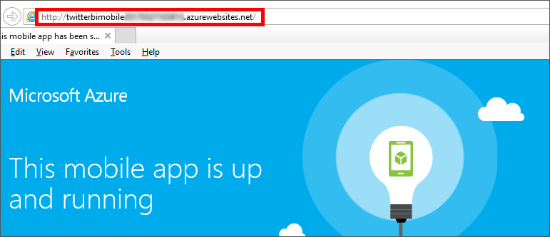
	
    _Copying the URL to the clipboard_

1. Return to Visual Studio and replace *AZURE_MOBILE_APP_URL* in the code you just added to **CoreConstants.cs** with the URL on the clipboard. 

1. Open **PowerBIHelper.cs** in the "Helpers" folder and add the following method just above the ```CreateWorkspaceAsync``` method: 

	```C#
	public static string GenerateReportViewUrl(string workspaceId, string reportId)
	{
	    return $"{Common.AzureMobileConstants.MobileServiceUrl}Reports/?workspaceId={workspaceId}&reportId={reportId}";
	}
	```

1. Open **MainViewModel.cs** and add the following code below the class constructor:

	```C#
	private string _reportViewerUrl;
    public string ReportViewerUrl
    {
        get { return this._reportViewerUrl; }
        set { this.SetProperty(ref this._reportViewerUrl, value); }
    }
	```

1. Insert the following line of code into the ```InitializeWorkspaceAsync``` method at the location pictured below: 

	```C#
	this.ReportViewerUrl = Helpers.PowerBIHelper.GenerateReportViewUrl(this.CurrentWorkspaceId, this.CurrentReportId);
	```

    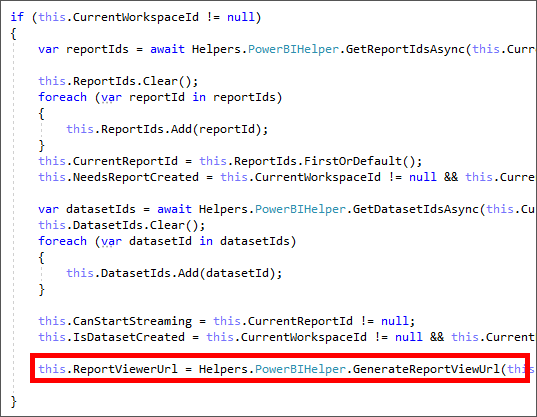
	
    _Updating the InitializeWorkspaceAsync method_

1. Insert the following statement just before the closing ```</StackLayout>``` tag in **MainPage.xaml**:

	```XAML
	<Button BackgroundColor="#00ACED" TextColor="Black" Text="View Activity" Clicked="OnViewActivityClicked"/>
	```

1. Add the following method to the ```MainPage``` class in **MainPage.xaml.cs**:

	```C#
	private void OnViewActivityClicked(object sender, EventArgs e)
    {
        Navigation.PushAsync(new ViewReportPage(), true);
    }
	```

1. Now it's time to see some results. Launch the Android version of the app and click **Start Streaming**. Let it run for 3 or 4 minutes, and then click **View Activity**.

	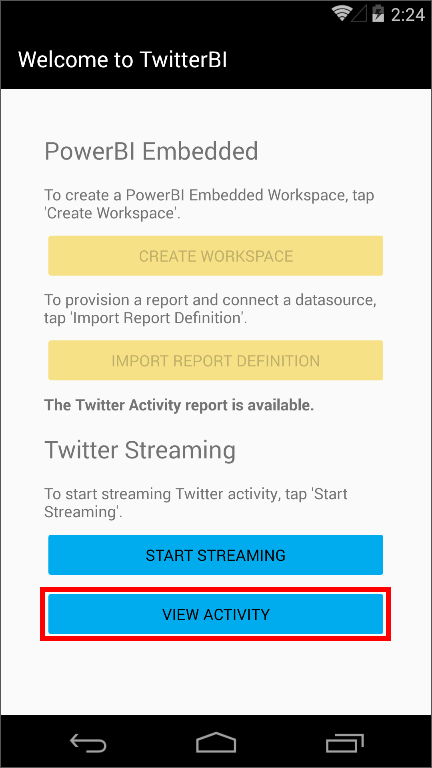
	
	_Viewing Twitter activity in the app_

1. Confirm that a map showing real-time Twitter activity appears.
 
	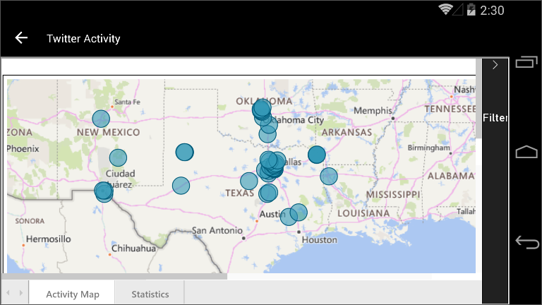
	
	_Map rendered by Power BI Embedded_

1. Click **Statistics** to see a different view of Twitter activity.

	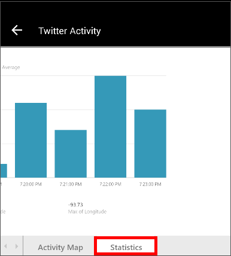
	
	_Switching to Statistics view_

Play with the app and notice that you can even filter results based on latitude and longitude. And it could just as easily be hosted in a Web page as in a mobile app because in the end, it's just HTML.

<a name="Exercise9"></a>
## Exercise 9: (OPTIONAL) Configure and view a Power BI report in Power BI Desktop ##

All the hard work is done, and although there are a number of pieces to the puzzle, it's easy to see how all efforts have really paid off. You now have a cross-platform app using Xamarin Forms to view Twitter activity using Power BI Embedded. One of the benefits of Power BI Embedded, especially when using the Power BI Embedded SDK to import report definitions (*.pbix) files, is the ability to view and manipulate these reports in Power BI Desktop.

In this exercise you will be accessing the report definition file imported in Exercise 4 to view and make slight adjustments to the report using Microsoft Power BI Desktop.

If you have not installed Microsoft Power BI Desktop, **stop now and install it** from [https://powerbi.microsoft.com/en-us/desktop/](https://powerbi.microsoft.com/en-us/desktop/ "https://powerbi.microsoft.com/en-us/desktop/").

1. Copy and paste the following URL in your browser to access the report definition used in this lab:

	```https://traininglabservices.azurewebsites.net/PowerBIImports/TwitterActivity.zip```

1. Save the ZIP file to a location on your computer where you can easily access it, such as your **Desktop** or **Documents** folder.
1. Change the file extension of this file from .zip to **.pbix**.
1. Open **TwitterActivity.pbix** in Microsoft Power BI Desktop by **double-clicking the file** in the saved location from the previous step.

	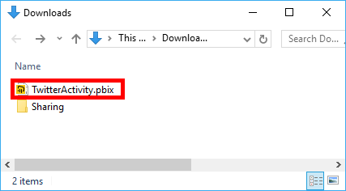
	
	_The renamed TwitterActivity.pbix file_

1. When Power BI Desktop loads you will be prompted for credentials. Power BI reports are disconnected from credentials by design, for security purposes. In the "SQL Server database" dialog, select the **Database** tab.
1. Enter "powerbiuser" as the **Username**, and "PowerBIRocks!" as the **Password** (both without quotation marks) and click **Connect**. 

	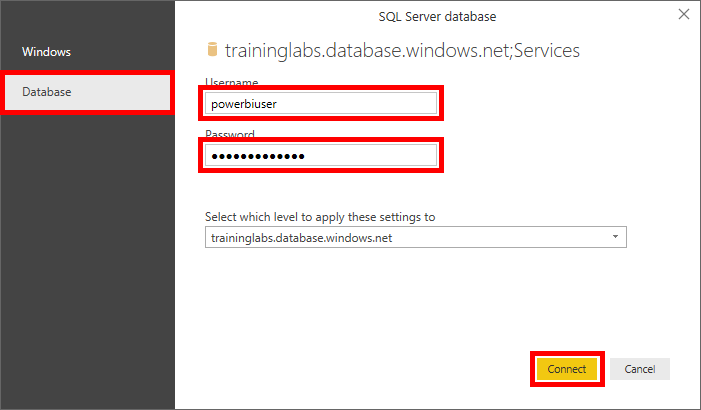
	
	_Updating credentials for the TwitterActivity.pbix report defintion_

1. After the report refreshes the dataset, select the **Statistics** tab at the bottom of the report designer.

	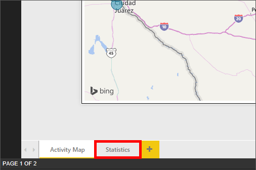
	
	_Selecting the report Statistics page_

1. Select the **Activity by Time Average** visual on the report palette by clicking it with your mouse cursor.

	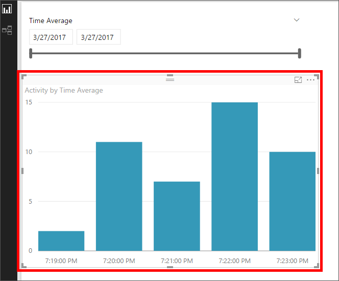
	
	_Selecting the Activity by Time Average visual_

1. Change report visual by selecting the **Stacked bar chart** visual from the **Visualizations** panel. Notice the immediate update to the report visual.

	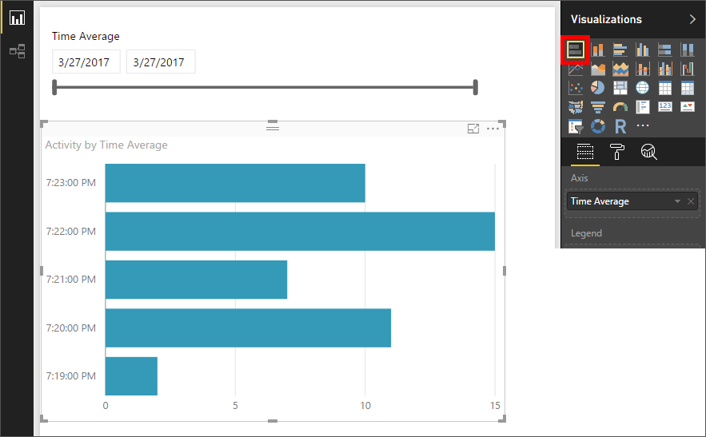
	
	_Selecting the Stacked bar chart visual_

1. Experiment with other Visualizations for other elements, such as the "Time average" **Slicer** and **Pie chart**, or if you're a data scientist check out the powerful **R script** visual, or just navigate back to the **Activity Map** tab and experiment with changing Visualizations and other properties for data that contains location data.

	
	
	_Selecting the Slicer visual_

Using Microsoft Power BI Desktop is one of the most powerful ways to create custom reports for Microsoft Power BI, especially when you're using Power BI Embedded to serve up reports to users who may not have direct access to Power BI services. 

<a name="Summary"></a>
## Summary ##

In this hands-on lab you learned how to:

- Provision a Power BI Embedded Workspace Collection
- Create a Xamarin Forms app in Visual Studio 2017 
- Add assets, common logic, and models to Xamarin Forms projects
- Write code to create Power BI Embedded reports
- Write code to track Twitter activity
- Create an Azure Mobile App as a back-end service
- Create a Power BI report viewer in an Azure Mobile App
- View a Power BI report in an app targeting Android, iOS, and Windows

You've worked through a lot of great scenarios in this lab, however this is really just the "tip of the iceberg" as it were. The power and ability of Power BI Embedded to transform your business intelligence and data visualization strategy, especially when combined with great cross-platform user experiences, is really just a few lines of code away.

---

Copyright 2017 Microsoft Corporation. All rights reserved. Except where otherwise noted, these materials are licensed under the terms of the MIT License. You may use them according to the license as is most appropriate for your project. The terms of this license can be found at https://opensource.org/licenses/MIT.