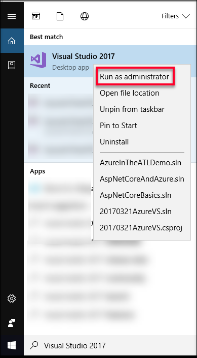
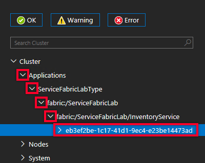
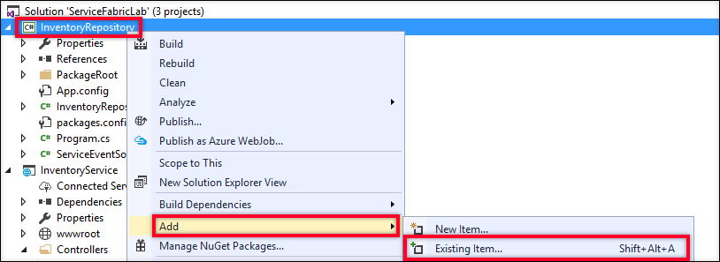
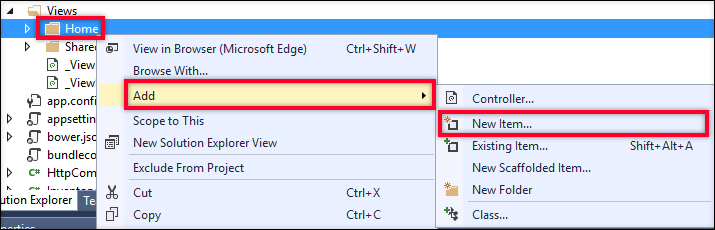

<a name="HOLTitle"></a>
# Developing Microservices with Azure Service Fabric #

---

<a name="Overview"></a>
## Overview ##

One of the more recent trends in enterprise architecture is the [Microservices architecture pattern](https://www.martinfowler.com/articles/microservices.html).  At its core, this pattern is a specialization of the Service Oriented Architecture pattern that gained popularity in the early 2000's, but extends that approach to focus on building small and independently deployable applications that communicate across lightweight protocols (including HTTP and TCP.)  This arrangement presents several advantages:

- Services are easy to both replace and maintain
- Services can be scaled independently
- Different programming tools & techniques can be employed for discrete areas of a given solution

Azure Service Fabric is a solution that supports developing and coordinating multiple services running within a cluster of virtual machines.  And while Service Fabric can be used to implement several different architectures, it is ideally suited to facilitate the development and orchestration of Microservices solutions.   

Azure Service Fabric deployments can exist on-premises, in Microsoft Azure, or even in other vendors' clouds.  In Azure, however, Service Fabric offers a first-class experience whose benefits are not necessarily as easily attainable in other deployment environments.  As such, Service Fabric both offers a platform for service management, as well as a set of programming models & related APIs.

It is important to note that while Service Fabric is one of the newer platform offerings within Microsoft Azure, it actually has been used internally by Microsoft for several years, powering Microsoft Cloud solutions that include Azure SQL Database, DocumentDB, Cortana, Microsoft Power BI, Microsoft Intune, Azure Event hHbs, Azure IoT Hub, Skype for Business, and others.  Additional information about Azure Service Fabric and its history can be found [here](https://docs.microsoft.com/en-us/azure/service-fabric/service-fabric-overview).

In this lab, you will learn how you can use Azure Service Fabric to build applications that implement a microservices architecture.  You will use Visual Studio 2017 to create an Azure Service Fabric application consisting of two services.  The first service will be a Stateless Service which will serve as the User Interface tier for the Inventory portion of a hypothetical catalog company.  The second service will be a Stateful Service which will provide RESTFul access to the inventory items.  Once both of these services have been created and communication is configured, you will explore how Azure Service Fabric provides scalability and resilience for the services it manages.

<a name="Objectives"></a>
### Objectives ###

In this hands-on lab, you will learn how to:
- Create a new Service Fabric application using Visual Studio 2017.
- Use the debugging and diagnostic tools provided by both Visual Studio and Service Fabric itself to run and monitor your Service Fabric application.
- Configure communication between multiple services in a Service Fabric application. 
- Leverage partitioning and Reliable Services in order to provide scalability and fault-tolerance in a Service Fabric application.

<a name="Prerequisites"></a>
### Prerequisites ###

The following are required to complete this hands-on lab:

- Visual Studio 2017 (Community Edition or higher) with the "*Azure development*" workload installed.  The Visual Studio 2017 installer can be downloaded [here](https://www.visualstudio.com/vs/).  Note that this lab is only supported on the Windows OS.
- An active Microsoft Azure subscription. If you do not already have an Azure subscription, you can [sign up for a free trial](http://aka.ms/WATK-FreeTrial).

<a name="Exercises"></a>
## Exercises ##

This hands-on lab includes the following exercises:

- [Exercise 1: Creating a new Service Fabric Project with Visual Studio 2017](#Exercise1)
- [Exercise 2: Running a Service Fabric Application in the Service Fabric Local Cluster Manager](#Exercise2)
- [Exercise 3: Adding Another Service in the Service Fabric Cluster](#Exercise3)
- [Exercise 4: Communicating Between Services in a Service Fabric Cluster](#Exercise4)
- [Exercise 5: Enable Partitioning and Show Node Failover](#Exercise5)

Estimated time to complete this lab: **60** minutes.

<a name="Exercise1"></a>
## Exercise 1: Creating a new Service Fabric Project with Visual Studio 2017 ##
In this exercise, you will create and examine a new Azure Service Fabric application using Visual Studio 2017.  In order to build and debug Azure Service Fabric applications using Visual Studio 2017 on your development machine, the following are requirements must be met:

- You need to be running Windows 7(SP1), 8.1, or 10 or Windows Server 2012 R2 or 2016.
- Visual Studio 2017 with the *Azure development* workload installed (Visual Studio 2015 Update 2 can also be used, but Visual Studio 2017 will be assumed throughout these lab instructions.)
- You need to install the *Microsoft Azure Service Fabric Core SDK*, which you can obtain [here](http://www.microsoft.com/web/handlers/webpi.ashx?command=getinstallerredirect&appid=MicrosoftAzure-ServiceFabric-CoreSDK).
- PowerShell 3.0 or newer must be installed with the execution policy set to "Unrestricted" for the administrator user.
	- You can achieve this configuration by running PowerShell as an administrator and executing the following command:
	`Set-ExecutionPolicy -ExecutionPolicy Unrestricted -Force -Scope CurrentUser`
 
Additional information about configuring your development environment can be found [here](https://docs.microsoft.com/en-us/azure/service-fabric/service-fabric-get-started).

Once you have your development environment properly configured, your first step is to create a Service Fabric Application project in Visual Studio 2017.
 
1. Run Visual Studio 2017 as an administrator.  This elevation of privileges for Visual Studio is required in order for it to work with the *Service Fabric Local Cluster Manager*, which allows you to deploy, run, and debug Service Fabric applications within your development machine.

	> In Windows 10, to run Visual Studio as an Administrator, you can first type **Visual Studio 2017** into the Windows search bar.  In the **Best Match** section of the search results, right-click on the **Visual Studio 2017** entry, and select **Run as administrator** from the dropdown.  When the *User Account Control (UAC)* dialog is displayed to confirm that you want to run Visual Studio this way, select **Yes**.

	

	_Running Visual Studio as an Administrator_

	> Note - When Visual Studio 2017 is running with administrator privileges, the application title will be displayed in the title bar with the word *(Administrator)* in parentheses at the end.
 
1. In Visual Studio, select **New** from the **File** menu, and then click on **Project**.

    

     _Creating a new project_

1. In the **New Project** dialog, select the **Cloud** node and then **Service Fabric Application** from within the **Cloud** node.
	- Enter *ServiceFabricLab* for the project **Name**.
	- Leave the **Location** set to the default value.
	- Leave the **Solution** name set to the default value.
	- Click the **OK** button to create the project.

    
     _New project settings_

1. The **New Service Fabric Service** dialog will be displayed.  This dialog shows the different types of services that can be included in a Service Fabric application.   Select **ASP.NET Core** and set the name to **InventoryService**.  Click **OK** to dismiss the dialog.

    

     _New Service Fabric Service_

1. In the dialog titled **New ASP.NET Core Web Application (.NET Framework) - Inventory Service**, make sure **ASP.NET Core 1.1** is selected in the framework dropdown.  Select the **Web Application** template, and then click on the **OK** button.

    

     _Web Application Template_

1. Take a minute to look over the contents of the *Solution Explorer* in Visual Studio 2017.
	
	The solution contains two projects - **InventoryService** and **ServiceFabricLab**.  Service Fabric solutions consist of one or more Service Fabric Service projects, as well as a Service Fabric Application project.

    

     _The Service Fabric Application Solution_

1. Examine the **ServiceFabricLab** project.  

	This project is the Service Fabric Application project for this solution. This project does not contain any code, but instead contains links to the services that are included in your Service Fabric application and information describing how your application will be packaged and deployed.

	One of the more important elements contained in the Service Fabric Application project is the *application manifest* file.  This file is named *ApplicationManifest.xml* and is located in the *ApplicationPackageRoot* folder.  The application manifest is an XML file that describes your configuration to Service Fabric.
	
1. Now examine the **InventoryService** project.  
	
	This project is a Stateless Service Fabric Service project.  If you examine the project properties for this project, you will see it is actually a .NET Core Console Application.  This is a self-hosted Web application (one that does not rely on IIS as an external HTTP Server), which hosts the WebListener server within the processes managed by the Service Fabric runtime.  Additional information about WebListener can be found [here](https://docs.microsoft.com/en-us/aspnet/core/fundamentals/servers/weblistener).  

1. Open the *Program.cs* file from the *InventoryService* project. This file contains the following code:
	```c#
	ServiceRuntime.RegisterServiceAsync("InventoryServiceType",
	    context => new InventoryService(context)).GetAwaiter().GetResult(); 
	```

	This code registers the Inventory Service with the Service Fabric runtime.  The `InventoryService` class is an instance of the `StatelessService` class defined in the Service Fabric SDK.  

1. Now open the *InventoryService.cs* file.  Locate the `CreateServiceInstanceListeners` method override.  This method is called by the Service Fabric runtime to configure the endpoints on which this service will listen for messages.  In this case, it is configuring an instance of the `WebListenerCommunicationListener` class, which is used to connect Service Fabric to a *WebListener* HTTP service.

	The following code configures the WebListener:
	```c#
	return new WebHostBuilder().UseWebListener()
            .ConfigureServices(
                services => services
                    .AddSingleton<StatelessServiceContext>(serviceContext))
            .UseContentRoot(Directory.GetCurrentDirectory())
            .UseStartup<Startup>()
            .UseApplicationInsights()
            .UseUrls(url)
            .Build();
	```

	At this point, the application is basically a standard *ASP.NET Core 1.1* MVC Web application.  ASP.NET Core is a rich framework for building Web applications, and a detailed description of programming it is beyond the scope of this lab.  Additional information about ASP.NET Core can be found [here](https://www.asp.net/core).

<a name="Exercise2"></a>
## Exercise 2: Running a Service Fabric Application in the Service Fabric Local Cluster Manager ##
Now that you have created a basic Service Fabric application project in Visual Studio 2017, it's time to see the application in action.  In this exercise, you will deploy your application to the Service Fabric Local Cluster Manager on your development machine and examine the running service using both Visual Studio 2017 and the Service Fabric Cluster manager.

1. Click on the **Start** button in Visual Studio 2017.  This will deploy your Service Fabric application to your local Service Fabric cluster and then open your default Web browser to your service's URL.

    

     _Starting the Service Fabric Application from Visual Studio 2017_

	> Note - depending on whether this is the first time you are deploying conten to your Service Fabric Local Cluster Manager, this step may take a couple minutes as the local cluster is prepared for first-time use.  

	If the service fails to run with a deployment error,be sure to check that you are running Visual Studio 2017 as an administrator. 

    

     _The Service Fabric Application Running in a Web Browser_

1. In addition to the application being launched in your Web browser, running your application for debugging in Visual Studio 2017 will also open a *Diagnostic Events* window within the IDE.  

    

     _The Diagnostic Events view in Visual Studio 2017_

	The default templates for Service Fabric Service applications in Visual Studio 2017 include a `ServiceEventSource` class.  This class registers your application and provides helper events for writing trace and diagnostic information to *Event Tracing for Windows* (ETW).

	ETW is a high-performance tracing technology that is built into Windows.  Your applications can leverage the code provided in *ServiceEventSource* to write application-specific diagnostic information into ETW in order to help you better understand and troubleshoot your service's behavior.  More information about ETW can be found [here](https://msdn.microsoft.com/library/windows/desktop/bb968803.aspx).

1. You will now see how you can set and trap a debugger breakpoint in your service fabric application.  Open the **HomeController.cs** file located in the **Controllers** folder in the *InventoryService* project.  Place your cursor at the start of the return statement in the `public IActionResult About()` method and use the F9 key on your keyboard to place a breakpoint at this line.
	
	

    _Setting an Application Breakpoint_

1. Return to your Web browser and click on the *About* link at the top of the page.

	

    _Clicking the About Link_

1. Return to Visual Studio 2017.  Notice that the application execution is indeed suspended at the breakpoint that you set, just as you would expect when debugging any other type of .NET application.  Clicking the **Continue** button in Visual Studio 2017 (or pressing the **F5** key on your keyboard will resume application execution, and the *About* page should now be displayed in your Web browser.  

1. The final set of steps in this exercise is to examine the *Service Fabric Explorer* Web application.  The *Service Fabric Explorer* is a Web-based tool that you can use to both see and manage the status of your Service Fabric application in a cluster.    

	With your application still running, locate the *Service Fabric Local Cluster Manager* icon in the Windows System Tray.  Right-click on the icon and select **Manage Local Cluster** from the menu that is displayed.  

	

    _Launching the Local Cluster Manager Site_

	This will open the *Service Fabric Explorer* for your site in your Web browser. 

	

    _The Service Fabric Explorer_

1. The *Service Fabric Explorer* interface is broken into 2 main sections.  The tree on the left side allows you to navigate through the parts that make up your cluster, and the panel on the right shows the details for what has been selected on the left.

	The initial display is the main cluster dashborad view.  This view offers at-a-glance information about your cluster's health, including the number and status of deployed applications and the number and status of the nodes in use in the cluster.  Using the section links at the top of the cluster display, you can also:
	- See detailed information about the overall cluster
	- See a map illustrating the layout of the cluster
	- Health metrics for the cluster
	- The application manifest that describes the application deployment in the cluster.

1. You can also view information about the applications and services deployed to the cluster using the *Applications* node in the navigation tree.  Click on the chevron next to the **Applications** link on the left-side navigation, then click on the chevron next to the **ServiceFabricLabType** entry, then click on the chevron next to the **fabric:/ServiceFabricLab** application entry, and again click on the chevron next to the **fabric:/ServiceFabricLab/InventoryService** service entry.  Finally, click on the entry under the **fabric:/ServiceFabricLab/InventoryService** branch to select the running service partition.

	

    _Locating the Service Fabric Service Partition

1. In the display area for the selected service partition, locate the **Instances** section and notice the **Node Name** value

	

    _Locating the Service Fabric Service Partition_

1. Finally, expand the **Nodes** link in the left-side navigation and expand the node that corresponds to the Node Name you obtained in the previous step.  Spend some time exploring the contents of this node to see some of the information that is available.

	

    _Examining the Application Node Information_

1. Close you Web browser.  To stop your cluster, click on the **Debug** menu in Visual Studio 2017 and then click on **Stop Debugging**.  By default, Visual Studio 2017 will remove your deployed application from the Service Fabric Local Cluster Manager.

<a name="Exercise3"></a>
## Exercise 3: Adding Another Service in the Service Fabric Cluster ##

In this exercise, you will add a new Stateful Service to the Service Fabric application that you created and worked with in the previous exercises. This service will act as a repository service for a hypothetical Product Inventory system, using the Service Fabric Stateful Service Reliable Collections to hold information and exposing access to this information via RESTful Web API endpoints.

1. Open the File menu in Visual Studio 2017.  In the dropdown menu, click on **Add** and then on **New Project...**   

    

     _Creating a new project_

1. In the **New Project** dialog, select the Visual C# node and then click on the Class Library (.NET Framework) entry.
	- Enter *InventoryCommon* for the project **Name**.
	- Leave the **Location** set to the default value.
	- Click the **OK** button to create the project.

    
     _New project settings_

	Delete the *Class1.cs* file from the new *InventoryCommon* project.

1. Right-click on the InventoryCommon project entry in the Solution Explorer.  In the context menu, click on Add and then on Existing Item...

	

    _Add an Existing Item to the Common Project_

1. In the *Add Existing Item* dialog, browse to the folder where this lab content is located and open the *Assets* folder.  Select the **InventoryItem.cs** file and click on the **Add** button. 

	

    _Add the InventoryItem File_

	> This file contains the definition of an `InventoryItem` type that will be exchanged between services in the application.  It also contains the related `InventoryItemType` that will be used to categorize the inventory items.  In a later exercise, this value will be used as a key to divide the application deployment into separate service partiions.

1. In the **ServiceFabricLab** project, right-click on the **Services** node.  Click **Add** and then click **New Service Fabric Service...** from the popup menus.

	

    _Add a New Service_

1. In the New Service Fabric Service dialog, click on the the **Stateful Service** option and enter the name **InventoryRepository** for the Service Name.  Click the **OK** button to close the dialog.

	

    _New Service Fabric Service_

	This will add a new *InventoryRepository* project to your Visual Studio 2017 solution.

1. The next step is to configure the new service to respond to HTTP REST requests.  In the Solution Explorer in Visual Studio 2017, right-click on the **References** node in the **InventoryRepository** project and click on **Manage NuGet Packages...** in the context menu.
 
1. In the NuGet window in Visual Studio, select **Browse**.  Type (or paste) ***Microsoft.AspNet.WebApi.OwinSelfHost*** into the Search box.  Select the ***Microsoft.AspNet.WebApi.OwinSelfHost*** entry in the search results and click the Install button.

	

    _Adding the OWIN Self-Host Nuget Package_

	In the **Preview** dialog, click the **OK** button to verify the list of packages being installed, and in the **License Acceptance** dialog, click the **I Accept** button to accept the terms associated with these packages. 

1. When the NuGet package installation completes, right-click on the **InventoryRepository** project entry in the Solution Explorer.  Click on **Add** and then click on **Existing Item** in the popup menus.

	

    _Add an Existing Item to the Service Project_

1. In the *Add Existing Item* dialog, browse to the folder where this lab content is located and open the *Assets* folder.  Select the **OwinCommunicationListener.cs** file and click on the **Add** button. 

	

    _Add the OWINCommunicationListener File_

1. Open the **InventoryRepository.cs** file in Visual Studio 2017.  Add the following `using` statements at the top of the file.
	``` c#
	using System.Fabric.Description;
	using InventoryRepository.ServiceFabric;
	```  

1. Next, delete the entire `RunAsync` method declaration and its contents, then update the `CreateServiceReplicaListeners` method to contain the following block of code: 
	``` c#
	var endpoints = Context.CodePackageActivationContext.GetEndpoints()
	           .Where(endpoint => endpoint.Protocol == EndpointProtocol.Http || endpoint.Protocol == EndpointProtocol.Https)
	           .Select(endpoint => endpoint.Name);
	
	return endpoints.Select(
	    endpoint => new ServiceReplicaListener(
	        serviceContext => new OwinCommunicationListener(
	            appBuilder => { WebHostStartup.ConfigureApp(appBuilder, StateManager); }, 
	            serviceContext, 
	            ServiceEventSource.Current, 
	            endpoint), 
	        endpoint));
	```
	This code locates the declared HTTP or HTTPS endpoints for the current service.  It then returns a new `ServiceReplicaListener` instance for each, which builds on top of the `OwinCommunicationListener` class that was in the file you just added to the project.  Additionally, it indicates that the OWIN pipeline should be initialized with the `WebHostStartup` class, which was also contained in that same file. 

1. The next step is to open the **ServiceManifest.xml** file in the project's **PackageRoot** folder.  Locate the `<Endpoint Name="ServiceEndpoint" />` entry and replace it with the following, which configures the application to expose an HTTP endpoint on port 8081, and drives the configuration code in the previous step.

	``` xml
	<Endpoint Name="ServiceEndpoint" Type="Input" Protocol="http" Port="8081"/>
	```
1. In the Solution Explorer in Visual Studio 2017, right-click on the **References** node in the **InventoryRepository** project and click on **Add References...** in the context menu.

1. In the **Reference Manager** dialog, select the **Projects** node and then click the checkbox next to the **InventoryCommon** project entry.  Click the **OK** button to add the reference.

	

    _Add A Reference to the InventoryCommon Project_

1. In the Solution Explorer in Visual Studio 2017, right-click on the **InventoryRepository** project.  Click on **Add** and then click on the **New Folder** in the context menus.  Name the folder **Controllers**.

1. Right-click on the *Controllers* folder.  Click on **Add** and then click on **Class...** in the context menus.  In the **AddNewItem - InventoryRepository** dialog, name the class **InventoryController.cs** and click the **Add** button.

1. Replace the code in the `InventoryController` class with the following block:

	``` c#
	using System;
	using System.Collections.Generic;
	using System.Threading;
	using System.Threading.Tasks;
	using System.Web.Http;
	using Microsoft.ServiceFabric.Data;
	using Microsoft.ServiceFabric.Data.Collections;
	using InventoryCommon;
	using InventoryRepository.ServiceFabric;
	
	namespace InventoryRepository.Controllers
	{
	    [RoutePrefix("api/inventory")]
	    public class InventoryController : ApiController
	    {
	        private readonly IReliableStateManager _stateManager;
	
	        public InventoryController()
	        {
	            _stateManager = WebHostStartup.StateManager;
	        }
	    }
	}
	```

1. Add the following GetItem(s) methods to the `InventoryController` class:
	``` c#
	[HttpGet]
	[Route("")]
	public async Task<IEnumerable<InventoryItem>> GetItems()
	{
	    using (var tx = _stateManager.CreateTransaction())
	    {
	        var inventoryDictionary = await _stateManager.GetOrAddAsync<IReliableDictionary<Guid, InventoryItem>>("inventoryDictionary");
	        var items = await inventoryDictionary.CreateEnumerableAsync(tx);
	
	        var result = new List<InventoryItem>();
	        using (var enumerator = items.GetAsyncEnumerator())
	        {
	            while (await enumerator.MoveNextAsync(CancellationToken.None))
	            {
	                result.Add(enumerator.Current.Value);
	            }
	            return result;
	        }
	    }
	}
	
	[HttpGet]
	[Route("{itemId}")]
	public async Task<InventoryItem> GetItem(Guid itemId)
	{
	    using (var tx = _stateManager.CreateTransaction())
	    {
	        var inventoryDictionary = await _stateManager.GetOrAddAsync<IReliableDictionary<Guid, InventoryItem>>("inventoryDictionary");
	        var item = await inventoryDictionary.TryGetValueAsync(tx, itemId);
	        return item.HasValue ? item.Value : null;
	    }
	}
	```
	In both of these methods, the Service Fabric Stateful Services' `StateMenager` is used to create a transaction scope for the operations.  The next step either retrieves a `ReliableDictionary` named *"inventoryDictionary"* if it exists; otherwise the dictionary is created.  

	> The `ReliableDictionary` is a part of the *Reliable Collection* types offered by Service Fabric.  Reliable collections support high-availability, scalability, and speed while offering a programming model that is similar to one that would be used for single-computer applications.  As of this writing, there are two memebrs of the Service Fabric Reliable Collections - `ReliableDictionary` and `ReliableQueue`.  You can learn more about the Service Fabric Reliable Collections [here](https://docs.microsoft.com/en-us/azure/service-fabric/service-fabric-reliable-services-reliable-collections).

	Finally, the dictionary is either iterated or searched for a specific item and the results are returned. 
 
1. Add the following AddNewItem method to the `InventoryController` class:
	``` c#
	[HttpPost]
	[Route("")]
	public async Task<InventoryItem> AddNewItem(InventoryItem item)
	{
	    using (var tx = _stateManager.CreateTransaction())
	    {
	        var inventoryDictionary = await _stateManager.GetOrAddAsync<IReliableDictionary<Guid, InventoryItem>>("inventoryDictionary");
	        if (item.ItemId == Guid.Empty) item.ItemId = Guid.NewGuid();
	        await inventoryDictionary.AddAsync(tx, item.ItemId, item);
	        await tx.CommitAsync();
	    }
	    return item;
	}

	```

	This code follows a very similar pattern to the GetItem(s) blocks discussed previously.

1. Add the methods in the block below to add support for updating inventory quantities:

	``` c#
	[HttpPost]
	[Route("{itemId}/addinventory/{quantity}")]
	public Task AddInventory(Guid itemId, Int32 quantity)
	{
	    if (quantity < 0) throw new ArgumentException("Quantity must be a positive number", nameof(quantity));
	    return UpdateInventoryAsync(itemId, quantity);
	}
	
	[HttpPost]
	[Route("{itemId}/removeinventory/{quantity}")]
	public Task RemoveInventory(Guid itemId, Int32 quantity)
	{
	    if (quantity < 0) throw new ArgumentException("Quantity must be a positive number", nameof(quantity));
	    return UpdateInventoryAsync(itemId, -1 * quantity);
	}
	
	private async Task UpdateInventoryAsync(Guid itemId, Int32 quantity)
	{
	    using (ITransaction tx = _stateManager.CreateTransaction())
	    {
	        // Use the user’s name to look up their data
	        var inventoryDictionary = await _stateManager.GetOrAddAsync<IReliableDictionary<Guid, InventoryItem>>("inventoryDictionary");
	
	        var originalItem = await inventoryDictionary.TryGetValueAsync(tx, itemId);
	        if (originalItem.HasValue)
	        {
	            var updatedItem = InventoryItem.CreateCopy(originalItem.Value);
	            updatedItem.InventoryCount = updatedItem.InventoryCount + quantity;
	            await inventoryDictionary.TryUpdateAsync(tx, itemId, updatedItem, originalItem.Value);
	
	            await tx.CommitAsync();
	        }
	    }
	}

	```
	
	> The code in the `UpdateInventoryAsync` block is different from the code shown in the previous blocks in a subtle but important way.  Items stored in the Reliable Collections are immutable.  In order to update an `InventoryItem` to reflect the new quantities, the items first need to be duplicated.  The copy is then updated, and the original `InventoryItem` value in the dictionary is replaced with a call to `TryUpdateAsync`.     

1. At this point, it would be wise to build and run your Service Fabric solution in Visual Studio using the steps presented in Exercise 2.  

	The services are not yet communicating with each other, so you won't see any new behavior in the service itself, but you can use the Service Fabric Explorer to see the two services working in your application.

	With your application running, once again right-click on the **Service Fabric Local Cluster Manager** icon in your Windows System Tray and select **Manage Local Cluster**.  Open the Applications node until you see both services running in the cluster.

	

    _Making Sure Both Services Are Running in the Service Fabric Explorer_

	Once you have checked that both services are listed in the *Service Fabric Explorer*, stop debugging.

<a name="Exercise4"></a>
## Exercise 4: Communicating Between Services in a Service Fabric Cluster ##

In this exercise, you will connect the two services you have created, making requests to the *InventoryRepository* from the *InventoryService*.  This will allow you to add inventory items to the catalog, as well as increase and decrease the inventory quantity for a given item.   At the end of this exercise, you will be able to launch your application and interact with it from your Web browser.

1. Right-click on the **InventoryService** project entry in the Solution Explorer.  Click on **Add** and then click on **Existing Item** in the popup menus.

1. In the *Add Existing Item* dialog, browse to the folder where this lab content is located and open the *Assets* folder.  Select the **HttpCommunicationClient.cs** file and click on the **Add** button. 

	

    _Add the HTTPCommunicationClient File_

1. Right-click on the **Dependencies** node in the **InventoryService** project and then click on the **Add Reference...** item in the context menu.

	

    _Add a Reference in the InventoryService Project_

1. In the **Reference Manager** dialog, select the **Projects** node and then click the checkbox next to the **InventoryCommon** project entry.  Click the **OK** button to add the reference.

1. Open the *HomeController.cs* file from the *Controllers* folder in the *InventoryService* project.  Add the following `using` entries at the top of the file:

	``` c#
	using System.Fabric;
	using System.Net.Http;
	using System.Text;
	using System.Threading;
	using Microsoft.ServiceFabric.Services.Communication.Client;
	using Microsoft.ServiceFabric.Services.Client;
	using Newtonsoft.Json;
	using InventoryCommon;
	``` 

1. Scroll to the bottom of the *HomeController.cs* file and add the following helper classes just before the final curly-brace:

	``` c#
	public class ItemListViewModel
	{
	    public IEnumerable<InventoryItem> InventoryItems { get; set; }
	    public InventoryItemType? SelectedItemType { get; set; }
	}
	
	public class InventoryQuantityViewModel
	{
	    public Guid ItemId { get; set; }
	    public InventoryItemType ItemType { get; set; }
	    public String Display { get; set; }
	    public Boolean IsAdd { get; set; }
	    public Int32 Quantity { get; set; }
	}
	```
 
1. Next, and the following field definitions at the start of the `HomeController` class:

	``` c#
	private readonly HttpCommunicationClientFactory _clientFactory 
		= new HttpCommunicationClientFactory(new ServicePartitionResolver(() => new FabricClient()));
	private readonly Uri _serviceUri = new Uri($"{FabricRuntime.GetActivationContext().ApplicationName}/InventoryRepository");
	```
	These values will be used by the code in the *InventoryService* to locate and communicate with the endpoints exposed by the *InventoryRepository* service.

1. Replace the existing `Index` method with the following block of code:

	``` c#
	[HttpGet]
	public async Task<IActionResult> Index(InventoryItemType? selectedItemType)
	{
	    // If not item type is selected, just display a blank list
	    if (selectedItemType == null)
	    {
	        return View(new ItemListViewModel { InventoryItems = new InventoryItem[] { } });
	    }
	
	    // An item type has been selected - retrieve its contents.
	    var partitionKey = new ServicePartitionKey(0);
	    var partitionClient = new ServicePartitionClient<HttpCommunicationClient>(_clientFactory, _serviceUri, partitionKey);
	    var items = await partitionClient.InvokeWithRetryAsync(async (client) =>
	    {
	        var response = await client.HttpClient.GetAsync(new Uri($"{client.BaseUri}/api/inventory"));
	        if (!response.IsSuccessStatusCode)
	        {
	            throw new InvalidOperationException($"Error - {response.StatusCode}: {response.ReasonPhrase}");
	        }
	        
	        var responseContent = await response.Content.ReadAsStringAsync();
	        var resultItems = JsonConvert.DeserializeObject<IEnumerable<InventoryItem>>(responseContent);
	
	        // Note - filter applied client-side for demo purposes only.
	        return resultItems.Where(x => x.ItemType == selectedItemType);
	                        
	    }, CancellationToken.None);
	
	    var viewModel = new ItemListViewModel
	    {
	        InventoryItems = items,
	        SelectedItemType = selectedItemType
	    };
	    return View(viewModel);
	}

	```

	This version of the `Index` method first checks to see if an *InventoryItemType* selection has been made.  The user interface in this application will display the inventory items based on the currently selected item type.  If no selection has been made, it simply passes an empty list to the view for display.

	If a selection has been made, a call is made to the InventoryRepository to retrieve the available catalog items in that category.  To make the request, an instance of the `ServicePatitionClient` class is used via a call to the `InvokeWithRetryAsync` method it provides.  The `ServicePartitionClient` class simpliefies access with stateful services in Service Fabric by resolving partition endpoint addresses for you.  It also provides the `InvokeWithRetryAsync` method which, as the name suggests, further facilitates calling the indicated endpoint by managing retries in the event that transient errors occur.

	The call is made to the inventory endpoint, and if a valid reponse code is received, the response JSON is converted into a list of `InventoryItem`s.  Finally, the returned list is filtered, and then this is colected and passed to the view for display.

	> Note that the filtering of the returned list to a given item type on the client end of the request is not a pattern you would use in production, but is instead done for simplicity in this Exercise.  In the next exercise you will see how you can eliminate this step by using the Partitioning support in Service Fabric.

1. Now open the *Views* folder in the project, then open the *Index.html* file from the *Home* subfolder under the *Views* folder.  Replace its content with the code block below:

	``` html
	@model InventoryService.Controllers.ItemListViewModel
	
	@{
	    ViewData["Title"] = "Inventory List";
	}
	
	<div class="row" style="padding-bottom: 20px; padding-top: 20px;">
	    <div class="col-sm-12">
	        <form method="get" class="form-inline">
	            <div class="form-group">
	                <label asp-for="SelectedItemType"></label>
	                <select asp-for="SelectedItemType"
	                        asp-items="@(new SelectList(Enum.GetNames(typeof(InventoryCommon.InventoryItemType))))"
	                        class="form-control">
	                    <option>Choose an item type</option>
	                </select>
	            </div>
	            <button type="submit" class="btn btn-primary">Select</button>
	        </form>
	    </div>
	</div>
	
	<div class="row">
	    <div class="col-sm-12">
	        <div class="table-responsive">
	            <table class="table table-condensed table-bordered table-responsive table-hover">
	                <thead>
	                    <tr>
	                        <th><span>Item Type</span></th>
	                        <th><span>Name</span></th>
	                        <th><span>Count</span></th>
	                        <th><span>Add/Remove</span></th>
	                    </tr>
	                </thead>
	                <tbody>
	                    @foreach (var inventoryItem in Model.InventoryItems)
	                    {
	                        <tr>
	                            <td><span>@inventoryItem.ItemType</span></td>
	                            <td><span>@inventoryItem.Name</span></td>
	                            <td><span>@inventoryItem.InventoryCount</span></td>
	                            <td>
	                                <a asp-action="AddInventory" 
	                                   asp-route-itemId="@inventoryItem.ItemId" 
	                                   asp-route-selectedItemType="@inventoryItem.ItemType">
	                                    <span>Increase</span>
	                                </a>
	                                &nbsp;|&nbsp;
	                                <a asp-action="RemoveInventory" 
	                                   asp-route-itemId="@inventoryItem.ItemId" 
	                                   asp-route-selectedItemType="@inventoryItem.ItemType">
	                                    <span>Decrease</span>
	                                </a>
	                            </td>
	                        </tr>
	                    }
	                </tbody>
	            </table>
	        </div>
	    </div>
	</div>
	<div class="row">
	    <div class="col-sm-12">
	        <a asp-action="AddNewInventoryItem" asp-route-itemType="@Model.SelectedItemType" 
	           class="btn btn-primary @(Model.SelectedItemType == null ? "disabled" : "")">
	            Add New Product
	        </a>
	    </div>
	</div>
	```
	This markup provides the user interface elements for selecting the current inventory item types, the table where the items are displayed, and a button to add a new inventory item to the catalog.

1. Return to the *HomeController.cs file*.  After the end of the `Index` method, add the following block of code:

	``` c#
	[HttpGet]
	public IActionResult AddNewInventoryItem(InventoryItemType itemType)
	{
	    var newItem = new InventoryItem { ItemType = itemType };
	    return View(newItem);
	}
	
	[HttpPost]
	public async Task<IActionResult> AddNewInventoryItem(InventoryItem newItem)
	{
	    var partitionKey = new ServicePartitionKey(0);
	    var partitionClient = new ServicePartitionClient<HttpCommunicationClient>(_clientFactory, _serviceUri, partitionKey);
	    var results = await partitionClient.InvokeWithRetryAsync(async (client) =>
	    {
	        var newItemContent = new StringContent(JsonConvert.SerializeObject(newItem), Encoding.UTF8, "application/json");
	        var response = await client.HttpClient.PostAsync(new Uri($"{client.BaseUri}/api/inventory"), newItemContent);
	        if (!response.IsSuccessStatusCode)
	        {
	            throw new InvalidOperationException($"Error - {response.StatusCode}: {response.ReasonPhrase}");
	        }
	
	        var responseContent = await response.Content.ReadAsStringAsync();
	        return JsonConvert.DeserializeObject<InventoryItem>(responseContent);
	
	    }, CancellationToken.None);
	
	    return RedirectToAction("Index", new { SelectedItemType = newItem.ItemType });
	}
	```

	These two methods handle adding a new inventory item to the catalog.  The first `AddInventoryItem` method simply sets up a blank item with the currently selected inventory item type.

	The second method uses the same `ServicePartitionClient` class and retry approach to communicate with the InventoryService endpoint that supports adding a new inventory item.  If the item is successfully added, the browser is redirected to the home page that includes the inventory table with the current inventory type value pre-selected.

1. Right-click on the *Home* subfolder of the *Views* folder in the project.  Click on **Add** and then on **New Item...** in the context menu.

	

    _Add New Item to the Home View Folder_

1. In the Add New Item - InventoryService dialog, click on **MVC View Page**, name the file **AddNewInventoryItem.cshtml**, and then click on the **Add** button to add the file.

	

    _Add the AddNewInventoryItem View_

1. Replace the markup in the new view file with the following block:

	``` html
	@model InventoryCommon.InventoryItem
	
	@{
	    ViewData["Title"] = "Create Inventory Item";
	}
	
	<div class="row">
	    <div class="col-sm-12">
	        <form asp-action="AddNewInventoryItem" method="post">
	            <div class="form-group">
	                <label asp-for="Name"></label>
	                <input asp-for="Name" class="form-control" placeholder="Name" />
	            </div>
	            <div class="form-group">
	                <label asp-for="ItemType"></label>
	                <select asp-for="ItemType" 
	                        asp-items="@(new SelectList(Enum.GetNames(typeof(InventoryCommon.InventoryItemType))))" 
	                        class="form-control">
	                    <option>Choose an item type</option>
	                </select>
	            </div>
	            <div>
	                <button type="submit" class="btn btn-primary">Add Inventory Item</button>
	                <a asp-action="index" asp-route-selectedItemType="@(Model.ItemType)" class="btn btn-default">Cancel</a>
	            </div>
	        </form>
	    </div>
	</div>
	```

	This markup provides the user interface elements needed to build the new inventory item, and calls the creation method when the *Add Inventory Item* button is clicked.

1. Return again to the *HomeController.cs file*.  After the end of the second `AddNewInventoryItem` method, add the following block of code:

	``` c#
	[HttpGet]
	public async Task<IActionResult> AddInventory(Guid itemId, InventoryItemType selectedItemType)
	{
	    var partitionKey = new ServicePartitionKey(0);
	    var partitionClient = new ServicePartitionClient<HttpCommunicationClient>(_clientFactory, _serviceUri, partitionKey);
	    var item = await partitionClient.InvokeWithRetryAsync(async (client) =>
	    {
	        var response = await client.HttpClient.GetAsync(new Uri($"{client.BaseUri}/api/inventory/{itemId}"));
	        if (!response.IsSuccessStatusCode)
	        {
	            throw new InvalidOperationException($"Error - {response.StatusCode}: {response.ReasonPhrase}");
	        }
	
	        var responseContent = await response.Content.ReadAsStringAsync();
	        return JsonConvert.DeserializeObject<InventoryItem>(responseContent);
	
	    }, CancellationToken.None);
	
	    var viewModel = new InventoryQuantityViewModel
	    {
	        ItemId = item.ItemId,
	        ItemType = item.ItemType,
	        Display = $"{item.Name} ({item.ItemType})",
	        IsAdd = true,
	        Quantity = 1
	    };
	    return View("UpdateInventoryQuantity", viewModel);
	}
	
	[HttpPost]
	public async Task<IActionResult> AddInventory(InventoryQuantityViewModel viewModel)
	{
	    var partitionKey = new ServicePartitionKey(0);
	    var partitionClient = new ServicePartitionClient<HttpCommunicationClient>(_clientFactory, _serviceUri, partitionKey);
	    await partitionClient.InvokeWithRetryAsync(async (client) =>
	    {
	        var uri = new Uri($"{client.BaseUri}/api/inventory/{viewModel.ItemId}/addinventory/{viewModel.Quantity}");
	        var response = await client.HttpClient.PostAsync(uri, null);
	        if (!response.IsSuccessStatusCode)
	        {
	            throw new InvalidOperationException($"Error - {response.StatusCode}: {response.ReasonPhrase}");
	        }
	
	        return;
	    }, CancellationToken.None);
	
	    return RedirectToAction("Index", new { SelectedItemType = viewModel.ItemType });
	}
	```
	This code adds a pair of `AddInventory` methods whose purpose and implementation are very similar to the code for the `AddNewInventoryItem` methods.

1. Add the following block of code after the code for the `AddInventory` methods that you just added:

	``` c#
	[HttpGet]
	public async Task<IActionResult> RemoveInventory(Guid itemId, InventoryItemType selectedItemType)
	{
	    var partitionKey = new ServicePartitionKey(0);
	    var partitionClient = new ServicePartitionClient<HttpCommunicationClient>(_clientFactory, _serviceUri, partitionKey);
	    var item = await partitionClient.InvokeWithRetryAsync(async (client) =>
	    {
	        var response = await client.HttpClient.GetAsync(new Uri($"{client.BaseUri}/api/inventory/{itemId}"));
	        if (!response.IsSuccessStatusCode)
	        {
	            throw new InvalidOperationException($"Error - {response.StatusCode}: {response.ReasonPhrase}");
	        }
	
	        var responseContent = await response.Content.ReadAsStringAsync();
	        return JsonConvert.DeserializeObject<InventoryItem>(responseContent);
	
	    }, CancellationToken.None);
	
	    var viewModel = new InventoryQuantityViewModel
	    {
	        ItemId = item.ItemId,
	        ItemType = item.ItemType,
	        Display = $"{item.Name} ({item.ItemType})",
	        IsAdd = false,
	        Quantity = 1
	    };
	    return View("UpdateInventoryQuantity", viewModel);
	}
	
	[HttpPost]
	public async Task<IActionResult> RemoveInventory(InventoryQuantityViewModel viewModel)
	{
	    var partitionKey = new ServicePartitionKey(0);
	    var partitionClient = new ServicePartitionClient<HttpCommunicationClient>(_clientFactory, _serviceUri, partitionKey);
	    await partitionClient.InvokeWithRetryAsync(async (client) =>
	    {
	        var uri = new Uri($"{client.BaseUri}/api/inventory/{viewModel.ItemId}/removeinventory/{viewModel.Quantity}");
	        var response = await client.HttpClient.PostAsync(uri, null);
	        if (!response.IsSuccessStatusCode)
	        {
	            throw new InvalidOperationException($"Error - {response.StatusCode}: {response.ReasonPhrase}");
	        }
	
	        return;
	    }, CancellationToken.None);
	
	    return RedirectToAction("Index", new { SelectedItemType = viewModel.ItemType });
	}
	```   
	This will add the complementary `RemoveInventory` methods.

1. Finally, following the steps you used to add the `AddNewInventoryItem.cshtml` view file, add a new `UpdateInventoryQuantity.cshtml` view file.  Replace the default markup it contains with the following:

	``` html
	@model InventoryService.Controllers.InventoryQuantityViewModel
	
	@{
	    ViewData["Title"] = Model.IsAdd ? "Add Inventory" : "Remove Inventory";
	}
	
	<div class="row">
	    <div class="col-sm-12">
	        <form asp-action=@(Model.IsAdd ? "AddInventory" : "RemoveInventory") method="post">
	            <input asp-for="ItemId" type="hidden" />
	            <input asp-for="ItemType" type="hidden" />
	            <input asp-for="IsAdd" type="hidden"/>
	
	            <div class="form-group">
	                <label>Item:</label>
	                <input asp-for="Display" class="form-control" placeholder="Name" readonly/>
	            </div>
	            <div class="form-group">
	                <label asp-for="Quantity"></label>
	                <input asp-for="Quantity" type="number" class="form-control"/>
	            </div>
	            <div>
	                <button type="submit" class="btn btn-primary">@(Model.IsAdd ? "Add Inventory" : "Remove Inventory")</button>
	                <a asp-action="index" class="btn btn-default">Cancel</a>
	            </div>
	        </form>
	    </div>
	</div>
	```
	
	This markup defines a form that you can use to either increase or deecrease the inventory quantity for a given inventory item.

1. At this point, your service Fabric inventory application should be ready to go, hosting both user interface and repository services.  Like you did in Exercise 2, start debugging the application by clicking on the **Start** button in Visual Studio 2017.  This will once again deploy your Service Fabric application to your local Service Fabric cluster and then open your default Web browser to your service's URL.

	

    _Initial Application Display_

1. Click on the **SelectedItemType** dropdown and select **HeatingCooling**, then click on the **Select** button.

1. Now that you have an inventory type selected, you can start adding some inventory.  Click on the **Add New Product** button and complete the new inventory item form:

	- Set the *Name* to **Air Conditioner** 
	- Click on the **Add Inventory Item** button to add the new item.  Your browser will be redirected back to inventory listing page.

1. Notice that you now have an entry in the table.  Click on the **SelectedItemType** dropdown once again and select **HandTools**, then click on the **Select** button.

	- Add a **Hammer** as a new new *Handtools* product.  
	- Add a **Screwdriver** as a new *Handtools product.

	

    _Inventory Listing Showing Hand-Tools_

1. Click on the **Increase** link on the *Hammer* row.  In the *Add Inventory* page, set the **Quantity** to **10** and click on the **Add Inventory** button.  You browser will once again be redirected to the inventory listing page.  Notice the updated quantity for hammers.

1. Repeat the previous instruction, but instead click on the **Decrease** link and leave the **Quantity** to **1** when you click on the **Remove Inventory** button.  Observe the updated quantity on the inventory listing page.

	> Bear in mind that in order to keep the demo lab simple, the inventory service has very little validation logic.  In a production application, for example, you would include checks in the Remove Inventory function to be sure that you could not remove more than the available. inventory, among others.

1. Close your browser and stop the debugger in Visual Studio 2017.

<a name="Exercise5"></a>
## Exercise 5: Enable Partitioning and Show Node Failover ##

This final exercise will demonstrate some of the scalability and resiliency features built into Service Fabric.  You will first update the partitioning scheme for the *Inventory Repository* service that you have previously created, in order to segment the functionality for each Inventory Item Type to a different partition within the cluster.  Then you will use the Service Fabric Explorer that you first explored in Exercise 2 in order to simulate a node failure in your cluster and to see how partition replicas for Reliable Services in Service Fabric help to provide a more fault-tolerant system. 

1. The first step is to update the Service Fabric runtime information for the *Inventory Repository* service.  The service will maintain 3 replicas per partition for durability.  Furthermore, to simulate performance considerations, the data will be partitioned across 10 distinct partitions, by each distinct Inventory Item Type.

	> Partitioning is a useful performance technique for distributing load accross your system.  As long as you select a good approach which yields a generally uniform distribution across your resources, it can help make sure that no one section of your cluster is particularly overloaded.  You can learn more about partitioning in Service Fabric [here](https://docs.microsoft.com/en-us/azure/service-fabric/service-fabric-concepts-partitioning).  One important note with Service Fabric partitions - you cannot change the partition count of a deployed Service Fabric application once it has been deployed without first tearing down the application, so it is important to plan & test your partitioning strategy ahead of time or you will risk service downtime if and when you need to reset.

1. In the Solution Explorer in Visual Studio 2017, locate the **ServiceFabricLab** project, expand the **ApplicationPackageRoot** folder and open the **ApplicationManifest.xml** file.

1. In the *ApplicationManifest.xml* file, update the `InventoryRepository_PartitionCount` value to 10 and add new values for the partition low key and partition high key settings. 

	``` xml
	<Parameter Name="InventoryRepository_PartitionCount" DefaultValue="10" />
    <Parameter Name="Inventory_PartitionLowKey" DefaultValue="0" />
    <Parameter Name="Inventory_PartitionHighKey" DefaultValue="9" />
	```

1.  Also in the  *ApplicationManifest.xml* file, locate the `UniformInt64Partition` element and update its `LowKey` and `HighKey` values to use the settings you just added:

	``` xml
	<UniformInt64Partition PartitionCount="[InventoryRepository_PartitionCount]" LowKey="[Inventory_PartitionLowKey]" HighKey="[Inventory_PartitionHighKey]" />
	```

1. Open the *ApplicationParameters* folder and update the each of the setting XML files (there are 3 - *Cloud.xml*, *Local.1Node.xml*, and *Local.5Node.xml*) with the new `InventoryRepository_PartitionCount` value.

	``` xml
	<Parameter Name="InventoryRepository_PartitionCount" Value="10" />
	```

	> These xml files are settings files that you can use to customize different values for different Service Fabric deployments.  In the default configuration, you have 1 file each for the 2 deployment options that are available in your Service Fabric Local Cluster Manager, and one file for your standard Cloud deployment options.  The values in these files override the corresponding `Parameter` value declared inside of the *ApplicationManifest.xml* file. 

1. Open the **HomeController.cs** file located in the **Controllers** folder in the *InventoryService* project.  Search for each instance of the code `new ServicePartitionKey(0)` and replace it with the corresponding value shown below:
	- In the `Index` method, replace it with `new ServicePartitionKey((Int64)selectedItemType)`
	- In the `AddNewInventoryItem` method, replace it with `new ServicePartitionKey((Int64)newItem.ItemType)`
	- In the first `AddInventory` method, replace it with `new ServicePartitionKey((Int64)selectedItemType)`
	- In the second `AddInventory` method, replace it with `new ServicePartitionKey((Int64)viewModel.ItemType)`
	- In the first `RemoveInventory` method, replace it with `new ServicePartitionKey((Int64)selectedItemType)`
	- In the second `RemoveInventory` method, replace it with `new ServicePartitionKey((Int64)viewModel.ItemType)`

	Your application is now ready to run using Service Fabric partitioning.  Calls from the *Inventory Service* to the *Inventory Repository* use the currently selected inventory item type to configure a `ServicePartitionKey` value, which is used by the `ServicePartitionClient` to find the address it should use for calls to the *Inventory Repository* service.
  
1.  Once again, start debugging your application and add several inventory items, as you did in Exercise 4, starting at Step 17.  Be sure you include at least one item in the *HandTools* category.

1. Like you did in Exercise 2, with your application still running, locate the *Service Fabric Local Cluster Manager* icon in the Windows System Tray.  Right-click on the icon and select **Manage Local Cluster** from the menu that is displayed in order to bring open the *Service Fabric Explorer* for your site in your Web browser.

1. In the *Service Fabric Explorer*, expand the **Applications** node, then the **ServiceFabricLabType** node, then the **fabric:/ServiceFabricLab** node, and then finally the **fabric:/ServiceFabricLab/InventoryRepository** node.  

	

    _Expanding the Service Fabric Explorer Nodes_

	Notice that the *InventoryRepository* node has 10 children underneath it - one for each partition that has been configured for the service.  

1. Click on each one of the partition entries underneath the **fabric:/ServiceFabricLab/InventoryRepository** node until you find one where the *Low Key* and *High Key* values are **3**, which corresponds to the value for the `HandTools` member of the `InventoryItemType` enumeration.

	

    _Locating the HandTools Partition_

1. Once you have located the `HandTools` partition, locate the **Replicas** display in the bottom of the window.  These are the nodes in your cluster where the replicas for the selected partition are deployed.  Find the row that corresponds to the **Primary** replica and make a note of the **Node Name** value.

	> In the image above, you can see that *_Node_2* hosts the *Primary Replica* for the *HandTools* partition, and *_Node_1* and *_Node_3* each host *Active Secondary Replicas*.

1. Expand the **Nodes** section in the Service Fabric Explorer tree view on the left and click the node whose name matches the value your found in the previous step.

	

    _Selecting the Primary Replica Node_

1. Locate and then click on the **Actions** dropdown in the top right corner of the page shown for the selected node.  In the context menu that is displayed, click on **Deactivate (restart)**

	

    _Deactivating the Primary Replica Node_

1. In the *Confirm Node Deactivation* dialog, type the name of the node into the text box as per the instructions and then click on the **Deactivate (restart)** button. 

	

    _Confirming Node Deactivation_

	This will kick deactivate the node you selected.  The process will take a couple minutes, during which Service Fabric will detect the non-functional node and rebalance the partitions and replicas across the remaining partitions.

1. The Service Fabric Explorer will update to show that it has detected problems with the current cluster.  

	Click once again on the partition identifier that you previously selected in Step 10.  You will also be able to see the updated Replica distribution for your partition. 

   	

    _The Service Fabric Explorer After Deactivation_
	
	In the picture above, you can see that the _Node_1 now hosts the Primary Replica for the HandTools partition.

1. Switch to the browser window for your service.  If it isn't already selected, select **HandTools** from the **SelectedItemType** pulldown and click on the **Select** button.  This will make a request from your *InventoryService Service* to the *InventoryRepository Service*, fetching and then using the new URL for the node where your HandTools partition is housed.  

   	

    _Using the Service Fabric Service After Node Failure_

1. Return to the Service Fabric Explorer and click on the node entry that you deactivated in Step 13.  Locate and then click on the **Actions** dropdown in the top right corner of the page shown for the selected node.  In the context menu that is displayed, click on **Activate**.

	Once again, Service Fabric will notice a change to the nodes that it is managing, and will rebalance its partition replicas to take advantage of the now-available node.

	After a few seconds, the warnings and errors in the Service Fabric Explorer will disappear and will reflect the now-stable status of the cluster.

1. Close your browser and stop debugging in Visual Studio 2017.   

<a name="Summary"></a>
## Summary ##

In this hands-on lab, you learned how to:
- Create a new Service Fabric application using Visual Studio 2017.
- Use the debugging and diagnostic tools provided by both Visual Studio and Service Fabric itself to run and monitor your Service Fabric application.
- Configure communication between multiple services in a Service Fabric application. 
- Leverage partitioning and Reliable Services in order to provide scalability and fault-tolerance in a Service Fabric application.

The application you built was fairly simple - it included a front-end display service and an inventory repository service.  A more complete Microservices implementation might consist of several additional services communicating with each other and leveraging the Service Fabric infrastructure to resolve locations and addresses.  In some cases, individual services might be assigned to specific subsets of the cluster that Service Fabric is managing, allowing different services to scale independently - a hallmark of a true Microservices implementation.     

As you have seen, using Azure Service Fabric it is possible to create applications that consist of several different kinds of services and to deploy them within a framework that supports both scalability and reliability.

----

Copyright 2017 Microsoft Corporation. All rights reserved. Except where otherwise noted, these materials are licensed under the terms of the MIT License. You may use them according to the license as is most appropriate for your project. The terms of this license can be found at https://opensource.org/licenses/MIT.