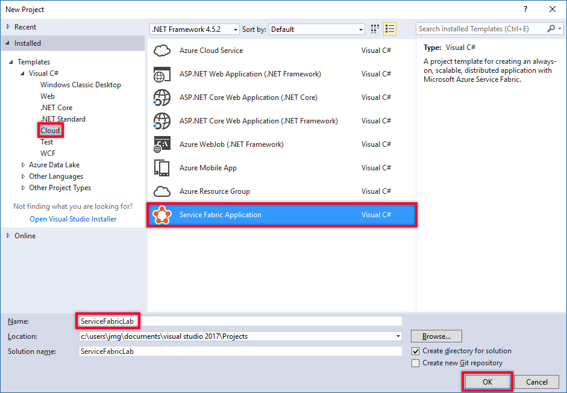
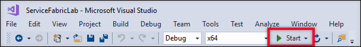
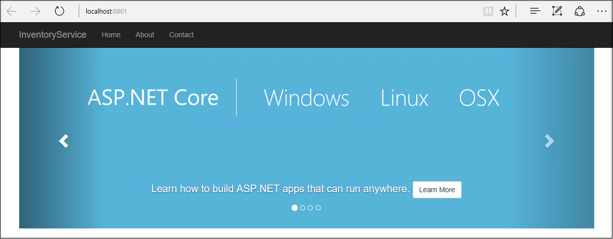
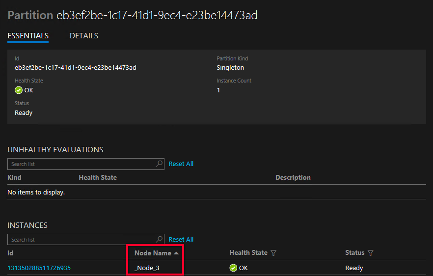
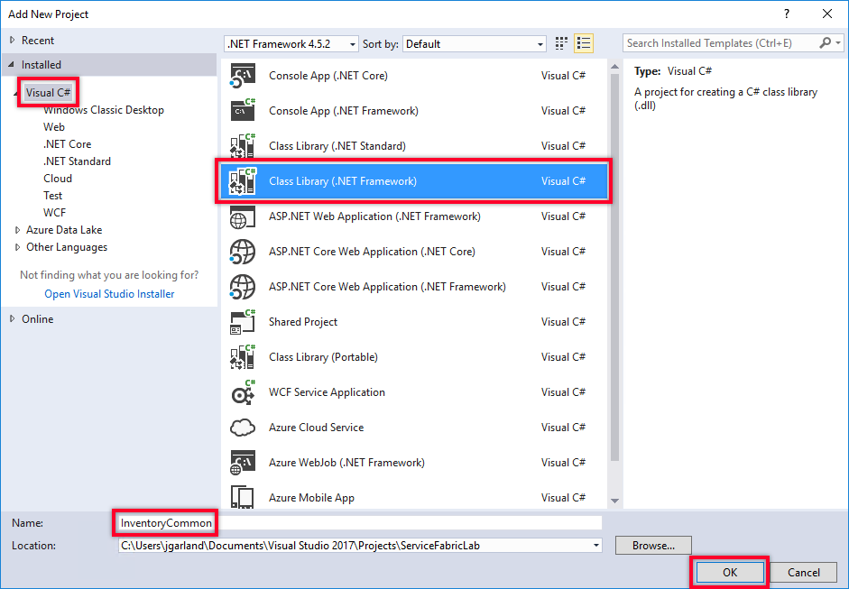
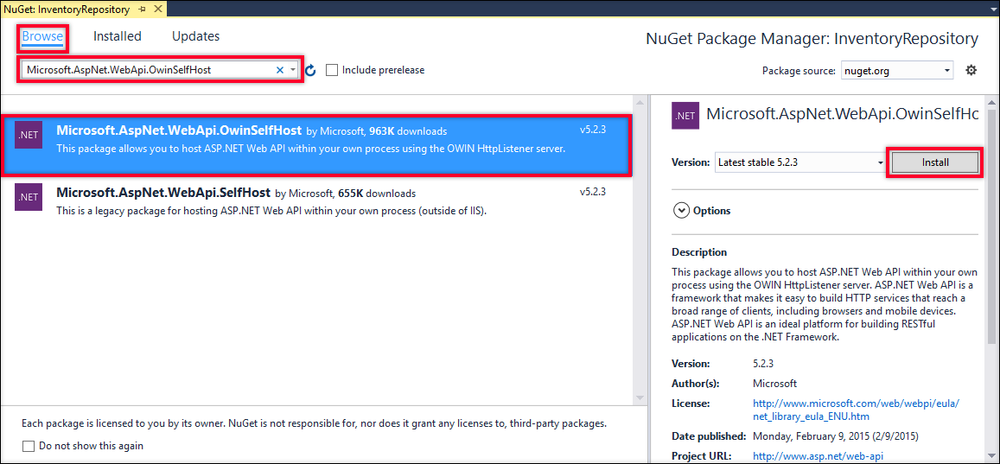
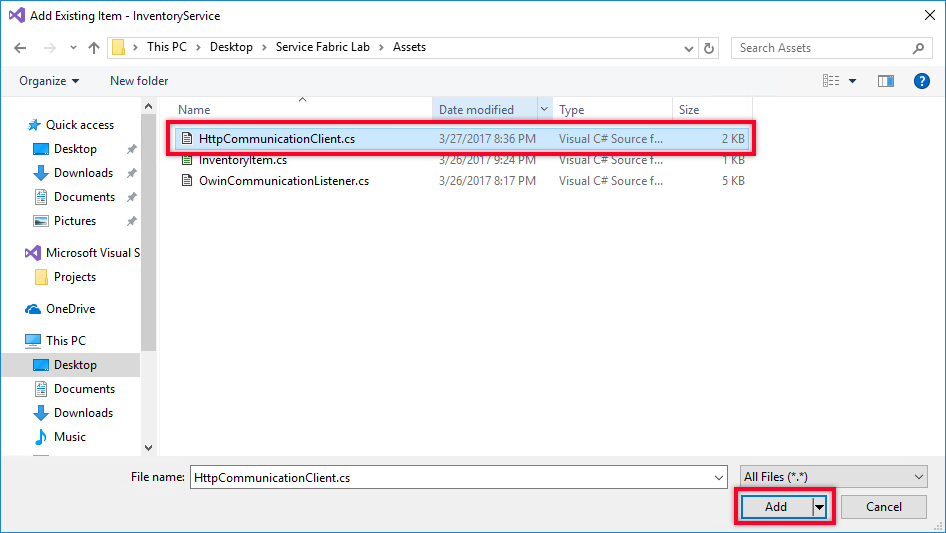
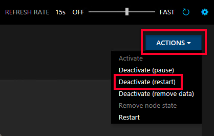

<a name="HOLTitle"></a>
# Developing Microservices with Azure Service Fabric #

---

<a name="Overview"></a>
## Overview ##

One of the more recent trends in enterprise architecture is the [Microservices architecture pattern](https://www.martinfowler.com/articles/microservices.html). At its core, this pattern is a specialization of the Service Oriented Architecture pattern that gained popularity in the early 2000s, but extends that approach to focus on building small and independently deployable applications that communicate using lightweight protocols (including HTTP and TCP). This arrangement presents several advantages:

- Services are easy to replace and maintain
- Services can be scaled independently
- Different programming tools and techniques can be employed in different parts of a solution

[Azure Service Fabric](https://azure.microsoft.com/en-us/services/service-fabric/) is a solution that supports developing and coordinating multiple services running on a cluster of virtual machines. While Service Fabric can be used to implement a variety of architectural patterns, it is ideally suited to developing and orchestrating microservice-based solutions.  

Azure Service Fabric deployments can exist on-premises, in the cloud in Microsoft Azure, and even in other vendors' clouds. In Azure, however, Service Fabric offers a first-class platform whose benefits are not easily duplicated in other environments. As such, Service Fabric offers a robust platform for managing solutions as well as APIs for writing them.

It is important to note that while Service Fabric is one of the newer platform offerings within Microsoft Azure, it has been used internally by Microsoft for several years to power Microsoft Cloud services that include Azure SQL Database, DocumentDB, Cortana, Microsoft Power BI, Microsoft Intune, Azure Event hHbs, Azure IoT Hub, Skype for Business, among others. Additional information about Azure Service Fabric and its history can be found [here](https://docs.microsoft.com/en-us/azure/service-fabric/service-fabric-overview).

In this lab, you will learn how to use Azure Service Fabric to build applications formed from microservices. You will use Visual Studio 2017 to create an Azure Service Fabric application consisting of two services. The first service will be a Stateless Service which serves as the user interface (UI) tier for the inventory portion of a hypothetical catalog company. The second service will be a Stateful Service and will provide RESTFul access to the inventory items. Once both of these services have been created and connected together, you will see first-hand how Azure Service Fabric provides scalability and resilience for the services it manages.

<a name="Objectives"></a>
### Objectives ###

In this hands-on lab, you will learn how to:

- Create a new Service Fabric application using Visual Studio 2017.
- Use the debugging and diagnostic tools provided by both Visual Studio and Service Fabric itself to run and monitor your Service Fabric application.
- Configure communication between multiple services in a Service Fabric application. 
- Leverage partitioning and Reliable Services in order to provide scalability and fault-tolerance in a Service Fabric application.

<a name="Prerequisites"></a>
### Prerequisites ###

The following are required to complete this hands-on lab:

- Windows 7 (SP1), Windows 8.1, Windows 10, Windows Server 2012 R2, or Windows Server 2016
- [Visual Studio 2017](https://www.visualstudio.com/vs/) Community higher with the **Azure development** workload installed
- The [Microsoft Azure Service Fabric Core SDK](https://azure.microsoft.com/en-us/services/service-fabric/)
- An active Microsoft Azure subscription. If you don't have one, [sign up for a free trial](http://aka.ms/WATK-FreeTrial).
- PowerShell 3.0 or higher with the execution policy set to "Unrestricted" for the administrative user

You can configure PowerShell correctly by running it as administrator and executing the following command:

```Set-ExecutionPolicy -ExecutionPolicy Unrestricted -Force -Scope CurrentUser```

Additional information about configuring your development environment can be found [here](https://docs.microsoft.com/en-us/azure/service-fabric/service-fabric-get-started).

<a name="Exercises"></a>
## Exercises ##

This hands-on lab includes the following exercises:

- [Exercise 1: Create a Service Fabric solution](#Exercise1)
- [Exercise 2: Run the app in a local cluster](#Exercise2)
- [Exercise 3: Add another service to the cluster](#Exercise3)
- [Exercise 4: Connect the services in the cluster](#Exercise4)
- [Exercise 5: Enable partitioning and show node failover](#Exercise5)

Estimated time to complete this lab: **60** minutes.

<a name="Exercise1"></a>
## Exercise 1: Create a Service Fabric solution ##

In this exercise, you will create an Azure Service Fabric application using Visual Studio 2017. Before you begin, make sure your development environment is configured with the tools and options specified in the [Prerequisites](#Prerequisites).

1. Start Visual Studio 2017 as an administrator. This elevation of privilege is required in order for Visual Studio to work with the *Service Fabric Local Cluster Manager*, which allows you to deploy, run, and debug Service Fabric applications on your development machine.

	> To start Visual Studio as an administrator in Windows 10, type "Visual Studio 2017" into the Windows search bar. Then right-click **Visual Studio 2017** and select **Run as administrator**. When prompted to confirm that you want to run Visual Studio as administrator, answer **Yes**.

1. In Visual Studio, select **New** from the **File** menu, and then click **Project**.

    

     _Creating a new project_

1. Select **Service Fabric Application** as the project type and enter "ServiceFabricLab" as the project name. Then click **OK**.

    

     _Specifying the project type_

1. Select **ASP.NET Core** and set the name to "InventoryService." Then click **OK**.

    

     _Selecting a service template_

1. Make sure **ASP.NET Core 1.1** is selected as the framework version. Then select **Web Application** and click **OK**.

    

     _Creating an ASP.NET Core Web app_

1. Go to Solution Explorer and confirm that the solution is structured like the one below. The solution should contain two projects named **InventoryService** and **ServiceFabricLab**. Service Fabric solutions consist of one or more Service Fabric Service projects, as well as a Service Fabric Application project.

    

     _Viewing the solution in Solution Explorer_

	**ServiceFabricLab** is the Service Fabric Application project. This project does not contain any code, but instead contains links to the services that are included in your Service Fabric application and information describing how the application will be packaged and deployed.

	One of the more important elements contained in the Service Fabric Application project is the *application manifest* file. This file is named **ApplicationManifest.xml** and is located in the "ApplicationPackageRoot" folder. The application manifest is an XML file that describes your configuration to Service Fabric.
	
	**InventoryService** is a Stateless Service Fabric Service project. If you examine the project properties for this project, you will see it is actually a .NET Core Console Application. This is a self-hosted Web application (one that does not rely on IIS as an external HTTP Server), which hosts the *WebListener* server within the processes managed by the Service Fabric runtime. Additional information about *WebListener* can be found [here](https://docs.microsoft.com/en-us/aspnet/core/fundamentals/servers/weblistener). 

1. Open **Program.cs** in the **InventoryService** project. This file contains the following code, which registers the Inventory Service with the Service Fabric runtime. The `InventoryService` class is an instance of the `StatelessService` class defined in the Service Fabric SDK:

	```c#
	ServiceRuntime.RegisterServiceAsync("InventoryServiceType",
	    context => new InventoryService(context)).GetAwaiter().GetResult(); 
	```

1. Now open **InventoryService.cs** and locate the `CreateServiceInstanceListeners` method override. This method is called by the Service Fabric runtime to configure the endpoints on which this service will listen for messages. In this case, it configures an instance of the `WebListenerCommunicationListener` class, which is used to connect Service Fabric to a *WebListener* HTTP service:

	```c#
	return new WebHostBuilder().UseWebListener()
            .ConfigureServices(
                services => services
                    .AddSingleton<StatelessServiceContext>(serviceContext))
            .UseContentRoot(Directory.GetCurrentDirectory())
            .UseStartup<Startup>()
            .UseApplicationInsights()
            .UseUrls(url)
            .Build();
	```

At this point, the application is basically a standard ASP.NET Core 1.1 MVC Web application. ASP.NET Core is a rich framework for building Web applications. Additional information about ASP.NET Core can be found [here](https://www.asp.net/core).

<a name="Exercise2"></a>
## Exercise 2: Run the app in a local cluster ##

Now that you have created a basic Service Fabric project in Visual Studio 2017, it's time to see the application in action. In this exercise, you will deploy the application to a local cluster managed by the Service Fabric Local Cluster Manager and examine it in Visual Studio and in the Service Fabric Explorer.

1. Click the **Start** button in Visual Studio 2017. This will deploy the Service Fabric application to a local Service Fabric cluster. This may take a couple of minutes the first time you do it.

	> If the service fails to run with a deployment error, make sure Visual Studio 2017 is running as an administrator. 

    

     _Starting the application_

1. Confirm that a browser opens to the service URL.

    

     _Browser showing the service URL_

1. Return to the Visual Studio and confirm that a Diagnostics Event window opened when you launched the app. The default templates for Service Fabric Service applications in Visual Studio 2017 include a `ServiceEventSource` class. This class registers your application and provides helper events for writing trace and diagnostic information using [Event Tracing for Windows](https://msdn.microsoft.com/library/windows/desktop/bb968803.aspx).

    

     _Viewing diagnostic events_

1. Open **HomeController.cs** in the "Controllers" folder of the **InventoryService** project. Insert a breakpoint on the ```return``` statement in the ```About``` method by clicking in the left margin or placing the cursor on that line and pressing **F9**.
	
	

    _Inserting a breakpoint_

1. Return to your browser and click **About** at the top of the page.

	

    _Navigating to the About page_

1. Return to Visual Studio and confirm that the breakpoint was hit. Click the **Continue** button (or simply press **F5**) to resume execution. 

1. The next step is to use the Service Fabric Explorer to view the status of the application as it runs in a local cluster. Right-click the **Service Fabric Local Cluster Manager** icon in the Windows system tray and select **Manage Local Cluster** from the ensuing menu. 

	

    _Launching the Local Cluster Manager_

1. Confirm that the Service Fabric Explorer appears in a browser. This dashboard view offers at-a-glance information about your cluster's health, including the status of applications deployed to the cluster and the status of the cluster's nodes. Links at the top of the dashboard provide access to additional information, including a cluster map and detailed health metrics.

	

    _Service Fabric Explorer_

1. Expand the **Applications** node in the treeview on the left and drill down until you find the running partition, whose name is a GUID. Click the running partition to select it.

	

    _Selecting the running partition_

1. Find the node name in the "Instances" section on the right.

	

    _Finding the node name_

1. Expand the **Nodes** node in the treeview on the left. Then select the node you identified in the previous step. Spend some time exploring the information that is available.

	

    _Viewing node information_

1. Close your Web browser. Then return to Visual Studio and use the **Debug** -> **Stop Debugging** command to stop debugging.
 
When you stop debugging, Visual Studio will stop the application and remove it from the local cluster. It will be deployed again the next time you launch it from Visual Studio.

<a name="Exercise3"></a>
## Exercise 3: Add another service to the cluster ##

In this exercise, you will add a new service to the Service Fabric application that you created in [Exercise 1](#Exercise1). This service will act as a repository for a hypothetical Product Inventory system, and it will use Service Fabric [Stateful Service Reliable Collections](https://docs.microsoft.com/en-us/azure/service-fabric/service-fabric-reliable-services-reliable-collections) to maintain inventory data and make it available through RESTful Web API endpoints.

1. Right-click the **ServiceFabricLab** solution in Solution Explorer and use the **Add** -> **New Project** command to add a project to the solution. Select **Class Library (.NET Framework)** as the project type and name it "InventoryCommon." Then click **OK**.    

    

     _Adding a project to the solution_

1. Delete the file named **Class1.cs** file from the **InventoryCommon** project. Then right-click the project in Solution Explorer and select **Add** -> **Existing Item...**.

	

    _Adding items to the project_

1. In the "Add Existing Item" dialog, browse to the "Assets" folder included with this lab. Select the file named **InventoryItem.cs** and click **Add**. 

	

    _Importing InventoryItem.cs_

	This file contains an ```InventoryItem``` type that will be used to pass inventory items between services in the application. It also contains an ```enum``` named ```InventoryItemType``` that specifies the item type — Appliances, Flooring, etc. Later, this ```enum``` will be used as a key to divide the deployment into separate service partiions.

1. Right-click **Services** in the **ServiceFabricLab** project, and select **Add** -> **New Service Fabric Service...**..

	

    _Adding a service_

1. Select **Stateful Service** and enter "InventoryRepository" as the service name. Then click **OK**. This will add a new project named **InventoryRepository** to the solution.

	

    _Adding a stateful service_

1. Right-click the **InventoryRepository** project and select **Manage NuGet Packages...** from the context menu. Make sure **Browse** is selected in the Nuget Package Manager, and then type "Microsoft.AspNet.WebApi.OwinSelfHost" into the search box. Select ***Microsoft.AspNet.WebApi.OwinSelfHost*** from the search results and click the Install button. OK any changes shown to you and accept any licenses that are presented.

	

    _Adding the OWIN Self-Host Nuget Package_

1. Right-click the **InventoryRepository** project in Solution Explorer and use the **Add** -> **Existing Item** command to import **OwinCommunicationListener.cs** from this lab's "Assets" folder.

	

    _Importing OwinCommunicationListener.cs_

1. Open **InventoryRepository.cs** and add the following ```using``` statements at the top of the file:

	``` c#
	using System.Fabric.Description;
	using InventoryRepository.ServiceFabric;
	```  

1. Delete the ```RunAsync``` method and replace the contents of the ```CreateServiceReplicaListeners``` method with the following code:

	```c#
	var endpoints = Context.CodePackageActivationContext.GetEndpoints()
	           .Where(endpoint => endpoint.Protocol == EndpointProtocol.Http || endpoint.Protocol == EndpointProtocol.Https)
	           .Select(endpoint => endpoint.Name);
	
	return endpoints.Select(
	    endpoint => new ServiceReplicaListener(
	        serviceContext => new OwinCommunicationListener(
	            appBuilder => { WebHostStartup.ConfigureApp(appBuilder, StateManager); }, 
	            serviceContext, 
	            ServiceEventSource.Current, 
	            endpoint), 
	        endpoint));
	```

	This code retrieves the HTTP/HTTPS endpoints for the current service. It then returns a new ```ServiceReplicaListener``` instance for each. Each ```ServiceReplicaListener``` is configured to load an ```OwinCommunicationListener``` and initialize the OWIN pipeline with an instance of ```WebHostStartup```. 

1. Now open **ServiceManifest.xml** in the project's "PackageRoot" folder. Locate the ```<Endpoint Name="ServiceEndpoint" />``` element and replace it with the following statement to configure the application to expose an HTTP endpoint on port 8081:

	``` xml
	<Endpoint Name="ServiceEndpoint" Type="Input" Protocol="http" Port="8081"/>
	```

1. In Solution Explorer, right-click **References** in the **InventoryRepository** project and select **Add References...**. In the "Reference Manager" dialog, check the box next to **InventoryCommon** in the list of projects. Then click **OK**.

	

    _Adding a reference to the InventoryCommon project_

1. Right-click the **InventoryRepository** project again use the **Add** -> **New Folder** command to add folder named "Controllers."

1. Right-click the "Controllers" folder. Use the **Add** -> **Class...** command to add a class file named **InventoryController.cs**. Then replace the contents of the file with the following code:

	```c#
	using System;
	using System.Collections.Generic;
	using System.Threading;
	using System.Threading.Tasks;
	using System.Web.Http;
	using Microsoft.ServiceFabric.Data;
	using Microsoft.ServiceFabric.Data.Collections;
	using InventoryCommon;
	using InventoryRepository.ServiceFabric;
	
	namespace InventoryRepository.Controllers
	{
	    [RoutePrefix("api/inventory")]
	    public class InventoryController : ApiController
	    {
	        private readonly IReliableStateManager _stateManager;
	
	        public InventoryController()
	        {
	            _stateManager = WebHostStartup.StateManager;
	        }
	    }
	}
	```

1. Add the following methods to the ```InventoryController``` class:

	```c#
	[HttpGet]
	[Route("")]
	public async Task<IEnumerable<InventoryItem>> GetItems()
	{
	    using (var tx = _stateManager.CreateTransaction())
	    {
	        var inventoryDictionary = await _stateManager.GetOrAddAsync<IReliableDictionary<Guid, InventoryItem>>("inventoryDictionary");
	        var items = await inventoryDictionary.CreateEnumerableAsync(tx);
	
	        var result = new List<InventoryItem>();
	        using (var enumerator = items.GetAsyncEnumerator())
	        {
	            while (await enumerator.MoveNextAsync(CancellationToken.None))
	            {
	                result.Add(enumerator.Current.Value);
	            }
	            return result;
	        }
	    }
	}
	
	[HttpGet]
	[Route("{itemId}")]
	public async Task<InventoryItem> GetItem(Guid itemId)
	{
	    using (var tx = _stateManager.CreateTransaction())
	    {
	        var inventoryDictionary = await _stateManager.GetOrAddAsync<IReliableDictionary<Guid, InventoryItem>>("inventoryDictionary");
	        var item = await inventoryDictionary.TryGetValueAsync(tx, itemId);
	        return item.HasValue ? item.Value : null;
	    }
	}
	```
	
	Each of these methods uses the Service Fabric Stateful Services' `StateManager` class to create a transaction scope, create or retrieve a ```ReliableDictionary``` object, and retrieve an item from that object. ```ReliableDictionary``` is part of the [Reliable Collection](https://docs.microsoft.com/en-us/azure/service-fabric/service-fabric-reliable-services-reliable-collections) types offered by Service Fabric. Reliable collections support high-availability, scalability, and speed while offering a programming model that is similar to one for applications that run on a single computer rather than a cluster.

1. Now add the following methods to the ```InventoryController``` class:

	```c#
	[HttpPost]
	[Route("")]
	public async Task<InventoryItem> AddNewItem(InventoryItem item)
	{
	    using (var tx = _stateManager.CreateTransaction())
	    {
	        var inventoryDictionary = await _stateManager.GetOrAddAsync<IReliableDictionary<Guid, InventoryItem>>("inventoryDictionary");
	        if (item.ItemId == Guid.Empty) item.ItemId = Guid.NewGuid();
	        await inventoryDictionary.AddAsync(tx, item.ItemId, item);
	        await tx.CommitAsync();
	    }
	    return item;
	}

	[HttpPost]
	[Route("{itemId}/addinventory/{quantity}")]
	public Task AddInventory(Guid itemId, Int32 quantity)
	{
	    if (quantity < 0) throw new ArgumentException("Quantity must be a positive number", nameof(quantity));
	    return UpdateInventoryAsync(itemId, quantity);
	}
	
	[HttpPost]
	[Route("{itemId}/removeinventory/{quantity}")]
	public Task RemoveInventory(Guid itemId, Int32 quantity)
	{
	    if (quantity < 0) throw new ArgumentException("Quantity must be a positive number", nameof(quantity));
	    return UpdateInventoryAsync(itemId, -1 * quantity);
	}
	
	private async Task UpdateInventoryAsync(Guid itemId, Int32 quantity)
	{
	    using (ITransaction tx = _stateManager.CreateTransaction())
	    {
	        // Use the user’s name to look up their data
	        var inventoryDictionary = await _stateManager.GetOrAddAsync<IReliableDictionary<Guid, InventoryItem>>("inventoryDictionary");
	
	        var originalItem = await inventoryDictionary.TryGetValueAsync(tx, itemId);
	        if (originalItem.HasValue)
	        {
	            var updatedItem = InventoryItem.CreateCopy(originalItem.Value);
	            updatedItem.InventoryCount = updatedItem.InventoryCount + quantity;
	            await inventoryDictionary.TryUpdateAsync(tx, itemId, updatedItem, originalItem.Value);
	
	            await tx.CommitAsync();
	        }
	    }
	}
	```
	
	The ```UpdateInventoryAsync``` method does something that is subtle but important. Items stored in Reliable Collections are immutable. In order to update an ```InventoryItem``` with a new quantity, ```UpdateInventoryAsync``` copies the original ```InventoryItem```, updates the quantity, and then replaces the original item in the dictionary with the new one by calling ```TryUpdateAsync```.    

1. Launch the application again from Visual Studio. Open the Service Fabric Explorer and confirm that there are now *two* services running in the cluster.

	

    _Services running in the cluster_

Once you have confirmed that both services are shown in Service Fabric Explorer, use Visual Studio's **Stop Debugging** command to stop debugging and shut down the application.

<a name="Exercise4"></a>
## Exercise 4: Connect the services in the cluster ##

In this exercise, you will connect the two services you have created, making requests to the *InventoryRepository* from the *InventoryService*. This will allow you to add inventory items to the catalog, as well as increase and decrease the inventory quantity for a given item.  At the end of this exercise, you will be able to launch your application and interact with it from your Web browser.

1. Right-click on the **InventoryService** project entry in the Solution Explorer. Click on **Add** and then click on **Existing Item** in the popup menus.

1. In the *Add Existing Item* dialog, browse to the folder where this lab content is located and open the *Assets* folder. Select the **HttpCommunicationClient.cs** file and click on the **Add** button. 

	

    _Add the HTTPCommunicationClient File_

1. Right-click on the **Dependencies** node in the **InventoryService** project and then click on the **Add Reference...** item in the context menu.

	

    _Add a Reference in the InventoryService Project_

1. In the **Reference Manager** dialog, select the **Projects** node and then click the checkbox next to the **InventoryCommon** project entry. Click the **OK** button to add the reference.

1. Open the *HomeController.cs* file from the *Controllers* folder in the *InventoryService* project. Add the following `using` entries at the top of the file:

	``` c#
	using System.Fabric;
	using System.Net.Http;
	using System.Text;
	using System.Threading;
	using Microsoft.ServiceFabric.Services.Communication.Client;
	using Microsoft.ServiceFabric.Services.Client;
	using Newtonsoft.Json;
	using InventoryCommon;
	``` 

1. Scroll to the bottom of the *HomeController.cs* file and add the following helper classes just before the final curly-brace:

	``` c#
	public class ItemListViewModel
	{
	    public IEnumerable<InventoryItem> InventoryItems { get; set; }
	    public InventoryItemType? SelectedItemType { get; set; }
	}
	
	public class InventoryQuantityViewModel
	{
	    public Guid ItemId { get; set; }
	    public InventoryItemType ItemType { get; set; }
	    public String Display { get; set; }
	    public Boolean IsAdd { get; set; }
	    public Int32 Quantity { get; set; }
	}
	```
 
1. Next, and the following field definitions at the start of the `HomeController` class:

	``` c#
	private readonly HttpCommunicationClientFactory _clientFactory 
		= new HttpCommunicationClientFactory(new ServicePartitionResolver(() => new FabricClient()));
	private readonly Uri _serviceUri = new Uri($"{FabricRuntime.GetActivationContext().ApplicationName}/InventoryRepository");
	```
	These values will be used by the code in the *InventoryService* to locate and communicate with the endpoints exposed by the *InventoryRepository* service.

1. Replace the existing `Index` method with the following block of code:

	``` c#
	[HttpGet]
	public async Task<IActionResult> Index(InventoryItemType? selectedItemType)
	{
	    // If not item type is selected, just display a blank list
	    if (selectedItemType == null)
	    {
	        return View(new ItemListViewModel { InventoryItems = new InventoryItem[] { } });
	    }
	
	    // An item type has been selected - retrieve its contents.
	    var partitionKey = new ServicePartitionKey(0);
	    var partitionClient = new ServicePartitionClient<HttpCommunicationClient>(_clientFactory, _serviceUri, partitionKey);
	    var items = await partitionClient.InvokeWithRetryAsync(async (client) =>
	    {
	        var response = await client.HttpClient.GetAsync(new Uri($"{client.BaseUri}/api/inventory"));
	        if (!response.IsSuccessStatusCode)
	        {
	            throw new InvalidOperationException($"Error - {response.StatusCode}: {response.ReasonPhrase}");
	        }
	        
	        var responseContent = await response.Content.ReadAsStringAsync();
	        var resultItems = JsonConvert.DeserializeObject<IEnumerable<InventoryItem>>(responseContent);
	
	        // Note - filter applied client-side for demo purposes only.
	        return resultItems.Where(x => x.ItemType == selectedItemType);
	                        
	    }, CancellationToken.None);
	
	    var viewModel = new ItemListViewModel
	    {
	        InventoryItems = items,
	        SelectedItemType = selectedItemType
	    };
	    return View(viewModel);
	}

	```

	This version of the `Index` method first checks to see if an *InventoryItemType* selection has been made. The user interface in this application will display the inventory items based on the currently selected item type. If no selection has been made, it simply passes an empty list to the view for display.

	If a selection has been made, a call is made to the InventoryRepository to retrieve the available catalog items in that category. To make the request, an instance of the `ServicePatitionClient` class is used via a call to the `InvokeWithRetryAsync` method it provides. The `ServicePartitionClient` class simpliefies access with stateful services in Service Fabric by resolving partition endpoint addresses for you. It also provides the `InvokeWithRetryAsync` method which, as the name suggests, further facilitates calling the indicated endpoint by managing retries in the event that transient errors occur.

	The call is made to the inventory endpoint, and if a valid reponse code is received, the response JSON is converted into a list of `InventoryItem`s. Finally, the returned list is filtered, and then this is colected and passed to the view for display.

	> Note that the filtering of the returned list to a given item type on the client end of the request is not a pattern you would use in production, but is instead done for simplicity in this Exercise. In the next exercise you will see how you can eliminate this step by using the Partitioning support in Service Fabric.

1. Now open the *Views* folder in the project, then open the *Index.html* file from the *Home* subfolder under the *Views* folder. Replace its content with the code block below:

	``` html
	@model InventoryService.Controllers.ItemListViewModel
	
	@{
	    ViewData["Title"] = "Inventory List";
	}
	
	<div class="row" style="padding-bottom: 20px; padding-top: 20px;">
	    <div class="col-sm-12">
	        <form method="get" class="form-inline">
	            <div class="form-group">
	                <label asp-for="SelectedItemType"></label>
	                <select asp-for="SelectedItemType"
	                        asp-items="@(new SelectList(Enum.GetNames(typeof(InventoryCommon.InventoryItemType))))"
	                        class="form-control">
	                    <option>Choose an item type</option>
	                </select>
	            </div>
	            <button type="submit" class="btn btn-primary">Select</button>
	        </form>
	    </div>
	</div>
	
	<div class="row">
	    <div class="col-sm-12">
	        <div class="table-responsive">
	            <table class="table table-condensed table-bordered table-responsive table-hover">
	                <thead>
	                    <tr>
	                        <th><span>Item Type</span></th>
	                        <th><span>Name</span></th>
	                        <th><span>Count</span></th>
	                        <th><span>Add/Remove</span></th>
	                    </tr>
	                </thead>
	                <tbody>
	                    @foreach (var inventoryItem in Model.InventoryItems)
	                    {
	                        <tr>
	                            <td><span>@inventoryItem.ItemType</span></td>
	                            <td><span>@inventoryItem.Name</span></td>
	                            <td><span>@inventoryItem.InventoryCount</span></td>
	                            <td>
	                                <a asp-action="AddInventory" 
	                                   asp-route-itemId="@inventoryItem.ItemId" 
	                                   asp-route-selectedItemType="@inventoryItem.ItemType">
	                                    <span>Increase</span>
	                                </a>
	                                &nbsp;|&nbsp;
	                                <a asp-action="RemoveInventory" 
	                                   asp-route-itemId="@inventoryItem.ItemId" 
	                                   asp-route-selectedItemType="@inventoryItem.ItemType">
	                                    <span>Decrease</span>
	                                </a>
	                            </td>
	                        </tr>
	                    }
	                </tbody>
	            </table>
	        </div>
	    </div>
	</div>
	<div class="row">
	    <div class="col-sm-12">
	        <a asp-action="AddNewInventoryItem" asp-route-itemType="@Model.SelectedItemType" 
	           class="btn btn-primary @(Model.SelectedItemType == null ? "disabled" : "")">
	            Add New Product
	        </a>
	    </div>
	</div>
	```
	This markup provides the user interface elements for selecting the current inventory item types, the table where the items are displayed, and a button to add a new inventory item to the catalog.

1. Return to the *HomeController.cs file*. After the end of the `Index` method, add the following block of code:

	``` c#
	[HttpGet]
	public IActionResult AddNewInventoryItem(InventoryItemType itemType)
	{
	    var newItem = new InventoryItem { ItemType = itemType };
	    return View(newItem);
	}
	
	[HttpPost]
	public async Task<IActionResult> AddNewInventoryItem(InventoryItem newItem)
	{
	    var partitionKey = new ServicePartitionKey(0);
	    var partitionClient = new ServicePartitionClient<HttpCommunicationClient>(_clientFactory, _serviceUri, partitionKey);
	    var results = await partitionClient.InvokeWithRetryAsync(async (client) =>
	    {
	        var newItemContent = new StringContent(JsonConvert.SerializeObject(newItem), Encoding.UTF8, "application/json");
	        var response = await client.HttpClient.PostAsync(new Uri($"{client.BaseUri}/api/inventory"), newItemContent);
	        if (!response.IsSuccessStatusCode)
	        {
	            throw new InvalidOperationException($"Error - {response.StatusCode}: {response.ReasonPhrase}");
	        }
	
	        var responseContent = await response.Content.ReadAsStringAsync();
	        return JsonConvert.DeserializeObject<InventoryItem>(responseContent);
	
	    }, CancellationToken.None);
	
	    return RedirectToAction("Index", new { SelectedItemType = newItem.ItemType });
	}
	```

	These two methods handle adding a new inventory item to the catalog. The first `AddInventoryItem` method simply sets up a blank item with the currently selected inventory item type.

	The second method uses the same `ServicePartitionClient` class and retry approach to communicate with the InventoryService endpoint that supports adding a new inventory item. If the item is successfully added, the browser is redirected to the home page that includes the inventory table with the current inventory type value pre-selected.

1. Right-click on the *Home* subfolder of the *Views* folder in the project. Click on **Add** and then on **New Item...** in the context menu.

	

    _Add New Item to the Home View Folder_

1. In the Add New Item - InventoryService dialog, click on **MVC View Page**, name the file **AddNewInventoryItem.cshtml**, and then click on the **Add** button to add the file.

	

    _Add the AddNewInventoryItem View_

1. Replace the markup in the new view file with the following block:

	``` html
	@model InventoryCommon.InventoryItem
	
	@{
	    ViewData["Title"] = "Create Inventory Item";
	}
	
	<div class="row">
	    <div class="col-sm-12">
	        <form asp-action="AddNewInventoryItem" method="post">
	            <div class="form-group">
	                <label asp-for="Name"></label>
	                <input asp-for="Name" class="form-control" placeholder="Name" />
	            </div>
	            <div class="form-group">
	                <label asp-for="ItemType"></label>
	                <select asp-for="ItemType" 
	                        asp-items="@(new SelectList(Enum.GetNames(typeof(InventoryCommon.InventoryItemType))))" 
	                        class="form-control">
	                    <option>Choose an item type</option>
	                </select>
	            </div>
	            <div>
	                <button type="submit" class="btn btn-primary">Add Inventory Item</button>
	                <a asp-action="index" asp-route-selectedItemType="@(Model.ItemType)" class="btn btn-default">Cancel</a>
	            </div>
	        </form>
	    </div>
	</div>
	```

	This markup provides the user interface elements needed to build the new inventory item, and calls the creation method when the *Add Inventory Item* button is clicked.

1. Return again to the *HomeController.cs file*. After the end of the second `AddNewInventoryItem` method, add the following block of code:

	``` c#
	[HttpGet]
	public async Task<IActionResult> AddInventory(Guid itemId, InventoryItemType selectedItemType)
	{
	    var partitionKey = new ServicePartitionKey(0);
	    var partitionClient = new ServicePartitionClient<HttpCommunicationClient>(_clientFactory, _serviceUri, partitionKey);
	    var item = await partitionClient.InvokeWithRetryAsync(async (client) =>
	    {
	        var response = await client.HttpClient.GetAsync(new Uri($"{client.BaseUri}/api/inventory/{itemId}"));
	        if (!response.IsSuccessStatusCode)
	        {
	            throw new InvalidOperationException($"Error - {response.StatusCode}: {response.ReasonPhrase}");
	        }
	
	        var responseContent = await response.Content.ReadAsStringAsync();
	        return JsonConvert.DeserializeObject<InventoryItem>(responseContent);
	
	    }, CancellationToken.None);
	
	    var viewModel = new InventoryQuantityViewModel
	    {
	        ItemId = item.ItemId,
	        ItemType = item.ItemType,
	        Display = $"{item.Name} ({item.ItemType})",
	        IsAdd = true,
	        Quantity = 1
	    };
	    return View("UpdateInventoryQuantity", viewModel);
	}
	
	[HttpPost]
	public async Task<IActionResult> AddInventory(InventoryQuantityViewModel viewModel)
	{
	    var partitionKey = new ServicePartitionKey(0);
	    var partitionClient = new ServicePartitionClient<HttpCommunicationClient>(_clientFactory, _serviceUri, partitionKey);
	    await partitionClient.InvokeWithRetryAsync(async (client) =>
	    {
	        var uri = new Uri($"{client.BaseUri}/api/inventory/{viewModel.ItemId}/addinventory/{viewModel.Quantity}");
	        var response = await client.HttpClient.PostAsync(uri, null);
	        if (!response.IsSuccessStatusCode)
	        {
	            throw new InvalidOperationException($"Error - {response.StatusCode}: {response.ReasonPhrase}");
	        }
	
	        return;
	    }, CancellationToken.None);
	
	    return RedirectToAction("Index", new { SelectedItemType = viewModel.ItemType });
	}
	```
	This code adds a pair of `AddInventory` methods whose purpose and implementation are very similar to the code for the `AddNewInventoryItem` methods.

1. Add the following block of code after the code for the `AddInventory` methods that you just added:

	``` c#
	[HttpGet]
	public async Task<IActionResult> RemoveInventory(Guid itemId, InventoryItemType selectedItemType)
	{
	    var partitionKey = new ServicePartitionKey(0);
	    var partitionClient = new ServicePartitionClient<HttpCommunicationClient>(_clientFactory, _serviceUri, partitionKey);
	    var item = await partitionClient.InvokeWithRetryAsync(async (client) =>
	    {
	        var response = await client.HttpClient.GetAsync(new Uri($"{client.BaseUri}/api/inventory/{itemId}"));
	        if (!response.IsSuccessStatusCode)
	        {
	            throw new InvalidOperationException($"Error - {response.StatusCode}: {response.ReasonPhrase}");
	        }
	
	        var responseContent = await response.Content.ReadAsStringAsync();
	        return JsonConvert.DeserializeObject<InventoryItem>(responseContent);
	
	    }, CancellationToken.None);
	
	    var viewModel = new InventoryQuantityViewModel
	    {
	        ItemId = item.ItemId,
	        ItemType = item.ItemType,
	        Display = $"{item.Name} ({item.ItemType})",
	        IsAdd = false,
	        Quantity = 1
	    };
	    return View("UpdateInventoryQuantity", viewModel);
	}
	
	[HttpPost]
	public async Task<IActionResult> RemoveInventory(InventoryQuantityViewModel viewModel)
	{
	    var partitionKey = new ServicePartitionKey(0);
	    var partitionClient = new ServicePartitionClient<HttpCommunicationClient>(_clientFactory, _serviceUri, partitionKey);
	    await partitionClient.InvokeWithRetryAsync(async (client) =>
	    {
	        var uri = new Uri($"{client.BaseUri}/api/inventory/{viewModel.ItemId}/removeinventory/{viewModel.Quantity}");
	        var response = await client.HttpClient.PostAsync(uri, null);
	        if (!response.IsSuccessStatusCode)
	        {
	            throw new InvalidOperationException($"Error - {response.StatusCode}: {response.ReasonPhrase}");
	        }
	
	        return;
	    }, CancellationToken.None);
	
	    return RedirectToAction("Index", new { SelectedItemType = viewModel.ItemType });
	}
	```   
	This will add the complementary `RemoveInventory` methods.

1. Finally, following the steps you used to add the `AddNewInventoryItem.cshtml` view file, add a new `UpdateInventoryQuantity.cshtml` view file. Replace the default markup it contains with the following:

	``` html
	@model InventoryService.Controllers.InventoryQuantityViewModel
	
	@{
	    ViewData["Title"] = Model.IsAdd ? "Add Inventory" : "Remove Inventory";
	}
	
	<div class="row">
	    <div class="col-sm-12">
	        <form asp-action=@(Model.IsAdd ? "AddInventory" : "RemoveInventory") method="post">
	            <input asp-for="ItemId" type="hidden" />
	            <input asp-for="ItemType" type="hidden" />
	            <input asp-for="IsAdd" type="hidden"/>
	
	            <div class="form-group">
	                <label>Item:</label>
	                <input asp-for="Display" class="form-control" placeholder="Name" readonly/>
	            </div>
	            <div class="form-group">
	                <label asp-for="Quantity"></label>
	                <input asp-for="Quantity" type="number" class="form-control"/>
	            </div>
	            <div>
	                <button type="submit" class="btn btn-primary">@(Model.IsAdd ? "Add Inventory" : "Remove Inventory")</button>
	                <a asp-action="index" class="btn btn-default">Cancel</a>
	            </div>
	        </form>
	    </div>
	</div>
	```
	
	This markup defines a form that you can use to either increase or deecrease the inventory quantity for a given inventory item.

1. At this point, your service Fabric inventory application should be ready to go, hosting both user interface and repository services. Like you did in Exercise 2, start debugging the application by clicking on the **Start** button in Visual Studio 2017. This will once again deploy your Service Fabric application to your local Service Fabric cluster and then open your default Web browser to your service's URL.

	

    _Initial Application Display_

1. Click on the **SelectedItemType** dropdown and select **HeatingCooling**, then click on the **Select** button.

1. Now that you have an inventory type selected, you can start adding some inventory. Click on the **Add New Product** button and complete the new inventory item form:

	- Set the *Name* to **Air Conditioner** 
	- Click on the **Add Inventory Item** button to add the new item. Your browser will be redirected back to inventory listing page.

1. Notice that you now have an entry in the table. Click on the **SelectedItemType** dropdown once again and select **HandTools**, then click on the **Select** button.

	- Add a **Hammer** as a new new *Handtools* product. 
	- Add a **Screwdriver** as a new *Handtools product.

	

    _Inventory Listing Showing Hand-Tools_

1. Click on the **Increase** link on the *Hammer* row. In the *Add Inventory* page, set the **Quantity** to **10** and click on the **Add Inventory** button. You browser will once again be redirected to the inventory listing page. Notice the updated quantity for hammers.

1. Repeat the previous instruction, but instead click on the **Decrease** link and leave the **Quantity** to **1** when you click on the **Remove Inventory** button. Observe the updated quantity on the inventory listing page.

	> Bear in mind that in order to keep the demo lab simple, the inventory service has very little validation logic. In a production application, for example, you would include checks in the Remove Inventory function to be sure that you could not remove more than the available. inventory, among others.

1. Close your browser and stop the debugger in Visual Studio 2017.

<a name="Exercise5"></a>
## Exercise 5: Enable partitioning and show node failover ##

This final exercise will demonstrate some of the scalability and resiliency features built into Service Fabric. You will first update the partitioning scheme for the *Inventory Repository* service that you have previously created, in order to segment the functionality for each Inventory Item Type to a different partition within the cluster. Then you will use the Service Fabric Explorer that you first explored in Exercise 2 in order to simulate a node failure in your cluster and to see how partition replicas for Reliable Services in Service Fabric help to provide a more fault-tolerant system. 

1. The first step is to update the Service Fabric runtime information for the *Inventory Repository* service. The service will maintain 3 replicas per partition for durability. Furthermore, to simulate performance considerations, the data will be partitioned across 10 distinct partitions, by each distinct Inventory Item Type.

	> Partitioning is a useful performance technique for distributing load accross your system. As long as you select a good approach which yields a generally uniform distribution across your resources, it can help make sure that no one section of your cluster is particularly overloaded. You can learn more about partitioning in Service Fabric [here](https://docs.microsoft.com/en-us/azure/service-fabric/service-fabric-concepts-partitioning). One important note with Service Fabric partitions - you cannot change the partition count of a deployed Service Fabric application once it has been deployed without first tearing down the application, so it is important to plan & test your partitioning strategy ahead of time or you will risk service downtime if and when you need to reset.

1. In the Solution Explorer in Visual Studio 2017, locate the **ServiceFabricLab** project, expand the **ApplicationPackageRoot** folder and open the **ApplicationManifest.xml** file.

1. In the *ApplicationManifest.xml* file, update the `InventoryRepository_PartitionCount` value to 10 and add new values for the partition low key and partition high key settings. 

	``` xml
	<Parameter Name="InventoryRepository_PartitionCount" DefaultValue="10" />
    <Parameter Name="Inventory_PartitionLowKey" DefaultValue="0" />
    <Parameter Name="Inventory_PartitionHighKey" DefaultValue="9" />
	```

1. Also in the  *ApplicationManifest.xml* file, locate the `UniformInt64Partition` element and update its `LowKey` and `HighKey` values to use the settings you just added:

	``` xml
	<UniformInt64Partition PartitionCount="[InventoryRepository_PartitionCount]" LowKey="[Inventory_PartitionLowKey]" HighKey="[Inventory_PartitionHighKey]" />
	```

1. Open the *ApplicationParameters* folder and update the each of the setting XML files (there are 3 - *Cloud.xml*, *Local.1Node.xml*, and *Local.5Node.xml*) with the new `InventoryRepository_PartitionCount` value.

	``` xml
	<Parameter Name="InventoryRepository_PartitionCount" Value="10" />
	```

	> These xml files are settings files that you can use to customize different values for different Service Fabric deployments. In the default configuration, you have 1 file each for the 2 deployment options that are available in your Service Fabric Local Cluster Manager, and one file for your standard Cloud deployment options. The values in these files override the corresponding `Parameter` value declared inside of the *ApplicationManifest.xml* file. 

1. Open the **HomeController.cs** file located in the **Controllers** folder in the *InventoryService* project. Search for each instance of the code `new ServicePartitionKey(0)` and replace it with the corresponding value shown below:
	- In the `Index` method, replace it with `new ServicePartitionKey((Int64)selectedItemType)`
	- In the `AddNewInventoryItem` method, replace it with `new ServicePartitionKey((Int64)newItem.ItemType)`
	- In the first `AddInventory` method, replace it with `new ServicePartitionKey((Int64)selectedItemType)`
	- In the second `AddInventory` method, replace it with `new ServicePartitionKey((Int64)viewModel.ItemType)`
	- In the first `RemoveInventory` method, replace it with `new ServicePartitionKey((Int64)selectedItemType)`
	- In the second `RemoveInventory` method, replace it with `new ServicePartitionKey((Int64)viewModel.ItemType)`

	Your application is now ready to run using Service Fabric partitioning. Calls from the *Inventory Service* to the *Inventory Repository* use the currently selected inventory item type to configure a `ServicePartitionKey` value, which is used by the `ServicePartitionClient` to find the address it should use for calls to the *Inventory Repository* service.
  
1. Once again, start debugging your application and add several inventory items, as you did in Exercise 4, starting at Step 17. Be sure you include at least one item in the *HandTools* category.

1. Like you did in Exercise 2, with your application still running, locate the *Service Fabric Local Cluster Manager* icon in the Windows System Tray. Right-click on the icon and select **Manage Local Cluster** from the menu that is displayed in order to bring open the *Service Fabric Explorer* for your site in your Web browser.

1. In the *Service Fabric Explorer*, expand the **Applications** node, then the **ServiceFabricLabType** node, then the **fabric:/ServiceFabricLab** node, and then finally the **fabric:/ServiceFabricLab/InventoryRepository** node. 

	

    _Expanding the Service Fabric Explorer Nodes_

	Notice that the *InventoryRepository* node has 10 children underneath it - one for each partition that has been configured for the service. 

1. Click on each one of the partition entries underneath the **fabric:/ServiceFabricLab/InventoryRepository** node until you find one where the *Low Key* and *High Key* values are **3**, which corresponds to the value for the `HandTools` member of the `InventoryItemType` enumeration.

	

    _Locating the HandTools Partition_

1. Once you have located the `HandTools` partition, locate the **Replicas** display in the bottom of the window. These are the nodes in your cluster where the replicas for the selected partition are deployed. Find the row that corresponds to the **Primary** replica and make a note of the **Node Name** value.

	> In the image above, you can see that *_Node_2* hosts the *Primary Replica* for the *HandTools* partition, and *_Node_1* and *_Node_3* each host *Active Secondary Replicas*.

1. Expand the **Nodes** section in the Service Fabric Explorer tree view on the left and click the node whose name matches the value your found in the previous step.

	

    _Selecting the Primary Replica Node_

1. Locate and then click on the **Actions** dropdown in the top right corner of the page shown for the selected node. In the context menu that is displayed, click on **Deactivate (restart)**

	

    _Deactivating the Primary Replica Node_

1. In the *Confirm Node Deactivation* dialog, type the name of the node into the text box as per the instructions and then click on the **Deactivate (restart)** button. 

	

    _Confirming Node Deactivation_

	This will kick deactivate the node you selected. The process will take a couple minutes, during which Service Fabric will detect the non-functional node and rebalance the partitions and replicas across the remaining partitions.

1. The Service Fabric Explorer will update to show that it has detected problems with the current cluster. 

	Click once again on the partition identifier that you previously selected in Step 10. You will also be able to see the updated Replica distribution for your partition. 

   	

    _The Service Fabric Explorer After Deactivation_
	
	In the picture above, you can see that the _Node_1 now hosts the Primary Replica for the HandTools partition.

1. Switch to the browser window for your service. If it isn't already selected, select **HandTools** from the **SelectedItemType** pulldown and click on the **Select** button. This will make a request from your *InventoryService Service* to the *InventoryRepository Service*, fetching and then using the new URL for the node where your HandTools partition is housed. 

   	

    _Using the Service Fabric Service After Node Failure_

1. Return to the Service Fabric Explorer and click on the node entry that you deactivated in Step 13. Locate and then click on the **Actions** dropdown in the top right corner of the page shown for the selected node. In the context menu that is displayed, click on **Activate**.

	Once again, Service Fabric will notice a change to the nodes that it is managing, and will rebalance its partition replicas to take advantage of the now-available node.

	After a few seconds, the warnings and errors in the Service Fabric Explorer will disappear and will reflect the now-stable status of the cluster.

1. Close your browser and stop debugging in Visual Studio 2017.  

<a name="Summary"></a>
## Summary ##

In this hands-on lab, you learned how to:

- Create a new Service Fabric application using Visual Studio 2017.
- Use the debugging and diagnostic tools provided by both Visual Studio and Service Fabric itself to run and monitor your Service Fabric application.
- Configure communication between multiple services in a Service Fabric application. 
- Leverage partitioning and Reliable Services in order to provide scalability and fault-tolerance in a Service Fabric application.

The application you built was fairly simple. It included a front-end display service and an inventory repository service. A more complete Microservices implementation might consist of several additional services communicating with each other and leveraging the Service Fabric infrastructure to resolve locations and addresses. In some cases, individual services might be assigned to specific subsets of the cluster that Service Fabric is managing, allowing different services to scale independently — a hallmark of a true Microservices implementation.    

As you have seen, using Azure Service Fabric it is possible to create applications that consist of several different kinds of services and to deploy them within a framework that supports both scalability and reliability.

----

Copyright 2017 Microsoft Corporation. All rights reserved. Except where otherwise noted, these materials are licensed under the terms of the MIT License. You may use them according to the license as is most appropriate for your project. The terms of this license can be found at https://opensource.org/licenses/MIT.