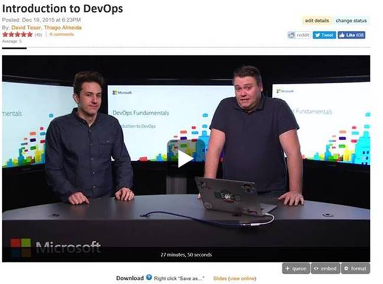
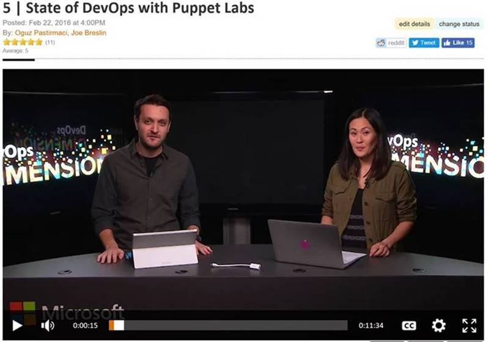
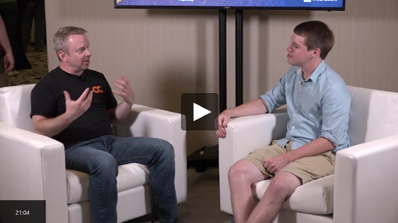
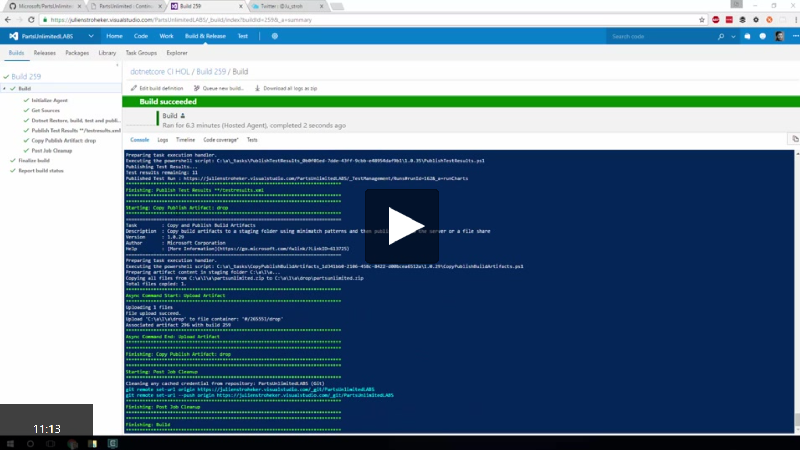

**Introduction**

Implementing DevOps practices is no small task. There’s Infrastructure as Code, Continuous Deployment, Release Management, and so much more to consider. So where do you even begin?

Although there are many commonalities, DevOps implementation will be unique for every environment. The purpose of this blog is to share (in one easy place) our major learnings and the resources we’ve been working on over the past few years, so that anyone can begin or continue their DevOps journey.

**Getting started: What is DevOps?**

Let’s start with the basics: what is DevOps and these practices you speak of? To start, DevOps is ultimately about modifying business people, process and tools to enable the organization to ship product more quickly, with fewer bugs and greater business alignment. Within DevOps we have a number of key practices; instead of going through all of the details here, I encourage you to read this [fantastic blog post on DevOps Practices](http://www.itproguy.com/devops-practices/) by David Tesar, one of our Technical Evangelists.

**Learn the fundamentals**

Let’s get into the detail of what each practice means. Check out this [DevOps Fundamentals](http://www.talmeida.net/blog/devops-fundamentals-series) video series by another one of our Technical Evangelists, Thiago Almeida. Get a tasty beverage, kick back with Thiago, and learn the fundamental skills you’ll need to tackle your DevOps journey.

**Convincing your boss**

It’s important to get buy-in from those calling the shots and fighting for you behind the scenes, because DevOps unfortunately doesn’t automate away the needs for middle management (not yet, anyway). Whether you’re looking for other groups like yours that have successfully implemented DevOps, the companies building the underlying solutions, or just want to learn how we at Microsoft have taken the DevOps journey, check out the [DevOps Dimension blog post](https://blogs.technet.microsoft.com/devops/2016/06/13/devops-dimensions/). In this featured episode, Oguz Pastirmaci interviews Alanna Brown from Puppet Labs on their annual State of DevOps report. (Management LOVES annual reports.)

**Understand the value stream**

It’s difficult to implement DevOps practices if you don’t truly understand how value flows through your environment. With the Value Stream Mapping exercise, we’ll define how software requirements flow from the customer to the product and development team, and finally out through the IT department. You’ll gain a better understanding of your most critical areas to focus your improvement.

You can learn more about [Value Stream Mapping](https://en.wikipedia.org/wiki/Value_stream_mapping).

**Learn advanced skills**

What comes after the fundamental skills? Well, the advanced skills, of course! If you’re looking for one page with nearly every DevOps resource imaginable, look no further than the [DevOps Cheat Sheet by Julien Stroheker](https://blogs.technet.microsoft.com/juliens/2016/02/14/devops-where-do-i-start-cheat-sheet/). And if you are hungry for even more content, make sure to check out these handy destinations:

-   [Channel 9 videos](https://channel9.msdn.com/DevOps)

-   [DevOps Basics blogs](https://blogs.technet.microsoft.com/canitpro/tag/devops/)

-   [Microsoft Virtual Academy Courses](https://mva.microsoft.com/training-topics/devops#!index=3&lang=1033)

**Get hands-on**

You’ve learned the core practices, mastered the fundamentals, gotten your boss on board, and learned all of the advanced skills. I know what you’re thinking: *How do I get my hands dirty?* Well, you’re in luck, because we built out a complete hands-on lab environment on GitHub, based on the [Parts Unlimited app](https://github.com/Microsoft/PartsUnlimitedMRP/tree/master/docs) from the Phoenix Project—the book that helped inspire the DevOps movement. Use these pre-configured environments to walk through implementation of the practices we’ve discussed.

You can watch [the full series](https://channel9.msdn.com/Series/Parts-Unlimited-Labs).
