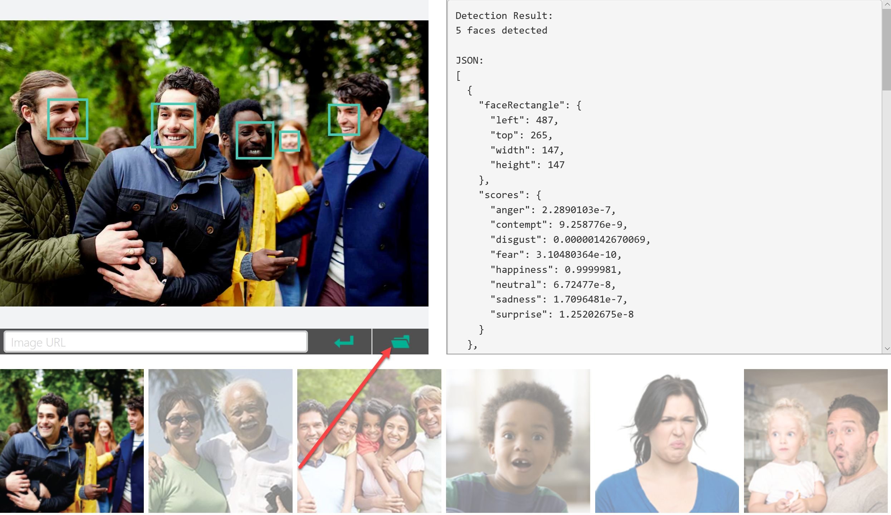
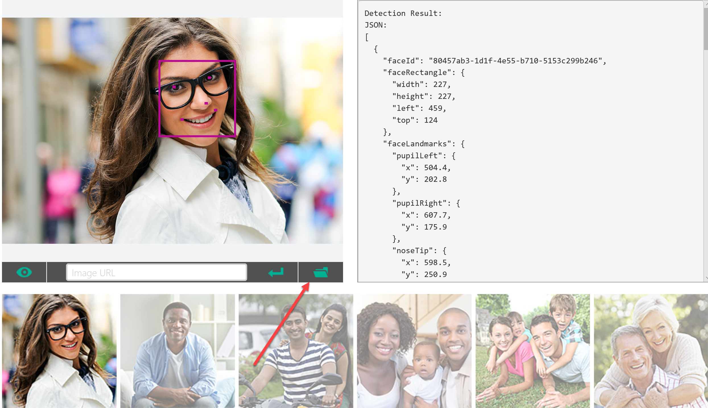
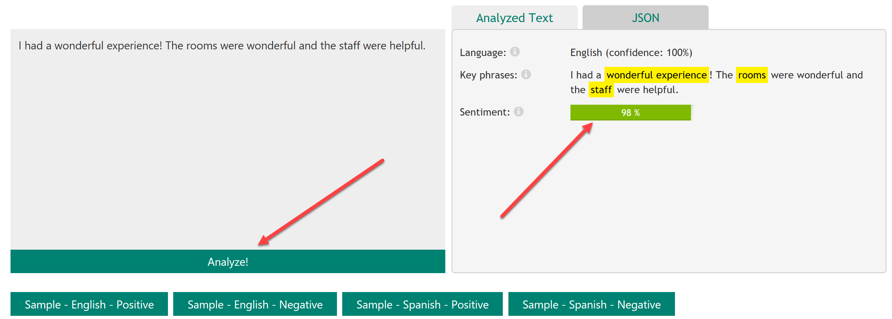

# Demo 1.1: Audience Participation #
This demo should take about 5 minutes
## Objectives ##
The goal of this presentation is to give the audience a taste of what some of the Microsoft Cognitive Services are and what they can do.  We will use The Cognitive Service pages themselves to demonstrate this.

The audience will be able to try these on-line examples on their phone, tablet or laptop.

## Requirements ##
- An active Internet Connection is required
- All on-line examples were tested with the Microsoft Edge browser

## Setup ##
There is no setup required for this presentation.

## Demo Steps ##
To demonstrate each of these examples, we will go to each of the sites, explain what they do, then scroll to the sample embedded about halfway down the page.

### Emotion of a Person in a picture ###
In this demo we'll review some provided images then we'll take a picture of ourselves and see what it will tell us about our emotional state.  The audience can try this too!

1. Go to [https://www.microsoft.com/cognitive-services/en-us/emotion-api](https://www.microsoft.com/cognitive-services/en-us/emotion-api)
2. Scroll down until you get to the demonstration app that looks like the image below
3. Try clicking on different provided pictures to demonstrate the emotion prediction
3. Now, let's try our own.  Press the Folder Open on sample and either look for an image to use or click on Camera (if available) in the folder tree. 
	
	
	> Note that the Cognitive Service scans the image for all the faces contained in it as well as figures out what the general emotion or sentiment of that image is, displayed on the right.  THe JSON displayed on the right is the Response document that gets returned to the calling app.
	>  
	> You can hover over the faces to see details.

### Face API ###
In this demo we'll review some provided images then we'll take a picture of ourselves and see what it will tell us about how old it thinks we are.  The audience can try this too!

1. Go to [https://www.microsoft.com/cognitive-services/en-us/face-api](https://www.microsoft.com/cognitive-services/en-us/face-api)
2. Scroll down until you get to the demonstration app that looks like the image below
3. Try clicking on different provided pictures to demonstrate age prediction
3. Press the Folder Open on sample and either look for an image to use or click on Camera (if available) in the folder tree. 
	
	
	> Note that the Cognitive Service scans the image for all the faces contained in it as well as figures information about that face.  If you hover over a facce, you can see some of the fun details.  THe JSON displayed on the right is the Response document that gets returned to the calling app.

### Text Analytics API ###
In this demo we are going to detect the sentiment of key words and phrases from our provided text.

1. Go to [https://aka.ms/trysentiment](https://aka.ms/trysentiment) (and easy URL to give to the audience).
2. The default text demonstrates how the Cognitive Service figures out the language, key phrases and the general sentiment of the text.  Enter your own text.
3. Press the Analyze button!
	
	
	> Note that the Cognitive Service scans the text and derives things like the language, key words and phrases along with the sentiment.  Just like the other services, the response document is in JSON and can be viewed by clicking on the JSON tab.  It's pretty amazing!

	> Audience should try this now.