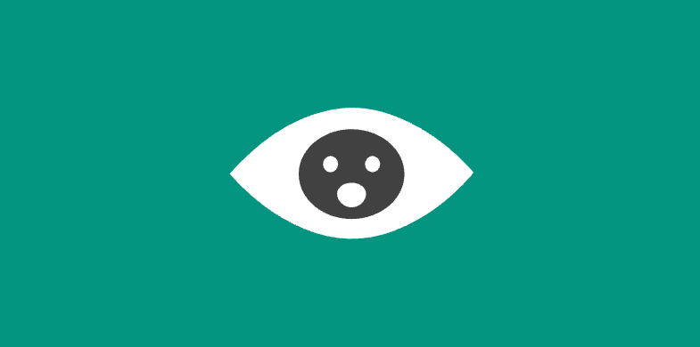
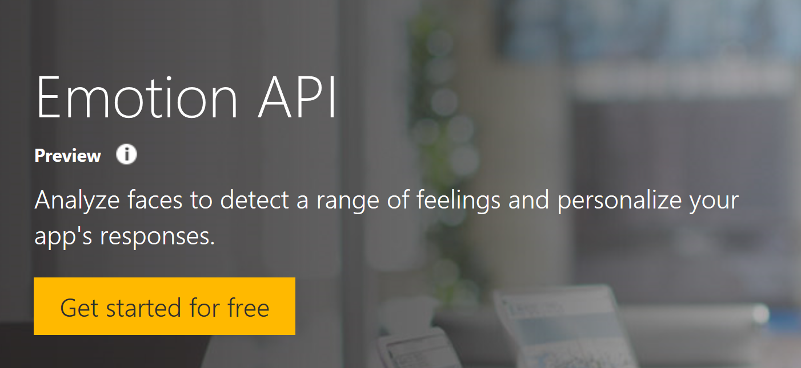
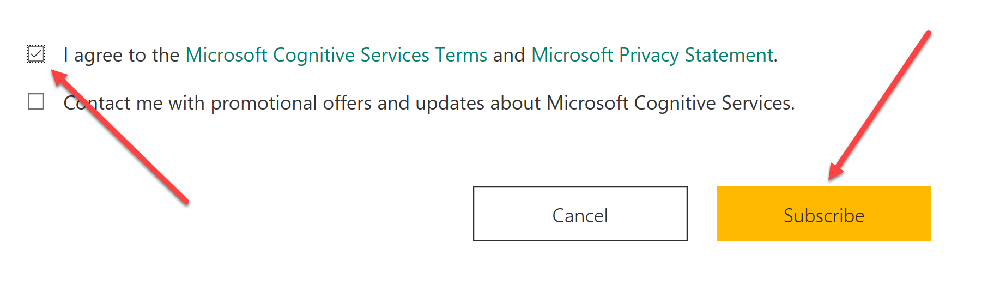
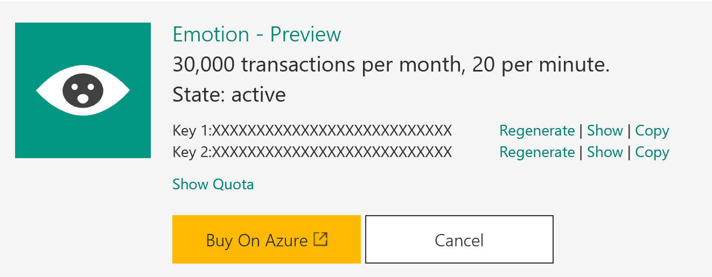
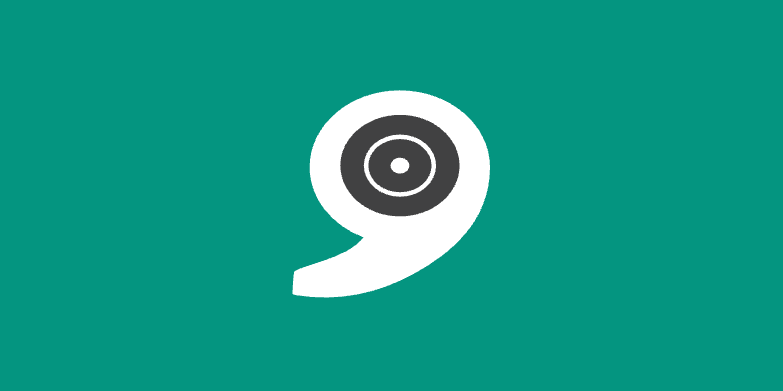
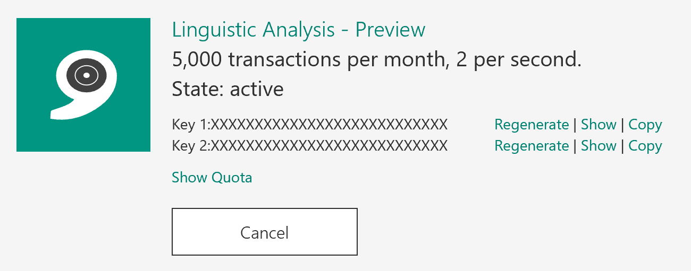

# Demo 1.2: Registering and Getting Started with Cognitive Services #
This demo should take about 10 minutes
## Objectives ##
The goal in this demo is to show how to register to use Cognitive Services and then show quickly how we can implement one of those services using nothing but the API documentation and Visual Studio 2015
## Requirements ##
- An active Internet connection
- Microsoft Visual Studio 2015
- Windows 10
- 
## Setup ##
2. Copy the Demo1.2.zip file provided in the Solutions folder that goes with this session.
3. Extract it under your documents folder and open any as indicated from the extracted version. 
1. Open Microsoft Visual Studio 2015

## Demo Steps ##
> All the Microsoft Cognitive Service APIs (Other than the Language Understanding Intelligence Service, LUIS) are accessed from the Cognitive Services web site ([https://www.microsoft.com/cognitive-services/en-us/apis](https://www.microsoft.com/cognitive-services/en-us/apis)).  The process is much simpler than LUIS and does not at this time need an Azure account for demo purposes.  Many of the Cognitive Services are in Preview.  This means that there may be updates and changes as you create your app.

### Emotion API ###
1. Click the Emotion API tile
	

1. Click “Get started for free”
	

1. The Emotion – Preview will be selected
1. Check the “I agree” box
1. Click “Subscribe” (no need to add an Azure key now)
	

1. Limited to 30,000 transactions per month, 20 per minute.  Plenty for demo.
	
1. When it comes time to use your api you will need one of the keys.  Click the “copy” link to put it in the clipboard.

	> NOTE: If you want volume you will need to get a key from Azure just you did for the LUIS instructions above.

### Linguistic Analysis API ###
1. Click the Linguistic Analysis API tile
	

1. Click “Get started for free”

	> The Emotion – Preview will already be selected

1. Check the “I agree” box
1. Click “Subscribe” (no need to add an Azure key now)
	

1. Limited to 5,000 transactions per month, 2 per second.  Plenty for demo.
	

1. When it comes time to use your api you will need one of the keys.  Click the “copy” link to put it in the clipboard. (WE WILL USE IT LATER)

	> NOTE: If you want volume you will need to get a key from Azure just you did for the LUIS instructions above.

### Show Linguistic Analysis API in an App ###
> Everything you need to create a quick app can be grabbed in the Linguistics API found at [https://westus.dev.cognitive.microsoft.com/docs/services/56ea598f778daf01942505ff/operations/56ea5a1cca73071fd4b102bb](https://westus.dev.cognitive.microsoft.com/docs/services/56ea598f778daf01942505ff/operations/56ea5a1cca73071fd4b102bb)
>
> The application itself is very simple.  We are going to enter a string, then we are going to send that string to Linguistic Analysis in Microsoft Cognitive Services and it's going to return to us a list of sentence parts from that text we sent, nouns, verbs, things like that and display in the bottom.

1. Open Visual Studio 2015
2. Open the Demo1.2.sln solution
3. Show the LinguisticRequest.cs and LinguisticResponse.cs files.  
	
	> Explain that these files were generated by copying the Request and Response JSON at the API documentation shown above and then Edit/Paste Special.../Paste JSON as Classes menu is used.
	> 
	> The Analyser Id is used to identify what sort of analysis we want to do on the entered sentence.
	> 
3. Go to the AnalyzeThis() method
4. Change the "COPY-KEY-HERE" to the key copied above.
3. Start the Program
4. Enter a sentence or leave the default sentence in there.
4. Press the "Send" button
5. Feel free to change the text as you see fit and press send again.

	> The response from the Linguistic Analysis provides a grammatical analysis of your sentence - word identifications and sentence parts.

### Show it in NodeJS ###
> The great thing about Microsoft Cognitive Services is that you can use in the way you most prefer.  Our demo just now was in C# but I could have done it in NodeJS too.  Here we have a NodeJS app written to call the same Linguistic Analysis API as we just called.
> 
1.	Open the app.js file (that you extracted from the Demo1.2.zip file) in Notepad or some other text editor
2.	Show the instructions at the top where we install two libraries
	1.	request - Used to call the Linguistic Analysis API via a REST web service
	2.	prompt - Used to prompt for text input so we can put in our sentence to be analyzed.
3.	Change the COPY-KEY-HERE to the key copied above.
4.	Save the file.
5.	Scroll to the bottom
	1.	getInput() starts everything off.
	2.	Scroll up to the getInput() function.  It used the prompt library to prompt for input then calls the callApi() function
	3.	callApi loads the request information include our analyzer id and the text to analyze then adds the key to the header then calls the REST service using the request library.
4.	The resulting JSON is displayed.
5.	Open a Command Window where the app.js is.
6.	type node app.js
7.	Enter in a sentence "Hello, how are you?  It's a nice day" (anything else will do)
8.	Press enter
9.	The sentence analysis comes back just the same as our sample C# app and displays in the Command Window
 