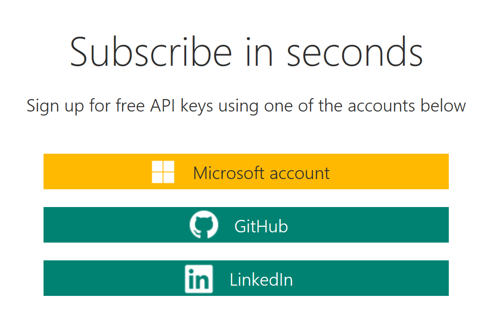
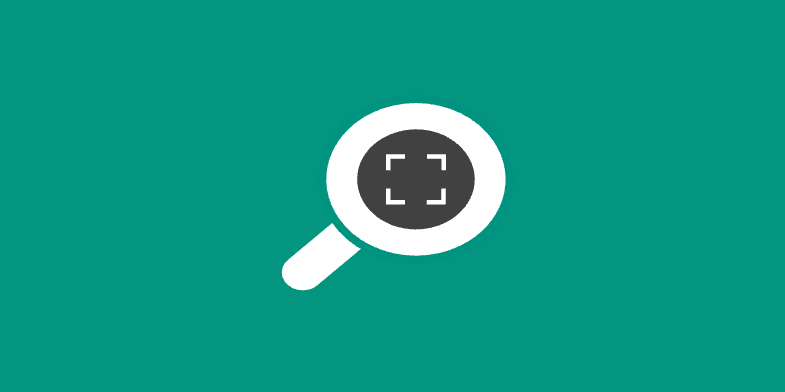

# Demo 1.3: A full Cognitive Services Demo #
This demo should take about 10 minutes
## Objectives ##
The goal of this demo is to familiarize the audience with some of the capabilities of multiple Cognitive Services used together.  We will show Bing Speech, Bing Speech to Text and Text to Speech, Bing Image Search, the Emotion API and also the Language Understanding Intelligent Service (LUIS).

## Requirements ##
- An active Azure subscription.  If you don't have an account, you can create a free trial account in just a couple of minutes.  For details, see [http://azure.microsoft.com/pricing/free-trial/](http://azure.microsoft.com/pricing/free-trial/ "http://azure.microsoft.com/pricing/free-trial/")
- An active Internet connection
- Microsoft Visual Studio 2015

## Setup ##
2. Copy the Demo1.3.zip file provided in the Solutions folder that goes with this session.
3. Extract it under your documents folder and open any files indicated below from the extracted version. 
1. Open up a browser and navigate to: [https://www.microsoft.com/cognitive-services/en-us/apis](https://www.microsoft.com/cognitive-services/en-us/apis).
2. Login with your Microsoft Account

### Setup Bing Speech ###
1. Got to [https://www.microsoft.com/cognitive-services ](https://www.microsoft.com/cognitive-services  "https://www.microsoft.com/cognitive-services ") then click on “Get Started for Free” button
	

2. You can authenticate with a Microsoft Account, GitHub or LinkedIn.  We will use Microsoft Account
	

3. Click the Microsoft Account button and login.
    1. If this is your first time signing in, you will need to click the "Send email verification" button.
    1. Go to your email inbox and click on the verify link then click "Get started for free" from the verification confirmation
    3. OR you can Click "Subscribe to new free trial + button

		

1. Click on Bing Speech API
	

1. Click “Get started for free”
1. Check the “I agree” box then click “Subscribe”
1. Make a note of one of the keys on the account page for “Bing Speech – Free”

	

### Setup Bing Search ###
1. Got to [https://www.microsoft.com/cognitive-services ](https://www.microsoft.com/cognitive-services  "https://www.microsoft.com/cognitive-services ") then click on “Get Started for Free” button
	

2. You can authenticate with a Microsoft Account, GitHub or LinkedIn.  We will use Microsoft Account
	

3. Click the Microsoft Account button and login.
    1. If this is your first time signing in, you will need to click the "Send email verification" button.
    1. Go to your email inbox and click on the verify link then click "Get started for free" from the verification confirmation
    3. OR you can Click "Subscribe to new free trial + button

		

1. Click on Bing Image Search API
	

1. Click “Get started for free”
1. Check the “I agree” box then click “Subscribe”
1. Make a note of one of the keys on the account page for “Bing Speech – Free”

	
### Setup Emotion API ###
1. Got to [https://www.microsoft.com/cognitive-services ](https://www.microsoft.com/cognitive-services  "https://www.microsoft.com/cognitive-services ") then click on “Get Started for Free” button
	

2. You can authenticate with a Microsoft Account, GitHub or LinkedIn.  We will use Microsoft Account
	

3. Click the Microsoft Account button and login.
    1. If this is your first time signing in, you will need to click the "Send email verification" button.
    1. Go to your email inbox and click on the verify link then click "Get started for free" from the verification confirmation
    3. OR you can Click "Subscribe to new free trial + button

		

1. Click on Emotion API
	

1. Click “Get started for free”
1. Check the “I agree” box then click “Subscribe”
1. Make a note of one of the keys on the account page for “Bing Speech – Free”

	

### Language Understanding Intelligent Service ###
1.	Sign on to [http://luis.ai](http://luis.ai "http://luis.ai") with your MSA (can take a while to setup)
	- In LUIS we need to create **Intents** and **Entities**.  Basically an Entity is a parameter that will be passed to our bot while an Intent is a recognizable element that a message to our bot will be recognized and slotted into for notification to our bot.  For example we receive in our bot the two different intents to search for things or search for people.
3.	Click "New App" button.
	

4.	Fill in the name as “cogdemo”  All other fields should be left as default.
5.	Click Create
	

4.	Click “Create an Intent” button
	

5.	Click “Add Intent” button
	

6.	Fill in the Intent name: *ThingPictures*
	- **Utterances** are just sentences entered that are representative of the input you will get in the bot that will define the intent.  The more utterances that are created up front the more accurate the training will be from the beginning.  But don't worry, it will learn as it goes from input provided by the people using your bot too.
7.	Add the first Utterance “Show me a picture of a cow” and press "Enter"
	

8.	Add Utterance “Please show me a car” and press "Enter"
9.	Click "Save" button
	

11.	Click on the "Intents" side menu again.
5.	Click “Add Intent” button
6.	Fill in the Intent name: *PeoplePictures*
7.	Add the first Utterance for this intent "Do you know what Satya Nadella looks like happy?” and press "Enter"
8.	Add Utterance “How does Elvis Feel in a picture?” and press "Enter".  
8.	Add Utterance “show me a picture of Elton John?” and press "Enter".  
9.	Click "Save" button

	

9.	Click Publish App on the side menu

	

10.	Click “Add a new key to your account”
11.	Click “Buy Key on Azure”  - You must already have an active Azure Subscription.
	> The key itself does not cost you anything to aquire, depending on the subscription you choose.  There are free subscriptions available when trying the service out.

	12.	Enter a name for this account.  **cogdemo** will work.
	13.	The Subscription should be pre-selected if you have an active Azure subscription.
	13.	The API Type of LUIS is already filled in for you.
	14.	You will need to select a pricing tier.  The demo tier of F0 - Free is available for first time developers and allows 10,000 calls per month and 5 calls per second.
	15.	Choose a resource group.  You can use an existing one or create a new group.
		

	16.	Click Create
	17.	Open the Cognitive Services Account "cogdemo"
	18.	Click on "Keys"	
		

	19.	Copy "Key 1" to the clipboard for use in your LUIS App definition.
13.	Return to the "My Keys" area and Click "Add a new Key"
14.	Paste the **subscription key**, copied from keys. (YOU WILL NEED THIS AGAIN LATER)
14.	Return to “Publish App”
15.	Select subscription key created above.
16.	Click Train
17.	Click Publish
18.	Go to LUIS app dashboard.  Note the **App Id** (YOU WILL NEED IT LATER)
2. In the Project after extracting, you will have to place keys for the demo to work.  Before beginning, make sure you have gone to the Cognitive Services website and acquired keys for all the pieces listed here.
	1. In Demo1-3-1 Open the MainWindow.xaml.cs file
		2. In MainWindow() constructor paste the **Bing Speech API** key at **COPY-KEY-HERE**
		3. In SearchImage() method paste the **Bing Search API** key at the **COPY-KEY-HERE**
	4.  In Demo1-3-2 Open the MainWindow.xaml.cs file
		2. In MainWindow() constructor paste the **Bing Speech API** key at **COPY-KEY-HERE**
		3. In SearchImage() method paste the **Bing Search API** key at the **COPY-KEY-HERE**
		4. In GetLuisIntent() method paste the **LUIS Endpoint URL** at the **COPY-LUIS-ENDPOINT-URL-HERE**
		5. In GetEmotion() method paste the **Emotion API Key** at the **COPY-KEY-HERE**
		5. In Speak() method paste the **Bing Speech API** key at the **COPY-KEY-HERE**
## Demo Steps ##
### Part 1 - A simple Bot ###
> The first demonstration will show just two Congnitive Services.  First is Bing Speech to convert Speech to Text (STT).  The first project we will show is written in C# using a WPF template.  We have used NuGet to get the Bing Speech SDK.  We'll use the SDK to listen for speech and convert it to text.  We will then use the text to do a Bing Image Search to retrieve an image for display

1.	Open Visual Studio 2015
2.	Open the Demo1-3.sln solution.
3.	Right click on the "Demo1-3-1" C# project and select "Set as Startup Project"
4.	Start the project. 

	> The button you see in the app will cause the SDK to start listening to your micrphone.  We will display an image to indicate that we are listening.  Speak your command.  The microphone will automatically stop listening after a gap of silence.  
	> 
	> Bing speech can be used to convert short phrases and sentences, which we will be doing, or real time on the fly conversion of speech to text for something like real time captioning.
	>
	> Bing speech not only does speech to text, but the other way also from text to speach in many different languages and different voices.  Often there is the choice of male or femaile.
	>
	> Here we will only showing the Speech-to-text part.

5.	Press the Speak Button
	

6.	While it is listening, try saying "Show me a horse"
	

	> Notice that the app has understood your request and retrieved a picture of a horse.  Not only did it do that but we display the results of the text to speech along with the Cognitive Services confidence that it heard your properly.

	

### Part 2 - The Full Language Bot ###
> Now it is time to add some more functionality to our app.  In example 2, we add three additional Cognitive Services.  First we want to add Language Understanding Intelligent Service also known as **LUIS** so that not only are we listening to the speech and converting it to text, but we are going to analyze that text for intent.  LUIS will tell us that the text is either asking us to show some **thing** or some **person**.  It is possible that it might  be neither also.  Once we know if it's a thing or person, we will do the image search.  If it is a thing, it will stop there.  If it is a person, we will use the **Emotion API** to derive the emotion expressed in the picture of a person.  Finally we will use Bing Speech to convert the resulting emotional assessment into text and report it back to us.

1.	Open Visual Studio 2015
2.	Open the Demo1-3.sln solution.
3.	Right click on the "Demo1-3-2" C# project and select "Set as Startup Project"
4.	Start the project. 

	> The button you see in the app will cause the SDK to start listening to your micrphone.  We will display an image to indicate that we are listening.  Speak your command.  The microphone will automatically stop listening after a gap of silence.

5.	Press the Speak Button
	

6.	While it is listening, try saying "Show me a horse"
	

	> Notice that the app has understood your request and retrieved a picture of a horse.  Not only did it do that but we display the results of the text to speech along with the Cognitive Services confidence that it heard your properly.  This is just the same as before.  Next we want to show the three new features.

	

7.	Press the Speak Button
8.	While it is listening say "Show me how Satya Nadella is feeling"
	

	> This time the app correctly heard us.  Found the appropriate picture, figured out our intent and then figured out the emotion of the picture.  Try other examples as you see fit.  
	
