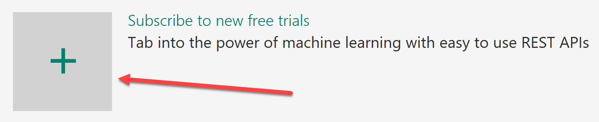
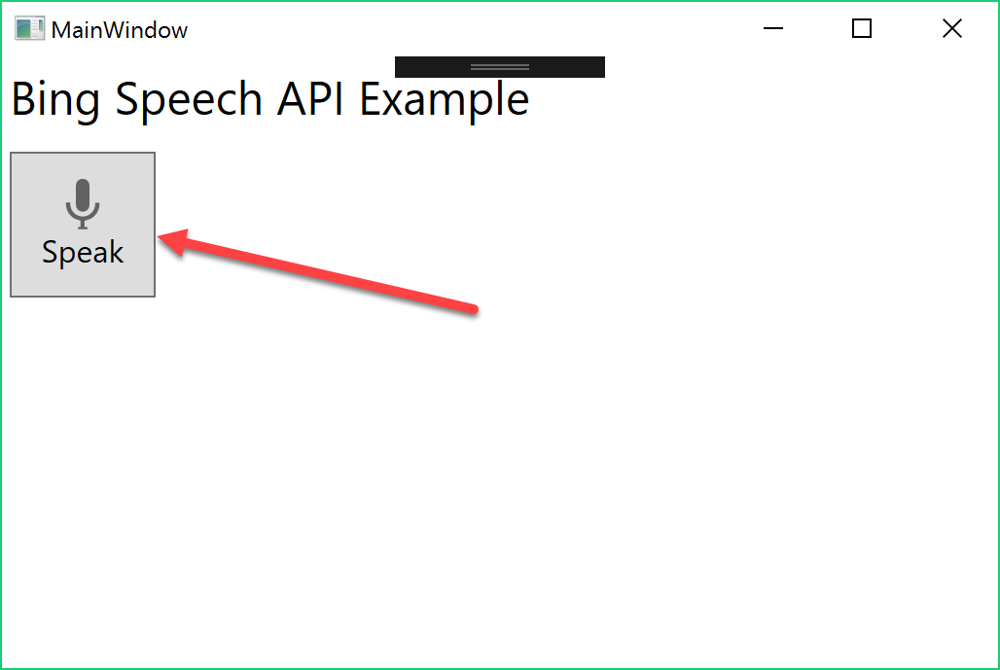

# Demo 2.1: Bing Speech API #
This demo should take about 6 minutes
## Objectives ##
The goal of this demonstration is to show how to implement Bing Speech API for both Speech to Text and Text to Speech

## Requirements ##
- Active Internet connection
- Microsoft Visual Studio 2015
## Setup ##
2. Copy the Demo2.1.zip file provided in the Solutions folder that goes with this session.
3. Extract it under your documents folder and open any files indicated below from the extracted version. 

## Demo Steps ##
### Register for Bing Speech API ###
1. Got to [https://www.microsoft.com/cognitive-services ](https://www.microsoft.com/cognitive-services  "https://www.microsoft.com/cognitive-services ") then click on “Get Started for Free” button
	

	> Bing Speech can process audio coming from any number of sources.  Our demonstration will stream an audio **file** to Bing Speech with the expected result the text representation of that audio file.  However, the Bing Speech API, can also accept audio from a live microphone, or another live audio source.  
	> 
	> It means we get partial recognitions on the fly if we should choose to.  While we are going to use it to just echo back the result, we could just as easily create a business app that would process and execute tasks based on voice commands.
	> 
	> The other side of the coin is processing text to speech.  So not only can your application understand the spoken word but it can also speak it.
	> 
	> One extra goody is we could have the Bing Speech API do speech intent recognition directly using models trained by the Language Understanding Intelligent Service (LUIS).
	> 
2. You can authenticate with a Microsoft Account, GitHub or LinkedIn.  We will use Microsoft Account
	

3. Click the Microsoft Account button and login.
    1. If this is your first time signing in, you will need to click the "Send email verification" button.
    1. Go to your email inbox and click on the verify link then click "Get started for free" from the verification confirmation
    3. OR you can Click "Subscribe to new free trial + button

		

1. Click on Bing Speech API
	

1. Click “Get started for free”
1. Check the “I agree” box then click “Subscribe”
1. Make a note of one of the keys on the account page for “Bing Speech – Free”

	

### Create a Speech App ###
> We've included the necessary code in the "before" project.  Only a few steps will be needed to get speech working in the demo app.  We will use the Speech SDK for speech-to-text and a straight REST web service to get the text-to-speech.

1.	Open Visual Studio 2015
2.	Open the "before" version of Demo2.1

	> The Speech SDK NuGet Package is already referenced.  First thing we need to do is download the package.

4.	Right Click on Solution and select "Restore NuGet Packages...
5.	Open the MainWindow.xaml.cs

	> The first piece you need to uncomment is the definition of the MicrophoneRecognitionClient.  Once that's done in the class constructor we need to uncomment the assignment of the Microphone client.

6.	Uncomment the Microphone declaration
7.	Uncomment the constructor
8.	Paste the Key copied above into the space indicated by "**YOUR-KEY-HERE**"
	
	> We are not using the partial response event but could implement that here if we chose and have words displayed as they were processed.  We need to put the key into the constructor that we got from Cognitive Services.
	> 
8.	In the button_Click event, uncomment the Start Microphone code.
9.	The last steps are to uncomment the final 4 methods
	1.	OnMicroPhoneStatus
		> This notifies us as the microphone turns on and off.  we use it to notify the user that we are recording.
		> 
	2.	OnResponseReceived

		> When the complete sentence is finished processing (after the microphone is off), we execute this giving us the full text recognized.
		
	3.	Speak

		> We want the text we get back to be echoed in voice rather than text, so we use Bing Speech to do this.  Note that the key is the same.
		> 
		> You need to paste the key copied above into the space indicated by "**YOUR-KEY-HERE**"
	4.	OnAudioAvailable
5.	Start the application

	

6.	Click the Speak button and dictate something.  The applications should echo it back in it's own voice.