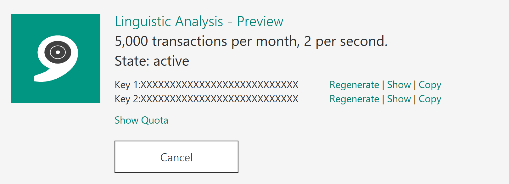

# Demo 2.3: Linguistic Analysis API #
This demo should take about 6 minutes
## Objectives ##
The goal of this demonstration is to show how to implement the Linguistic Analysis API that will let us pull apart the text created by the Bing Speech API and speech-to-text.

## Requirements ##
- Active Internet connection
- Microsoft Visual Studio 2015
- 
## Setup ##
2. Copy the Demo2.3.zip file provided in the Solutions folder that goes with this session.
3. Extract it under your documents folder and open any files indicated from the extracted version. 
4. In the Project after extracting, you will have to place keys for the demo to work.  Before beginning, make sure you have gone to the Cognitive Services website and acquired keys for all the pieces listed here.
	2. In MainWindow() constructor paste the **Bing Speech API** key at **COPY-KEY-HERE**
	3. In SearchImage() method paste the **Bing Search API** key at the **COPY-KEY-HERE**
	5. In Speak() method paste the **Bing Speech API** key at the **COPY-KEY-HERE**

## Demo Steps ##
### Register for Linguistic Analysis API ###
1. Got to [https://www.microsoft.com/cognitive-services ](https://www.microsoft.com/cognitive-services  "https://www.microsoft.com/cognitive-services ") then click on “Get Started for Free” button
	

2. You can authenticate with a Microsoft Account, GitHub or LinkedIn.  We will use Microsoft Account
	

3. Click the Microsoft Account button and login. (IF NECESSARY)
    1. If this is your first time signing in, you will need to click the "Send email verification" button.
    1. Go to your email inbox and click on the verify link then click "Get started for free" from the verification confirmation
    3. OR you can Click "Subscribe to new free trial + button

		

1. Click on Linguistic Analysis API
	

	> In this app we will demonstrate using Linguistic Analysis to bring back information about our text.  In this case we are asking to label the text with tokens indicating verbs, nouns and so on.  We could also get the Parts Of Speech tags and a constituency tree which would map out the entire sentence.  This sure would have been handy in school!
	> 
1. Click “Get started for free”
1. Check the “I agree” box then click “Subscribe”
1. Make a note of one of the keys on the account page for “Bing Search – Free”

	

### Create a Linguistic Analysis App ###
> We've included the necessary code in the "before" project, only commented out.  Only a few steps will be needed to get Linguistic Analysis working in the demo app.  We will use the Cognitive Service REST web service to search for our analysis.

1.	Open Visual Studio 2015
2.	Open the "before" version of Demo2.3

	> To more easily handle results from Bing Image Search, we need to include the Newtonsoft NuGet Package which is already referenced.  First thing we need to do is download the package.

4.	Right Click on Solution and select "Restore NuGet Packages..."
5.	Open the MainWindow.xaml.cs

	> The first piece you need to uncomment is the method we created for calling the Linguistic Analysis API.  Then all we need to do is add the call to that method after we get a linguistic analysis result from our Speech-to-text.

	> NOTE: We have already included the LinguisticRequest and LinguisticResponse classes in the /Model folder.  This was created by pasting JSON from the Cognitive Services API for Linguistic Analysis.  They provide examples of all the results.  Look in the menu for /Edit/Paste Special.../Paste JSON as Classes which will create the class file to deserialize the JSON into.

6.	Uncomment the `AnalyzeLanguage(string phraseToAnalyze)` method.
7.	Paste the Linguistic Analysis API Key into the space indicated by "**COPY-KEY-HERE**"
8.	In the `MicClient_OnResponseReceived(object sender, SpeechResponseEventArgs e)` event, uncomment the call to the `this.AnalyzeLanguage(e.PhraseResponse.Results[0].DisplayText);` made available above.

	`this.AnalyzeLanguage(e.PhraseResponse.Results[0].DisplayText);`

	> It's important to note that we can choose how we want the text analyzed.  As described above, by including different analyzers, described in the Cognitive Services API documentation  we can choose to get back Parts of Speech or the constituency tree.  In this case we are just going to ask for the tokens like nouns and verbs and then display that information.

5.	Start the application

	

6.	Click the Speak button and dictate something like "Show me a kitten".  The applications should echo it back in it's own voice and display a picture.
	
