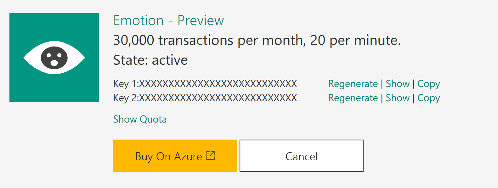

# Demo 2.4: Emotion API #
This demo should take about 6 minutes
## Objectives ##
The goal of this demonstration is to show how to implement the Vision Emotion API for to assess the emotion of people in pictures.

## Requirements ##
- Active Internet connection
- Microsoft Visual Studio 2015
- 
## Setup ##
2. Copy the Demo2.4.zip file provided in the Solutions folder that goes with this session.
3. Extract it under your documents folder and open any files indicated below from the extracted version. 
4. In the Project after extracting, you will have to place keys for the demo to work.  Before beginning, make sure you have gone to the Cognitive Services website and acquired keys for all the pieces listed here.
	2. In MainWindow() constructor paste the **Bing Speech API** key at **COPY-KEY-HERE**
	3. In SearchImage() method paste the **Bing Search API** key at the **COPY-KEY-HERE**
	5. In Speak() method paste the **Bing Speech API** key at the **COPY-KEY-HERE**
## Demo Steps ##
### Register for the Emotion API ###
1. Got to [https://www.microsoft.com/cognitive-services ](https://www.microsoft.com/cognitive-services  "https://www.microsoft.com/cognitive-services ") then click on “Get Started for Free” button
	

2. You can authenticate with a Microsoft Account, GitHub or LinkedIn.  We will use Microsoft Account
	

3. Click the Microsoft Account button and login. (IF NECESSARY)
    1. If this is your first time signing in, you will need to click the "Send email verification" button.
    1. Go to your email inbox and click on the verify link then click "Get started for free" from the verification confirmation
    3. OR you can Click "Subscribe to new free trial + button

		

1. Click on Emotion API
	

	> The Emotion API is one of the seeming simplest of the cognitive services.  However it accomplishes some very difficult things.  It is not easy to understand the human face.  There are all sort of variations in the face and being able to discern an emotion is no small task.  The Face API need only identify where the eyes and face are, but to read a concept like emotion into a face is another whole level of difficulty.  And, I must say, it does it very well.
	> 
1. Click “Get started for free”
1. Check the “I agree” box then click “Subscribe”
1. Make a note of one of the keys on the account page for “Emotion – Preview”

	

### Create a Emotion Enabled App ###
> We've included the necessary code in the "before" project, only commented out.  Only a few steps will be needed to get the Emotion API working in the demo app.  We will use the Cognitive Service REST web service to analyze the images we found with Bing Image Search.

1.	Open Visual Studio 2015
2.	Open the "before" version of Demo2.4

	> To more easily handle results from the Emotion API, we need to include the Newtonsoft NuGet Package which is already referenced.  First thing we need to do is download the package.

4.	Right Click on Solution and select "Restore NuGet Packages..."
5.	Open the MainWindow.xaml.cs

	>  In addition to adding the Emotion API, we are going to switch things up a bit and have the speech tell us the emotion instead of just parroting back what we say. 
	>  
	>  The first piece you need to uncomment is the method we created for calling the Emotion API.  Then all we need to do is add the call to that method after we get a result from our Bing Image Search.

	> NOTE: We have already included the EmotionRequest and EmotionResponse classes in the /Model folder.  This was created by pasting JSON from the Cognitive Services Vision API for the Emotion API.  They provide examples of all the results.  Look in the menu for /Edit/Paste Special.../Paste JSON as Classes which will create the class file to deserialize the JSON into.

6.	Uncomment the `GetEmotion(string imageUri)` method.
7.	Paste the Emotion API key in the space indicated by "**YOUR-KEY-HERE**"
8.	In the `SearchImage(string phraseToSearch)` event, uncomment the call to the `await GetEmotion(bingImageSearchResponse.value[0].contentUrl);` made available above.

	`await GetEmotion(bingImageSearchResponse.value[0].contentUrl);`

5.	Start the application

	

6.	Click the Speak button and dictate something like "Show me a kitten".  The applications should echo it back in it's own voice and display a picture.
	
