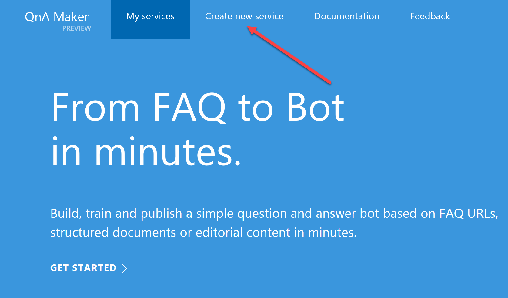

# Demo 2.5: Cognitive Services Knowledge - QnA Maker - Preview #
This demo should take about 5 minutes
## Objectives ##
The goal is to demonstrate one of the "Knowledge" services from Cognitive Services.  The QnA Maker is a tool that can distill information into conversational answer.  Instead of having a confusing long list of FAQs or Q&As, you can put the information into QnA Maker and people can ask natural language questions in a bot interface to get answers.

## Requirements ##
- Active Internet connection
- A Valid Microsoft Account.  [http://QnQMaker.ai](http://QnQMaker.ai) requires authentication

## Setup ##
Before beginning you should have a browser (This demo was created using the Microsoft Edge browser) with the QnA introductory page loaded. [https://www.microsoft.com/cognitive-services/en-us/qnamaker](https://www.microsoft.com/cognitive-services/en-us/qnamaker)

	https://www.microsoft.com/cognitive-services/en-us/qnamaker

## Demo Steps ##
> We begin at cognitive services and the QnA Maker page.  QnA Maker is part of the "Knowledge" suite of cognitive services.

1.	Scroll down the the sample app first.  

	> You have your choice of two different sets of questions that were processed by the QnA Maker.  One is an FAQ from the Bot Framework, the other is the FAQ for QnA Maker itself.
	>
	> Note that it uses a bot interface to ask and answer questions.  In this case, the answer is displayed in JSON so you can manually process this as well.  The QnA Maker is also using Cognitive Services behind the scenes.  To process the natural language questions it uses LUIS.  Currently when you sign up using QnA Maker, it is free with a limit of 10,000 transactions per month or 10 per minute.
  
2.	Click on the "Check the source FAQ URL" to show how the data originally looked.
3.	Return to the QnA Page and try some of the sample questions.

	

4.	Scroll back to the top and click "Get started for free"

	

	> For our demo we are going to try loading a FAQ of our choice into the QnAMaker and then try asking some questions.  Hopefully we'll get some interesting answers.
	> 
	> You have the option of using an existing FAQ or Q&A list on an active web site or you can upload a list you creating just for Cognitive Services.  
	> 
5.	To begin, click on "Create a new Service" (You may need to login with your Microsoft Account if not already logged in)

	

6.	We are immediately presented with a very simple form.  Fill in the name of your service. (MyFAQ)
7.	Enter the location of the FAQ web page you wish to use with QnA Maker.

		We suggest you use: https://www.microsoft.com/en-ca/software-download/faq

	> You can enter a web page or upload a file with your questions.  You can even just skip all that and enter the questions in the next step.

	

8.	Press the Create button at the bottom of the page.

	

	> Just like in LUIS you can make changes and re-train the knowledge.  For our purposes, we just want to get it a try now.
9.	Click on the "Test" menu on the left side of the page

	

10.	In the Chat Bot that is presented, try asking a question: "What do I do with an ISO file?"

	
	> There is a whole lot going on here.  In the center you can see where we asked the question.  We can also see the answer derived from FAQ web page we provided.
	> 
	> On the left side the QnA maker displays other possible answers giving you the option of selecting the best one (it learns from your choices).
	> 
	> On the right you are given the opportunity to add an alternative answer.  So not only can you help it learn from existing content but you can add more content on the fly as you test.
	> 
	> It automatically retrains but you can retrain it at any time by pressing the Save and Retrain button. 
	> Try some other questions if you wish...

