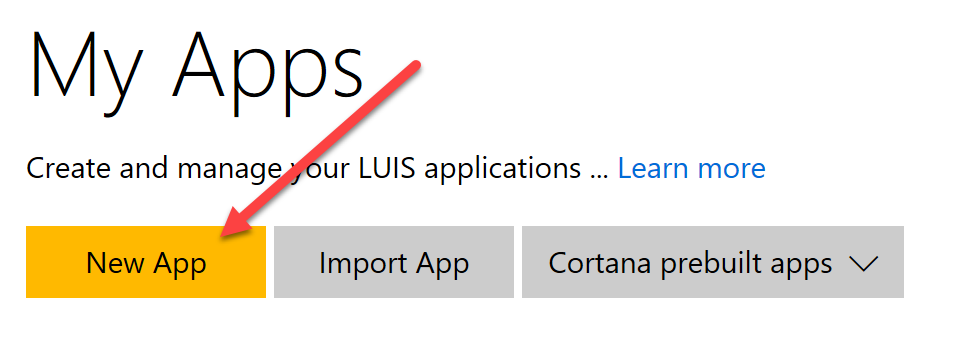
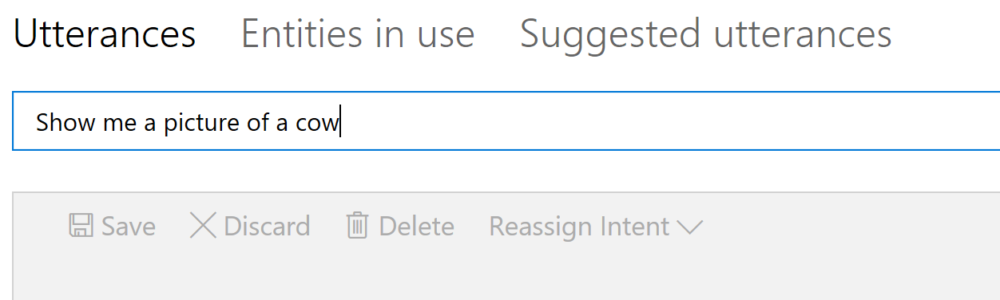
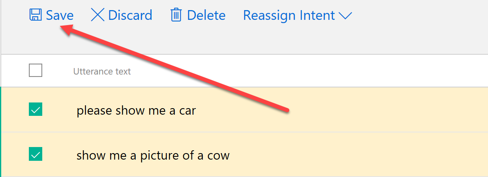
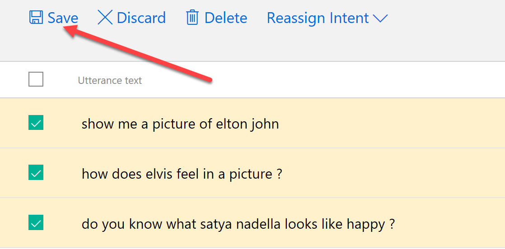
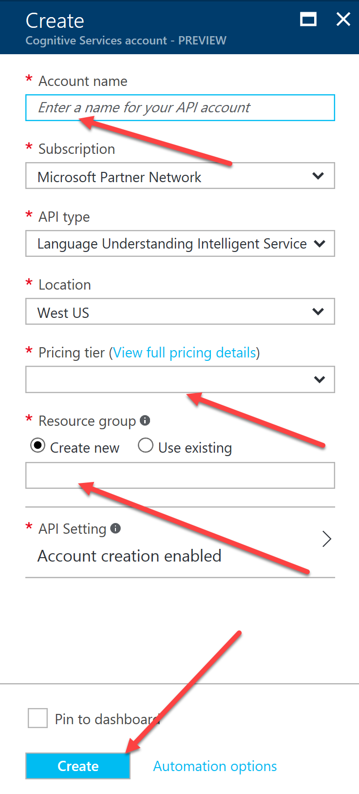
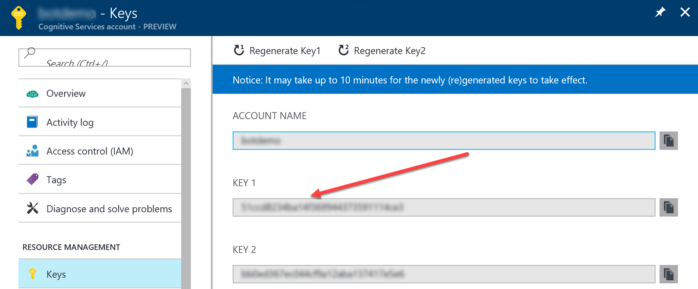
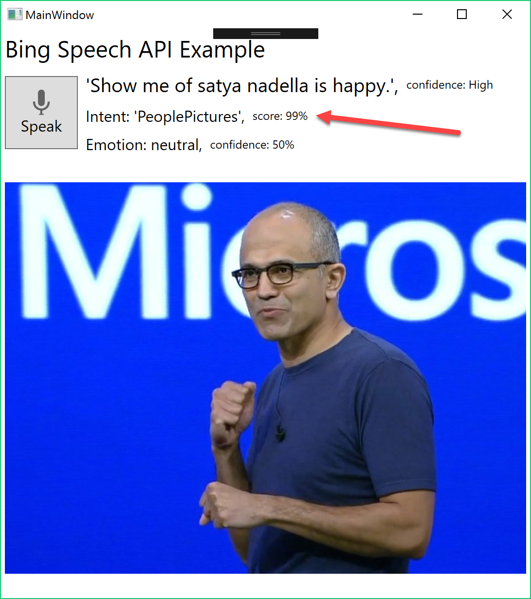

# Demo 2.6: Language Understanding Intelligent Service (LUIS) #
This demo should take about 10 minutes
## Objectives ##
The goal of this demonstration is to show how to implement LUIS to assist us on knowing what to do with the text generated by Bing Speech through speech-to-text.

We will learn how to implement LUIS in our application. 

## Requirements ##
- An active Azure subscription.  If you don't have an account, you can create a free trial account in just a couple of minutes.  For details, see [http://azure.microsoft.com/pricing/free-trial/](http://azure.microsoft.com/pricing/free-trial/ "http://azure.microsoft.com/pricing/free-trial/")
- An active Internet connection
- Microsoft Visual Studio 2015
- 
## Setup ##
2. Copy the Demo2.6.zip file provided in the Solutions folder that goes with this session.
3. Extract it under your documents folder and open any files indicated below from the extracted version. 
4. In the Project after extracting, you will have to place keys for the demo to work.  Before beginning, make sure you have gone to the Cognitive Services website and acquired keys for all the pieces listed here.
	2. In MainWindow() constructor paste the **Bing Speech API** key at **COPY-KEY-HERE**
	3. In SearchImage() method paste the **Bing Search API** key at the **COPY-KEY-HERE**
	5. In GetEmotion() method paste the **Emotion API Key** at the **COPY-KEY-HERE**
	5. In Speak() method paste the **Bing Speech API** key at the **COPY-KEY-HERE**

## Demo Steps ##
### Language Understanding Intelligent Service ###
1.	Sign on to [http://luis.ai](http://luis.ai "http://luis.ai") with your MSA (can take a while to setup)
	
	> Language Understanding Intelligent Service is a Microsoft Cognitive Service that can be used to understand natural human language, derive meaning and pass the determined intent to an application.
	> 
	> In LUIS we can create **Intents** and **Entities**.  Basically an Entity is a parameter that could be passed to our application while an Intent is a recognizable element that a message to our application will be recognized as and slotted into for notification to our application.  For example we receive in our app the intent to search for things or search for people.  We will not be creating any entities today as we don't really need to.
	>
	>You can create your own intents or use a number of pre-build, world class models provided by bing.   LUIS models can be called from any device across platforms.  LUIS SDKS are available for C#, Node JS, Android and Python and supports REST Services (we'll be using that today).
	>
3.	Click "New App" button.
	

4.	Fill in the name as “cogdemo”  All other fields should be left as default.
5.	Click Create
	

4.	Click “Create an Intent” button
	

5.	Click “Add Intent” button
	

6.	Fill in the Intent name: *ThingPictures*

	> **Utterances** are just sentences entered that are representative of the input you will get in the application that will define the intent.  The more utterances that are created up front the more accurate the training will be from the beginning.  But don't worry, it will learn as it goes from input provided by the people using your application too.
	> 
7.	Add the first Utterance “Show me a picture of a cow” and press "Enter"
	

8.	Add Utterance “Please show me a car” and press "Enter"
9.	Click "Save" button
	

	> The list of utternaces will grow with use.  At any time you can come back here and add more utterances if you want.

11.	Click on the "Intents" side menu again.
5.	Click “Add Intent” button
6.	Fill in the Intent name: *PeoplePictures*
7.	Add the first Utterance for this intent "Do you know what Satya Nadella looks like happy?” and press "Enter"
8.	Add Utterance “How does Elvis Feel in a picture?” and press "Enter".  
8.	Add Utterance “show me a picture of Elton John?” and press "Enter".  
9.	Click "Save" button

	

9.	Click Publish App on the side menu

	

10.	Click “Add a new key to your account” **This is only necessary if you no longer have a trial key availalble to you!
	11.	Click “Buy Key on Azure”  - You must already have an active Azure Subscription.
		> The key itself does not cost you anything to aquire, depending on the subscription you choose.  There are free subscriptions available when trying the service out.

		12.	Enter a name for this account.  **cogdemo** will work.
		13.	The Subscription should be pre-selected if you have an active Azure subscription.
		13.	The API Type of LUIS is already filled in for you.
		14.	You will need to select a pricing tier.  The demo tier of F0 - Free is available for first time developers and allows 10,000 calls per month and 5 calls per second.
		15.	Choose a resource group.  You can use an existing one or create a new group.
			
	
		16.	Click Create
		17.	Open the Cognitive Services Account "cogdemo"
		18.	Click on "Keys"	
			
	
		19.	Copy "Key 1" to the clipboard for use in your LUIS App definition.
	13.	Return to the "My Keys" area and Click "Add a new Key"
	14.	Paste the **subscription key**, copied from keys. (YOU WILL NEED THIS AGAIN LATER)
	14.	Return to “Publish App”
	15.	Select subscription key created above.
16.	Click Train
17.	Click Publish
18.	Go to LUIS app dashboard.  place the Endpoint URL in the clipboard **(YOU WILL NEED IT LATER)**

### Create a LUIS Enabled App ###
> We've included the necessary code in the "before" project, only commented out.  Only a few steps will be needed to get the Emotion API working in the demo app.  We will use the Cognitive Service REST web service to analyze the images we found with Bing Image Search.

1.	Open Visual Studio 2015
2.	Open the "before" version of Demo2.6

	> To more easily handle results from the Emotion API, we need to include the Newtonsoft NuGet Package which is already referenced.  First thing we need to do is download the package.

4.	Right Click on Solution and select "Restore NuGet Packages..."
5.	Open the MainWindow.xaml.cs

	>  In addition to adding the Emotion API, we are going to switch things up a bit and have the speech tell us the emotion instead of just parroting back what we say. 
	>  
	>  The first piece you need to uncomment is the method we created for calling the Emotion API.  Then all we need to do is add the call to that method after we get a result from our Bing Image Search.

	> NOTE: We have already included the LuisResponse class in the /Model folder.  This was created by pasting JSON created by executing the Endpoint Url with a question as shown in the "Publish" page of the LUIS App Management page.  You can run it in any browser then just copy the provided JSON into the clipboard.  Look in the menu for /Edit/Paste Special.../Paste JSON as Classes which will create the class file to deserialize the JSON into.

6.	Uncomment the `GetLuisIntent(string utterance)` method.
	4. In GetLuisIntent() method paste the **LUIS Endpoint URL** at the **COPY-LUIS-ENDPOINT-URL-HERE**
8.	In the `MicClient_OnResponseReceived(object sender, SpeechResponseEventArgs e)` event, uncomment the call to the `var intent = await this.GetLuisIntent(e.PhraseResponse.Results[0].DisplayText);` and the following code needed to understand and react to the intent value provided by LUIS needs to be uncommented also.

		//var intent = await this.GetLuisIntent(e.PhraseResponse.Results[0].DisplayText);
		//await Application.Current.Dispatcher.BeginInvoke(
		//    DispatcherPriority.Normal, new Action(() =>
		//    {
		//        this.MySpeechIntent.Text = $"Intent: '{intent.intents[0].intent}',";
		//        this.MySpeechIntentScore.Text = $"score: {Convert.ToInt16(intent.intents[0].score * 100)}%";
		//    }));
		
		//if (intent.intents[0].intent.ToLower() == "thingpictures")
		//{
		//    this.showEmotion = false;
		//    this.SearchImage(intent.query);
		//}
		//else if (intent.intents[0].intent.ToLower() == "peoplepictures")
		//{
		//    this.showEmotion = true;
		//    this.SearchImage(intent.query);
		//}
		//else
		//{
		//    await Application.Current.Dispatcher.BeginInvoke(
		//        DispatcherPriority.Normal,
		//        new Action(() => { this.MySpeechSentiment.Text = $"I'm not sure what your intent is and will not search"; }));
		//}

5.	Start the application

	

6.	Click the Speak button and dictate something like "Show me a kitten".  The applications should echo it back in it's own voice and display a picture.
7.	Try other phrases like, "Show me if Satya Nadella is happy."

	
	
	> Show that the application is able to provid ethe appropriate use of services based on the  intent determined by LUIS.

