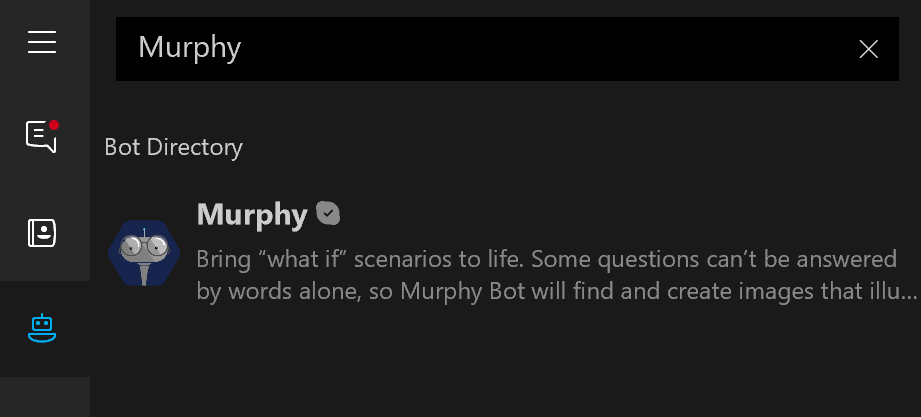

# Demo 1.1: Audience Participation #
This demo should take about 5 minutes
## Objectives ##
The goal is to demonstrate one of the ways in which the combination of the Microsoft Bot Framework and Microsoft Cognitive Services can provide interesting solutions in fun and creative ways.  You can have the audience try out the Murphy Bot during the session with their own devices and have a few laughs while doing it.

During the demo, there is no need to see how it was done or even show any code.  This experience is about trying it out and seeing what happens.  There is very little setup required.  Having some questions at the ready is about the most you will need.

## Requirements ##
You will need a Windows 10 device and an active internet connection.  On Windows 10, you will need to [install Skype Preview](https://www.microsoft.com/store/apps/9wzdncrfj364 "install Skype Preview") from the Windows Store.  The attendees will only need a browser to try out this demo.  The bot has been tried on the Microsoft Edge Browser.
## Setup Steps ##
Before beginning your presentation:

1. Open Skype Preview
2. If you already have Murphy in your list of contacts, right click and select Remove Contact to reset things.
3. Have a jpg/png image of yourself or a person that you don't mind using in your demo.  It's more fun if you can use a picture of yourself.

## Demo Steps ##
Explain to the attendees that they will use their smartphone to interact with a bot built using the Microsoft Bot Framework along with Microsoft Cognitive Services.

To demonstrate that the Bot Framework can be used on multiple channels (Skype, messenger, web, etc...) you will demonstrate the Murphy Bot in Skype on your laptop, then they will try it on their phone in a web page.

> Skype Preview comes with a whole bunch of bots built in.  If you have Skype Preview you will see the bot button on the far left side.  There are many already there.  We are going to focus on one fun bot called the Murphy Bot

Let's start the demo:

1. Click on the Bots tab (bottom icon on the left under the hamburger menu)
2. Type Murphy into "Search Bots" search box at the top of the list.
3. Click on the Murphy bot.

	

	> The getting started screen provided by Murphy.  Explain that Murphy uses the Microsoft Bot Framework using the Skype Channel along with Microsoft Cognitive Services to create images that answer "what if" questions.
	> 
	> The getting started page for the Murphy Bot tells you generally what it does, what it's capabilities are like sending files and photos.  
	> 
	> There is also a privacy statement.

	> Don't forget to mention that the bot maintains context

5. Click "Get Started"

	> The initial greeting for bots will often explain how you should get started.  In this case we should type a "What if" type question.

6. Ask in the chat box "What if Scott Guthrie was a judge?"

	>It will analyze your question using natural language and also Bing image search and create a mash up of pictures for your entertainment.
	>
	>It uses face matching provided by the Face API Cognitive Services.
	>
	>It understands context and the concept of a conversation.  You can respond and it understands that you are continuing the conversation.

6. Ask in the chat box "What if I was a Policeman?"
	>The Natural Language Understanding interprets the question and figures out that "I" means the person typing so it needs to ask for a picture.
	>
	>You will be prompted to upload your picture at this point.
	>
8. Click on the Send Image button at the bottom of the Skype App 
9. Wait a moment and a picture of you as a Policeman will be sent to you.
10. Click the download button in the picture
11. When prompted to display the picture, do so.

Now it is their turn:
1. Ask the audience to visit the [http://murphybot.com](http://murphybot.com "http://murphybot.com") website.
2. They should ask a similar What if Question: "What if Satya Nadella was a Superhero?"
