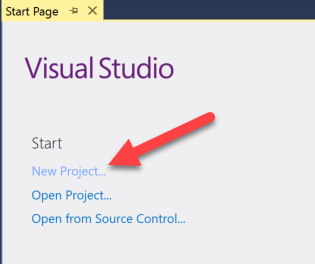
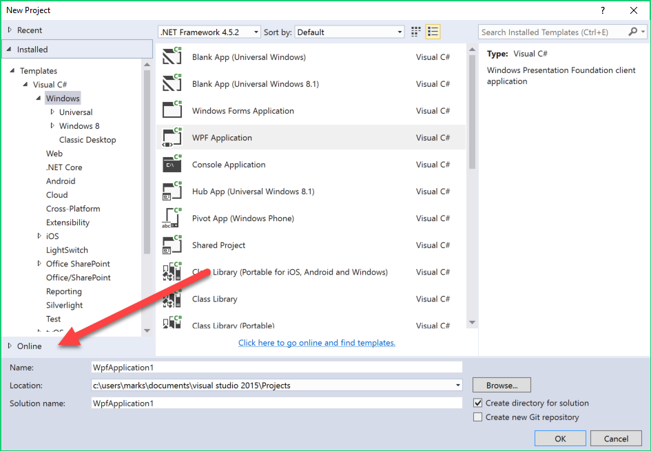
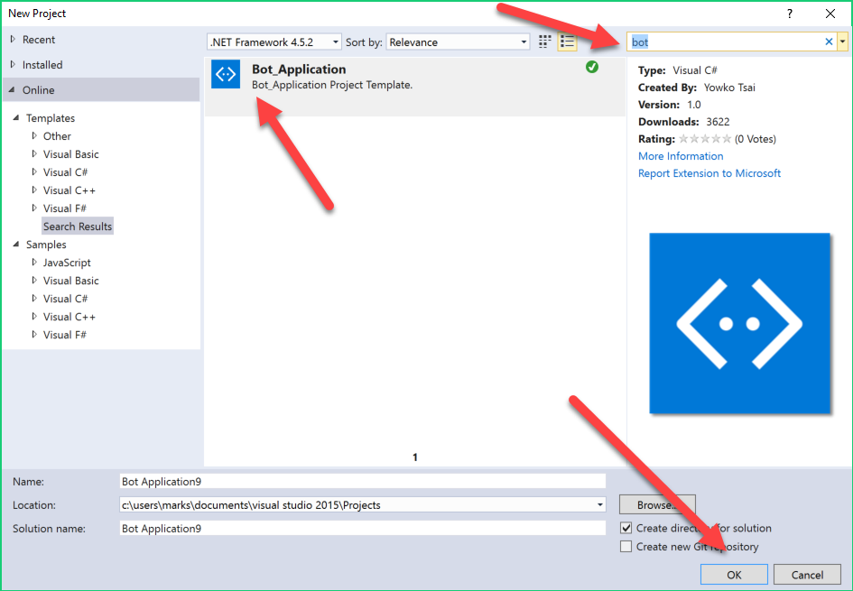
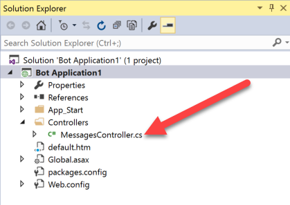
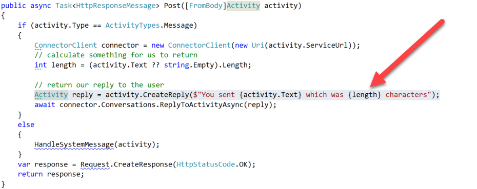
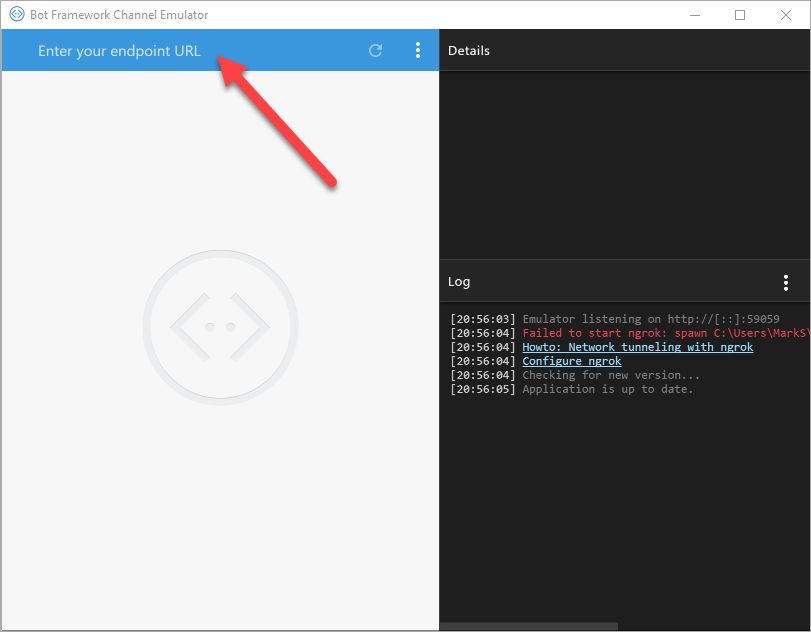
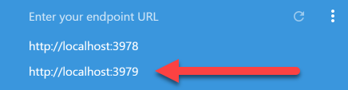
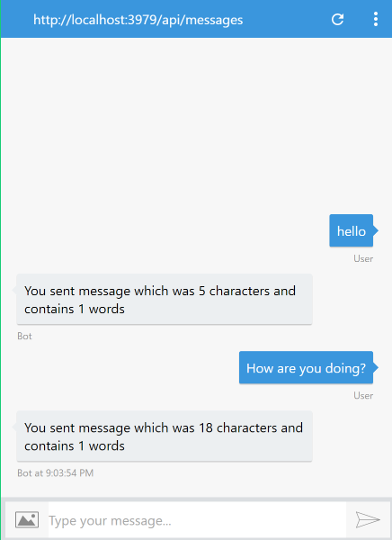

# Demo 1.2: Building a Basic Bot #
This demo should take about 10 minutes
## Objectives ##
The goal of this demonstration is to show how easy it is to get started building bots.  We will be using Visual Studio to create a simple bot and test it.  We'll also show a node.js equivalent bot app.  Other than the finding and installing of the bot template on-line, we will not require any internet connection. 

We also demonstrate an alternative channel to Skype.  In this case the Bot Emulator which in turn is modeling the Web Chat channel.

When done the audience will know the basics outline of how to create a new basic bot.
## Requirements ##
Before beginning there are a number of things you should pre-install.

- Download and [install Microsoft Visual Studio 2015](• https://www.microsoft.com/en-us/download/details.aspx?id=48146 "install Microsoft Visual Studio 2015")
- Download and [install the Microsoft Bot Emulator](https://download.botframework.com/botconnector/tools/emulator/publish.htm "install the Microsoft Bot Emulator")
## Setup ##
1. Open Visual Studio 2015
2. Open the Microsoft Bot Emulator
3. Open the app.js in the Notepad.exe

## Demo Steps ##
### Build the Bot ###
1. Open Visual Studio 2015
2. Click “New project…” from start page
	

1. Click “Online” from templates list (at the bottom)
	

	> If you have already downloaded the template or built a bot using the template it will be in your local template store.

1. Type “bot” in “Search Online Template” in the top right corner.
	

	> This bot is simple with only one level of response.  You can create any level of complexity you wish in your bot.
	
	> We'll be showing registration in Session 2. 

1. Look for “Bot_Application”, select it.  The default name is fine for this demonstration.

	> The bot template and all necessary NuGet packages will automatically be downloaed and prepared to be used in the bot.
	> 
	> The project files are pretty standard.  There is a default.htm page that can be used to try out the bot placement should you deploy to the web.

1. Open “MessagesController.cs”
	

	>The starting point is the POST method.  All messages typed into our bot begin here.  Right now it will just echo back the word count but you could do much more if you wanted here either through direct calls to methods or through a Dialog which is a type of class that can help keep track of things like context.
	>
	>Bot interactions ARE conversations.  It is back and forth and it maintains context and continuity.

1. In “public async Task<HttpResponseMessage> Post…” replace the existing reply creation with the following two lines of code.

	`int wordcount = activity.Text.Split(new char[] {' ', '\r'}, StringSplitOptions.RemoveEmptyEntries).Length;`

	`Activity reply = activity.CreateReply($"You sent {activity.Text} which was {length} characters and contains {wordcount} words");`
	

	>These lines of code will not only count the characters but count the words.  It's not much but it's a customization in the little time we have.
	>
	>This demonstration is self contained.  We needed the internet to download the template but after that we do everything locally.  When we start the bot it will launch a local IIServer and deploy the web services contained here.  We can then switch to the Bot Emulator shown below to test our app against the local web service.  At no time are we needing to connect or retrieve information from the internet.
	>
	>Make a note of the address in the browser when we start the bot.  We'll need that in the Emulator.

### Test the Bot ###
1. Open the emulator
1. Run the Bot App in Visual Studio (we'll launch in Edge or whatever your default browser)
2. Make a note of the address in the browser.  Usually `"http://locahost:3979"`
1. Connect to the bot in the emulator (*http://BrowserAddressAbove*/api/messages) by clicking on "Enter your endpoint URL"
	

1. Click the connect button, don’t fill in the App ID and Password.  

	>We won't use those fields in this demonstration.  Those fields are for a bot registered in your bot dashboard at http://dev.botframework.com but because we want to test locally we won't need them.
	

1. Try typing "**hello**", then try “**How are you doing?**” 
	
	
	> You could even try setting a breakpoint in the **Post** method so you can see how easy it is to debug the C# code.

### nodeJS ###
1.	Open the app.js nodeJS bot app in Notepad or some other text editor
2.	Review with the audience what is happening in this bot.

	> Starting from the top, the bot emulator uses restify to host the web service.  This time we are hosting at port 3978 for no other reason than to differentiate from our C# bot.
	> 
	> We also set the endpoint to be `/api/messages` just as before.
	> 
	> The bot entry point is the bot.dialog at the root ("/") where it calls the function to ask for your name.  Once it has your name it falls through to the final piece that sends the result back with "Hello" + your name (or at least the one that I entered
