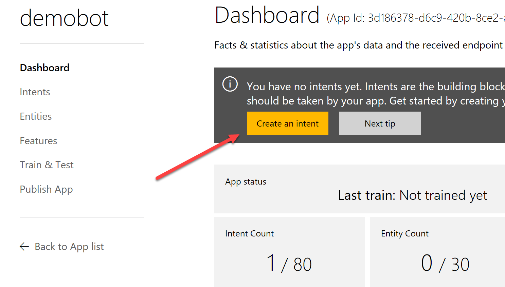
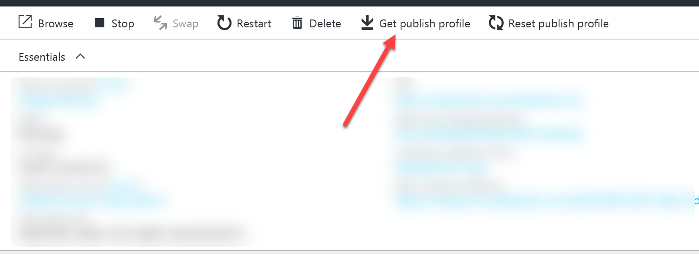

# Demo 1.3: Introduce Cognitive Services #
This demo should take about 10 minutes
## Objectives ##
The goal of this demonstration is to show the capabilities of a fully realized bot using the Microsoft Bot Framework and several coordinated Microsoft Cognitive services.

We will walk through a completed bot demonstrating the different ways it responds to users' requests using Natural Language recognition, Linguistic and Text Analysis and even a little spell checking for good measure.

The audience will get to know some of the advanced features of the Bot Framework along with getting a peak inside what makes it tick.  Along the way hopefully they will have some ideas of  **what** they can build too.

## Requirements ##
- Microsoft Visual Studio 2015
- Microsoft Bot Emulator
- An active Azure subscription.  If you don't have an account, you can create a free trial account in just a couple of minutes.  For details, see [http://azure.microsoft.com/pricing/free-trial/](http://azure.microsoft.com/pricing/free-trial/ "http://azure.microsoft.com/pricing/free-trial/").
- An Active Microsoft Account (MSA), often using an @outlook.com or @hotmail.com login id.

## Setup
Make sure to create your Azure account before the event.  You will need Azure to setup the Language Understanding Intelligent Service (LUIS)

-	Have Visual Studio 2015 open and the botdemo solution open.  For the demo, set the default project to be "Demo1.3"
-	Open the Bot Emulator

Setting up the demo will take a few minutes and require creating accounts and keys in Azure, Cognitive Services and LUIS.
### Language Understanding Intelligent Service ###
1.	Sign on to [http://luis.ai](http://luis.ai "http://luis.ai") with your MSA (can take a while to setup)
	- In LUIS we need to create **Intents** and **Entities**.  Basically an Entity is a parameter that will be passed to our bot while an Intent is a recognizable element that a message to our bot will be recognized and slotted into for notification to our bot.  For example we receive in our bot the intent to parse grammar.
3.	Click "New App" button.
	

4.	Fill in the name as “botdemo”  All other fields should be left as default.
5.	Click Create
	

4.	Click “Create an Intent” button
	

5.	Click “Add Intent” button
	

6.	Fill in the Intent name: *linguisticanalysis*
	- **Utterances** are just sentences entered that are representative of the input you will get in the bot that will define the intent.  The more utterances that are created up front the more accurate the training will be from the beginning.  But don't worry, it will learn as it goes from input provided by the people using your bot too.
7.	Add the first Utterance “Please tell me the grammar parts for a sentence.” and press "Enter"
	

8.	Add Utterance “What are the grammar parts in this sentence?” and press "Enter"
9.	Click "Save" button
	

9.	Click on the "Entities" side menu.
	

10.	Enter the name as "AnalyticsType
	

11.	Click on the "Intents" side menu again.
5.	Click “Add Intent” button
6.	Fill in the Intent name: *textanalytics*

	`Because there are more variations in this Intent, more seed utterances are recommended.`

7.	Add the first Utterance for this intent “What is the sentiment for this website” and press "Enter"
	

8.	You can see that the utterance has been added to the list.  It is likely that the word "url" is not highlighted in anyway.  You need to click on that word and select "AnalyticsType".
	

	`We are telling the utterance that something like "url" is an entity or parameter that will be sent to our bot.  We can use that parameter in our bot to decide if we want to analyze a sentence or a webpage.`

	
	
8.	Add Utterance “What is the feeling for this website?” and press "Enter".  
9.	Select the AnalyticsType Entity (URL)
8.	Add Utterance “What is the feeling for this webpage?” and press "Enter".  
9.	Select the AnalyticsType Entity (URL)
8.	Add Utterance “What is the feeling for this statement?” and press "Enter"
9.	Select the AnalyticsType Entity (statement) 
8.	Add Utterance “What is the sentiment for this sentence?” and press "Enter"
9.	Select the AnalyticsType Entity (sentence)
9.	Click "Save" button

	

9.	Click Publish App on the side menu

	

10.	Click “Add a new key to your account”
11.	Click “Buy Key on Azure”  - You must already have an active Azure Subscription.
12.	Add a LUIS key.  Copy the key.  Use the Free Subscription (demo 30 days)
12.	Click “Add a New Key”
13.	Paste the **subscription key**, copied from keys. (YOU WILL NEED THIS LATER)
14.	Return to “Publish App”
15.	Select Endpoint key created above.
16.	Click Train
17.	Click Publish
18.	Go to LUIS app dashboard.  Note the **App Id** (YOU WILL NEED IT LATER)
### Cognitive Services - Linguistic Analysis ##
1. Got to [https://www.microsoft.com/cognitive-services ](https://www.microsoft.com/cognitive-services  "https://www.microsoft.com/cognitive-services ") then click on “Get Started for Free” button
	

2. You can authenticate with a Microsoft Account, GitHub or LinkedIn.  We will use Microsoft Account
	

3. Click the Microsoft Account button and login.
    1. If this is your first time signing in, you will need to click the "Send email verification" button.
    1. Go to your email inbox and click on the verify link then click "Get started for free" from the verification confirmation
    3. OR you can Click "Subscribe to new free trial + button

		

2. Check the Linguistic Analysis - Preview checkbox
	

1. Check the “I agree” box
1. Click “Subscribe” (no need to add an Azure key now)
	

2. You will see the Tile for Linguistic Analysis - Preview
	1. Limited to 5,000 transactions per month, 2 per second.  Plenty for this demo.
	2. Click on the "Show" link to see one of the keys provided (YOU WILL NEED THIS LATER)
	

1. NOTE: If you want volume you will need to get a key from Azure just you did for the LUIS instructions above.
### Cognitive Services - Text Analytics ###
1. Continuing from the previous step, click the "Subscribe to new free trials" + button
2. Check the Text Analytics - Preview checkbox
1. Check the “I agree” box
1. Click “Subscribe” (no need to add an Azure key now)
2. You will see the Tile for Text Analytics - Preview
	1. Limited to 5,000 transactions per month.  Plenty for this demo.
	2. Click on the "Show" link to see one of the keys provided (YOU WILL NEED THIS LATER)
	

1. NOTE: If you want volume you will need to get a key from Azure just you did for the LUIS instructions above.

### Cognitive Services - Bing Spell Check ###
1. Continuing from the previous step, click the "Subscribe to new free trials" + button
2. Check the Text Bing Spell Check - Free checkbox
1. Check the “I agree” box
1. Click “Subscribe” (no need to add an Azure key now)
2. You will see the Tile for Bing Spell Check - Free
	1. Limited to 5,000 transactions per month, 7 per minute.  Plenty for this demo.
	2. Click on the "Show" link to see one of the keys provided (YOU WILL NEED THIS LATER)
	

1. NOTE: If you want volume you will need to get a key from Azure just you did for the LUIS instructions above.
### Azure - Web App ###
1. Go to portal.azure.net and logon using your MSA of choice.
1. Click on the App Services Blade
1. Click “Add”
	

1. Click “Web App” tile
	
	

1. Click Create
1. Give your Bot App a name.  It must be unique.  One suggested name is “BotDemo” + your initials.
1. Select your subscription
2. Use an existing Resource Group or create a new one.
1. Click Create
1. Once your App is up and running, you need to click on the “Get Publish Profile” and save it to a location you can get to from Visual Studio.  We’ll use that profile in Visual Studio.

	

### Register with the Bot Framework ###
1. Go to [http://dev.botframework.com](http://dev.botframework.com "http://dev.botframework.com")
2. Sign in with an MSA then click “Register a bot”
	
	

1. Give it a name, this is the name that will show up in Bot Directories should you publish the bot (which we will not be doing in this demo)
1. Give it a Bot Handle, used in the URL for your Bot.
1. Describe your bot.
1. The messaging endpoint is from your just created Azure Web App.  It will be based on the name of your Web App “https://BotDemo” + YourInitials + “.azurewebsites.net/api/messages”.  Make sure the YourInitials part is globally unique - perhaps add on the date in YYYYMMDD format if necessary.
	
	

1. Click “Create Microsoft App ID and password.  
	3. Make note of the App ID, you will need it in the Bot Creation Window (It helps if you use the same MSA for all your accounts, but it's not necessary)
	4. Click "Generate App Password to continue"
	5. Make note of the App Password.  You will not be able to retrieve it later and you need it in the Visual Studio project.
	
	

1. Enter the App Id from the above step into the spot provided in the bot profile
2. Click Register
	1. By default, the Web Chat and Skype channels are enabled.  We'll use the Web Chat later.
	2. Click on "Edit" for Web Chat
	3. Make a note of the Embed Code and One of the Secret Keys.  We'll combine those inside the Visual Studio demobot project.
	
	

### Adding Keys to Demo Bot ###
1. Open Visual Studio 2015
2. Copy the Demo1.3.zip file provided in the Solutions folder that goes with this session.
3. Extract it under your documents folder and open any files indicated below from the extracted version. 
2. Open default.htm and paste the embed code just above the </body> tag.
	
	

1. This will let you try your bot in a browser window
2. Open the AnalysisDialog.cs class file
	1. find the `[LuisModel("", "")` and replace with your App Id and subscription key from your LUIS setup above.
	2. find the "AnalyzeSpeechParts() method.
	3. Add your key from the Linguistic Analytics section acquired above.
		`client.DefaultRequestHeaders.Add("Ocp-Apim-Subscription-Key", "COPY-KEY-HERE");`
	4. find the AnalyzeText() method
	5. Add your key from the Text Analysis section acquired above.
		`client.DefaultRequestHeaders.Add("Ocp-Apim-Subscription-Key", "COPY-KEY-HERE");`
2. Open the "/Utils/SpellChecker.cs" file
	1. find the "CorrectSpelling()" method
	2. Add your key from the Bing Spell Check section acquired above.
		`client.DefaultRequestHeaders.Add("Ocp-Apim-Subscription-Key", "COPY-KEY-HERE");`
1. Right click on the bot project name and click “Publish…”
1. Click Import and import the publishing profile saved earlier. (Under Azure - Web App section)
1. Click Publish
1. A web page should open that lets you try your bot.

## Demo Steps ##
### Show LUIS ###
The first thing we want to do is show off LUIS and explain how Language Understanding plays a part in bots.

1.	Go to [http://luis.ai](http://luis.ai "http://luis.ai")
2.	Sign In if necessary using the same account you used when setting up
3.	Click on the "Demo1.3" App.

	> Looking at the dashboard we can see intent count.
	> 
	> **Intents** are the distilled meaning of sentences or utterances passed to LUIS for understanding.  LUIS will analyse the provided language and decide what the intent of that language is.  It will then pass that information to the bot.
	
	> **Entities** are parameters that get passed to the bot.  In our example we'll recognize if the person wants to analyze a sentence or a webpage.

4.	You begin on the Dashboard.  

	>Explain that some facts and statistics are presented for your inspection so you can know how your LUIS app is being used.
	>
	>Endpoints Hits Per Period tells us what kind of traffic we are getting while "Intent Breakdown" shows which intents being recognized the most.  Both graphs give us actionable information.  If we are getting lots of traffic we can make sure we tune our service level to best help out those people.  If one intent seems to be getting the most hits then we know that perhaps that specific intent requires more of our intention to provide the best response.  A lot of nones will also tell us if people are not getting our bot's purpose or perhaps we have to do more LUIS training.
	>
	>The default intent that all bots get is the "none" intent.  This is basically a catch-all for statements that are not recognized as belonging to any of the intents we created.
	

5.	The Intent Breakdown graph shows which intents are the most popular.  
	

6.	The Endpoint Hits graph shows how many times LUIS is handing a question or sentence from you bot.  This is an easy way to see how popular your bot might be.
	

7.	Now click on the Intents side menu to show the list of intents.  

	>Explain that this shows the intents that will be resolved and how many utterances they each have.  The higher the utterance count (both from you and users of your bot) the better it is able to understand the language.\
	
	

8.	Now click on the linguisticanalysis intent

	>You can now see the utterances that have been analyzed.  You will probably not have too many but that number will grow with use.
	
10.	Click on the Entities side menu to show entities.  Explain that they are the equivalent of parameters to your bot.
11.	Click on the "Train and Test" side menu to demonstrate LUIS.
12.	Click the "Train Application" button.  Explain that this allows LUIS to teach itself how to better figure out your intents based on input from you and also input from your bot.  It won't take long.
	

13.	Once trained you can try it out.  Type "Please tell me the grammar for this sentence" in the "Type a test utterance & press Enter" area and hit Enter.
	

14.	Note that the test shows the Entity was correctly identified and so was the Intent (on the right).  LUIS is ready.
	

### Show the Bot ###
1.	Open Visual Studio 2015 with the "Demo-1-3.sln" solution open.
2.	Run the Bot Application.
3.	Switch to the Bot Emulator and connect to your Bot (http://localhost:3979/api/messages)
	

4.	Type a simple request.  "Please check the grammar of this sentence"
5.	Note that the bot figured out your intent and has come back to ask you for the sentence you want analyzed.  On the right in the log, you can point out that the emulator lets you know how things are going.
	

6.	Try replying with "Today is a beautiful day to code" or anything that pleases you.

	> The reply shows the break down of the sentence using the Cognitive Service "Linguistic Analysis".  The Linquistic Analysis service can break down sentences into their language and grammatical components.  In this case there are five different grammatical constructs and we rate how many are present.  Linguistic Analysis can do much more, but this is a good start.
	
	

8.	Now we want to try out some of the other Cognitive Services.  Try asking "What is the sentiment for this sentence?"
	

9.	The response indicated that we LUIS correctly figured out the intent AND the AnalysisType of "sentence".
10.	Give it a sentence to Analyze for sentiment: "Today is a great day to write code"
	

11.	The bot, using Text Analysis is able to look at the natural language and figure out the tone or sentiment of the sentence.
	
	> The Bot Framework provides for many different ways of replying to input.  We have seen simple text replies up to now but in response to a request for sentiment, Cognitive Services gives us that sentiment, we then analyze the positiveness and provide an image along with the analysis.  The Bot Framework provides many different kinds of cards and rich text formatting fo replies.

	> You can return data in a rich format if you like including web links and images.
	
9.	We'll try one more before we conclude to demonstrate one more useful Cognitive Service.  The ability to spell check input.  Try entering again "Please check the grammar of this sentence."
10.	Now enter the sentence to analyze as (this deliberately mis-typed sentence) "Today is a drk and raney day.  We should code som more.".  Note all the spelling errors.
	

	> Note that the Bot used Bing Spell Checker, a Cognitive Service, to fix our horrible spelling and then continue on to do Linguistic Analysis on the corrected sentence.  We've now shown three different Cognitive Services enhancing the intelligence of our bot.
	
