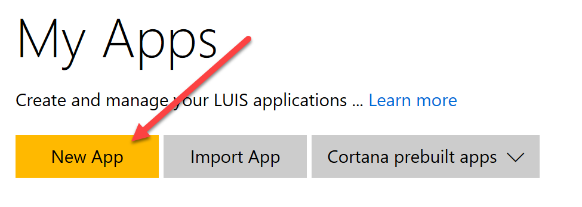

# Demo 2.2: Cognitive Services - LUIS #
This demo should take about 6 minutes
## Objectives ##
The goal of this demo is to know how to create a Microsoft Cognitive Services - Language Understanding Intelligent Service (LUIS) app for use with the Microsoft Bot Framework.  The audience, at the conclusion of the demo, will have an understanding of how to build a natural language processor for use by their bot.

In this demo, we will add all the information to allow us to recognize one type of question, an intent.

## Requirements ##
- An active Azure subscription.  If you don't have an account, you can create a free trial account in just a couple of minutes.  For details, see [http://azure.microsoft.com/pricing/free-trial/](http://azure.microsoft.com/pricing/free-trial/ "http://azure.microsoft.com/pricing/free-trial/")
- An Active Microsoft Account (MSA), often using an @outlook.com or @hotmail.com login id
- An Active Internet connection

## Setup
- Open [http://luis.ai](http://luis.ai "http://luis.ai") website
- Login as the Microsoft Account from requirements

	> The demonstration goes smoother if Azure account login id is the same as the one you will use for luis.ai.  During the demo you will be required to retrieve an Cognitive Services key from Azure. 

## Demo Steps ##
### Setting up and Training LUIS ###
1.	Open a browser already at the [http://luis.ai](http://luis.ai "http://luis.ai") website.
2.	Make sure you are already signed on to the luis.ai website.
	1.	Sign on to [http://luis.ai](http://luis.ai "http://luis.ai") with your MSA (can take a while to setup)
		> In LUIS we need to create **Intents** and **Entities**.  Basically an Entity is a parameter that will be passed to our bot while an **Intent** is a LUIS trying to figure out what we are trying to do.  For example we receive in our bot the intent to parse grammar.

		> There is one intent included by default.  The none intent is included with every LUIS App and is used whenever no other intent is likely.

		> For this demonstration we will focus strictly on building our first intent.  We won't be demonstrating Entities.
3.	Click My Apps Button
4.	Click "New App" button.
	

4.	Fill in the name as “botdemo”  All other fields should be left as default.
5.	Click Create
	

4.	Click “Create an Intent” button
	

5.	Click “Add Intent” button
	

6.	Fill in the Intent name: *linguisticanalysis*
	> **Utterances** are just sentences entered that are representative of the input you will get in the bot that will define the intent.  The more utterances that are created up front the more accurate the training will be from the beginning.  But don't worry, it will learn as it goes from input provided by the people using your bot too.
7.	Add the first Utterance “Please tell me the grammar parts for a sentence.” and press "Enter"
	

8.	Add Utterance “What are the grammar parts in this sentence?” and press "Enter"
9.	Click "Save" button
	

9.	Click Publish App on the side menu
	

10.	Click “Add a new key to your account”
11.	Click “Buy Key on Azure”  - You must already have an active Azure Subscription.
	> The key itself does not cost you anything to aquire, depending on the subscription you choose.  There are free subscriptions available when trying the service out.
							
12.	Enter a name for this account.  **demobot** will work.
13.	The Subscription should be pre-selected if you have an active Azure subscription.
13.	The API Type of LUIS is already filled in for you.
14.	You will need to select a pricing tier.  The demo tier of F0 - Free is available for first time developers and allows 10,000 calls per month and 5 calls per second.
15.	Choose a resource group.  You can use an existing one or create a new group.
	

16.	Click Create
17.	Open the Cognitive Services Account "demobot"
18.	Click on "Keys"	
	

19.	Copy "Key 1" to the clipboard for use in your LUIS App definition.
20.	Return to the "My Keys" area and Click "Add a new Key"
21.	Paste the **subscription key**, copied from keys. (YOU WILL NEED THIS AGAIN LATER)
22.	Return to “Publish App”
23.	Select subscription key created above.
24.	Click Train
25.	Click Publish
	

	> 1. There are a few pieces of information you want to remember depending on how you will be calling LUIS.  
	> 2. From within the Bot Framework, you can create a LuisDialog type dialog where you will need the App Id and Subscription Key outlined above.  The App Id can be seen as a GUID in the Endpoint URL or you can go to the LUIS app dashboard.
	> 3. Using REST services to call LUIS you will need the Endpoint URL shown in the image above.  That URL already contains both the App Id and the Subscription Key.
	> 4. You can test the REST service by clicking on the Enpoint URL then adding your own query to the "q=" part of the URL provided.  In this way you can see the real result of utterances fed into LUIS.