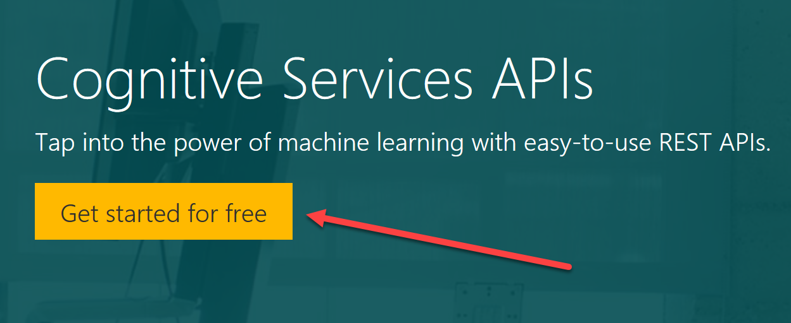
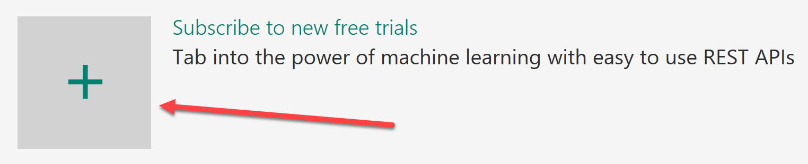
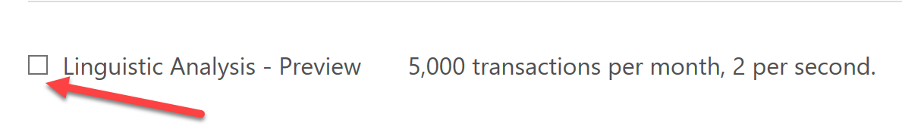
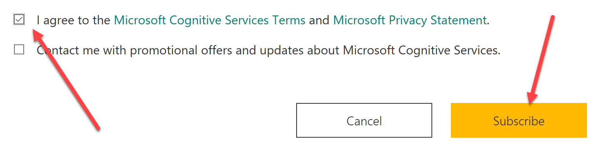
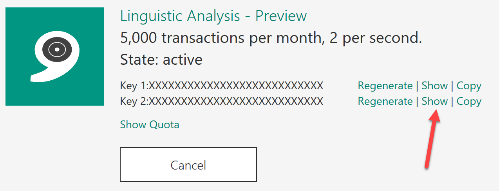

# Demo 2.3: Cognitive Services - Linguistic Analysis #
This demo should take about 6 minutes
## Objectives ##
The goal of this demonstration is to help the audience become familiar with Microsoft Cognitive Services.  The audience will become familiar with the cognitive service discussed here, Linguistic Analysis.  They should know where to find Cognitive Services and how to choose the services to be used.

We will not be coding in this session but rather walking through existing code.

## Requirements ##
- Microsoft Visual Studio 2015
- Microsoft Bot Emulator
- An active Azure subscription.  If you don't have an account, you can create a free trial account in just a couple of minutes.  For details, see [http://azure.microsoft.com/pricing/free-trial/](http://azure.microsoft.com/pricing/free-trial/ "http://azure.microsoft.com/pricing/free-trial/").
- An Active Microsoft Account (MSA), often using an @outlook.com or @hotmail.com login id.
## Setup
2. Copy the Demo2.3.zip file provided in the Solutions folder that goes with this session.
3. Extract it under your documents folder and open any files indicated from the extracted version. 
4. Open the project in Visual Studio so as to be ready for the demonstration.
5. Add Keys for demo purposes.
	1.	In the AnalysisDialog.cs file:
		1.	 you need to get a LUIS Subscription Key and LUIS Model ID (GUID) from the Luis.ai page.  You will have these keys if you have run the Demo1.3 in session 1.  Look for "COPY-LUIS-MODEL-ID" and "COPY-SUBSCRIPTION-KEY"
		2. In the AnalyzeSpeechParts() method, replace the "COPY-KEY-HERE" with the Key from Linguistic Analysis.
	1. In the SpellChecker.cs file:
		1. add a key for the Ocp-Apim-SubscriptionKey for Bing Spell Check from Cognitive Services.
5. Open the Bot Emulator ready to connect

## Demo Steps ##
### Cognitive Services - Linguistic Analysis ##
1. Got to [https://aka.ms/cognitive-services ](https://aka.ms/cognitive-services  "https://aka.ms/cognitive-services ") then click on “Get Started for Free” button
	

2. You can authenticate with a Microsoft Account, GitHub or LinkedIn.  We will use Microsoft Account **(Optional Step, if not alreadly logged in)**
	

3. Click the Microsoft Account button and login.
    1. If this is your first time signing in, you will need to click the "Send email verification" button.
    1. Go to your email inbox and click on the verify link then click "Get started for free" from the verification confirmation
    3. OR you can Click "Subscribe to new free trial + button

		

2. Check the Linguistic Analysis - Preview checkbox
	

1. Check the “I agree” box
1. Click “Subscribe” (no need to add an Azure key now)
	

2. You will see the Tile for Linguistic Analysis - Preview
	1. Limited to 5,000 transactions per month, 2 per second.  Plenty for this demo.
	2. Click on the "Show" link to see one of the keys provided (YOU WILL NEED THIS LATER)
	

	> NOTE: If you want volume you will need to get a key from Azure just you did for the LUIS instructions above.

	> All Cognitic Services return results from their REST services as JSON files.  Many of them also accept JSON as request bodies also.  You can see the exact JSON files by reviewing the API descriptions for each of the Cognitive services we will discuss here.

	> All the Documentation is available here: [https://www.microsoft.com/cognitive-services/en-us/documentation](https://www.microsoft.com/cognitive-services/en-us/documentation "https://www.microsoft.com/cognitive-services/en-us/documentation").  The API documentation for each of the services shows the details of what can be done.  For example for the [Linguistic API](https://westus.dev.cognitive.microsoft.com/docs/services/56ea598f778daf01942505ff/operations/56ea5a1cca73071fd4b102bb "Linguistic API"), you can **Analyze text** in several different ways gettng the results back as JSON.
1.	Open Visual Studio 2015 and the Demo2.3.sln solution
2.	Expand the "Model" folder in the project and open both the LinguisticRequest.cs and LinguisticResponse.cs one at a time to show the Json to C# Class created to interact with the Linguistic Analysis web service.
3.	Start with the MessagesController class and show how the post feeds LUIS into our dialog.
4.	Go to the "LuisIntent("")" intent method and review the entry point.
4.	Open the "AnalysisDialog.cs" and go to the "AnalyzeSpeechParts()" method to review how to call the Cognitive Service.
2. In the AnalyzeSpeechParts() method, replace the "COPY-KEY-HERE" with the Key from Linguistic Analysis.
	
	> Note that we need to add our secret key to the Request Header (noted above) and then we need to create a request body using the LinguisticRequest class.  There are three different types of analysis that can be performed by selecting different text analyzers.  There are listed in the [Linguistic API documentation](https://westus.dev.cognitive.microsoft.com/docs/services/56ea598f778daf01942505ff/operations/56ea59bfca73071fd4b102ba "Linguistic API documentation"))).  You can request **Parts of Speech (POS)**, **Tokens, or grammatical parts** and **constituency tree** which shows you the full structure.  In our we focus on just the POS.

2.	Start the Project
1.  Let's see it in action.  Open the Bot Emulator
2.  Enter the question "Please check the grammar of a sentence."
3.  When prompted enter "Helo, how ar you, wht is yor name?"

	> Notice that it corrects the spelling and then does the analysis on your fixed sentence. So you can see where the Linguistic Analysis comes in.  Also you can see how combining cognitive services makes them better.
	>
	> Let's look at the code.

