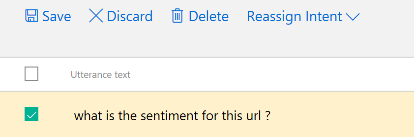

# Demo 2.4: Combining Cognitive Services #
This demo should take about 6 minutes
## Objectives ##
The goal of this demo is to delve more deeply into LUIS by explorer the effects of multiple Intents. We will be looking at the Language Understanding Intelligent Service (LUIS).

## Requirements ##
- An active Azure subscription.  If you don't have an account, you can create a free trial account in just a couple of minutes.  For details, see [http://azure.microsoft.com/pricing/free-trial/](http://azure.microsoft.com/pricing/free-trial/ "http://azure.microsoft.com/pricing/free-trial/")
- An Active Microsoft Account (MSA), often using an @outlook.com or @hotmail.com login id
- An Active Internet connection

## Setup
1. Open [http://luis.ai](http://luis.ai "http://luis.ai") website
2. Login as the Microsoft Account from requirements
2. Copy the Demo2.4.zip file provided in the Solutions folder that goes with this session.
3. Extract it under your documents folder and open any files when indicated below from the extracted version. 
4. Open the project in Visual Studio so as to be ready for the demonstration.
5. Open the Bot Emulator in preparation for the demonstration.
5. Add Keys for demo purposes.
	1.	In the AnalysisDialog.cs file:
		1.	 you need to get a LUIS Subscription Key and LUIS Model ID (GUID) from the Luis.ai page.  You will have these keys if you have run the Demo1.3 in session 1.  Look for "COPY-LUIS-MODEL-ID" and "COPY-SUBSCRIPTION-KEY"
		2. In the AnalyzeSpeechParts() method, replace the "COPY-KEY-HERE" with the Key from Linguistic Analysis.
		3. In the AnalyzeText() method, replace the "COPY-KEY-HERE" with the key from the Text Analytics Cognitive Service.
	1. In the SpellChecker.cs file:
		1. add a key for the Ocp-Apim-SubscriptionKey for Bing Spell Check from Cognitive Services.
5. Open the Bot Emulator ready to connect

## Demo Steps ##
### Back to LUIS ###
9.	Open [http://luis.ai](http://luis.ai "http://luis.ai") website
10.	Login if necessary with the MSA for your LUIS account
11.	Click on the **demobot** app previously created.	 
11.	Click on the "Intents" side menu again.

	> Adding another intent lets us get more flexible in handling requests.  We already handle Linguistic Analysis type requests or intents and now we want to do the same thing for Text Analytics.  We do it like the following
	
5.	Click “Add Intent” button
6.	Fill in the Intent name: *textanalytics*

	`Because there are more variations in this Intent, more seed utterances are recommended.`

7.	Add the first Utterance for this intent “What is the sentiment for this statement” and press "Enter"
	

8.	You can see that the utterance has been added to the list.
8.	Add Utterance “What is the sentiment for this sentence?” and press "Enter"
9.	Click "Save" button
	

15. Click on Train & Test on the side menu
16.	Click Train

	> Training and Iteration are key to the success of LUIS.  You need to add a couple of utterances to each intent to help it learn.  This will help catch most of the intents, however, you will learn quickly that human language is very complex and there are many ways to convey messages.  LUIS provides a way for you to see what sort of information is being fed into LUIS and for you to offer your human intelligence in guiding LUIS in it's learning.  You can confirm LUIS' decisions or correct them.  You can help clarify content of entities.  All you need do is re-train and LUIS is just a little bit smarter.  

17. Try out the new intent by entering in the space labelled "Type a test utterance & press Enter", "What is the sentiment for a statement?"
9.	Click Publish App on the side menu
	

17.	Click Publish

	> Typically you would add some simple conversational intents like "help" or "hello" which you would then respond to in your bot usually to provide a greeting or some sort of information on what your bot is capable of.

18.	Open the Demo2.4 Project in Visual Studio 2015
19.	Start the project
20.	Open the Bot Emulator and connect to http://localhost:3979/api/messsages
21.	Ask "What is the sentiment for a statement?"
22.	When asked enter "Hello, it's an ok day" press enter.

	> Note that the bot returns the sentiment analysis.  The LUIS intent was correctly identified and it did not go to grammar checking.

19.	Open the AnalysisDialog.cs file
20.	Find the "TextAnalytics" routine

	> Note how the LuisIntent is identied in the LuisDialog.