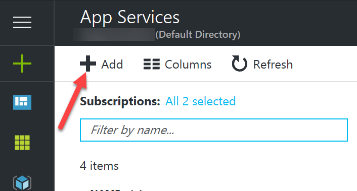
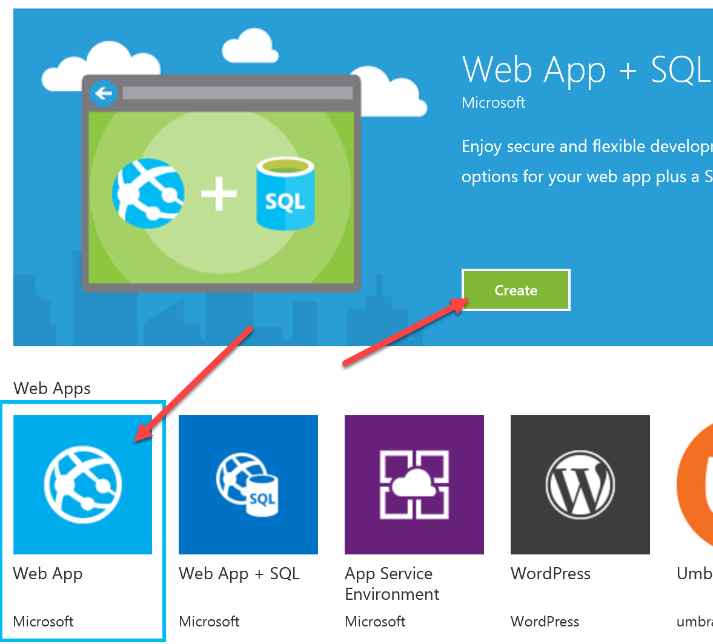
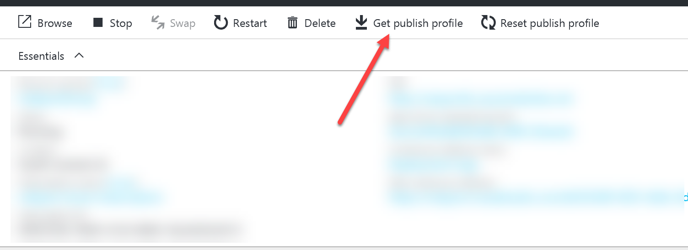
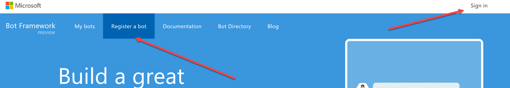
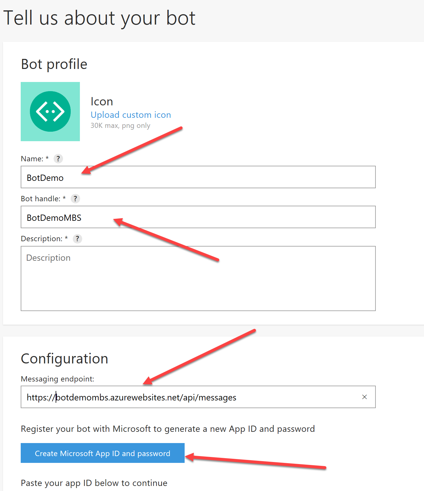
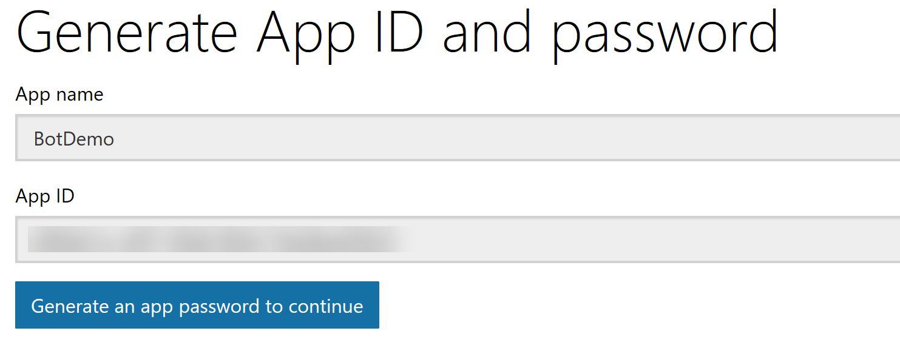
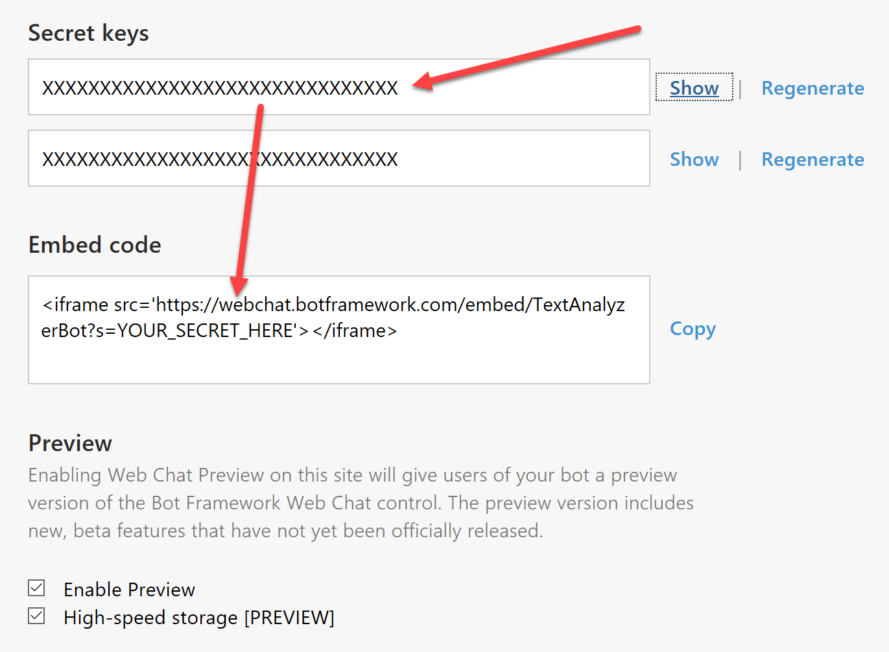
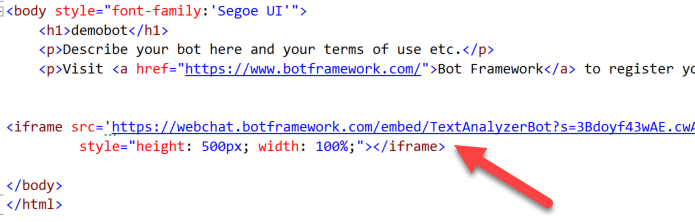

# Demo 2.5: Publishing the Bot to the cloud #
This demo should take about 6 minutes
## Objectives ##
The goal of this demo is to show the audience how to publish their fabulous app to the internet and then discuss different channel options (Skype, messenger, etc...)

## Requirements ##
- Microsoft Visual Studio 2015
- An active Azure subscription.  If you don't have an account, you can create a free trial account in just a couple of minutes.  For details, see [http://azure.microsoft.com/pricing/free-trial/](http://azure.microsoft.com/pricing/free-trial/ "http://azure.microsoft.com/pricing/free-trial/").
- An Active Microsoft Account (MSA), often using an @outlook.com or @hotmail.com login id.

## Setup
2. Copy the Demo2.5.zip file provided in the Solutions folder that goes with this session.
3. Extract it under your documents folder and open any files indicated from the extracted version. 

1. Before beginning your presentation, you need to open the Demo2.5.sln solution file and add key values to LUIS and the Cognitive Service REST calls.  You can find the keys on your Cognitive Services Account page. [https://www.microsoft.com/cognitive-services/en-US/subscriptions](https://www.microsoft.com/cognitive-services/en-US/subscriptions)
2. Open the AnalysisDialog.cs class file
	1. find the `[LuisModel("COPY-LUIS-MODEL-ID", "COPY-LUIS-SUBSCRIPTION-KEY")` and replace with your App Id and subscription key from your LUIS setup.
	2. find the "AnalyzeSpeechParts() method.
	3. Add your key from the Linguistic Analytics section acquired above.
		`client.DefaultRequestHeaders.Add("Ocp-Apim-Subscription-Key", "COPY-KEY-HERE");`
	4. find the AnalyzeText() method
	5. Add your key from the Text Analysis section acquired above.
		`client.DefaultRequestHeaders.Add("Ocp-Apim-Subscription-Key", "COPY-KEY-HERE");`
2. Open the "/Utils/SpellChecker.cs" file
	1. find the "CorrectSpelling()" method
	2. Add your key from the Bing Spell Check section acquired above.
		`client.DefaultRequestHeaders.Add("Ocp-Apim-Subscription-Key", "COPY-KEY-HERE");`

## Demo Steps ##
### Azure - Web App ###
> Its time to publish the bot on the internet.  To start off we need a place to put the bot.  We will use Microsoft Azure which is really easy for hosting a bot.

1. Go to [http://portal.azure.net](http://portal.azure.net "http://portal.azure.com") and login using your MSA of choice.
1. Click on the App Services Blade
1. Click “Add”
	

1. Click “Web App” tile
	
	

1. Click Create
1. Give your Bot App a name.  It must be unique.  One suggested name is “BotDemo” + your initials.
1. Select your subscription
2. Use an existing Resource Group or create a new one.
1. Click Create
1. Once your App is up and running, you need to click on the “Get Publish Profile” and save it to a location you can get to from Visual Studio.  We’ll use that profile in Visual Studio.

	

	> The publish profile makes it really easy to deploy to the Azure Web Service.  You don't have to remember anything then.
	
### Register with the Bot Framework ###
> The bot framework lets us connect the bot up to different channels like Skype or the Web Chat channel.  There are about 9 others.

1. Go to [http://dev.botframework.com](http://dev.botframework.com "http://dev.botframework.com")
2. Sign in with an MSA then click “Register a bot”
	
	

1. Give it a name, 

	>this is the name that will show up in Bot Directories should you publish the bot (we will not be doing so in this demo)
	
1. Give it a Bot Handle, used in the URL for your Bot.
1. Describe your bot.
1. The messaging endpoint is from your just created Azure Web App.  It will be based on the name of your Web App “https://BotDemo” + YourInitials + “.azurewebsites.net/api/messages”.
	
	

	> The endpoint must always be using SSL (HTTPS).  It needs to be unique to Azure also.

1. Click “Create Microsoft App ID and password.  
	3. Make note of the App ID, you will need it in the Bot Creation Window (It helps if you use the same MSA for all your accounts, but it's not necessary)
	4. Click "Generate App Password to continue"
	5. Make note of the App Password.  You will not be able to retrieve it later and you need it in the Visual Studio project.
	
	

1. Enter the App Id from the above step into the spot provided in the bot profile
2. Click Register
	1. By default, the Web Chat and Skype channels are enabled.  We'll use the Web Chat later.
	2. Click on "Edit" for Web Chat
	3. Make a note of the Embed Code and One of the Secret Keys.  We'll combine those inside the Visual Studio demobot project.
	
	

### Adding Keys to Demo Bot in Azure ###
1. Go back to the Azure Web Service and click on Application Settings
2. Scroll down until you see App Settings
3. You need to add two new settings:
	1. MicrosoftAppId and the value is the App Id acquired above.
	2. MicrosoftAppPassword and the value is the Password recorded above.
1. Press Save Button to save the App Settings.

	> When you put values into Azure's Application Settings, The bot will automatically replace the value in the Web.Config file (very exposed) with the values in Azure (much more secure).

1. Open Visual Studio 2015
2. Open the Demo2.5.sln solution
2. Open default.htm and first paste the embed code just above the </body> tag.
3. Then paste the secret key you saved above into the space indicated. `(s="")`
	
	

1. Right click on the bot project name and click “Publish…”
1. Click Import and import the publishing profile saved earlier. (Under Azure - Web App section)
1. Click Publish
1. A web page should open that lets you try your bot.

