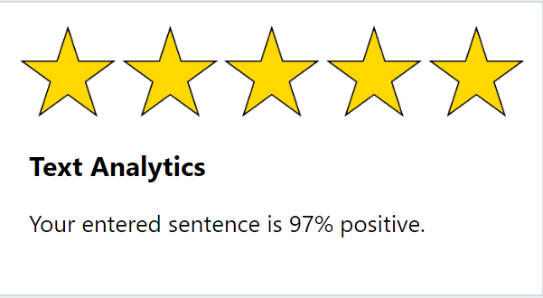

# Demo 1.1: Audience Participation #
This demo should take about 6 minutes
## Objectives ##
The goal is to make sure the audience understands channels and how they work in the Microsoft Bot Framework.  We also want to build some formatting into the language bot we have created so that we don't just send plain text all the time.

## Requirements ##
2. Copy the Demo2.6.zip file provided in the Solutions folder that goes with this session.
3. Extract it under your documents folder and open any files indicated from the extracted version. 

## Setup
1. Open Visual Studio 2015
2. Open the "Demo2.6.before.sln" solution.
3. Open the Bot Emulator
2. Open the AnalysisDialog.cs class file
	1. find the `[LuisModel("COPY-LUIS-MODEL-ID", "COPY-LUIS-SUBSCRIPTION-KEY")` and replace with your App Id and subscription key from your LUIS setup.
	2. find the "AnalyzeSpeechParts() method.
	3. Add your key from the Linguistic Analytics section acquired above.
		`client.DefaultRequestHeaders.Add("Ocp-Apim-Subscription-Key", "COPY-KEY-HERE");`
	4. find the AnalyzeText() method
	5. Add your key from the Text Analysis section acquired above.
		`client.DefaultRequestHeaders.Add("Ocp-Apim-Subscription-Key", "COPY-KEY-HERE");`
2. Open the "/Utils/SpellChecker.cs" file
	1. find the "CorrectSpelling()" method
	2. Add your key from the Bing Spell Check section acquired above.
		`client.DefaultRequestHeaders.Add("Ocp-Apim-Subscription-Key", "COPY-KEY-HERE");`

## Demo Steps ##
### Channels ###
1.	Open the [http://dev.botframework.com](http://dev.botframework.com) web site.
2.	Click on My Bots (You may be required to logon with your Microsoft Account used previously)
3.	Scroll down to see Channels

	> Channels lets you publish your bot to multiple places without having to rewrite your bot.  Some features will appear different on different channels for the most part because of the style of a particular channel or that feature is inappropriate for the channel.
	>  
	>  There are currently 11 channels available to you.  By default you have the Skype and Web Chat channels available to you.  However, unless you turn on "Publish" they will not be publically available.  You can continue to test your bot in private though.
### More Formatting ###
We have an existing bot that does some nice things with Cognitive Services, but it only replies in plain text.  We want to enhance that using cards and images and a little text formatting.  TO do this we'll use an existing project that we just want to fix up a bit.

1.	Open Visual Studio
3.	Expand the "Assets" folder to view images we have provided

	> The Assets folder contains simple "star rating" images from one to five stars.  We'll use them in our bot when replying to a request to provide the intent

4.	Run the Bot
5.	Open the Bot Emulator and connect to the bot.
6.	First ask `Please tell me the sentiment of this sentence`
7.	When prompted enter "It's a happy day!"
8.	Notice that we get a simple text reply back.

	> Your entered sentence is 97% positive.
	
	> We want to make that look a whole bunch nicer.
5.	Open the AnalyticsDialog.cs file
5.	Go to the "AnalyzeText()" method

	> We first need to add the simple code for displaying the images, then we'll see about doing some formatting updates to this text.  Near the bottom of the method is some commented code that will create a HeroCard.  You can add multiple cards to any message and display them as a list or in carousel.  There are several different types of cards including:
	> 
	> 	- AnimationCard - Can play Gifs or short videos
	> 	- AudioCard - Can play audio files
	> 	- HeroCard - Has a large image, title, text and action buttons (links)
	> 	- ThumbnailCard - Like the HeroCard but a smaller image
	> 	- ReceiptCard - Contains a receipt for purchases
	> 	- SigninCard - Sign in card for services
	> 	- VideoCard - Can play video files
6.	Uncomment the HeroCard code.
7.	We'll leave in the existing message for use later.

	> message.Text = $"Your entered sentence is {Math.Truncate(textAnalyticsResponse.documents[0].score * 100)}% positive.";
4.	Run the Bot
5.	Open the Bot Emulator and connect to the bot.
6.	First ask `Please tell me the sentiment of this sentence`
7.	When prompted enter "It's a happy day!"

	
	> Next, lets add a bit of formatting to the text using markdown.  We'll make the % score bolded.

8.	In the code wrap the part of the string shown below with "**{Math... %**"
9.	Add a URL to the end of the line:
	> [http://portal.azure.net](http://portal.azure.net "http://portal.azure.com")
	> message.Text = $"Your entered sentence is **{Math.Truncate(textAnalyticsResponse.documents[0].score * 100)}%** positive.";

9.	Next we'll add a link to the Text Analytics page for Microsoft Cognitive Services.  Add the following lines immediately after `responseCard.Title = "Text Analytics"`

                responseCard.Buttons = new List<CardAction>
                {
                    new CardAction(
                        ActionTypes.OpenUrl,
                        "Go to Cognitive Services",
                        value: "https://www.microsoft.com/cognitive-services/en-us/text-analytics-api")
                };

 	

