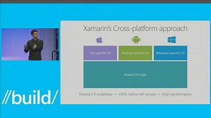

# Mobile Application Development #

Explore the sub-folders to find community-ready presentation materials on the following topics:

- [Xamarin](Devops/README.md)
- [Cordova](Cordova/README.md)

**Introduction**

Smartphone and tablet users love the rich experience of native mobile apps compared to mobile websites, but for you, the developer, maintaining distinct environments can be a nightmare. To preserve user choice and flexibility, your app has to run across iOS, Android, and Windows devices, while taking advantage of the unique characteristics of each platform. Developing three different versions of your code base in multiple languages is a veritable headache, and don’t get us started on responding to OS updates and introducing constant new SDK features. Throw in testing, security, user customization, and more, and you’ve got yourself a roaring migraine!

***Develop one code base for multiple mobile platforms.*** Multiplatform mobile application development environments like [Xamarin](https://www.xamarin.com/) and [Cordova](http://cordova.apache.org/) provide the cure to your dilemma, enabling you to streamline mobile app development across iOS, Android, and Windows platforms. While their coding environment differs—Xamarin uses C\# and Cordova leverages HTML, CSS and JavaScript—both let you create a shared code base with the same IDE, language and APIs, while delivering a fully native experience across mobile devices.

***Elevate your app***. You can link your mobile app to backend cloud storage and extend application functionality. With [Azure's built-in mobile features](https://azure.microsoft.com/en-us/services/app-service/mobile/), you can readily add capabilities like app data storage in the cloud or on-premises, user authentication, push notifications, social integrations, and more—enriching your app while minimizing your dev cycle churn.

***Bring mobile DevOps to your app lifecycle.*** By applying mobile DevOps practices to your development lifecycle, you can efficiently develop and deliver quality applications with confidence. With [Visual Studio Mobile Center](https://www.visualstudio.com/vs/mobile-center/) you can enhance and automate your development process with features such as continuous integration, analytics, crash reporting, and beta distribution. Mobile Center also enables automated testing of your app on thousands of *actual* mobile devices connected to the cloud —a far preferable alternative to having a test lab (or two) filled floor to ceiling with devices to test manually, or having your support team inundated with customer complaints!

Want to learn more? Below we share some key learnings and resources we’ve developed over the past year to help address the opportunities—and challenges—of mobile application development. We’ve featured Xamarin as the multiplatform mobile application environment, although many of the concepts can be applied to other multiplatform development solutions as well.

**Getting Started**

Creating mobile apps is different from developing traditional web or desktop apps. Smaller form factors, limited power consumption, memory and processing constraints, differing device capabilities—all these and more must be taken into account as you design and develop your mobile app. Check out this [Introduction to the Mobile Software Development Lifecycle](https://developer.xamarin.com/guides/cross-platform/getting_started/introduction_to_mobile_sdlc/) to help chart your mobile app development journey through *inspiration*, *design*, *development*, *stabilization*, *deployment*, and *maintenance*.

**Learn the fundamentals**

***Develop one base for multiple mobile platforms.***

Ready to explore the basics of creating a shared, yet optimized, multiplatform mobile code base?

-   Read about the [Anatomy of A Native Mobile App](http://cdn1.xamarin.com/webimages/assets/Xamarin-White-Paper-Anatomy-of-a-Native-Mobile-App.pdf).

-   Check out this overview of [Xamarin Studio’s](https://developer.xamarin.com/guides/cross-platform/xamarin-studio/) integrated development environment.

-   Get ready to [Take Your Team Mobile with Xamarin](http://cdn1.xamarin.com/webimages/assets/Xamarin-Guide-Take-Your-Team-Mobile-with-Xamarin.pdf).

There’s also free training available:

-   Xamarin University’s [self-guided learning](https://university.xamarin.com/classes/track/self-guided).

-   Microsoft Virtual Academy’s course on [Xamarin for Absolute Beginners](https://mva.microsoft.com/en-us/training-courses/xamarin-for-absolute-beginners-16182?l=fPHWqptJC_5705846048).

Want more? Kick back and watch this presentation by Xamarin co-founder Miguel de Icaza.

***Elevate your app.***

Now, take your mobile application development to the next level! Watch [this short video](https://azure.microsoft.com/en-us/resources/videos/develop-connected-apps-using-azure-and-xamarin/) to see how you can use Microsoft Azure, Visual Studio, and Xamarin to add rich functionality to your mobile apps, including data analytics and storage, security, traffic monitoring, user authentication, and notification management—we even provide [quickstart code](https://github.com/Microsoft/XamarinAzure_ShoppingDemoApp) to speed your development!

Want to dive a little deeper? Check out our [Building Mobile Apps on Azure](https://azure.microsoft.com/en-gb/solutions/mobile/) webinar for more details on how to leverage Azure features to deliver innovative, tailored mobile apps.

***Bring mobile DevOps to your app lifecycle.***

Rest assured—that’s what applying proven DevOps practices to your mobile app development will enable you to do. Using continuous integration, automated testing, distribution, and feedback capabilities as you develop your mobile app will enable you to reduce time-to-market and increase application reliability. [Visual Studio Mobile Center](https://www.visualstudio.com/vs/mobile-center/) integrates with your mobile application development environment, enabling you to optimize, test, and deploy your mobile apps with confidence.

Intrigued about mobile DevOps?

-   Read about our [Mobile DevOps Solution](https://www.xamarin.com/mobile-devops).

-   Check out our [Mobile DevOps Overview whitepaper](https://s3.amazonaws.com/data.xamarin.com-uploads/resources/Mobile+DevOps+Overview+-+June2016.pdf).

-   View one or more of our [Visual Studio Mobile Center webinars](https://channel9.msdn.com/Events/Xamarin/Mobile-Center-Webinar-Series).

***Stay up to speed***

Keep up to date on the latest and greatest topics around Xamarin and mobile application development.

-   Watch the [Xamarin Show on Channel 9](https://channel9.msdn.com/Shows/XamarinShow).

-   Check out [Xamarin Dev Days Live – On Demand](https://channel9.msdn.com/Events/Xamarin/Xamarin-Dev-Days-Live).

-   Read our [Xamarin blog](https://blog.xamarin.com/).

**Convince your boss**

Of course, understanding modern technology demands is just one part of the equation, you’ll also need to convince your boss. Two things bosses tend to like are big numbers and dollar figures, so you can start by letting them know that mobile app downloads are projected at 260+ billion worldwide in 2017, nearly 90% of a smartphone user’s time is spent on mobile apps, and that global revenues from mobile apps (from app stores and in-app advertising) are projected to more than double from \$88B in 2016 to \$189B in 2020. Then lay on the fact that there are cost-effective options to develop, validate, and deliver &lt;your business transforming app&gt; across multiple mobile platforms so that your organization can be part of this mobile wave.

Bosses also like to hear vision. Check out this video of Xamarin’s other co-founder Nat Friedman discussing mobile trends that are driving business amplification.

Here’s some additional fodder as you craft your program justification:

-   [Take your Team Mobile with Xamarin](http://cdn1.xamarin.com/webimages/assets/Xamarin-Guide-Take-Your-Team-Mobile-with-Xamarin.pdf) whitepaper.

-   A “Developing Cross-Platform Applications” [slideshare](https://www.slideshare.net/IBTSMG/xamarin-66809909)—select the slides you want!

-   Show what Alaska Airlines has to say about using Xamarin for one of their recent mobile app development projects.

    

**Solutions in Practice**

Words are easy, actually translating those words into reality is quite another story. For instance, check out this inspiring [technical case study](https://microsoft.github.io/techcasestudies/mobile%20application%20development%20with%20xamarin/mobile%20devops/azure%20app%20service/2016/12/12/Urban-Refuge.html) where we teamed with Urban Refuge to bring urban refugees in Amman, Jordan, access to local assistance opportunities via a cross-platform mobile application. Need something closer to home? Here are [more mobile app development technical case studies](https://microsoft.github.io/techcasestudies/) that even include the solution’s code.

**Learn advanced skills**

What comes after the fundamental skills? Well, the advanced skills, of course! If you’re hungry for more content, make sure to check out these handy destinations:

-   [Your Guide to Mobile DevOps](https://info.microsoft.com/rs/157-GQE-382/images/Your%20Guide%20to%20Mobile%20DevOps%2011_14_16.pdf), which uses a consumer-facing Android, iOS, and UWP app to walk you through each stage of the mobile DevOps lifecycle, as well as how to connect mobile apps to Microsoft Azure’s backend services.

-   Xamarin [developer](https://developer.xamarin.com/) and [resource](https://www.xamarin.com/resources) pages for lots of great information.

-   *Free* Xamarin University [guest lectures](https://university.xamarin.com/guestlectures).

-   All [Xamarin University learning options](https://university.xamarin.com/classes).

-   [Xamarin podcast](http://www.xamarinpodcast.com/) series discussing the latest in mobile development.

**Get hands-on**

So now you’re studied out and ready to get your hands dirty. Well, you’re in luck, because we have a ton of resources for you:

-   Begin your [Xamarin trial](https://developer.xamarin.com/guides/cross-platform/getting_started/beginning_a_xamarin_trial/).

-   Take a look at our [library of Xamarin code samples](https://developer.xamarin.com/samples-all/), with pages and pages of sample code to get your creative juices flowing and jumpstart your development.

-   Enrich your app with [Xamarin and Azure Quickstart Code](https://github.com/Microsoft/XamarinAzure_ShoppingDemoApp) to authenticate users, send push notifications, personalize your app’s responses, and more.

<!-- -->

-   Take advantage of the [100+ GitHub repositories](https://github.com/jamesmontemagno) published by [James Montemagno](https://theinitialcommit.com/2017/02/28/james-montemagno/). Topics range from building intelligence into your mobile apps to a simple cross-platform plugin to get GPS location. Find the repository of interest to you!
