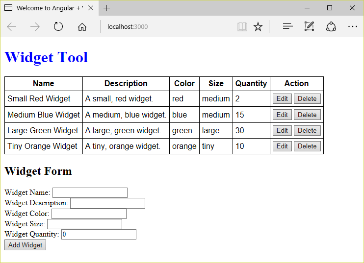

<a name="HOLTitle"></a>
# Building Web Applications with Angular #

---

<a name="Overview"></a>
## Overview ##

[Angular](https://angular.io/) is a popular framework for building UI applications. The newest version, which is not backward-compatible with the original version, is referred to as Angular, while the original version is referred to as [AngularJS](https://angularjs.org/). The Angular team recently released version 4 of the framework. This lab is based on that version.

Angular takes a template-driven approach to building UIs. An HTML template is decorated with component elements, directives, and other expressions to bind data models and other entities. The fundamental building block of Angluar apps is the *component*. Components are template-bound to a data model. The template is part of the component's metadata, and the data model is the component instance itself.

Composing rich UIs from components is major aspect of Angular programming. Angular partially implements the W3C recommendations for [Web Components](https://www.w3.org/standards/techs/components#w3c_all). As Web Components grow in popularity and browser support increases, Angular will be well positioned to fully support them. In addition to component-driven development, Angular is well known for its rich services architecture, which even includes hierarchical dependency injection. While two-way data binding between the UI and data models is supported in Angular, developers who do not like the two-way pattern can easily avoid it. This lab makes use of ```ngModel``` to perform two-way binding for collecting form data, but does not use two-way binding otherwise.

Angular is a complete framework for building UIs. Angular apps can be written in JavaScript, but [TypeScript](https://www.typescriptlang.org/) is more commonly used to due to its support for advanced features such as decorators (which are used to configure metadata for components), directives, modules, and services. TypeScript is especially helpful when building enterprise applications because of the strong typing that it enforces.

In this lab, you will use Angular, TypeScript, and [Visual Studio Code](https://code.visualstudio.com/) to build a simple application for managing a table of widgets. Data will be loaded from a REST service and displayed in an HTML table by Angular components. In addition, the application will fully support CRUD (Create, Read, Update and Delete), allowing widgets to be added and edited as well as viewed and deleted. As you build out the app, you will learn the basics of Angular and get a feel for what Angular programming is all about. 

<a name="Objectives"></a>
### Objectives ###

In this hands-on lab, you will learn how to:

- Create Angular components and services
- Combine Angular with HTML forms for collecting and editing data
- Decompose a single UI component into several smaller components
- Compose rich UIs from Angular components
- Integrate REST services into Angular apps

<a name="Prerequisites"></a>
### Prerequisites ###

The following are required to complete this hands-on lab:

- [Visual Studio Code](http://code.visualstudio.com/)
- [Node.js](https://nodejs.org/en/) version 7.0 or higher

---
<a name="Exercises"></a>
## Exercises ##

This hands-on lab includes the following exercises:

- [Exercise 1: Use Angular to display a static widget table](#Exercise1)
- [Exercise 2: Add a data model to the component](#Exercise2)
- [Exercise 3: Add a form for adding widgets](#Exercise3)
- [Exercise 4: Decompose the component into two components](#Exercise4)
- [Exercise 5: Add support for editing and deleting widgets](#Exercise5)
- [Exercise 6: Connect the app to a REST service](#Exercise6)

Estimated time to complete this lab: **45** minutes.

<a name="Exercise1"></a>
## Exercise 1: Use Angular to display a static widget table ##

Rather than start from scratch, you will begin with a "hello world" project that has been created for you. This will enable you to start learning quickly without spending time creating boilerplate infrastructure. In this exercise, you will copy the starter project to a local folder and use Visual Studio Code to modify a simple Angular component included in the starter project to display a table of widgets. As you do, you will get a first look at the Angular component model.

1. Find the "resources" folder that accompanies this lab, and then open the "angular-vscode-starter" folder inside the "resources" folder. Copy the contents of the "angular-vscode-starter" folder to a local folder on your hard disk (the "project folder").

1. Open a terminal or Command Prompt window and use a **cd** command to change to the project folder that you copied the starter project into.

1. If you are running Windows, execute the following command in the Command Prompt window to open Visual Studio Code in the project folder:

    ```
    code .
    ```

	If you are running Linux or macOS instead, use this command instead:

    ```
    open -a "Visual Studio Code" .
    ```

1. Confirm that Visual Studio Code starts and shows the project files in the Explorer pane on the left.

    

    _Visual Studio Code showing the starter project_

1. Select **Integrated Terminal** from Visual Studio Code's **View** menu to open the integrated terminal. In the integrated terminal, run the following command to install the packages that the app requires:

    ```
    npm install
    ```

    

    _Installing packages_

    > During the install, you may receive warning messages regrading deprecations. These warnings can be ignored. If you receive an actual error message (usually displayed in red and labeled "ERR"), delete the "node_modules" folder in the project folder and try again.

1. Once the install has completed, run the following command in the integrated terminal to start the development web server:

    ```
    npm start
    ```

    > The development web server is powered by the popular module bundler utility [Webpack 2](https://webpack.github.io/). As part of the bundling process, Webpack watches the file system for changes to the source code files, and processes them as changes are made. The processing primarily consists of transpiling code, which is necessary to convert TypeScript code to JavaScript.

1. To verify that the development environment and the application are working correctly, open a web browser and navigate to http://localhost:3000. Confirm that a "Hello World" page appears.

    

    _The starter app running in a browser_

1. The "Hello World" that you see is HTML content produced by a simple Angular component named ```AppComponent```. The component is defined in **app.component.ts**, which is located in the project's "src\ts\app" folder. Open **app.component.ts** and inspect its contents:

    

    _Defining an Angular component_

	The component replaces the page's ```hello-world``` element with the HTML in **app.component.html** (the component template), and styles the output with the styles in **app.component.scss**.

1. The next step is to modify the component to display a table of widgets instead of "Hello World." Open **index.html** in the project's "src" folder and replace the  ```hello-world``` element  with the following element:

	```html
	<widget-tool>Loading...</widget-tool>
	```

1. Now change the ```selector``` property in **app.component.ts** to target the ```widget-tool``` element:

	```javascript
	selector: "widget-tool",
	```

1. Next, the component template needs to be updated to display a static table of widgets. Open **app.component.html** in the "src\ts\app" folder and replace its contents with the following markup:

	```html
	<h1>Widget Tool</h1>
	<table>
	    <thead>
	        <tr>
	            <th>Name</th>
	            <th>Description</th>
	            <th>Color</th>
	            <th>Size</th>
	            <th>Quantity</th>
	        </tr>
	    </thead>
	    <tbody>
	        <tr>
	            <td>Sample Widget</td>
	            <td>A sample widget</td>
	            <td>blue</td>
	            <td>large</td>
	            <td>10</td>
	        </tr>
	    </tbody>
	</table>
	```

1. Historically, stylesheets were applied to entire web pages. With components, styles can applied at the component level. Open **app.component.scss** in the "src\ts\app" folder and add the following statements:

	```css
	table {
	
	    font-family: 'arial';
	    border-collapse: collapse;
	    border:1px solid #000;
	
	    tr {
	
	        td, th {
	            border-bottom:1px solid black;
	            padding: 5px;
	        }
	
	        th {
	            font-weight: bold;
	            text-align:center;
	        }
	
	        th:nth-child(n + 1), td:nth-child(n + 1) {
	            border-left:1px solid black;
	        }
	
	    }
	
	}
	```

	This markup is not conventional CSS; it is [SCSS](http://sass-lang.com/), which is an extension to [SASS](http://sass-lang.com/). SASS is a preprocessor for CSS that includes a number of syntax efficiencies not available in CSS. Angular provides no direct support for SASS, but a properly configured development environment enables developers to leverage such technologies in Angular applications.

1. Use the **File** -> **Save All** command to save all of your changes. Then switch back to the browser and confirm that a table of widgets appears, as shown below.

    

    _Widgets dsiplayed by the modified Angular component_

You have now seen how Angular components are defined, how they are declared in a page using custom HTML elements, how HTML templates are attached to them, and how they are styled. Now let's build on that by adding a data model to the Angular component.

<a name="Exercise2"></a>
## Exercise 2: Add a data model to the component ##

In this exercise, you will add a model to the project and modify ```AppComponent``` to use the model. You will also see Angular's ```ngFor``` directive for the first time.

1. Create a "models" folder in the project's "src\ts\app" folder. Then add a file named **widget.ts** to the "models" folder and add the following code to the file:

	```typescript
	export interface Widget {
	    id: number;
	    name: string;
	    description: string;
	    color: string;
	    size: string;
	    quantity: number;
	}
	```

	> An easy way to add a file or folder to a project in Visual Studio Code is to right-click (on a Mac, Control-click) the folder you want to add it to and select **New File** or **New Folder** from the context menu.

1. Add the following statement to the top of **app.component.ts** (after the existing ```import``` statement) to import the ```Widget``` interface defined in the previous step:

	```typescript
	import { Widget } from "./models/widget";
	```

1. Replace the empty ```AppComponent``` class in the same file with one that declares a property named ```widgets``` initialized with an array of Widgets:

	```typescript
	export class AppComponent {
	
	    public widgets: Widget[] = [{
	        id: 1, name: 'Small Red Widget', description: 'A small, red widget.',
	        color: 'red', size: 'small', quantity: 2
	    },{
	        id: 2, name: 'Medium Blue Widget', description: 'A medium, blue widget.',
	        color: 'blue', size: 'medium', quantity: 15
	    }];
	
	}
	```

1. Now return to **app.component.html** and update the component template by replacing the template's ```tbody``` element with the following element:

	```html
	<tbody>
	    <tr *ngFor="let widget of widgets">
	        <td>{{widget.name}}</td>
	        <td>{{widget.description}}</td>
	        <td>{{widget.color}}</td>
	        <td>{{widget.size}}</td>
	        <td>{{widget.quantity}}</td>
	    </tr>
	</tbody>
	```

	The ```ngFor``` directive duplicates an element and its children from model data. In this case, a ```tr``` element is produced for each widget, and each widget populates the columns of its table row. The asterisk before ```ngFor``` indicates that this is a structural directive. Directives come in two forms: structural and attribute. Structural directives add and remove DOM elements. Attribute directives manipulate the elements they are applied to.

	The double curly braces denote Angular *expressions*. Expressions are evaluated at run-time. In this example, the first table cell in each row will be filled with the widget's ```name``` property, the second will be filled with the widget's ```description``` property, and so on.

1. Use the **File** -> **Save All** command to save your changes. Then switch back to the browser and confirm that the widget table is populated with the model data you added in Step 3.

    

    _Widget table populated with model data_

Now that a model is in place, the next step is to provide an interface for creating new widgets.

<a name="Exercise3"></a>
## Exercise 3: Add a form for adding widgets ##

In this exercise, you will add an HTML form to the app so users can add widgets to the collection. This will involve importing an Angular module named ```FormsModule``` and modifying ```AppComponent``` to use the module.

1. Open **app.module.ts** in the project's "src\ts\app" folder and add the following ```import``` statement after the statement that imports ```BrowserModule```:

	```typescript
	import { FormsModule } from "@angular/forms";
	```

1. Once imported, ```FormsModule``` must be registered with the ```AppModule```. In the ```@NgModule``` decorator, update the ```imports``` property to include ```FormsModule```:

	```typescript
	imports: [ BrowserModule, FormsModule ],
	```

1. The next step is to add a form to the component template. In **app.component.ts**, add the following statements after the ```table``` element:

	```html
	<h2>Widget Form</h2>
	<form>
	    <div>
	        <label for="widget-name-input">Widget Name:</label>
	        <input type="text" name="widgetNameInput" id="widget-name-input" [(ngModel)]="newWidget.name" />
	    </div>
	    <div>
	        <label for="widget-description-input">Widget Description:</label>
	        <input type="text" name="widgetDescriptionInput" id="widget-description-input" [(ngModel)]="newWidget.description" />
	    </div>
	    <div>
	        <label for="widget-color-input">Widget Color:</label>
	        <input type="text" name="widgetColorInput" id="widget-color-input" [(ngModel)]="newWidget.color" />
	    </div>
	    <div>
	        <label for="widget-size-input">Widget Size:</label>
	        <input type="text" name="widgetSizeInput" id="widget-size-input" [(ngModel)]="newWidget.size" />
	    </div>
	    <div>
	        <label for="widget-quantity-input">Widget Quantity:</label>
	        <input type="text" name="widgetQuantityInput" id="widget-quantity-input" [(ngModel)]="newWidget.quantity" />
	    </div>
	    <button type="button" (click)="addWidget()">Add Widget</button>
	</form>
	```

	The ```ngModel``` directives establish two-way data binding between the UI and the model on the component instance. Each directive is surrounded by square brackets and parentheses. Square brackets denote an input binding, which passes data from the model to the directive or component. Parentheses indicate an output binding, which passes data back to the model. The use of both declares a two-way data binding. For the button's click event, parentheses are used without square brackets since there is no input, just output, when the button is clicked.

1. Now update the component class to make information about new widgets available. To do the update, add the following property to the ```AppComponent``` class in **app.component.ts**:

	```typescript
	public newWidget: Widget = {
	    id: 0,
	    name: "",
	    description: "",
	    color: "",
	    size: "",
	    quantity: 0,
	}
	```
1. Next, add the following function to the ```AppComponent``` class to handle clicks of the **Add Widget** button:

	```typescript
	public addWidget() {
	
	    this.newWidget.id = this.widgets.reduce((maxWidgetId, nextWidget) =>
	        Math.max(maxWidgetId, nextWidget.id), 0) + 1;
	    this.widgets = this.widgets.concat(this.newWidget);
	
	    this.newWidget = {
	        id: 0,
	        name: "",
	        description: "",
	        color: "",
	        size: "",
	        quantity: 0,
	    };
	
	}
	```

	The array ```reduce``` function is used to generate an id for the new widget based on the last id present in the array.

1. Use the **File** -> **Save All** command to save your changes. Then switch back to the browser and confirm that you can add a widget to the collection by filling in the form and clicking **Add Widget**.

    

    _UI for adding widgets_

Now you know how to implement forms in Angular components and use ```ngModel``` to bind form elements to model properties. The next step is to modularize the app a bit more.

<a name="Exercise4"></a>
## Exercise 4: Decompose the component into two components ##

The application component has grown and is now responsible for displaying the widget table AND handling form input for new widgets. This works, but it's not ideal. In this exercise, you will decompose the application component into two smaller components: one for displaying widgets, and another for adding widgets. 

1. Create a new folder named "components" in the project's "src\ts\app" folder. Add a new file named **widget-table.component.ts** to the "components" folder, and add the following code to the file to define a new component named ```WidgetTable```:

	```typescript
	import { Component, Input } from "@angular/core";
	
	import { Widget } from "../models/widget";
	
	@Component({
	    selector: "widget-table",
	    templateUrl: "./widget-table.component.html",
	    styleUrls: [ "./widget-table.component.scss" ],
	})
	export class WidgetTable {
	
	    @Input()
	    widgets: Widget[] = [];
	
	}
	```

	The ```@Input``` decorator indicates which property (or properties) of the component class can be used for input bindings. The property type can be any valid type.

1. Add a file named **widget-table.component.html** to the "components" folder to hold the component template. Then add the following markup to the file:

	```html
	<table>
	    <thead>
	        <tr>
	            <th>Name</th>
	            <th>Description</th>
	            <th>Color</th>
	            <th>Size</th>
	            <th>Quantity</th>
	        </tr>
	    </thead>
	    <tbody>
	        <tr *ngFor="let widget of widgets">
	            <td>{{widget.name}}</td>
	            <td>{{widget.description}}</td>
	            <td>{{widget.color}}</td>
	            <td>{{widget.size}}</td>
	            <td>{{widget.quantity}}</td>
	        </tr>
	    </tbody>
	</table>
	```

1. Add a file named **widget-table.component.scss** to the "components" folder. Then add the following statements to the file:

	```scss
	table {
	
	    font-family: 'arial';
	    border-collapse: collapse;
	    border:1px solid #000;
	
	    tr {
	
	        td, th {
	            border-bottom:1px solid black;
	            padding: 5px;
	        }
	
	        th {
	            font-weight: bold;
	            text-align:center;
	        }
	
	        th:nth-child(n + 1), td:nth-child(n + 1) {
	            border-left:1px solid black;
	        }
	
	    }
	
	}
	```

1. Now that the ```WidgetTable``` component has been defined, the application component needs to be updated to use it. In **app.module.ts**, add the following ```import``` statement right after the statement that imports ```AppComponent```.

	```typescript
	import { WidgetTable } from "./components/widget-table.component";
	```

1. Next, add ```WidgetTable``` to the component declarations in the ```@NgModule``` decorator attached to ```AppComponent```:

	```typescript
	declarations: [ AppComponent, WidgetTable ],
	```

	Remembering to update the ```declarations``` array is key to decomposition. Many an Angular developer has lost precious time by failing to remember to register new components, directives, and pipes with the appropriate module.

1. Replace the ```table``` element in **app.component.html** with the following markup:

	```html
	<widget-table [widgets]="widgets"></widget-table>
	```

1. ```WidgetTable``` manages its own CSS, so delete the contents of **app.component.scss**. **Do not delete the file; just delete the contents**.

1. Use the **File** -> **Save All** command to save your changes. Then switch back to the browser and view the page source. Confirm that you see the new ```widget-table``` element created from the template.

    

    _Output from the WidgetTable component_

1. Now let's separate the form into its own component. Whereas the widget table received widgets as inputs, the widget form will output widgets. Add a file named **widget-form.component.ts** to the "components" folder. Then add the following code to the file:

	```typescript
	import { Component, Output, EventEmitter } from "@angular/core";
	
	import { Widget } from "../models/widget";
	
	@Component({
	    selector: "widget-form",
	    templateUrl: "./widget-form.component.html",
	})
	export class WidgetForm {
	
	    newWidget: Widget = {
	        id: 0,
	        name: "",
	        description: "",
	        color: "",
	        size: "",
	        quantity: 0,
	    }
	
	    @Output()
	    onSubmit: EventEmitter<Widget> = new EventEmitter<Widget>();
	
	    addWidget() {
	
	        this.onSubmit.emit(this.newWidget);
	
	        this.newWidget = {
	            id: 0,
	            name: "",
	            description: "",
	            color: "",
	            size: "",
	            quantity: 0,
	        };
	
	    }
	
	}
	```

	The ```@Output``` decorator indicates which properties on the component are available for output bindings. Typically, the ```EventEmitter``` class is used to wire up the outputs.

1. Add a file named **widget-form.component.html** to the "components" folder. Then add the following markup to the file:

	```html
	<h2>Widget Form</h2>
	<form>
	    <div>
	        <label for="widget-name-input">Widget Name:</label>
	        <input type="text" name="widgetNameInput" id="widget-name-input" [(ngModel)]="newWidget.name" />
	    </div>
	    <div>
	        <label for="widget-description-input">Widget Description:</label>
	        <input type="text" name="widgetDescriptionInput" id="widget-description-input" [(ngModel)]="newWidget.description" />
	    </div>
	    <div>
	        <label for="widget-color-input">Widget Color:</label>
	        <input type="text" name="widgetColorInput" id="widget-color-input" [(ngModel)]="newWidget.color" />
	    </div>
	    <div>
	        <label for="widget-size-input">Widget Size:</label>
	        <input type="text" name="widgetSizeInput" id="widget-size-input" [(ngModel)]="newWidget.size" />
	    </div>
	    <div>
	        <label for="widget-quantity-input">Widget Quantity:</label>
	        <input type="text" name="widgetQuantityInput" id="widget-quantity-input" [(ngModel)]="newWidget.quantity" />
	    </div>
	    <button type="button" (click)="addWidget()">Add Widget</button>
	</form>
	```

1. Return to **app.module.ts** and add the following ```import``` statement after the statement that imports ```WidgetTable```:

	```typescript
	import { WidgetForm } from "./components/widget-form.component";
	```

1. Next, add ```WidgetForm``` to the component declarations in the ```@NgModule``` decorator attached to ```AppComponent```:

	```typescript
	declarations: [ AppComponent, WidgetTable, WidgetForm ],
	```

1. Replace the contents of **app.component.html** with the following markup:

	```html
	<h1>Widget Tool</h1>
	<widget-table [widgets]="widgets"></widget-table>
	<widget-form (onSubmit)="saveWidget($event)"></widget-form>
	```

	Notice how much simpler and cleaner the ```AppComponent``` template is now. Angular uses depedency injection to pass arguments to event handlers in component templates. ```$event``` is a special variable name that allows event data to be passed as function arguments.

1. The ```AppComponent``` class needs to be updated to use the ```WidgetForm``` component. Replace the contents of **app.component.ts** with the following code:

	```typescript
	import { Component } from "@angular/core";
	
	import { Widget } from "./models/widget";
	
	@Component({
	    selector: "widget-tool",
	    templateUrl: "./app.component.html",
	    styleUrls: [ "./app.component.scss" ],
	})
	export class AppComponent {
	
	    widgets: Widget[] = [{
	        id: 1, name: 'Small Red Widget', description: 'A small, red widget.',
	        color: 'red', size: 'small', quantity: 2
	    },{
	        id: 2, name: 'Medium Blue Widget', description: 'A medium, blue widget.',
	        color: 'blue', size: 'medium', quantity: 15
	    }];
	
	    saveWidget(newWidget: Widget) {
	
	        newWidget.id = this.widgets.reduce((maxWidgetId, nextWidget) =>
	            Math.max(maxWidgetId, nextWidget.id), 0) + 1;
	        this.widgets = this.widgets.concat(newWidget);
	
	    }
	
	}
	```

1. Use the **File** -> **Save All** command to save your changes. Then switch back to the browser and confirm that the widget table and widget form are both displayed on the web page. Add a new widget and verify that it works.

    

    _Adding a yellow widget_

The application component has now been decomposed into two smaller components, and you can add widgets and view widgets. The next task is to permit widgets to be edited and deleted as well.

<a name="Exercise5"></a>
## Exercise 5: Add support for editing and deleting widgets ##

Currently, the app allows new widgets to be added, but lacks a UI for editing and deleting widgets. In this exercise, you will add support for editing widgets using inline table editing, and support for deleting widgets as well. This will involve adding two new components — one to represent edit rows and one to represent "view" rows (rows that are not currently being edited) — and modifying existing code to use them.

1. Create a new file named **widget-row.component.scss** in the "components" folder to provide CSS styling for the view-row and edit-row components. Then add the following markup to the file:

	```scss
	td {
	    border-bottom:1px solid black;
	    padding: 5px;
	}
	
	td:nth-child(n + 1) {
	    border-left:1px solid black;
	}
	```

1. The ```WidgetTable``` component's styling needs to be updated as well. Open **widget-table.component.scss** and replace the contents of that file with the following markup:

	```scss
	table {
	
	    font-family: 'arial';
	    border-collapse: collapse;
	    border:1px solid #000;
	
	    tr {
	
	        th {
	            border-bottom:1px solid black;
	            padding: 5px;
	            font-weight: bold;
	            text-align:center;
	        }
	
	        th:nth-child(n + 1) {
	            border-left:1px solid black;
	        }
	
	    }
	
	}
	```

1. Create a file named **widget-view-row.component.ts** in the "components" folder and add the following code:.

	```typescript
	import { Component, Input, Output, EventEmitter } from "@angular/core";
	
	import { Widget } from "../models/widget";
	
	@Component({
	    selector: "tr[widget-view-row]",
	    templateUrl: "./widget-view-row.component.html",
	    styleUrls: [ "./widget-row.component.scss" ],
	})
	export class WidgetViewRow {
	
	    @Input()
	    public widget: Widget = {} as Widget;
	
	    @Output()
	    public onEditWidget: EventEmitter<number> = new EventEmitter<number>();
	
	    @Output()
	    public onDeleteWidget: EventEmitter<number> = new EventEmitter<number>();
	}
	```

	Observe that the selector for this component targets ```tr``` elements. The purpose of the ```widget-view-row``` attribute in the selector is to differentiate between view rows and edit rows.

1. Create a file named **widget-view-row.component.html** in the "components" folder and add the following code:

	```html
	<td>{{widget.name}}</td>
	<td>{{widget.description}}</td>
	<td>{{widget.color}}</td>
	<td>{{widget.size}}</td>
	<td>{{widget.quantity}}</td>
	<td>
	    <button type="button" (click)="onEditWidget.emit(widget.id)">Edit</button>
	    <button type="button" (click)="onDeleteWidget.emit(widget.id)">Delete</button>
	</td>
	```

1. Create a file named **widget-edit-row.component.ts** in the "components" folder and add the following code:

	```typescript
	import { Component, Input, Output, EventEmitter, OnChanges } from "@angular/core";
	
	import { Widget } from "../models/widget";
	
	@Component({
	    selector: "tr[widget-edit-row]",
	    templateUrl: "./widget-edit-row.component.html",
	    styleUrls: [ "./widget-row.component.scss" ],
	})
	export class WidgetEditRow implements OnChanges {
	
	    @Input()
	    public widget: Widget = {} as Widget;
	
	    @Output()
	    public onSaveWidget: EventEmitter<Widget> = new EventEmitter<Widget>();
	
	    @Output()
	    public onCancelWidget: EventEmitter<void> = new EventEmitter<void>();
	
	    public ngOnChanges(changes: any) {
	        if (changes.widget) {
	            this.widget = Object.assign({}, changes.widget.currentValue);
	        }
	    }
	}
	```

	The ```OnChanges``` interface is imported and applied to the ```WidgetEditRow``` class to declare that the component implements the ```ngOnChanges``` lifecycle method. This method executes whenever the input properties to the component change. In particular, changes to the ```widgets``` property must be properly handled to ensure that edits to the widget do not overwrite the existing widget object in memory. For this reason, a new object is created, and the properties of the original widget are copied to the new widget using ```Object.assign``` in the ```ngOnChanges``` method. As a result, the original object is not modified if the user clicks the **Cancel** button.

1. Create a file named **widget-edit-row.component.html** in the "components" folder and add the following markup:

	```html
	<td><input type="text" name="editWidgetName" id="edit-widget-name-input" [(ngModel)]="widget.name"></td>
	<td><input type="text" name="editWidgetDescription" id="edit-widget-description-input" [(ngModel)]="widget.description"></td>
	<td><input type="text" name="editWidgetColor" id="edit-widget-color-input" [(ngModel)]="widget.color"></td>
	<td><input type="text" name="editWidgetSize" id="edit-widget-size-input" [(ngModel)]="widget.size"></td>
	<td><input type="text" name="editWidgetQuantity" id="edit-widget-quantity-input" [(ngModel)]="widget.quantity"></td>
	<td>
	    <button type="button" (click)="onSaveWidget.emit(widget)">Save</button>
	    <button type="button" (click)="onCancelWidget.emit()">Cancel</button>
	</td>
	```

1. The two new row components need to be registered with the application module. Add the following ```import``` statements after the statement that imports ```WidgetForm``` in **app.module.ts**:

	```typescript
	import { WidgetViewRow } from "./components/widget-view-row.component";
	import { WidgetEditRow } from "./components/widget-edit-row.component";
	```

1. Now add the new components to the ```declarations``` in the application module:

	```typescript
	declarations: [ AppComponent, WidgetTable, WidgetForm, WidgetViewRow, WidgetEditRow ],
	```

1. The ```WidgetTable``` template needs to be updated to use the new row components. A new "Action" column needs to be added to the table header row, and some logic needs to be added to the table to switch between the view row and edit row. Replace the template for the widget table component in **widget-table.component.html** with the following markup:

	```html
	<table>
	    <thead>
	        <tr>
	            <th>Name</th>
	            <th>Description</th>
	            <th>Color</th>
	            <th>Size</th>
	            <th>Quantity</th>
	            <th>Action</th>
	        </tr>
	    </thead>
	    <tbody>
	        <ng-template ngFor let-widget [ngForOf]="widgets">
	            <tr widget-view-row *ngIf="widget.id !== editRowId" [widget]="widget"
	                (onEditWidget)="editWidget($event)" (onDeleteWidget)="onDeleteWidget.emit($event); editRowId = 0">
	            </tr>
	            <tr widget-edit-row *ngIf="widget.id === editRowId" [widget]="widget"
	                (onSaveWidget)="onSaveWidget.emit($event); editRowId = 0" (onCancelWidget)="editRowId = 0">
	            </tr>
	        </ng-template>
	    </tbody>
	</table>
	```

	It isn't possible to use ```ngFor``` to apply two different components to the same element. Therefore, an ```ng-template``` element is used instead to iterate over the model data, and the appropriate component is emitted using ```ngIf```. The asterisk is shorthand, and must be used when a structural directive is applied to multiple sibling directives.

	Also, observe how multiple expressions can be included in a single template. For ```onDeleteWidget```, one expression emits a delete-widget event, and the second sets ```editRowId``` to zero.

1. The ```WidgetTable``` component needs to be updated to handle edit rows and the events associated with saving and deleting widgets. Open **widget-table.component.ts** and replace the contents of the file with the following code:

	```typescript
	import { Component, Input, Output, EventEmitter } from "@angular/core";
	
	import { Widget } from "../models/widget";
	
	@Component({
	    selector: "widget-table",
	    templateUrl: "./widget-table.component.html",
	    styleUrls: [ "./widget-table.component.scss" ],
	})
	export class WidgetTable {
	
	    public editRowId = 0;
	
	    @Input()
	    public widgets: Widget[] = [];
	
	    @Output()
	    public onSaveWidget: EventEmitter<Widget> = new EventEmitter<Widget>();
	
	    @Output()
	    public onDeleteWidget: EventEmitter<number> = new EventEmitter<number>();
	
	    public editWidget(widgetId: number) {
	        this.editRowId = widgetId;
	    }
	}
	```

1. Open **app.component.ts** in the "app" folder and replace its contents with the following code to add functions for saving and deleting widgets to the application component:

	```typescript
	import { Component } from "@angular/core";
	
	import { Widget } from "./models/widget";
	
	@Component({
	    selector: "widget-tool",
	    templateUrl: "./app.component.html",
	    styleUrls: [ "./app.component.scss" ],
	})
	export class AppComponent {
	
	    public widgets: Widget[] = [{
	        id: 1, name: 'Small Red Widget', description: 'A small, red widget.',
	        color: 'red', size: 'small', quantity: 2
	    },{
	        id: 2, name: 'Medium Blue Widget', description: 'A medium, blue widget.',
	        color: 'blue', size: 'medium', quantity: 15
	    }];
	
	    public deleteWidget(widgetId: number) {
	        this.widgets = this.widgets.filter(w => w.id !== widgetId);
	    }
	
	    public saveWidget(widget: Widget) {
	
	        if (widget.id) {
	
	            const widgetIndex = this.widgets.findIndex(w =>
	                w.id === widget.id);
	
	            this.widgets = [
	                ...this.widgets.slice(0, widgetIndex),
	                widget,
	                ...this.widgets.slice(widgetIndex + 1) ];
	
	        } else {
	
	            widget.id = this.widgets.reduce((maxWidgetId, nextWidget) =>
	                Math.max(maxWidgetId, nextWidget.id), 0) + 1;
	
	            this.widgets = this.widgets.concat(widget);
	
	        }
	
	    }
	
	}
	```

1. Now update the application component's template in **app.component.html** to reference the functions added in the previous step:

	```html
	<h1>Widget Tool</h1>
	<widget-table [widgets]="widgets" (onSaveWidget)="saveWidget($event)" (onDeleteWidget)="deleteWidget($event)"></widget-table>
	<widget-form (onSubmit)="saveWidget($event)"></widget-form>
	```

1. Use the **File** -> **Save All** command to save your changes. Then switch back to the browser and confirm that you can add new widgets as well as edit and delete existing ones.

    

    _The modified UI with tools for editing and deleting widgets_

Users can now edit and delete widgets as well as view and add them. The final step is to connect the app to a REST service and move widget data to the cloud rather than store it locally.

<a name="Exercise6"></a>
## Exercise 6: Connect to a REST service ##

The app is almost complete. In the final exercise, you will modify it to use a REST service to store widget data. To communicate with the REST service, you will use Angular's ```HttpModule```, which provides HTTP services to applications that require them. And you will implement a service of your own named ```Widgets``` to use Angular's HTTP services.

1. Open **app.module.ts** in the project's "app" folder and add the following statement after the statement that imports ```FormsModule```:

	```typescript
	import { HttpModule } from "@angular/http";
	```
1. Add ```HttpModule``` to the list of modules imported into the application module:

	```typescript
	imports: [ BrowserModule, FormsModule, HttpModule ],
	```

1. Create a new folder in the "app" folder named "services." Then add a file named **widgets.service.ts** to the "services" folder and add the following code:

	```typescript
	import { Injectable } from "@angular/core";
	import { Http, Headers, RequestOptions } from "@angular/http";
	import { Observable } from "rxjs/Rx";
	
	import { Widget } from "../models/widget";
	
	@Injectable()
	export class Widgets {
	
	    private baseUrl: string = "http://localhost:3010/widgets";
	
	    private requestOptions: RequestOptions = new RequestOptions({
	        headers: new Headers({ "Content-Type": "application/json" })
	    });
	
	    constructor(private http: Http) { }
	
	    public getAll(): Observable<Widget[]> {
	        return this.http.get(this.baseUrl).map(res => res.json());
	    }
	
	    public get(widgetId: number): Observable<Widget> {
	        return this.http.get(this.baseUrl + "/" + encodeURIComponent(widgetId.toString())).map((res) => res.json());
	    }
	
	    public insert(widget: Widget): Observable<Widget> {
	        return this.http.post(this.baseUrl + "/", JSON.stringify(widget), this.requestOptions).map((res) => res.json());
	    }
	
	    public update(widget: Widget): Observable<Widget> {
	        return this.http.put(this.baseUrl + "/" + encodeURIComponent(widget.id.toString()),
	            JSON.stringify(widget), this.requestOptions).map((res) => res.json());
	    }
	
	    public delete(widgetId: number): Observable<Widget> {
	        return this.http.delete(this.baseUrl + "/" + encodeURIComponent(widgetId.toString())).map((res) => res.json());
	    }
	
	}
	```

	Angular's HTTP service provides helper methods for making REST service requests. You simply call these methods with a URL, data, and request options, and an HTTP request is transmitted. To manage the asynchronous nature of such requests, Angular uses *observables* provided by another framework named RxJS (Reactive Extensions for JavaScript). Parties that subscribe to an observable returned by the HTTP service are notified when an asynchronous call completes.

1. The ```Widgets``` service needs to be registered with the application module so it can be injected into the application component. Open **app.module.ts** and import the service just before the statement that imports ```AppComponent```.

	```typescript
	import { Widgets } from "./services/widgets.service";
	```

1. Now modify the ```@NgModule``` decorator on the ```AppModule``` class to include a ```providers``` option that registers the ```Widgets``` class as a provider:

	```typescript
	@NgModule({
	  imports: [ BrowserModule, FormsModule, HttpModule ],
	  declarations: [ AppComponent, WidgetTable, WidgetForm, WidgetViewRow, WidgetEditRow ],
	  bootstrap: [ AppComponent ],
	  providers: [ Widgets ],
	})
	```

	The ```providers``` option specifies how the ```Widgets``` service will be injected. In this example, ```Widgets``` doubles as an injection token and as the concrete implementation to be injected.

1. Next, the application component needs to be updated to use the ```Widgets``` service. Replace the contents of **app.component.ts** with the following code:

	```typescript
	import { Component, OnInit } from "@angular/core";
	
	import { Widget } from "./models/widget";
	import { Widgets } from "./services/widgets.service";
	
	@Component({
	    selector: "widget-tool",
	    templateUrl: "./app.component.html",
	    styleUrls: [ "./app.component.scss" ],
	})
	export class AppComponent implements OnInit {
	
	    public widgets: Widget[] = [];
	
	    constructor(private widgetsSvc: Widgets) { }
	
	    public refreshWidgets() {
	        this.widgetsSvc.getAll().subscribe((widgets) => {
	            this.widgets = widgets;
	        });
	    }
	
	    public ngOnInit() {
	        this.refreshWidgets();
	    }
	
	    public deleteWidget(widgetId: number) {
	
	        this.widgetsSvc.delete(widgetId).subscribe((widgets) => {
	            this.refreshWidgets();
	        });
	    }
	
	    public saveWidget(widget: Widget) {
	
	        if (widget.id) {
	            this.widgetsSvc.update(widget).subscribe(() => this.refreshWidgets());
	        } else {
	            this.widgetsSvc.insert(widget).subscribe(() => this.refreshWidgets());
	        }
	
	    }
	
	}
	```

	```ngOnInit``` is a lifecycle function that's called when a component is loaded and ready. In this case, it loads widgets from the REST service. Oserve how callback functions are used to perform widget operations. Because REST service calls are asynchronous in nature, a callback is registered with ```subscribe```, and the callback is invoked when a call completes.

1. Use the **File** -> **Save All** command to save your changes. Then switch back to the browser one last time and observe that the widget tool is now populated with data from the REST service. Try adding, editing, and deleting widgets to confirm that the app behaves as expected.

    

    _The final application_

Great job! You have built a CRUD application with Angular and learned a lot about Angular along the way.

## Summary ##

For more information on Angular, check out [this summary of Angular basics](https://angular.io/docs/ts/latest/quickstart.html) on the Angular Web site, as well as [these Angular tutorials](https://angular.io/docs/ts/latest/tutorial/). Note that Angular is great for building mobile apps, too. The [Angular Mobile Toolkit](https://mobile.angular.io/) makes it easy to build responsive Web apps that work on any device, even when you lack an Internet connection.


----

Copyright 2017 Microsoft Corporation. All rights reserved. Except where otherwise noted, these materials are licensed under the terms of the MIT License. You may use them according to the license as is most appropriate for your project. The terms of this license can be found at https://opensource.org/licenses/MIT.