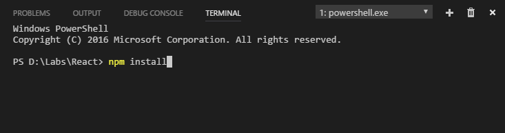
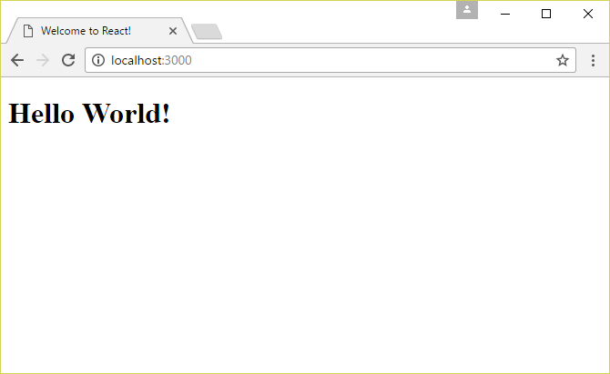
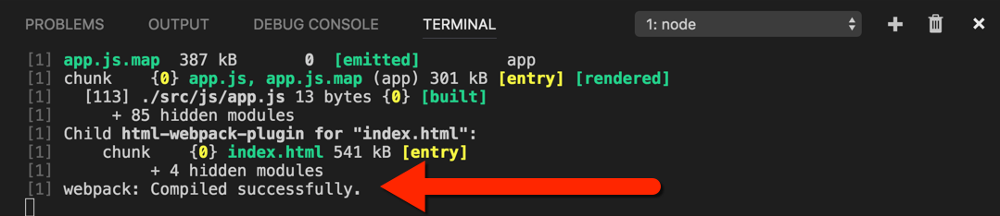
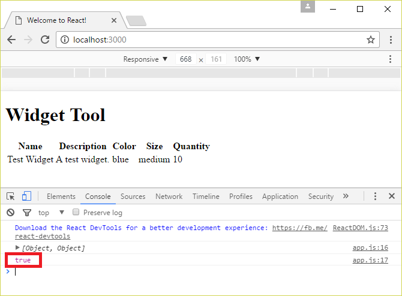
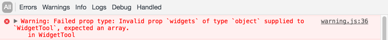
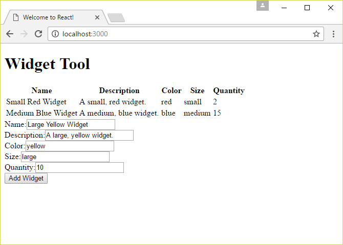
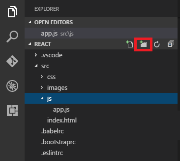

<a name="HOLTitle"></a>
# Building Web Apps with React #

---

<a name="Overview"></a>
## Overview ##

Modern user interface (UI) development is rooted in the concept of components. Components link presentation logic to model data. Typically, components implement individual parts of the UI, and are composed into higher-order components to construct holistic UIs. The goal is to create "UI parts" which are reusable, decoupled from one another, and individually testable. Many platforms, languages, frameworks, and libraries support component-based UI development. For JavaScript developers, one of the most popular UI frameworks is [React](https://facebook.github.io/react/).

React is an open-source framework created by Facebook. React's claim to fame is performance, and how quickly it updates the DOM in response to model changes. React uses a JavaScript derivative named [JSX](https://jsx.github.io/) to implement presentation logic. JSX looks similar to HTML, but is really just an alternative syntax for creating React elements. Transpilers such as [Babel](https://babeljs.io/) and [TypeScript](http://www.typescriptlang.org/) compile JSX into native JavaScript.

One of the most important concepts in React programming is that of state management. React organizes component data into three categories: props, state and context. This tutorial focuses on props and state. *Props* represent the immutable data passed into a component from a parent component, while *state* represents mutable data managed by the component itself. Learning React — and learning about proper state management — is a great way to get acquainted with modern UI development and provides a foundation for becoming proficient with other popular component libraries such as [Angular](https://angular.io/).

In this lab, you will use React and [Visual Studio Code](https://code.visualstudio.com/) to build an application for managing a collection of widgets. Data will be loaded locally at first, then later from a REST service, and displayed in an HTML table rendered by React components. After implementing basic functionality for creating and listing widgets, you will add functionality for editing and deleting widgets.

<a name="Objectives"></a>
### Objectives ###

In this hands-on lab, you will learn how to:

- Create and render React components
- Work with component data, including props and state
- Compose components into higher-order components
- Integrate REST services into React applications

<a name="Prerequisites"></a>
### Prerequisites ###

The following are required to complete this hands-on lab:

- [Visual Studio Code](http://code.visualstudio.com/)
- [Node.js](https://nodejs.org/en/) version 7.0 or higher

---

<a name="Exercises"></a>
## Exercises ##

This hands-on lab includes the following exercises:

- [Exercise 1: Create a static widget table](#Exercise1)
- [Exercise 2: Pass widget data via props](#Exercise2)
- [Exercise 3: Add a form for adding widgets](#Exercise3)
- [Exercise 4: Decompose WidgetTool into discrete components](#Exercise4)
- [Exercise 5: Add support for editing and deleting widgets](#Exercise5)
- [Exercise 6: Connect to a REST service](#Exercise6)

Estimated time to complete this lab: **60** minutes.

<a name="Exercise1"></a>
## Exercise 1: Create a static widget table ##

Rather than start from scratch, you will begin with a "hello world" project that has been created for you. This will enable you to start learning quickly without spending time creating boilerplate infrastructure. In this exercise, you will copy the starter project to a local folder and use Visual Studio Code to modify it to display a table of widgets. As you do, you will get a first look at the React component model.

1. Find the "resources" folder that accompanies this lab, and then open the "react-vscode-starter" folder inside the "resources" folder. Copy the contents of the "react-vscode-starter" folder to a local folder on your hard disk (the "project folder").

1. Open a terminal or Command Prompt window and use a **cd** command to change to the project folder that you copied the starter project into.

1. If you are running Windows, execute the following command in the Command Prompt window to open Visual Studio Code in the project folder:

    ```
    code .
    ```

	If you are running Linux or macOS instead, use this command instead:

    ```
    open -a "Visual Studio Code" .
    ```

1. Confirm that Visual Studio Code starts and shows the project files in the Explorer pane on the left.

    

    _Visual Studio Code showing the starter project_

1. Select **Integrated Terminal** from Visual Studio Code's **View** menu to open the integrated terminal. In the integrated terminal, run the following command to install the packages that the app will use:

    ```
    npm install
    ```

    

    _Installing packages_

    > During the install, you may receive warning messages regrading deprecations. These warnings can be ignored. If you receive an actual error message (usually displayed in red and labeled "ERR"), delete the "node_modules" folder in the project folder and try again.

1. Once the install has completed, run the following command in the integrated terminal to start the development web server:

    ```
    npm start
    ```

    > The development web server is powered by the popular module bundler utility [Webpack 2](https://webpack.github.io/). As part of the bundling process, Webpack watches the file system for changes to the source code files, and processes them as changes are made. The processing primarily consists of transpiling code, which is necessary to convert JSX code to JavaScript.

1. To verify that the development environment and the application are working correctly, open a web browser and navigate to http://localhost:3000. Confirm that a "Hello World" page appears.

    

    _The starter app running in a browser_

1. Return to Visual Studio Code and open **app.js** in the project's "src/js" folder. Delete the contents of the file, and then save. When you save the file, check the terminal window and verify that Webpack recompiled it.

    

    _Successful recompilation_

1. Add the following code to **app.js**, and then save the file.

	```javascript
	import React from 'react';
	import ReactDOM from 'react-dom';
	
	class WidgetTool extends React.Component {
	
	    render() {
	        return React.createElement('h1', null, 'Widget Tool');
	    }
	}
	
	ReactDOM.render(
	    React.createElement(WidgetTool),
	    document.querySelector('main')
	);
	```

	The code that you just added to **app.js** defines a new React component and renders it in a web page. React components are defined with JavaScript classes. Syntactically, JavaScript classes are similar to C# and Java classes. But under the hood, JavaScript classes are much different; they use prototype inheritance instead of classical inheritance.

	All React components inherit from the ```React.Component``` class. React uses prototype inheritance to configure classes as components. All React component classes must implement a ```render``` function. The ```render``` function returns a tree of React elements which are rendered into the browser DOM.

	React can be used to create components on many platforms, including iOS and Android. Because of this cross-platform flexibility, the core React library is decoupled from the platform-specific UI renderers. Because the exercises in this lab use a web browser, the ReactDOM package does the rendering.

	The ```import``` syntax is from the ES2015 modules specification. Because Babel is being used to transpile the JavaScript code, ES2015 modules are used even though they are not currently supported natively in any JavaScript engine.

1. Switch back to your browser, and observe that the web page refreshed automatically. Automatic refreshing is known as *live reload*, and it's a feature of Webpack 2's web development server.

    

    _The web page following a live reload_

1. To create React elements, React provides a ```createElement``` function. The function's first parameter accepts either an HTML element name or another React component class. The second argument is a ```props``` object, which allows data to be passed into the component. The final argument represents the child content of the element. The child content can be either a string or another React element (or set of elements).

	While a single call to ```React.createElement``` is simple enough, most components output lots of elements, making the code that renders the output tedious to write. To solve this problem, a new language named JSX (JavaScript Syntax Extension) was created. The Babel transpiler compiles JSX code into ordinary JavaScript, essentially emitting ```React.createElement``` calls.

	To demonstrate, replace the code in **app.js** with the following code and then save the file:

	```jsx
	import React from 'react';
	import ReactDOM from 'react-dom';
	
	class WidgetTool extends React.Component {
	
	    render() {
	        // return React.createElement('h1', null, 'Widget Tool');
	        return <h1>Widget Tool</h1>;
	    }
	}
	
	ReactDOM.render(
	    // React.createElement(WidgetTool),
	    <WidgetTool />,
	    document.querySelector('main')
	);
	```

	The final result in the web browser is exactly the same. The only difference is that JSX is easier to read and write when it comes to generating complex DOMs.

1. The next step is to expand the ```WidgetTool``` component to display a table of static widget data. Replace the ```return``` statement in the ```render``` function with the following code:

	```jsx
	return <div>
	    <h1>Widget Tool</h1>
	    <table>
	        <thead>
	            <tr>
	                <th>Name</th>
	                <th>Description</th>
	                <th>Color</th>
	                <th>Size</th>
	                <th>Quantity</th>
	            </tr>
	        </thead>
	        <tbody>
	            <tr>
	                <td>Test Widget</td>
	                <td>A test widget.</td>
	                <td>blue</td>
	                <td>medium</td>
	                <td>10</td>
	            </tr>
	        </tbody>
	    </table>
	</div>;
	```

	> Because JSX transpiles to function calls, only one top-level element may be returned. That's why the modified ```return``` statement returns a ```div``` element wrapping an ```h1``` and a ```table```.

1. Switch to the web browser and confirm that a static table of widget data appears under "Widget Tool."

    

    _Output from the modified WidgetTool component_

You now have a working development environment and have seen live reload at work. You have also seen what a basic React component looks like. That's a good start, but it barely scratches the surface of the React component model.

<a name="Exercise2"></a>
## Exercise 2: Pass widget data via props ##

In the previous exercise, a static table of widget data was displayed. In this exercise, the widget data will be passed into the component via ```props```. Props hold parameters passed to components, and roughly correspond to attributes on HTML elements. Understanding ```props``` is a key step in becoming a React programmer. Let's dive in.

1. Add the following array declaration above the ```WidgetTool``` class declaration in **app.js**:

	```javascript
	const widgetData = [{
	    id: 1, name: 'Small Red Widget', description: 'A small, red widget.',
	    color: 'red', size: 'small', quantity: 2
	},{
	    id: 2, name: 'Medium Blue Widget', description: 'A medium, blue widget.',
	    color: 'blue', size: 'medium', quantity: 15
	}];
	```

	This array will be used to populate the ```WidgetTool``` component via props.

1. Update the ```ReactDOM.render``` function at the bottom of **app.js** to pass the array of widgets into the ```WidgetTool``` component via props:

	```jsx
	ReactDOM.render(
	    // React.createElement(WidgetTool, { widgets: widgetData }),
	    <WidgetTool widgets={widgetData} />,
	    document.querySelector('main')
	);
	```

	The comment shows the equivalent code if it were written to call ```React.createElement``` directly.

1. To utilize the array of widgets within the component, the ```props``` property on the component instance will have a ```widgets``` property pointing to the array of widgets. Add the following statement to the ```render``` function before the ```return``` statement:

	```javascript
	console.log(this.props.widgets);
	```

1. Switch to the web browser, open the developer console, and reload the web page. Then examine the widget data shown in the console.

    

    _Console log showing WidgetTool props_

1. A React component's ```props``` data is special. It represents information passed in from the outside. The ```props``` data (including primitive data stored directly on the ```props``` object as well as *all* objects referenced from ```props```) is considered immutable. React enforces this on the ```props``` property by freezing the object. But this immutability extends to all objects referenced by ```props```, or referenced by other objects that are ultimately referenced by ```props```.

	To drive home this point, add the following code to the ```render``` function before the ```return``` statement. Then save the file.

	```javascript
	console.log(Object.isFrozen(this.props));
	```

1. Reload the page in the browser, and observe the console output. Is ```props``` frozen or not?

    

    _Testing props for immutability_

1. Next, the widget data on ```props``` will be used to dynamically build the table content. In **app.js**, replace the ```tbody``` element with the following statements:

	```jsx
	<tbody>
	    {this.props.widgets.map(widget => <tr>
	        <td>{widget.name}</td>
	        <td>{widget.description}</td>
	        <td>{widget.color}</td>
	        <td>{widget.size}</td>
	        <td>{widget.quantity}</td>
	    </tr>)}
	</tbody>
	```

	The ```map``` function iterates over the array of widget objects, creating a new array of table rows populated with widget data.

1. Switch back to the browser. The table is now being dynamically generated by data passed in via ```props```.

    

    _Table populated dynamically from props_

1. While the code you added in the previous step works, there is a warning message in the console. When React renders sibling elements dynamically, it wants key values linking the elements to corresponding fields in the model. This link between elements and model data helps React update the DOM more efficiently when the model changes. To facilitate this linkage, the ```key``` prop is used. When setting the ```key``` prop, it is best to use a unique property of each object such as an ```id```.

	Update the code in **app.js** to use a ```key``` prop for the table row, and save the file:

	```jsx
	<tbody>
	    {this.props.widgets.map(widget => <tr key={widget.id}>
	        <td>{widget.name}</td>
	        <td>{widget.description}</td>
	        <td>{widget.color}</td>
	        <td>{widget.size}</td>
	        <td>{widget.quantity}</td>
	    </tr>)}
	</tbody>
	```

1. Switch back to the browser and confirm that the console warning has disappeared.

1. The final step in working with ```props``` is to add prop validation to the React component. React provides run-time validation to ensure that a component's ```props``` requirements are met. Add the following code to the top of the ```WidgetTool``` class in **app.js**, and save the file.

	```javascript
	static propTypes = {
	    widgets: React.PropTypes.arrayOf(React.PropTypes.shape({
	        id: React.PropTypes.number,
	        name: React.PropTypes.string,
	        description: React.PropTypes.description,
	        color: React.PropTypes.string,
	        size: React.PropTypes.string,
	        quantity: React.PropTypes.number,
	    })).isRequired
	}
	```

	This pattern is known as a *property declaration*. The property declaration syntax allows for simple value properties to be defined within the class structure (typically only accessor properties and functions are permitted). The ```static``` keyword defines the property directly on the class (really a constructor function under the hood), and not on the component instance.

	The ```React.PropTypes``` object provides a number of predefined validators such as ```number``` and ```string``` which can be used to define props' data types. It also lets you specify whether the props are required. While beyond the scope of this lab, custom validators can defined as well.

    

    _Props validation warning_

Note that ```propTypes``` validation only runs in development mode. In production mode, the validation is not enforced (no warnings are displayed in the console). When the ```props``` are invalid in development mode, an error message is displayed in the console. 

<a name="Exercise3"></a>
## Exercise 3: Add a form for adding widgets ##

Most web applications use forms to collect user input. React uses a *controlled component* approach to collecting form data and keeping the model synchronized with the UI. In this exercise, you will add a form to the app that enables users to create new widgets. And you will learn about component ```state```, which is another fundamentally important concept in React programming.

1. Handling form input requires the ability to mutate data. Component ```props``` are immutable, which means form input cannot be stored there. Instead, a new kind of component data, ```state```, needs to be used. Configuring ```state``` for a component requires adding a constructor to that component.

	Add the following constructor to the ```WidgetTool``` class between the ```propTypes``` declaration and the ```render``` function:

	```javascript
	constructor(props) {
	    super(props);
	
	    this.state = {
	        widgets: this.props.widgets.concat(),
	        name: '',
	        description: '',
	        color: '',
	        size: '',
	        quantity: 0,
	    };
	}
	```

	The component state will contain the widget array, which new widgets will be added to. The state definition includes one property for each control in the form: ```name```, ```description```, and so on. These properties will be used to collect data entered by the user.

1. Add the following JSX code to the ```render``` function after the closing ```</table>``` tag.

	```jsx
	<form>
	    <div>
	        <label htmlFor="widget-name-input">Name:</label>
	        <input type="text" id="widget-name-input" name="name"
	            value={this.state.name} onChange={this.onChange} />
	    </div>
	    <div>
	        <label htmlFor="widget-description-input">Description:</label>
	        <input type="text" id="widget-description-input" name="description"
	            value={this.state.description} onChange={this.onChange} />
	    </div>
	    <div>
	        <label htmlFor="widget-color-input">Color:</label>
	        <input type="text" id="widget-color-input" name="color"
	            value={this.state.color} onChange={this.onChange} />
	    </div>
	    <div>
	        <label htmlFor="widget-size-input">Size:</label>
	        <input type="text" id="widget-size-input" name="size"
	            value={this.state.size} onChange={this.onChange} />
	    </div>
	    <div>
	        <label htmlFor="widget-quantity-input">Quantity:</label>
	        <input type="number" id="widget-quantity-input" name="quantity"
	            value={this.state.quantity} onChange={this.onChange} />
	    </div>
	    <button type="button" onClick={this.onClick}>Add Widget</button>
	</form>
	```

	Observe the ```htmlFor``` prop on each ```label``` element. Because JSX is translated into function calls and props are translated into JavaScript objects, and because ```for``` is a reserved word in JavaScript, React requires that the ```for``` attribute of the ```label``` element be written as ```htmlFor```.

	The ```value``` attribute of each ```input``` element maps to a ```state``` property of the same name. The assignment of the ```value``` attribute designates the ```input``` element as a controlled component in React. Wired to each ```input``` element is an ```onChange``` event handler. React updates the ```input``` control by firing the ```onChange``` event on each keystroke. The ```onChange``` event handler updates the underlying state, which in turn updates the ```input``` control. This unidirectional flow of data is critical to how React works.

1. The next step is to implement the ```onChange``` function referenced in the ```input``` elements. You will use a class arrow function to make it easier to retain the value of ```this``` when passing the reference to the ```onChange``` event handler. Add the following code to the ```WidgetTool``` component class in **app.js** between the ```constructor``` and ```render``` functions:

	```javascript
	onChange = e => {
	    this.setState({
	        [e.currentTarget.name]: e.currentTarget.type === 'number'
	            ? Number(e.currentTarget.value)
	            : e.currentTarget.value
	    });
	}
	```

	The ```setState``` function updates the state with the new value, and triggers the component to render itself. On each keystroke, the state is updated, and the component rerenders. On the surface this may sound inefficient, but this is the beauty of React. React uses a process called *reconciliation* to determine the most efficient way of updating the DOM. In this case, only the ```value``` property of the ```input``` element gets updated. The component is not rerendered from scratch.

	The syntax ```[e.currentTarget.name]``` in unfamiliar to many JavaScript developers. The square brackets mean the property name is determined at run-time based on the value of the expression within the brackets. In this case, the property name is determined by the ```input``` control's ```name``` prop. This allows multiple ```input``` controls to share one ```onChange``` function.

1. Once the form has been filled out, the data in it needs to be converted into a widget and added to the array of widgets. That's the purpose of the ```onClick``` handler attached to the ```button``` control. Add the following code to the ```WidgetTool``` class after the ```onChange``` function added in the previous step. Then save the file.

	```javascript
	onClick = () => {
	    this.setState({
	        widgets: this.state.widgets.concat({
	            name: this.state.name,
	            description: this.state.description,
	            color: this.state.color,
	            size: this.state.size,
	            quantity: this.state.quantity,
	        }),
	        name: '',
	        description: '',
	        color: '',
	        size: '',
	        quantity: 0,
	    });
	}
	```

	Treating arrays as immutable improves the performance of React applications. While a full explanation is beyond the scope of this lab, it's best to use immutable array functions such as ```slice``` and ```concat``` instead of array-mutating functions such as ```push```, ```pop```, and ```splice```. To add the new widget, the ```onClick``` function you added creates a new widget object from the data collected from the form, and adds the object to the widget array using ```concat```, which produces a new array. Finally, ```onClick``` clears the form fields.

1. One final step is to tweak ```WidgetTool``` to list widgets using ```state``` rather than ```props```. Find the following line of code in the ```render``` function:

	```javascript
	{this.props.widgets.map(widget => <tr key={widget.id}>
	```

	And change it to look like this:

	```javascript
	{this.state.widgets.map(widget => <tr key={widget.id}>
	```

    > If you check the developer console after adding a widget, you will see a key error. The error occurs because the new widget has not been assigned an id. You can ignore this error for now. It will go away when you connect the app to a REST service in Exercise 6 because the service will generate ids.

1. Switch back to the web browser, and use the form to add a widget.

    

    _Creating a new widget_

1. Click the **Add Widget** button and confirm that a new widget is added to the list and the form is cleared.

    

    _Widget added_

Knowing how to write components that handle form input is an important step on the road to becoming a React programmer. Equally important is knowing how to decompose large, complex UI components into smaller, more manageable components. That is the subject of the next exercise.

<a name="Exercise4"></a>
## Exercise 4: Decompose WidgetTool into discrete components ##

Thus far, the application you are building codes all of the UI pieces as one component. In this exercise, you will decompose the UI into several components.

1. Select the "src/js" folder in the Explorer pane, and click the **New Folder** button to create a new folder. Name the folder "components."

    

    _Adding a "components" folder_

1. In the "src/js/components" folder, create a new file named **widget-table.js**.

1. Add the following code to **widget-table.js**. Then save the file.

	```jsx
	import React from 'react';
	
	export class WidgetTable extends React.Component {
	
	    static propTypes = {
	        widgets: React.PropTypes.arrayOf(React.PropTypes.shape({
	            id: React.PropTypes.number,
	            name: React.PropTypes.string,
	            description: React.PropTypes.description,
	            color: React.PropTypes.string,
	            size: React.PropTypes.string,
	            quantity: React.PropTypes.number,
	        })).isRequired
	    }
	
	    render() {
	        return <table>
	            <thead>
	                <tr>
	                    <th>Name</th>
	                    <th>Description</th>
	                    <th>Color</th>
	                    <th>Size</th>
	                    <th>Quantity</th>
	                </tr>
	            </thead>
	            <tbody>
	                {this.props.widgets.map(widget => <tr key={widget.id}>
	                    <td>{widget.name}</td>
	                    <td>{widget.description}</td>
	                    <td>{widget.color}</td>
	                    <td>{widget.size}</td>
	                    <td>{widget.quantity}</td>
	                </tr>)}
	            </tbody>
	        </table>;
	    }
	}
	```

	In the ```WidgetTool``` class, the widgets displayed in the table were stored in the ```state``` object. When decomposing a larger component into smaller components, the latter are often coded without state, meaning the ```props``` are used to display the data. Using ```props``` instead of ```state``` is a best practice. In general, very few components should have state, while most components should render with ```props``` only. This approach to organizing data flow greatly simplifies React applications.

1. Now that ```WidgetTable``` has been defined, ```WidgetTool``` needs to import the new ```WidgetTable``` component and pass its state as props to ```WidgetTable```. Whether data is ```props``` or ```state``` is determined by the context in which it is used. Often, a parent's ```state``` is passed as ```props``` to the child component.

	Add the following statement after the imports at the top of **app.js**:

	```javascript
	import { WidgetTable } from './components/widget-table';
	```

1. Now replace the ```table``` element in the ```render``` function with the following statement, which utilizes the ```WidgetTable``` component:

	```jsx
	<WidgetTable widgets={this.state.widgets} />
	```

1. The next step is to define a ```WidgetForm``` component to replace the ```form``` element. Unlike the ```WidgetTable``` component, the ```WidgetForm``` component will need to manage state. Application state will be divided between ```WidgetTool``` and ```WidgetForm```. The ```WidgetTool``` component will manage the state of the widgets array. The ```WidgetForm``` component will manage the state of the form's ```input``` controls.
 
	Create a new file in the project's "src/js/components" folder named **widget-form.js**. Then add the following code and save the file.

	```jsx
	import React from 'react';
	
	export class WidgetForm extends React.Component {
	
	    static propTypes = {
	        onSubmit: React.PropTypes.func
	    };
	
	    constructor(props) {
	        super(props);
	
	        this.state = {
	            name: '',
	            description: '',
	            color: '',
	            size: '',
	            quantity: 0,
	        };
	    }
	
	    onChange = e => {
	        this.setState({
	            [e.currentTarget.name]: e.currentTarget.type === 'number'
	                ? Number(e.currentTarget.value)
	                : e.currentTarget.value
	        });
	    }
	
	    onClick = () => {
	
	        this.props.onSubmit({
	            name: this.state.name,
	            description: this.state.description,
	            color: this.state.color,
	            size: this.state.size,
	            quantity: this.state.quantity,
	        });
	
	        this.setState({
	            name: '',
	            description: '',
	            color: '',
	            size: '',
	            quantity: 0,
	        });
	    }
	
	    render() {
	        return <form>
	            <div>
	                <label htmlFor="widget-name-input">Name:</label>
	                <input type="text" id="widget-name-input" name="name"
	                    value={this.state.name} onChange={this.onChange} />
	            </div>
	            <div>
	                <label htmlFor="widget-description-input">Description:</label>
	                <input type="text" id="widget-description-input" name="description"
	                    value={this.state.description} onChange={this.onChange} />
	            </div>
	            <div>
	                <label htmlFor="widget-color-input">Color:</label>
	                <input type="text" id="widget-color-input" name="color"
	                    value={this.state.color} onChange={this.onChange} />
	            </div>
	            <div>
	                <label htmlFor="widget-size-input">Size:</label>
	                <input type="text" id="widget-size-input" name="size"
	                    value={this.state.size} onChange={this.onChange} />
	            </div>
	            <div>
	                <label htmlFor="widget-quantity-input">Quantity:</label>
	                <input type="number" id="widget-quantity-input" name="quantity"
	                    value={this.state.quantity} onChange={this.onChange} />
	            </div>
	            <button type="button" onClick={this.onClick}>Add Widget</button>
	        </form>;
	    }
	}
	```

1. Now add the following statement to the imports in **app.js** to import the ```WidgetTable``` component:

	```javascript
	import { WidgetForm } from './components/widget-form';
	```

1. The ```WidgetTool``` constructor needs to be updated so that it only manages the widget array state. Replace the ```WidgetTool``` constructor in **app.js** with the following code:

	```javascript
	constructor(props) {
	    super(props);
	
	    this.state = {
	        widgets: this.props.widgets.concat(),
	    };
	}
	```

1. The ```onChange``` function can be removed, and the ```onClick``` function can be replaced with a ```saveWidget``` function. Replace the ```onChange``` and ```onClick``` functions in **app.js** with the following code:

	```javascript
	saveWidget = widget => {
	    this.setState({
	        widgets: this.state.widgets.concat(widget),
	    });
	}
	```

1. Finally, replace the ```form``` element in the ```render``` function with the following statement, and save the file.

	```jsx
    <WidgetForm onSubmit={this.saveWidget} />
	```

1. Switch back to the browser and add a new widget. Confirm that the UI works exactly as before and that the new widget is successfully added to validate the changes that you made in this exercise.

Using several smaller components rather than one monolithic component promotes reusability and makes React code more readable and more maintainable. But thus far, users can only add widgets; they can't modify or delete widgets. It is time to fix that.

<a name="Exercise5"></a>
## Exercise 5: Add support for editing and deleting widgets ##

In this exercise, you will modify the widget table to support deletions and inline editing.

1. To enable inline editing of widgets, the widget table needs a view row and an edit row. You will start by defining a new ```WidgetTableViewRow``` component to encapsulate view rows. Create a new file in the "src/js/components" folder named **widget-table-view-row.js** and add the following code before saving the file:

	```jsx
	import React from 'react';
	
	export class WidgetTableViewRow extends React.Component {
	
	    static propTypes = {
	        widget: React.PropTypes.shape({
	            id: React.PropTypes.number,
	            name: React.PropTypes.string,
	            description: React.PropTypes.description,
	            color: React.PropTypes.string,
	            size: React.PropTypes.string,
	            quantity: React.PropTypes.number,
	        }).isRequired,
	        onEdit: React.PropTypes.func.isRequired,
	        onDelete: React.PropTypes.func.isRequired,
	    };
	
	    render() {
	        return <tr>
	            <td>{this.props.widget.name}</td>
	            <td>{this.props.widget.description}</td>
	            <td>{this.props.widget.color}</td>
	            <td>{this.props.widget.size}</td>
	            <td>{this.props.widget.quantity}</td>
	            <td>
	                <button type="button" onClick={() => this.props.onEdit(this.props.widget.id)}>Edit</button>
	                <button type="button" onClick={() => this.props.onDelete(this.props.widget.id)}>Delete</button>
	            </td>
	        </tr>;
	    }
	}
	```

	View rows feature **Edit** and **Delete** buttons enabling widgets to be edited and deleted. To facilitate this, ```WidgetTable``` will need to pass in ```onEdit``` and ```onDelete``` event handlers. ```onEdit``` will switch the row to edit mode by displaying input fields. ```onDelete``` will delete the widget from the array and remove it from the table.

1. Now implement a ```WidgetTableEditRow``` component by adding a file named **widget-table-edit-row.js** to the "src/js/components" folder and adding the following code. Then save the file.

	```jsx
	import React from 'react';
	
	export class WidgetTableEditRow extends React.Component {
	
	    static propTypes = {
	        widget: React.PropTypes.shape({
	            id: React.PropTypes.number,
	            name: React.PropTypes.string,
	            description: React.PropTypes.description,
	            color: React.PropTypes.string,
	            size: React.PropTypes.string,
	            quantity: React.PropTypes.number,
	        }).isRequired,
	        onSave: React.PropTypes.func.isRequired,
	        onCancel: React.PropTypes.func.isRequired,
	    };
	
	    constructor(props) {
	        super(props);
	
	        this.state = {
	            name: this.props.widget.name,
	            description: this.props.widget.description,
	            color: this.props.widget.color,
	            size: this.props.widget.size,
	            quantity: this.props.widget.quantity,
	        };
	    }
	
	    onChange = e => {
	        this.setState({
	            [e.currentTarget.name]: e.currentTarget.type === 'number'
	                ? Number(e.currentTarget.value)
	                : e.currentTarget.value
	        });
	    }
	
	    saveWidget = () => {
	        this.props.onSave(Object.assign({ id: this.props.widget.id }, this.state));
	    }
	
	    render() {
	        return <tr>
	            <td><input type="text" name="name"
	                value={this.state.name} onChange={this.onChange} /></td>
	            <td><input type="text" name="description"
	                value={this.state.description} onChange={this.onChange} /></td>
	            <td><input type="text" name="color"
	                value={this.state.color} onChange={this.onChange} /></td>
	            <td><input type="text" name="size"
	                value={this.state.size} onChange={this.onChange} /></td>
	            <td><input type="number" name="quantity"
	                value={this.state.quantity} onChange={this.onChange} /></td>
	            <td>
	                <button type="button" onClick={this.saveWidget}>Save</button>
	                <button type="button" onClick={this.props.onCancel}>Cancel</button>
	            </td>
	        </tr>;
	    }
	}
	```

	The ```constructor``` function initializes ```state``` with the widget data of the row being edited. The ```saveWidget``` function captures the updated widget data, producing a new widget object with the original widget id retrieved from ```props```.

1. The ```WidgetTable``` component needs to be updated to use the new row components. When a widget is being edited, ```WidgetTableEditRow``` will be displayed. Otherwise, ```WidgetTableViewRow``` will be used. Begin by adding the following statements after the existing ```import``` statement in **widget-table.js**:

	```javascript
	import { WidgetTableViewRow } from './widget-table-view-row';
	import { WidgetTableEditRow } from './widget-table-edit-row';
	````

1. The ```propTypes``` declaration for the ```WidgetTable``` component needs be updated to pass through the various functions for interacting with the widget table rows, as well as the ```id``` of the widget to be edited. To that end, add the following ```propTypes``` to the ```WidgetTable``` component:

	```javascript
	onEdit: React.PropTypes.func.isRequired,
	onDelete: React.PropTypes.func.isRequired,
	onSave: React.PropTypes.func.isRequired,
	onCancel: React.PropTypes.func.isRequired,
	editRowId: React.PropTypes.number.isRequired,
	```

1. To choose between the ```WidgetTableViewRow``` and ```WidgetTableEditRow``` components, logic needs to be added to the ```widgets.map``` function to compare the widget id to ```editRowId``` and display a ```WidgetTableEditRow``` if the ids are equal, or a ```WidgetTableViewRow``` if they are not. In **widget-table.js**, replace the ```tbody``` element in the ```render``` function with the following ```tbody```:

	```jsx
	<tbody>
	    {this.props.widgets.map(widget =>
	        widget.id === this.props.editRowId
	            ? <WidgetTableEditRow key={widget.id} widget={widget}
	                onSave={this.props.onSave} onCancel={this.props.onCancel} />
	            : <WidgetTableViewRow key={widget.id} widget={widget}
	                onDelete={this.props.onDelete} onEdit={this.props.onEdit} />
	    )}
	</tbody>
	```

1. Now return to the ```WidgetTool``` class in **app.js** and add an ```editRowId``` property to the ```state``` object in the constructor:

	```javascript
	this.state = {
	    widgets: this.props.widgets.concat(),
	    editRowId: 0,
	};
	```

1. Add the following functions to the ```WidgetTool``` class to support editing a row, deleting a row, and canceling a row edit:

	```javascript
	editWidget = widgetId => {
	    this.setState({
	        editRowId: widgetId
	    });
	}
	
	deleteWidget = widgetId => {
	    this.setState({
	        widgets: this.state.widgets.filter(w => w.id !== widgetId),
	        editRowId: 0,
	    }); 
	}
	
	cancelWidget = () => {
	    this.setState({
	        editRowId: 0,
	    });
	}
	```

1. Now replace the existing ```saveWidget``` function with the one below to support widget insertion and replacement:

	```javascript
	saveWidget = widget => {
	
	    const widgets = this.state.widgets;
	
	    if (widget.id) {
	        const widgetIndex = this.state.widgets.findIndex(w => w.id === widget.id);
	        this.setState({
	            widgets: [ ...widgets.slice(0, widgetIndex), widget, ...widgets.slice(widgetIndex + 1) ],
	            editRowId: 0,
	        });
	    } else {
	        widget.id = widgets.reduce((maxId, { id }) => Math.max(maxId, id), 0) + 1;
	        this.setState({
	            widgets: this.state.widgets.concat(widget),
	            editRowId: 0,
	        });
	    }
	}
	```

1. Finally, replace the existing ```render``` function with the one below to pass the ```editRowId``` property and the class functions ```editWidget```, ```deleteWidget```, ```cancelWidget```, and ```saveWidget``` to the ```WidgetTable``` component:

	```jsx
	render() {
	
	    return <div>
	        <h1>Widget Tool</h1>
	        <WidgetTable widgets={this.state.widgets} editRowId={this.state.editRowId}
	            onEdit={this.editWidget} onCancel={this.cancelWidget}
	            onDelete={this.deleteWidget} onSave={this.saveWidget} />
	        <WidgetForm onSubmit={this.saveWidget} />
	    </div>;
	}
	```

1. With the changes complete, it is time to test. Use the **File** -> **Save All** command to save all of your changes. Then switch back to the browser and try editing and deleting widgets. Also test the edit-cancellation feature by editing a widget, changing data in the form, and then clicking **Cancel**. Confirm that the data was not changed in the widget array.

    

    _The modified UI with Edit and Delete buttons_

The app is almost complete, but one important step remains: connecting it to a REST service.

<a name="Exercise6"></a>
## Exercise 6: Connect to a REST service ##

The final exercise will have you connect the ```WidgetTool``` component to a REST service that manages widgets and supports classic CRUD operations. The REST service is provided for you in the starter project and was implemented using the [JSON Server](https://github.com/typicode/json-server) library, which creates REST services from JSON files. It's a fast and simple way to create a REST service for development purposes.

1. Open **app.js** and delete the ```const widgetData``` variable declaration. It isn't needed any more because widgets will be loaded from the REST service.

1. Also in **app.js**, remove the ```static propTypes``` declaration from the ```WidgetTools``` component.

1. Replace the ```ReactDOM.render``` function at the bottom of **app.js** with the following function to remove the ```widgets``` prop from the ```WidgetTool``` declaration:

	```JSX
	ReactDOM.render(
	    // React.createElement(WidgetTool, { widgets: widgetData }),
	    <WidgetTool />,
	    document.querySelector('main')
	);
	```

1. Update the ```WidgetTool``` constructor to initialize the ```widgets``` property on the state to an empty array literal:

	```javascript
	this.state = {
	    widgets: [],
	    editRowId: 0,
	};
	```

1. Like most component systems, React supports various functions that allow you to inject code at critical points in a component's lifetime. One of those functions is ```componentDidMount```, which executes when a component is loaded, or "mounted." Add the following function to the ```WidgetTool``` component to load widgets from the REST service when the component loads: 

	```javascript
	componentDidMount() {
	    fetch('http://localhost:3000/widgets')
	        .then(res => res.json())
	        .then(widgets => this.setState({ widgets }));
	}
	```

	Observe how ```setState``` is invoked within the ```then``` callback to set the ```widgets``` on the ```state``` object. Once the state is set, the component renders the downloaded widget data.

1. The REST service also supports saving widgets, which is needed when a new widget is added or an existing widget is edited. Replace the ```saveWidget``` function in the ```WidgetTool``` component with the following implementation, and then save your changes.

	```javascript
	saveWidget = widget => {
	
	    let widgetSavePromise = null;
	
	    if (widget.id) {
	        widgetSavePromise = fetch('http://localhost:3000/widgets/' + encodeURIComponent(widget.id), {
	            method: 'PUT',
	            headers: { 'Content-Type': 'application/json' },
	            body: JSON.stringify(widget),
	        });
	    } else {
	        widgetSavePromise = fetch('http://localhost:3000/widgets', {
	            method: 'POST',
	            headers: { 'Content-Type': 'application/json' },
	            body: JSON.stringify(widget),
	        });
	    }
	
	    widgetSavePromise
	        .then(() => fetch('http://localhost:3000/widgets'))
	        .then(res => res.json())
	        .then(widgets => this.setState({ widgets, editRowId: 0 }));
	}
	```

	Replacing a widget is accomplished by issuing a ```PUT``` command with a URL containing the widget id. The request body is formatted as a JSON string. Inserting a widget is a simple matter of transmitting a ```POST``` containing the widget data. Each time a widget is replaced or inserted, the widget list is reloaded.

1. Now replace the ```deleteWidget``` function in the ```WidgetTool``` component with the function below, and save:

	```javascript
	deleteWidget = widgetId => {
	
	    fetch('http://localhost:3000/widgets/' + encodeURIComponent(widgetId), {
	        method: 'DELETE',
	    })
	        .then(() => fetch('http://localhost:3000/widgets'))
	        .then(res => res.json())
	        .then(widgets => this.setState({ widgets, editRowId: 0 }));
	}
	```

	The new ```deleteWidget``` function issues a ```DELETE``` request containing a widget id to the REST service.

1. Switch to your browser one more time and try inserting, editing, and deleting widgets. Confirm that the app behaves as expected.

Try opening multiple browsers to http://localhost:3000. Delete a widget in one browser, and then refresh the page in the other. Does the widget you deleted disappear from the other browser? Why or why not? Does the same hold true when you edit and insert widgets, too?

## Summary

This is a great start if you are new to React because it demonstrates some of the most important concepts in React programming. Feel free to enhance the application on your own. You could, for example, add input-validation logic to the form, add error handling to calls placed to the REST service, or simplify state management by introducing libraries such as [Redux](http://redux.js.org/). For an excellent introduction to combining React and Redux, see https://onsen.io/blog/react-state-management-redux-store/, or watch the video entitled [Using React with Redux](https://wintellectnow.com/Videos/Watch?videoId=using-react-with-redux) by React guru Eric Greene.

----

Copyright 2017 Microsoft Corporation. All rights reserved. Except where otherwise noted, these materials are licensed under the terms of the MIT License. You may use them according to the license as is most appropriate for your project. The terms of this license can be found at https://opensource.org/licenses/MIT.