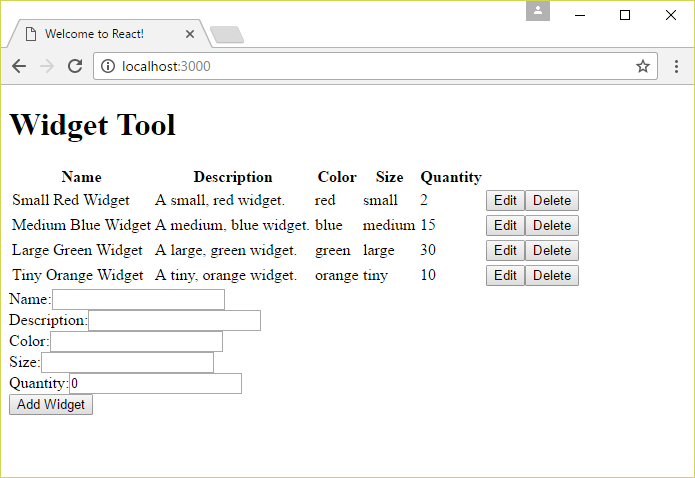
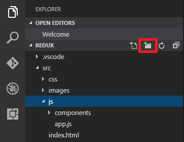
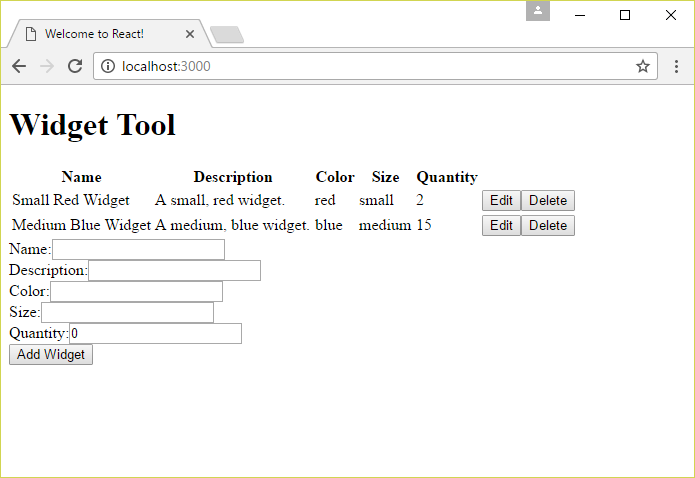
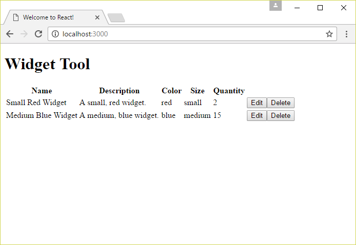
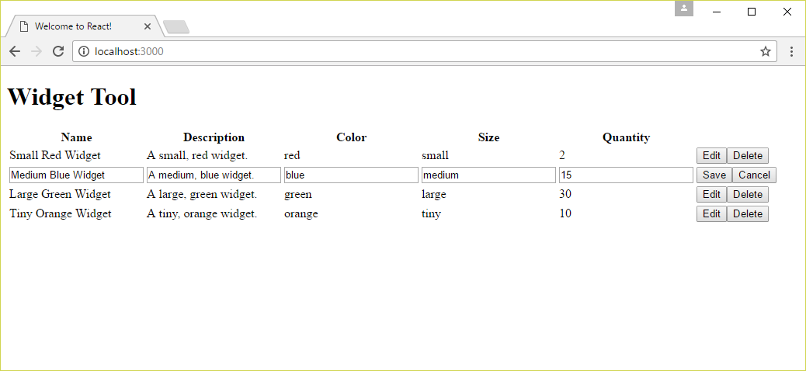
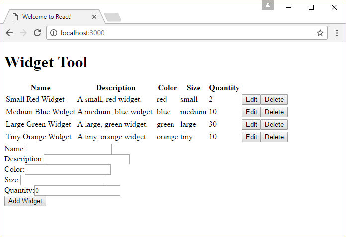

<a name="HOLTitle"></a>
# Building Web Applications with React and Redux #

---

<a name="Overview"></a>
## Overview ##

An important aspect of modern user interface (UI) development is change detection ― specifically, how to know when the underlying data has changed so the UI can be updated accordingly. Change detection is not an easy problem to solve. With the exception of apps that use [HTML5 Web Workers](https://www.html5rocks.com/en/tutorials/workers/basics/), JavaScript is inherently single-threaded and executes on the same thread that renders the UI. Consequently, JavaScript tasks that take too long to execute ― such as code that scans every element in the DOM to identify changes ― make the UI sluggish and unresponsive. Change detection must also take into account the fact that model data needs to be available to *all* parts of the application, regardless of how or where the data is stored.

One solution to the problem of detecting changes without sacrificing performance is [Redux](http://redux.js.org/), a popular JavaScript library that works well with React. Redux manages all of the state for an application using a single store. *State* includes all of the model data, as well as data regarding the current state of the UI such as the active sort column in a table. Allowing Redux to take responsibility for managing state has several advantages. First, it centralizes the location of the data and makes it available to all parts of the application. Second, it eliminates the hard coupling between between the UI and the state that drives it and simplifies workflow within the application. Redux serves as the "single source of truth" for data. This is the first principle of Redux.

To implement change detection in a performant way, Redux treats application state as read-only and relies on immutable programming techniques to produce new state each time a change occurs. Immutability eliminates the need to traverse object trees and element arrays to determine what changed. The creation of a new object or array reference allows Redux to detect *exactly* what changed so it can communicate that change to the UI. Treating state as read-only is the second principle of Redux.

To process state changes, a Redux store handles *actions* generated by the application. An action is any kind of asynchronous event triggered in the browser. Examples include button clicks, the receipt of data from a web socket, and the completion of an asynchronous AJAX call. Actions are handled by *reducers*, which are so-called because their behavior is analogous to the ```reduce``` function on array objects. A reducer takes an array of input values and returns a single value such as the sum of an array of numbers. Conceptually, you can think of user interactions as an array of actions such as login, display table, sort data, and so on. Envision a state object that is "reduced" by each action to produce a new state object. This is the essence of reduction and is an important concept in Redux programming.

A store can have many reducers, but each reducer must be a pure function. A pure function has four qualities:

- Its only input data is passed via parameters; no external references may be used
- Input parameters are read-only
- The function must not produce side-effects; it must not write to a database, for example
- The only data returned from a reducer is the value returned via the ```return``` statement

Reducer functions have many advantages. They are easy to unit test. Their behavior is predictable and easily understood. They are reusable across applications without concern for dependencies. They allow state to be read-only because input parameters are read-only. The use of reducer functions to produce new state is the third principle of Redux.

In this lab, you will use [React](https://facebook.github.io/react/), [Redux](http://redux.js.org/), and [Visual Studio Code](https://code.visualstudio.com/) to create an application that manages a collection of widgets. Widget data will be loaded from a REST service, displayed in an HTML table by a React component, and managed by Redux. You will use a library named [React-Redux](https://github.com/reactjs/react-redux) to bind React and Redux, and a library named [Redux-Thunk](https://github.com/gaearon/redux-thunk) to manage interactions with the REST service. And along the way, you will get a first-hand look at the face of modern web development.

<a name="Objectives"></a>
### Objectives ###

In this hands-on lab, you will learn how to:

- Convert an existing React application to use Redux
- Create a Redux store, complete with reducer functions
- Connect Redux stores to React components with React-Redux
- Manage asychronous REST calls with Redux-Thunk

<a name="Prerequisites"></a>
### Prerequisites ###

The following are required to complete this hands-on lab:

- [Visual Studio Code](http://code.visualstudio.com/)
- [Node.js](https://nodejs.org/en/) version 7.0 or higher

---
<a name="Exercises"></a>
## Exercises ##

This hands-on lab includes the following exercises. All exercises must be completed to create a working application. Because Redux requires actions, reducers, middleware and component registration there are a number of steps required to convert an existing application to simply load up.

- [Exercise 1: Create and configure the starter application](#Exercise1)
- [Exercise 2: Modify the code to use Redux for state management](#Exercise2)
- [Exercise 3: Connect React and Redux with React-Redux](#Exercise3)
- [Exercise 4: Connect to the REST service with Redux-Thunk](#Exercise4)
- [Exercise 5: Add support for editing widgets](#Exercise5)
- [Exercise 6: Add support for adding and deleting widgets](#Exercise6)

Estimated time to complete this lab: **45** minutes.

<a name="Exercise1"></a>
## Exercise 1: Create and configure the starter application ##

In this exercise, you will copy a starter project that uses React to a local folder on your hard disk and use the Node Package Manager (NPM) to install Redux, Redux-Thunk, and other packages required by the application.

1. Find the "resources" folder that accompanies this lab, and then open the "react-redux-vscode-starter" folder inside the "resources" folder. Copy the contents of the "react-redux-vscode-starter" folder to a local folder on your hard disk (the "project folder").

1. Open a terminal or Command Prompt window and use a **cd** command to change to the project folder that you copied the starter project into.

1. If you are running Windows, execute the following command in the Command Prompt window to open Visual Studio Code in the project folder:

    ```
    code .
    ```

	If you are running Linux or macOS instead, use this command instead:

    ```
    open -a "Visual Studio Code" .
    ```

1. Confirm that Visual Studio Code starts and shows the project files in the Explorer pane on the left.

    

    _Visual Studio Code showing the starter project_

1. Select **Integrated Terminal** from Visual Studio Code's **View** menu to open the integrated terminal. In the integrated terminal, run the following command to install the packages that the app will use:

    ```
    npm install
    ```

    

    _Installing packages_

    > During the install, you may receive warning messages regrading deprecations. These warnings can be ignored. If you receive an actual error message (usually displayed in red and labeled "ERR"), delete the "node_modules" folder in the project folder and try again.

1. Once the install has completed, run the following command in the integrated terminal to start the development web server:

    ```
    npm start
    ```

    > The development web server is powered by the popular module bundler utility [Webpack 2](https://webpack.github.io/). As part of the bundling process, Webpack watches the file system for changes to the source code files, and processes them as changes are made. The processing primarily consists of transpiling code, which is necessary to convert JSX code to JavaScript.

1. To verify that the development environment and the application are working correctly, open a web browser and navigate to http://localhost:3000. Confirm that a "Widget Tool" page appears.

    

    _The starter app running in a browser_

1. Return to the integrated terminal and press **Ctrl+C** to stop the web server. Then execute the following command to install additional packages:
    
    ```
    npm install -S redux react-redux redux-thunk key-mirror
    ```

	> The ```-S``` switch is shorthand for ```--save```. The save option adds the packages to the project's **package.json** file. If you move the project to another directory minus the "node_modules" folder, ```npm-install``` will now install these packages for you. 

1. Use the following command to restart the web server:

    ```
    npm start
    ```

With the project set up and the required libraries installed, it is time to begin modifying the application to use Redux.

<a name="Exercise2"></a>
## Exercise 2: Modify the code to use Redux for state management ##

The application that you built and ran in the previous exercise manages state itself. In this exercise, you will modify the application to use Redux to manage its state.

1. Select the "js" folder in the project's "src" folder. Then click the **New File** button and create a file named **action-types.js** in that folder.

	> Another way to add this file is to right-click (on a Mac, Control-click) the "js" folder and select **New File** from the menu.

    

    _Adding a file_

1. Add the following code to **action-types.js**:

	```javascript
	import keyMirror from 'key-mirror';
	
	export const actionTypes = keyMirror({
	    REFRESH_WIDGETS: null,
	});
	```

	For each action that the application supports, an action name needs to be registered with ```actionTypes```. Key Mirror is a helpful utility for declaring properties whose values are the property names themselves. The ```actionTypes``` object will be imported in relevant parts of the application to ensure that consistent action-type names are used.

1. Select the "js" folder in the project's "src" folder again. Then click the **New Folder** button and create a folder named "actions."

    

    _Adding a folder_

1. Create a new file named **refresh-widgets.js** in the "actions" folder and add the following code to the file:

	```javascript
	import { actionTypes } from '../action-types';
	
	// mock data until the asynchronous code is wired up
	const widgets = [{
	    id: 1, name: 'Small Red Widget', description: 'A small, red widget.',
	    color: 'red', size: 'small', quantity: 2
	},{
	    id: 2, name: 'Medium Blue Widget', description: 'A medium, blue widget.',
	    color: 'blue', size: 'medium', quantity: 15
	}];
	
	export const refreshWidgets = () => ({
	    type: actionTypes.REFRESH_WIDGETS,
	    widgets
	});
	```

	Until the app is wired up to a REST service with Redux-Thunk, the widget table is populated with mock data. The exported function generates an ```action``` object. Each ```action``` object requires a ```type``` property. Additionally, data may be added to the ```action``` object. The action's type and data are used to produce a new application state. The exported function is known as an *action creator function*.

	Examine the ```widgets``` property on the ```action``` object produced by the ```refreshWidgets``` function. Only the word "widgets" with no colon and no value is specified. This is known as a *shorthand property*. If a property and the variable that stores its value have the same name, this shorthand syntax simplifies the code.

1. With the first action type and an action creator defined, the next step is to add a reducer function to process the action. Add a file named **reducer.js** to the "js" folder and add the following code:

	```javascript
	import { actionTypes } from './action-types';
	
	export const reducer = (state = { widgets: [] }, action) => {
	
	    switch (action.type) {
	        case actionTypes.REFRESH_WIDGETS:
	            return Object.assign({}, state, { widgets: action.widgets });
	        default:
	            return state;
	    }
	
	};
	```

	Action types are imported into the reducer so it is aware of the actions that are defined. Every reducer accepts two parameters: the state and the action. The state is the current application state, including model data and UI data. The action is the operation triggered by the application to update the state. In this case, the operation that updates the state assigns to it a new array of widgets.

	While this application has just one reducer, most real-world Redux applications have many reducers. Each action dispatched into the store is processed by every reducer. There is no logic within the store to pick and choose which reducers to run. This is by design. Each reducer is given the opportunity to update the state tree or part of the state tree when an action is dispatched. Because of this, the reducer must return the original state if it does not care about the action being dispatched. Additionally, the reducer must maintain the state it doesn't care about while it updates the parts that it *does* care about. This reducer calls ```Object.assign``` to copy the original state (regardless of what's in it), and then replaces one property.

	Note that the reducer does not mutate the state. Instead, it creates a new state object containing a ```widgets``` property initialized to an empty array.

1. Now it is time to create the Redux store. Once created, the store can be used by the React application to dispatch actions and receive the application state for updating the UI. Create a new file named **app-store.js** in the "js" folder and add the following code:

	```javascript
	import { createStore } from 'redux';
	
	import { reducer } from './reducer';
	
	export const appStore = createStore(reducer);
	```

	Redux uses named exports, and one of the exports is the ```createStore``` function. That function accepts a reducer function and produces a store for the application. Within a Redux application, there is just one store. This differs from the traditional Flux pattern that includes many stores and one dispatch.

1. To complete the exercise, the ```WidgetTable``` component must be modified to connect it to the Redux store. Open **app.js** in the project's "js" folder and add the following ```import``` statements at the top of the file after the existing ```import``` statements:

	```javascript
	import { refreshWidgets } from './actions/refresh-widgets';
	import { appStore } from './app-store';
	```

1. Replace the ```componentDidMount``` function in the same file with the following functions:

	```javascript
	componentDidMount() {
	
	    this.appStoreUnsubscribe = appStore.subscribe(() => {
	        this.setState({
	            widgets: appStore.getState().widgets,
	        });
	    });
	
	    appStore.dispatch(refreshWidgets());
	}
	
	componentWillUnmount() {
	    this.appStoreUnsubscribe();
	}
	```

	When the component mounts (loads), it subscribes to notifications fired by the store indicating that state has been updated. The registered callback function is invoked when an action is dispatched after the new state is produced by the reducer function. The store object's ```getState``` function returns a reference to the entire state tree. The return value from the ```subscribe``` function is an ```unsubscribe``` function which is invoked with the component is unmounted to prevent memory leaks. Finally, the *REFRESH_WIDGETS* action is dispatched to populate the table of widgets.

1. Use the **File** -> **Save All** command to save all your changes. Then switch back to the web browser and confirm that the widget table resembles the one below.

    

    _Widget table using Redux and mock data_

Now that you are familiar with actions, action creators, reducers, and stores, you will build on this foundation to enhance the application further.

<a name="Exercise3"></a>
## Exercise 3: Connect React and Redux with React-Redux ##

At this point, React is managing the application's user interface, and Redux is managing the application's state. The React ```WidgetTool``` component uses the Redux store, but the connection can be improved. In this exercise, you will use a library named React-Redux to simplify the code that connects the two together.

1. Open **app.js** in the project's "js" folder. Add the following ```import``` statements after the ```import``` statement that loads ```ReactDOM```:

	```javascript
	import { bindActionCreators } from 'redux';
	import { connect, Provider } from 'react-redux';
	```

1. Now add the following statement before the ```WidgetTool``` class declaration:

	```javascript
	const mapStateToProps = ({ widgets }) => ({ widgets });
	```

1. To use React-Redux, two mapping functions need to be added. The first maps the application state object to the component's props. Add the following statement after the ```mapStateToProps``` function declaration:

	```javascript
	const mapDispatchToProps = dispatch => bindActionCreators({ refreshWidgets }, dispatch);
	```

	The use of the curly braces and property name in the parameters passed to the arrow function is known as *destructuring*. Destructuring allows specific properties of an input object to plucked off as variables. This approach facilitates the use of a shorthand property to do the mapping.

1. After the ```WidgetTool``` class declaration, replace the call to ```ReactDOM.render``` with the following code:

	```jsx
	const WidgetToolContainer = connect(mapStateToProps, mapDispatchToProps)(WidgetTool);
	
	ReactDOM.render(
	    <Provider store={appStore}>
	        <WidgetToolContainer />
	    </Provider>,
	    document.querySelector('main')
	);
	```

	This second mapping function binds the action creators to the store's dispatch function and produces an object containing action creator/dispatch functions which are passed as props to the component. This allows the component to dispatch actions in response to user interactions

	React-Redux provides the ```connect``` function, which produces a *container* component that connects the application state to the action dispatch functions. While the store could be passed directly to the ```WidgetToolContainer```, a more common approach is to use the React-Redux ```Provider``` component to pass in the store and make it available to all container components in the tree via React's context feature.

1. The final step is to update the ```WidgetTool``` component to receive the array of widgets via props. Replace the ```WidgetTool``` class with the following code:

	```jsx
	class WidgetTool extends React.Component {
	
	    static propTypes = {
	        refreshWidgets: React.PropTypes.func,
	    };
	
	    componentDidMount() {
	        this.props.refreshWidgets();
	    }
	
	    render() {
	        return <div>
	            <h1>Widget Tool</h1>
	            <WidgetTable {...this.props} />
	        </div>;
	    }
	}
	```

	The ```{...this.props}``` syntax is known as a *JSX spread*. The name comes from the ```spread``` operator in ES2015. Essentially, it takes the properties of the ```this.props``` object and passes them as individual props to the ```WidgetTable``` component.

1. The ```WidgetTool``` component is *much* simpler now. Use the **File** -> **Save All** command to save your changes. Return to your browser and confirm that the page resembles the one below. Ignore any error messages displayed in the console if you have the developer console open; you will fix those in a bit.

    

    _Widget tool using React-Redux_

The ```WidgetTool``` component is now connected to the Redux store using the React-Redux library. But the widget data is still being stored locally. Let's fix that by reconnecting the application to the REST service that the starter application was connected to. 

<a name="Exercise4"></a>
## Exercise 4: Connect to the REST service with Redux-Thunk ##

In the starter application, widget data was loaded from a REST service. In [Exercise 2](#Exercise2), data coming from the REST service was swapped out with mock data to allow Redux to be added incrementally. In this exercise, the REST service will be connected again, and Redux-Thunk will help Redux manage the asynchronous actions used to load data from the REST service.

1. The first step in using Redux-Thunk is to register it with the store as middleware. Redux provides an ```applyMiddleware``` function for this purpose. Go to **app-store.js** and replace its contents with the following code:

	```javascript
	import { createStore, applyMiddleware } from 'redux';
	import thunk from 'redux-thunk';
	
	import { reducer } from './reducer';
	
	export const appStore = createStore(reducer, applyMiddleware(thunk));
	```

1. Executing an asynchronous call involves two actions: one to transmit the call, and another to  receive the result when the call completes. The latter is accomplished via callback functions. The first action can be thought of as the *REQUEST* action, and the second can be thought of as the *DONE* action. While these actions happen in pairs, the Redux store dispatches them separately.

	Open **action-types.js** and replace its contents with the following code to define a *REQUEST* action and a *DONE* action:

	```javascript
	import keyMirror from 'key-mirror';
	
	export const actionTypes = keyMirror({
	    REFRESH_WIDGETS_REQUEST: null,
	    REFRESH_WIDGETS_DONE: null,
	});
	```

1. Now replace the contents of **refresh-widgets.js** with the following code to dispatch these actions and trigger REST calls:

	```javascript
	import { actionTypes } from '../action-types';
	
	export const refreshWidgetsRequest = () => ({
	    type: actionTypes.REFRESH_WIDGETS_REQUEST
	});
	
	export const refreshWidgetsDone = widgets => ({
	    type: actionTypes.REFRESH_WIDGETS_DONE,
	    widgets
	});
	
	export const refreshWidgets = () => {
	
	    return dispatch => {
	
	        dispatch(refreshWidgetsRequest());
	
	        return fetch('http://localhost:3000/widgets')
	            .then(res => res.json())
	            .then(widgets => dispatch(refreshWidgetsDone(widgets)));
	    };
	};
	```

	The ```refreshWidgets``` action creator is now divided into a "Request" half and a "Done" half. The new ```refreshWidgets``` function dispatches the *REQUEST* action, and then uses ```fetch``` to request widgets from the REST service. When the call completes, the callback function is invoked and the *DONE* action is dispatched and passed the downloaded widget data.

1. Replace the ```reducer``` function in **reducer.js** with the following code to update the reducer to handle the new actions:

	```javascript
	export const reducer = (state = { widgets: [] }, action) => {
	
	    switch (action.type) {
	        case actionTypes.REFRESH_WIDGETS_REQUEST:
	            return Object.assign({}, state, { widgets: [] });
	        case actionTypes.REFRESH_WIDGETS_DONE:
	            return Object.assign({}, state, { widgets: action.widgets });
	        default:
	            return state;
	    }
	
	};
	```

	The reducer handles each action independently. If desired, the *REQUEST* action could be used to display a "loading" spinner or some other UI element indicating that a request has been made and completion is pending. Once the call completes, the second action updates the state with the widget data.

1. Use the **File** -> **Save All** command to save your changes. Then switch back to the browser and examine the widget table.

    

    _Widget table using Redux-Thunk_

The list of widgets displayed in the page has changed because the data now comes from REST service. But even though the UI contains **Edit** and **Delete** buttons, clicking the buttons does nothing. There is no way to edit and delete widgets. The REST service supports editing and deleting, but the buttons need to be bound to the service.

<a name="Exercise5"></a>
## Exercise 5: Add support for editing widgets ##

In this exercise, you will restore the application's ability to edit widgets. You will do so by implementing new actions.

1. Open **action-types.js** and add the following properties to the ```actionTypes``` object:

	```javascript
	EDIT_WIDGET: null,
	CANCEL_WIDGET: null,
	SAVE_WIDGET_REQUEST: null,
	```

	The *EDIT_WIDGET* action will replace a view row with an edit row, while *CANCEL_WIDGET* will replace an edit row with a view row. The *SAVE_WIDGET_REQUEST* action will save the edited widget and change the edit row to a view row. Note that there is no *DONE* action. That's because saving a widget refreshes the widget array and executes a *REFRESH_WIDGETS_DONE* action.

1. Create a new file named **edit-widget.js** in the "actions" folder and add the following code:

	```javascript
	import { actionTypes } from '../action-types';
	
	export const editWidget = widgetId => ({
	    type: actionTypes.EDIT_WIDGET,
	    widgetId
	});
	
	export const cancelWidget = () => ({
	    type: actionTypes.EDIT_WIDGET,
	    widgetId: -0
	});
	```

1. Create a new file named **save-widget.js** in the "actions" folder and add the following code:

	```javascript
	import { actionTypes } from '../action-types';
	
	import { refreshWidgetsDone } from './refresh-widgets';
	
	export const saveWidgetsRequest = widget => ({
	    type: actionTypes.SAVE_WIDGET_REQUEST,
	    widget,
	});
	
	export const saveWidget = (widget) => {
	
	    return dispatch => {
	
	        dispatch(saveWidgetsRequest(widget));
	
	        let widgetSavePromise = null;
	
	        if (widget.id) {
	            widgetSavePromise = fetch('http://localhost:3000/widgets/' + encodeURIComponent(widget.id), {
	                method: 'PUT',
	                headers: { 'Content-Type': 'application/json' },
	                body: JSON.stringify(widget),
	            });
	        } else {
	            widgetSavePromise = fetch('http://localhost:3000/widgets', {
	                method: 'POST',
	                headers: { 'Content-Type': 'application/json' },
	                body: JSON.stringify(widget),
	            });
	        }
	
	        widgetSavePromise
	            .then(() => fetch('http://localhost:3000/widgets'))
	            .then(res => res.json())
	            .then(widgets => dispatch(refreshWidgetsDone(widgets)));
	    };
	};
	```

	The ```saveWidget``` function dispatches a *REQUEST* action, and then in the callback dispatches a *DONE* action. For the *REQUEST* action, the widget to be saved is passed along in case the reducer needs it. The save operation handles both inserts and edits, and decides which to do based on whether the widget input to it contains an id value.

1. Open **reducer.js** and replace its contents with the following code:

	```javascript
	import { actionTypes } from './action-types';
	
	export const reducer = (state = { widgets: [], editRowId: 0 }, action) => {
	
	    switch (action.type) {
	        case actionTypes.REFRESH_WIDGETS_REQUEST:
	            return Object.assign({}, state, { widgets: [] });
	        case actionTypes.REFRESH_WIDGETS_DONE:
	            return Object.assign({}, state, { widgets: action.widgets, editRowId: 0 });
	        case actionTypes.EDIT_WIDGET:
	            return Object.assign({}, state, { editRowId: action.widgetId });
	        case actionTypes.CANCEL_WIDGET:
	            return Object.assign({}, state, { editRowId: 0 });
	        case actionTypes.SAVE_WIDGET_REQUEST:
	            return Object.assign({}, state, { widget: action.widget });
	        default:
	            return state;
	    }
	
	};
	```

	The state object is now initialized with an ```editRowId``` value of 0 to make sure that all rows are reset to read-only after a refresh occurs.

1. Open **app.js** and add the following ```import``` statements after the statement that imports ```refreshWidgets```:

	```javascript
	import { editWidget, cancelWidget } from './actions/edit-widget';
	import { saveWidget } from './actions/save-widget';
	```

1. Now replace the mapping functions with the following code:

	```javascript
	const mapStateToProps = ({ widgets, editRowId }) => ({ widgets, editRowId });
	
	const mapDispatchToProps = dispatch => bindActionCreators({
	    refreshWidgets,
	    onEdit: editWidget,
	    onCancel: cancelWidget,
	    onSave: saveWidget,
	}, dispatch);
	```

1. Use the **File** -> **Save All** command to save your changes. Switch back to the browser and confirm that you can edit widgets and save the changes.

    

    _Editing a widget_

Almost there, but you still can't add and delete widgets. That needs to be fixed so the application can be considered finished.

<a name="Exercise6"></a>
## Exercise 6: Add support for adding and deleting widgets ##

In this exercise, you will modify the application to support for adding and deleting widgets.

1. Add the following property to the ```actionTypes``` object in **action-types.js**:

	```javascript
	DELETE_WIDGET_REQUEST: null,
	```

	The *DELETE_WIDGET* action will trigger the widget to be deleted. The next step is to implement the action.

1. Create a file named **delete-widget.js** in the "actions" folder and add the following code:

	```javascript
	import { actionTypes } from '../action-types';
	
	import { refreshWidgetsDone } from './refresh-widgets';
	
	export const deleteWidgetRequest = widgetId => ({
	    type: actionTypes.DELETE_WIDGET_REQUEST,
	    widgetId,
	});
	
	export const deleteWidget = (widgetId) => {
	
	    return dispatch => {
	
	        dispatch(deleteWidgetRequest(widgetId));
	
	        fetch('http://localhost:3000/widgets/' + encodeURIComponent(widgetId), {
	            method: 'DELETE',
	        })
	            .then(() => fetch('http://localhost:3000/widgets'))
	            .then(res => res.json())
	            .then(widgets => dispatch(refreshWidgetsDone(widgets)));
	    };
	};
	```

1. Open **reducer.js** and add the following action type:

	```javascript
	case actionTypes.DELETE_WIDGET_REQUEST:
	    return Object.assign({}, state, { widgetId: action.widgetId });
	```

1. Add the following ```import``` statement to **app.js** after the statement that imports ```saveWidget```:

	```javascript
	import { deleteWidget } from './actions/delete-widget';
	```

1. Update the dispatch mapping function to include ```deleteWidget```:

	```javascript
	onDelete: deleteWidget,
	```

1. Update the ```propTypes``` in the ```WidgetTool``` class to include ```onSave```:

	```javascript
	onSave: React.PropTypes.func,
	```

1. Add the ```WidgetForm``` component to the ```render``` function, just before the closing ```</div>``` tag:

	```jsx
	<WidgetForm onSubmit={this.props.onSave} />
	```

1. Use the **File** -> **Save All** command to save your changes. Then switch back to the browser, reload the application, and confirm that you can add and delete widgets.

    

    _Widget UI with support for adding and deleting widgets_

The application now contains all the functionality of the starter application, but implemented in an entirely different way: the React-Redux way.

<a name="Summary"></a>
## Summary ##

React and Redux together represent the frontier of modern web development. If you would like to learn more about these libraries and how they work together, see https://onsen.io/blog/react-state-management-redux-store/, or watch the video entitled [Using React with Redux](https://wintellectnow.com/Videos/Watch?videoId=using-react-with-redux) by React guru Eric Greene. For a great step-by-step tutorial on React itself, see [Building Web Apps with React](https://github.com/Microsoft/TechnicalCommunityContent/tree/master/Web%20Frameworks/React/Session%202%20-%20Hands%20On).

----

Copyright 2017 Microsoft Corporation. All rights reserved. Except where otherwise noted, these materials are licensed under the terms of the MIT License. You may use them according to the license as is most appropriate for your project. The terms of this license can be found at https://opensource.org/licenses/MIT.